# **OS Lab1**
2312325巩岱松
2311561梁朝阳
2312145郭子涵

## 前言

在RISC-V设备上运行操作系统，需要具备处理器、内存、硬盘、鼠标和显示器等硬件。目前缺乏这些设备，因此只能在软件环境中进行验证。

为在无硬件条件下验证RISC-V，需要使用模拟器。常用的工具是 **QEMU（Quick Emulator）**，它能在 x86 或 ARM 的 Linux 主机上模拟 RISC-V 处理器。QEMU 的原理是：针对 RISC-V 的每条指令，在宿主机上执行等效操作。例如，它在内存中开辟32个变量模拟寄存器，根据指令对这些变量进行运算，从而实现完整的CPU行为。编译后得到的 **qemu-system-riscv64** 程序可以模拟64位RISC-V处理器的特权模式与用户模式。

接下来，需要生成能在该CPU上运行的二进制程序。编译器的作用是将C语言源代码转换为目标CPU的机器指令。若在x86主机上生成RISC-V的指令，这种过程称为**交叉编译（Cross Compilation）**。交叉编译器本身运行在x86平台，但输出RISC-V或ARM指令。可直接下载现成的RISC-V GCC 交叉编译器，并通过VSCode或Makefile调用它，将源代码编译成RISC-V可执行的二进制文件。

在编译过程中，**GCC** 负责生成二进制文件，而 **Makefile** 用于自动化执行编译命令。完成编译后，通过 QEMU 运行生成的程序，即可模拟RISC-V处理器的执行过程。若系统版本配置正确，编译与运行时会输出提示信息。

为进一步理解RISC-V的启动过程，需要使用 **GDB** 调试工具。GDB 能单步跟踪CPU的执行，就像在VSCode中设置断点，可观察寄存器变化和指令流。

当CPU上电时，寄存器与内存均处于未初始化状态。此时CPU依赖程序计数器（PC）的值去取第一条指令。由于内存掉电后数据丢失，启动指令必须存放在掉电不丢失的设备中，即 **ROM（Read Only Memory）**。ROM中保存的启动程序在上电后被CPU自动读取并执行，从而加载系统。

在传统x86架构中，这段ROM程序被称为 **BIOS**，它的作用是帮助CPU从硬盘加载操作系统。RISC-V中有类似的机制。QEMU模拟的RISC-V硬件在启动时，CPU首先跳转到内置的上电地址，然后进入 **OpenSBI**（RISC-V的系统引导层），由OpenSBI继续加载用户编写的操作系统。

在实验中，编写的 **uCode** 内核会通过QEMU命令被加载到固定的内存地址 **0x80200000**。实验要求使用GDB追踪RISC-V处理器的上电流程：CPU首先执行内部引导代码，再进入OpenSBI，最终跳转到uCode所在的地址执行操作系统。

之所以uCode必须放在0x80200000，是因为该区域有可用内存。编译器通过**链接脚本（Linker Script）**控制内核起始位置，将程序入口（`kernel_init_entry`）放在该地址，以确保CPU在执行时能正确找到并运行内核代码。

## 实验一重要知识点

### 计算机启动的流程

经查阅资料与自己梳理修改（切分的更详细一些），一个电脑从按下电源键到操作系统启动的流程如下：

1. 上电与复位阶段 (Power-On / Reset)
2. MROM阶段 （Machine ROM）
3. 固件加载阶段（Firmware）/引导加载阶段（Bootloader）
4. 内核阶段（Kernel Initialization）
5. 用户空间阶段（User Space）

总结就是：电源启动 → 固件自检 → Bootloader 加载内核 → 内核初始化 → 启动用户空间程序。

而练习一主要关注的是第3阶段（Bootloader）和第4阶段（内核初始化）的交接部分，即从OpenSBI作为bootloader的工作过程到内核初始化，再到进入kern_init()的过程。

因此实验中，我们默认已经完成了上电与复位，还有固件自检阶段，但仍然会给出简要介绍。

#### 这个过程中的基本问题（计算机启动的基本问题）

为了更好的叙述本次实验，首先简单介绍一下前两个阶段，防止过分生硬。

##### 上电阶段的大致流程

首先是刚才提到的前两个阶段，上电阶段的大致流程如下：


其中`0x1000`是Qemu模拟器中实现的RISC-V架构的复位向量，即CPU复位后的默认执行地址。这一阶段具体会涉及电源管理（如电源供应器（PSU）开始工作并使得电压轨（3.3V、5V、12V等）逐步稳定）。同时复位脉冲产生，CPU会进入初始状态，时钟系统（晶振、时钟分频器等部件）开始工作。

##### MROM阶段

这一阶段是我自己细分出的阶段，在介绍前需要先明晰出两个概念：固件和MROM。

1. 固件：固件是介于硬件和软件之间的特殊程序，通常在ROM中，我比较熟知的是BIOS或UEFI。对于RISV-V架构，固件通常被称为OpenSBI（Open-Source Supervisor Binary Interface）。
2. MROM：MROM是Machine ROM的缩写，MROM是固化在CPU内部的只读存储器，包含CPU复位后执行的第一段代码，不可修改，由CPU厂商预置。 也就是实际上这个会**更先执行**。具体作用会在下面详细说明。

在这一阶段，MROM 会执行以下操作：


可以看到上一阶段结束后，立刻会运行MROM中的代码，这段代码用于加载OpenSBI固件，在这一阶段，MROM 会执行以下操作：

1. 建立最小的运行环境 —— 设置堆栈指针、初始化寄存器，使 CPU 具备执行更复杂程序的基本条件；
2. 定位外部固件（OpenSBI）的位置 —— 在真实硬件上通常存放于 NOR Flash 等非易失性存储器中；而在 QEMU 中，则被映射到内存的 `0x80000000` 起始处；
3. 将控制权转交给 OpenSBI —— 当 MROM 确认固件位置后，会将程序计数器（PC）跳转到 OpenSBI 的入口地址，正式开始执行固件代码。

至此，MROM 的职责完成，系统进入 OpenSBI 固件阶段。OpenSBI 作为运行在 M 模式（Machine Mode） 下的软件层，将继续负责完成更高层次的初始化工作：

1. 建立中断控制和内存管理环境；
2. 为操作系统内核提供标准化的 SBI（Supervisor Binary Interface） 接口；
3. 并最终加载操作系统内核（例如 `os.bin`）到指定的物理内存地址（通常为 `0x80200000`），然后将控制权交给内核。

实践中，在Qemu模拟器的输出结果中，也可以看到固件的基本信息：

```yaml
    Firmware Base: 0x80000000
    Firmware Size: 327 KB
    Firmware RW Offset: 0x40000
    Firmware RW Size: 71 KB
```

即MROM阶段达成的效果是：


##### 固件阶段/引导加载阶段

简单介绍完前两个阶段，下面就是本次实验的重点阶段，开始前我在这里更愿意介绍一下这个名字的由来：固件（Firmware）。

1. Firm → 固定的、稳固的；
2. ware → “东西”或“程序”；

也就是说这个**程序**既不像硬件那样“写死在电路里”（MROM），也不像软件那样“经常被修改、存放在磁盘上”，而是“**介于硬件与软件之间”**的程序。

 > 从**功能**上看：固件是“让硬件能工作的最小软件”： 
 >
 > 1. 它知道硬件的基本结构；
 > 2. 它能初始化硬件（如内存、时钟、中断）；
 > 3. 它能把更高级的软件（操作系统）加载进来。
 >    —— 引用自AI

注意：这里采用的是**狭义**的“固件（Firmware）”（也是实验指导中使用的概念），主要指像 OpenSBI、BIOS、UEFI、U-Boot 这类，“能初始化硬件、并加载操作系统”的软件。广义的固件还包含刚才所说的MROM甚至OS程序。

回归正题，固件阶段/引导加载阶段的大致流程如下：


可以看到这一阶段主要是OpenSBI加载内核，并最终加载操作系统内核（例如 `os.bin`）到指定的物理内存地址（通常为 `0x80200000`），然后将控制权交给内核。

而在这一阶段之前会涉及硬件检测、设备初始化等操作，但与本次实验关系不大，因此这里不展开介绍。

### 内核阶段

#### 内核栈的初始化过程（entry.S阅读讲解）


下面也是将要涉及`Entry.S`的初始化过程，回顾整个流程，目前为止：


总结来说，OpenSBI 的核心任务之一，就是把汇编代码（`entry.S`）所在的整个内核镜像二进制（`os.bin`）加载进内存，然后把控制权交给它执行。注意：这里为了报告书写的逻辑流畅，我们暂且不关心链接脚本，直接假设加载进来了`os.bin`。

那么当前的计算机状态可以概括为下面这个表格：

| 环境     | 状态                                                   |
| -------- | ------------------------------------------------------ |
| 当前地址 | 0x80200000（entry.S 开始）                             |
| 模式     | S 模式（Supervisor）                                   |
| 栈指针   | ❌ 还没设置                                             |
| 内存布局 | 各段（.text, .data, .bss）已经在内存，但还没完全初始化 |
| CPU      | 准备执行 entry.S 第一条汇编指令                        |

因此，我们直接逐行阅读这个entry.s ，观察它做了什么，先贴出代码：

```asm
    .section .text,"ax",%progbits
    .globl kern_entry
    kern_entry:
        la sp, bootstacktop
        tail kern_init 
    .section .data
        .align PGSHIFT
        .global bootstack
    bootstack:
        .space KSTACKSIZE
        .global bootstacktop
    bootstacktop:
```


首先简单说下语法，汇编语言分成了机器指令（如等下要说的`la`）和伪指令（如`section、globl`）。机器指令 是 CPU 执行的，伪指令 是汇编器在“编译时”处理的。这些伪指令都以 . 开头，是 GNU 汇编器 (GAS) 的统一语法`.section 段名, "标志", %类型`。

```asm
    .section .text,"ax",%progbits
```

首先，`.text` 是 ELF 文件中的“代码区”，放所有代码，`ax` 表示这个段是：

1. a → allocatable（可分配进内存）

2. x → executable（可执行）

`%progbits` 表示这是普通的程序数据，而不是特殊调试信息。

```asm 
    .globl kern_entry
```

这里定义一个全局符号 kern_entry，让链接器能在其他文件里看到它。用于配合链接脚本中的`ENTRY(kern_entry)` 指定入口点。先跳过这里，等下详细讲解其中的内容。

之后就是data section，用于存储已定义完的全局与静态变量（bss段相反）。

```asm
    .section .data
        .align PGSHIFT    // 对齐
        .global bootstack // 声明一个全局变量（地址）
    bootstack: // 上面的那个地址
        .space KSTACKSIZE // 分配KSTACKSIZE大小的空间
        .global bootstacktop // 声明一个全局变量（地址）
    bootstacktop: // 上面的那个地址
```


这里的Page Shift就是mmu.h中的PGSHIFT，即12，然后KSTACKSIZE就是memlayout.h中的KSTACKSIZE，即2 * 4096 = 8192。（分配了两个页）

```c
    #define PGSHIFT    12      
    #define KSTACKSIZE   (KSTACKPAGE * PGSIZE)  // sizeof kernel stack
```

`.align`的作用就是让接下来的数据或指令的起始地址是某个整数倍。可以具体讲解一下：首先可以举个例子，4字节对齐（alignment = 4），那么接下来的数据或指令的起始地址是4的倍数，比如0x1000、0x1004、0x1008等。换句话说如果当前地址不是对齐的，就在前面空出一点地方，让下一个变量/指令的地址刚好落在对齐边界上。

```ld
    .align n 
```

表示：让当前位置的地址是 $2^n$ 的整数倍。具体地在计算机的地址中就是`0x1000`、`0x2000`、`0x3000`等($2^{{1000}_H} =  2^{{12}_D}  = 4096$)。

最后回到

```asm
        la sp, bootstacktop
        tail kern_init 
```

这两条指令，`la`是load address的缩写，即加载地址，`sp`是栈指针，`bootstacktop`是栈顶地址。也就是第一句的作用是加载**栈顶地址**到**栈顶指针**。

`tail`是跳转指令，跳转到`kern_init`内核初始化函数。而这个函数是在C语言中编写的，也就是把控制权交给C语言写的代码。（编译后其实都是os.bin的二进制）。而`tial`与`call`的区别是，`tail`不再保留返回地址，而`call`会保留返回地址。

## 实验一问题解答

总结：到此，电脑开机的流程与entry.s的阅读与讲解就完成了。我们首先总结，正面回答**练习一**中的问题：

1. **指令 la sp, bootstacktop 完成了什么操作，目的是什么？**
   1. **完成了什么操作**： 完成了加载**栈顶地址**到**栈顶指针**的操作。
   
   2. **目的是什么**：目的是初始化栈帧。由于每次调用函数、保存局部变量、压栈返回地址等操作都需要用到栈，因此需要提前设置好栈顶指针。但现在刚刚启动CPU，栈顶指针还没有初始化，所以需要提前设置好栈顶指针。
   
2. **tail kern_init 完成了什么操作，目的是什么？**

   1. **完成了什么操作**：完成了跳转**内核初始化函数**的操作（把 CPU 的执行流跳转到 C 函数  `kern_init()`）。

   2. **目的是什么**：代码层面理解，就是把控制权交给 C 语言入口点 kern_init()，让 C 接管后续初始化。但编译后本质都是os.bin的二进制。

---

我们后面说下init.c中的内容，与链接脚本的作用，因为其也是至关重要的。inti.c 中只是声明了一个数组edata[]和end[]，用于初始化bss段。关键是链接脚本：

链接脚本生成的二进制镜像（os.bin）是一个独立文件，OpenSBI 会把它加载并运行。


>除了定义Base Address的`. = BASE_ADDRESS;`和定义内核入口点`ENTRY(kern_entry)`外，链接脚本剩余的部分是一整条SECTIONS指令，用来指定输出文件的所有SECTION; "." 是SECTIONS指令内的一个特殊变量/计数器，对应内存里的一个地址。

这里可以区分两个地址：kern_entry的地址（CPU 跳转到这里取第一条指令）。另一个是Base Address，即0x80200000，即内核镜像的起始地址。是所有段开始的地方。但这里两者恰好相等：

```ld
    . = BASE_ADDRESS;
    .text : {
        *(.text.kern_entry)
        *(.text .stub .text.* .gnu.linkonce.t.*)
    }//意思是：从.的当前值（当前地址）开始放置一个叫做text的section. 
    // 花括号内部的*(.text.kern_entry .text .stub .text.* .gnu.linkonce.t.*)是正则表达式
    // 如果输入文件中有一个section的名称符合花括号内部的格式
    // 那么这个section就被加到输出文件的text这个section里
```

因为第一个段就是text，且这个段的第一个函数就是kern_entry，所以kern_entry的地址就是0x80200000。

剩下的还有一个`PROVIDE(etext = .);`，用于定义一个符号etext，其值为当前地址。（就是end text address）。

同理： c程序中的

```c
    int kern_init(void) {
        extern char edata[], end[];
        memset(edata, 0, end - edata);
        ... // 其他代码
    }
```

edata和end，也来自这个链接脚本的provide语句（语义是如果这个符号没有被定义过，就把当前地址给他）：

```ld
    PROVIDE(edata = .);
        /* 初始化为零的数据 */
        .bss : {
            *(.bss)
            *(.bss.*)
            *(.sbss*)
        }
    PROVIDE(end = .);
```

到这里，就把c程序、汇编程序与链接脚本讲清楚了。他们一个是用于后续更复杂的管理，一个用于最初的栈帧初始化和引导作用，最后一个是用于连接器连接所有程序的。

---


最后，我绘制了一个图，展现Lab1的所有代码运行完后，内存区域的布局，地址由低到高：


## 实验二重要知识点

### 内核与操作系统

​	**内核**是操作系统的核心。**内核是操作系统执行的第一道程序，被率先加载到内存中开始系统行为。**内核始终保持在主内存中直到系统被关闭，将用户输入的命令转换成计算机硬件能理解的机器语言。同时，内核是系统应用软件和硬件的桥梁，直接与硬件联系，并告之它由应用软件发起的请求。操作系统不能脱离内核工作，内核是系统正常运行最重要的程序。内核的主要职责是：进程管理、磁盘管理、任务调度、内存管理等，具体如下：

1. **文件管理：**为了更有效地搜索和使用文件，内核使用文件系统来组织文件，并通过文件系统保持对文件数据存储、文件状态、访问设置的监视。
2. **进程管理：**在多进程环境下，内核决定哪一道进程被CPU优先运行，以及分配的运行时间片长度是多少，即进程调度。当进程不再被需要的时候，将被内核自动销毁。
3. **内存管理：**内核检测内存空间，可以生成或销毁内存，以确保应用程序被正确执行。


内核分为宏内核、微内核和混合内核三种。

1. **宏内核，**也被称为单体内核，是一种把所有的服务都集中在一起的内核设计。它的优点是性能高，因为所有服务都在内核中运行，调用过程简单，效率高。但是，这种设计也有缺点，如果内核中的一个服务出现问题，可能会影响到整个系统的稳定性。
2. **微内核，**只提供最基本的服务，如进程调度、内存管理等，其他的服务，如文件系统、网络协议等，都在内核之外的用户空间中运行。这种设计的优点是结构简单，容易理解和修改，如果一个服务出现问题，也不会影响到其他服务。但是，这种设计的缺点是性能较低，因为服务之间的调用需要在内核和用户空间之间进行切换，效率较低。
3. **混合内核，**基于微内核的架构设计，把一些性能要求高的服务放在内核中，比如设备驱动、应用进程间通信等，而其他的服务则放在用户空间中。这种设计既有宏内核的性能优势，又有微内核的稳定性优势。但是，这种设计的缺点是复杂性高，需要仔细地选择哪些服务放在内核中，哪些服务放在用户空间中。

​	

​	针对这三者而言，在性能上，宏内核最好，因为所有服务都在内核中，调用效率高；微内核最差，因为需要频繁地在内核和用户空间之间切换；混合内核介于两者之间。于安全性而言，微内核最好，因为各个服务相互独立，一个服务出问题不会影响到其他服务；宏内核最差，因为所有服务都在一起，一个服务出问题可能会导致整个系统崩溃；混合内核介于两者之间。

​	**操作系统**是用来管理计算机系统资源的软件，内核是用户和系统硬件的桥梁。操作系统提供的接口允许用户直接看到其输入命令的响应结果，例如Window的命令行cmd和Linux的Shell终端。没有操作系统，系统就不可能运行，部分嵌入式系统看似没有操作系统，但仍然对硬件作了一层简单封装，也可理解为Tiny OS。操作系统的主要职责是创建应用软件可以运行的环境。操作系统同样是运行在计算机系统中的持久化程序，直至系统关闭。它是计算机系统运行的第一道程序，一旦操作系统被加载到内存，计算机就做好了执行用户程序的准备。在操作系统中，内核是最重要的程序。除了内核的职责外，操作系统额外负责安全性与隐私、中断与挂起等服务，具体如下：

1. **安全性：**为了保护用户数据安全，操作系统对计算机进行了密码保护，保护程序不被非法途径泄露。
2. **工作分析：**操作系统跟踪资源的使用情况，这些分析数据可以用来监视、反映资源对特定用户或用户群体的利用率，便于系统调整。
3. **与用户和其他软件合作：**操作系统也向用户分配解释器、汇编、编译器和其他系统级软件，便于用户和其他应用调用接口。
4. **控制系统性能：**为控制系统性能，操作系统时刻监视其运行状态，最主要是测量应用发起服务接口请求，和系统返回响应之间的时间。在操作系统的帮助下，通过提供解决问题的关键性信息可以提供系统性能。
5. **错误自检：**操作系统密切监测系统漏洞来防止运行崩溃。
6. **设备管理：**操作系统保持对所有接入计算机的硬件设备的监视和跟踪，决定了每个外设是否可以访问计算机资源以及访问的允许时长是多少。

### RISC-V的四种特权级别

​	RISC-V 硬件线程 hart（**har**dware **t**hread）由一或多个 CSRs（**C**ontrol and **s**tatus **r**egisters）编码决定了其运行的权级模式。目前已经定义了三个权级，如下表所示：

| 级别 | 编码 |          名称          | 缩写 |
| :--: | :--: | :--------------------: | :--: |
|  0   |  00  |     用户(**U**ser)     |  U   |
|  1   |  01  | 监管者(**S**upervisor) |  S   |
|  2   |  10  |          保留          |      |
|  3   |  11  | 机器权级(**M**achine)  |  M   |

​	RISC-V 指令集架构采用多特权级别设计作为其核心安全机制，通过层次化的权限管理实现系统资源的隔离与保护。该架构明确定义了四个层次化的特权模式，按照权限等级由高至低依次为：

- 机器模式（M-mode）：权限等级最高。在这个模式下，程序**可以执行所有操作**，包括直接访问和修改所有硬件资源。机器模式通常用于硬件初始化、系统引导、中断和异常处理等关键任务。由于其高度特权，机器模式通常只允许特定的、受信任的代码运行。
- 监管者模式（S-mode）：权限等级介于用户模式和机器模式之间。通常用于**操作系统内核的运行**。在监管模式下，程序可以执行一些特权操作，如访问物理内存、管理设备驱动程序等。它允许操作系统管理硬件资源，为多个用户模式的程序提供服务和调度。
- 用户模式（U-mode）：权限等级最低。在这个模式下运行的程序（如应用程序）**不能直接访问硬件资源**或执行特权操作。用户模式提供了最基本的程序执行环境，用于隔离和保护操作系统内核和其他程序。它确保了应用程序的稳定性和安全性，防止它们对系统造成损害。

这些模式的存在意义在于提供了一种灵活而安全的计算环境。通过限制不同程序的权限，RISC-V 架构能够防止恶意软件或不受信任的程序对系统造成损害。同时，它也允许操作系统有效地管理硬件资源，确保多个程序能够公平地共享这些资源。下图是特权指令引起的特权模式切换示意图：


​	由图可以看出，`ecall` 指令是 RISC-V 中用于实现受控的权限提升的关键指令。当在 U 模式（用户态）执行 `ecall`，会触发异常，从而陷入到 S 模式（内核态）。这是系统调用的底层机制。当在 S 模式（内核态）执行 `ecall`，会触发异常，从而陷入到 M 模式（机器态）。这也正是我们本次实验中涉及到的调用 `OpenSBI` 服务的方式。

​	对比在软件层面的概念对：**内核态和用户态，**他们分别对应到RISC-V 的特权等级就是用户态对应U-Mode，内核态对应S-Mode。

通常，用户程序只运行在用户态，在以下三种情况下会切换到内核态进行处理：

1. 系统调用：当应用程序需要访问操作系统服务如文件读写、进程创建时，通过 int 指令或 syscall 指令主动请求内核执行操作。
2. 异常：运行时若发生异常如缺页异常、非法指令、除零错误等，CPU 会自动切换到内核态，由操作系统处理异常。
3. 外部中断：外设如磁盘、网卡完成任务后向 CPU 发送中断信号，CPU 根据中断向量表跳转到内核态处理事件。

这种机制通过限制用户程序的直接硬件访问权限，确保系统的安全性和稳定性，仅在必要时通过上述三种方式切换到内核态。

## 练习二

### RISC-V启动流程简述

​	在本实验在中WSL(Ubuntu 22.04)进行操作，目标为**使用GDB验证启动流程**，跟踪 QEMU 模拟的 RISC-V 从加电开始，直到执行内核第一条指令（跳转到 0x80200000）的整个过程。此流程涉及五个关键组成部分：

1. **MROM（Machine ROM）**

   在 QEMU 模拟的 RISC-V 启动流程中，CPU 复位后 PC 被初始化为 0x1000，对应虚拟的 MROM 区域（Machine ROM）。它的主要任务是读取硬件信息例如硬件线程ID，查找下一阶段固件（本实验中是OpenSBI）的入口地址，并将控制权跳转过去。MROM 不进行复杂初始化，也不会产生输出，**仅起到“引导跳板”的作用，确保 CPU 从复位状态正确进入 OpenSBI。**

2. **OpenSBI**

   OpenSBI是运行在 **M模式** 下的引导固件。它负责初始化底层硬件环境（如时钟、中断、串口、PMP 权限等），在QEMU启动时，OpenSBI作为bootloader会将操作系统内核从硬盘加载到内存地址 **0x80200000**，并把CPU的控制权交给操作系统。此时QEMU 终端上会输出 OpenSBI 的启动信息，例如平台名称、HART 数量和内核入口地址等。

3. **内核（Kernel）**

   运行在 **S 模式**，是操作系统的主体。当内核加载到内存中后，CPU 开始执行内核入口文件（如 entry.S），设置栈、初始化 C 运行时环境，并最终进入 kern_init()。该阶段会打印内核初始化信息，标志着系统从固件阶段过渡到操作系统阶段。

4. **QEMU**

   是本实验中用于模拟 RISC-V 硬件平台的虚拟机。它模拟 CPU、内存、外设等硬件资源，并提供 GDB 远程调试接口gdbstub，允许我们通过 GDB 精确控制模拟 CPU 的执行。在实验过程中，QEMU 负责运行 MROM 与 OpenSBI 的固件镜像、加载内核镜像，并配合 GDB 实现断点设置、单步调试与寄存器状态查看。

5. **GDB**

   **GDB** 是由 GUN 软件系统社区提供的**调试工具**，同 GCC 配套组成了一套完整的开发环境，GDB 是 Linux 和许多 类Unix系统的标准开发环境。在本实验中用来“观察与控制”QEMU 内部虚拟 CPU 的工具；通过 target remote连接到 QEMU 的 gdbstub 后，GDB 能在 MROM、OpenSBI、内核的任意地址设置断点、单步执行、查看寄存器和内存，从而精确地验证启动链发生的时序与状态。

具体的启动流程图如下所示：

```mermaid
flowchart TD
  A[Power on<br/>PC = <b>0x1000] --> B[MROM@ <b>0x1000]
  B -->|读取hart id/读取固件入口地址| C[Jump to OpenSBI @ <b>0x80000000]
  C -->|OpenSBI 初始化平台<br/>加载内核到 <b>0x80200000| D[Kernel image @ <b>0x80200000]
  C -->|打印平台信息到 QEMU 终端| T[QEMU]
  D -->|跳转到 kernel entry<br/>进入内核初始化流程| E[kern_init -> C runtime]
  subgraph 调试
    G[GDB] ---|target remote| Q[QEMU内置的远程调试接口<br>gdbstub]
    Q ---|pauses/resumes<br>控制执行| B
    Q ---|pauses/resumes<br>控制执行| C
    Q ---|pauses/resumes<br>控制执行| D
  end

  style A fill:#f9f,stroke:#333,stroke-width:1px
  style B fill:#ffd,stroke:#333,stroke-width:1px
  style C fill:#ddf,stroke:#333,stroke-width:1px
  style D fill:#dfd,stroke:#333,stroke-width:1px
  style E fill:#efe,stroke:#333,stroke-width:1px
  style G fill:#fff,stroke:#666,stroke-width:1px
  style Q fill:#fff,stroke:#666,stroke-width:1px
  style T fill:#fff,stroke:#666,stroke-width:1px
```


### 具体实验流程

#### 配置工具	

​	配置riscv-elf-toolchains工具链的环境变量到文件 `~/.bashrc`，它是bash shell启动时自动执行的脚本，里面通常包含自定义的环境变量、别名、函数等。 `source ~/.bashrc`命令让当前shell立即执行，改动立即生效。QEMU同理。

```bash
echo 'export PATH=/home/lin_gzh/riscv-elf-toolchains/bin:$PATH' >> ~/.bashrc
source ~/.bashrc
```

#### 启动环境

执行命令：输入make gdb运行GDB，实际上执行的是一系列操作的集合如下代码所示:

1. **file bin/kernel：**让GDB加载我们编译好的内核文件，包含宝贵的调试符号。
2. **set arch riscv:rv64：**告诉GDB调试的是RISC-V 64位的程序。
3. **target remote localhost:1234：**让GDB连接gdbstub(localhost:1234)，这是 **QEMU内置的远程调试接口**，一个轻量级的 **GDB 服务器**，遵守 GDB 的远程调试协议，通常监听在本地端口 1234。然后 GDB 就能远程控制 QEMU 内部的“虚拟CPU”,实现设置断点（如 b *0x80200000）、单步执行（si）、查看寄存器（info registers）和查看内存与反汇编（x/10i $pc）等操作。

```bat
newuser@LAPTOP-MBRBQ4H4:/mnt/d/大三上课程/OS/实验/labcode/labcode/lab1$ make gdb
riscv64-unknown-elf-gdb \
    -ex 'file bin/kernel' \
    -ex 'set arch riscv:rv64' \
    -ex 'target remote localhost:1234'
GNU gdb (GDB) 16.3.90.20250610-git
Copyright (C) 2024 Free Software Foundation, Inc.
License GPLv3+: GNU GPL version 3 or later <http://gnu.org/licenses/gpl.html>
This is free software: you are free to change and redistribute it.
There is NO WARRANTY, to the extent permitted by law.
Type "show copying" and "show warranty" for details.
This GDB was configured as "--host=x86_64-pc-linux-gnu --target=riscv64-unknown-elf".
Type "show configuration" for configuration details.
For bug reporting instructions, please see:
<https://www.gnu.org/software/gdb/bugs/>.
Find the GDB manual and other documentation resources online at:
    <http://www.gnu.org/software/gdb/documentation/>.
```

打开一个新的终端，执行make 运行QEMU。这里QEMU为“被调试的目标”，它按照我们的要求启动内核，然后在某个端口上等待；同时，我们使用GDB调试器，去连接QEMU，让GDB向我们报告QEMU内部虚拟CPU的一举一动，可以像调试普通程序一样调试内核。

#### 从0x1000处执行初始化固件的汇编代码

```assembly
The target architecture is set to "riscv:rv64".
Remote debugging using localhost:1234
0x0000000000001000 in ?? ()
(gdb) p/x $pc
$1 = 0x1000
```

首先在GDB执行`p/x $pc`查看当前程序计数器PC，输出`$1 = 0x1000`表示最初执行的指令位于**复位地址 0x1000**

```assembly
(gdb) x/10i 0x1000
=> 0x1000:      auipc   t0,0x0
   0x1004:      addi    a2,t0,40
   0x1008:      csrr    a0,mhartid
   0x100c:      ld      a1,32(t0)
   0x1010:      ld      t0,24(t0)
   0x1014:      jr      t0
   0x1018:      unimp
   0x101a:      .insn   2, 0x8000
   0x101c:      unimp
   0x101e:      unimp
```

然后执行`x/10i 0x1000`这里是以指令格式反汇编0x1000地址处机器码，用具体的地址计算说明如何配合把控制权交给OpenSBI，逐条观察解释：

1. `auipc t0,0x0`：**PC寻址指令：auipc rd, imm**，把 imm（立即数）左移12位并带符号扩展到64位后，得到一个新的立即数，，再加上当前 PC 值，然后存储到 rd 寄存器中。

   这里 imm=0，因此实际上 `t0=PC=0x1000`。建立一个**PC 相对基址**，后续通过对 t0 加上小偏移就能访问“当前段附近”的数据

2. `addi a2,t0,40`：将t0 + 40放入寄存器a2中 。

3. `csrr a0,mhartid`：读取 CSR 寄存器 mhartid（当前硬件线程编号），放进 a0。固件常需要知道当前是哪个 hart。

4. `ld a1,32(t0)`：从 t0+32 地址即 0x1020 处装载 8 字节到 a1。通常是读取某个指针或参数（例如指向 OpenSBI/固件镜像的地址或参数表）。

5. `ld t0,24(t0)`：从 t0+24 地址即 0x1018 处装载 8 字节到 t0。这条指令很关键，它把 t0 改成**要跳转到的目标地址**，这个值就是OpenSBI在内存中的入口地址。

6. `jr t0`：伪指令，跳转到 t0 指向的地址，实际上把控制权交给下一阶段(OpenSBI)。

7. `unimp` / `.insn` 等：这些是 GDB 无法识别或伪装或保留的指令，或者 MROM 中的数据填充，可以忽略。

​	这段在 0x1000 的代码是 CPU 上复位后的第一段固化代码（MROM）。它的作用非常有限但关键：读取 hart id，定位并跳转到固件（OpenSBI）的入口地址，从而把控制权交给 OpenSBI。MROM 通常很短，一个平台只需做最初级的跳转。

**我们以字节显示0x1018处的数据，发现确实是0x80000000**


<center><b>验证OpenSBI的入口地址


#### OpenSBI加载内核到0x80200000处

程序接着设置断点0x80200000，输入c运行到断点处：

```
(gdb) tbreak *0x80200000
Note: breakpoint 2 also set at pc 0x80200000.
Temporary breakpoint 3 at 0x80200000: file kern/init/entry.S, line 7.       
(gdb) c
Continuing.
```

**file kern/init/entry.S, line 7：**GDB 有符号信息（用 file bin/kernel 加载了内核的符号），因此能把地址 0x80200000 映射回源代码 kern/init/entry.S的第 7 行。

当程序执行并命中该断点，la sp, bootstacktop初始化栈指针。说明 CPU 的 PC 确实到了内核入口，并且当前执行位置就是 `kern_entry` 的那一行。

```assembly
Temporary breakpoint 2, kern_entry () at kern/init/entry.S:7
7           la sp, bootstacktop
(gdb) p/x $pc
$3 = 0x80200000
(gdb) x/40i 0x80200000
=> 0x80200000 <kern_entry>:     auipc   sp,0x3
   0x80200004 <kern_entry+4>:   mv      sp,sp
   0x80200008 <kern_entry+8>:   j       0x8020000a <kern_init>
   0x8020000a <kern_init>:      auipc   a0,0x3
   0x8020000e <kern_init+4>:    addi    a0,a0,-2
   0x80200012 <kern_init+8>:    auipc   a2,0x3
   0x80200016 <kern_init+12>:   addi    a2,a2,-10
   0x8020001a <kern_init+16>:   addi    sp,sp,-16
   0x8020001c <kern_init+18>:   li      a1,0
   0x8020001e <kern_init+20>:   sub     a2,a2,a0
   0x80200020 <kern_init+22>:   sd      ra,8(sp)
   0x80200022 <kern_init+24>:   jal     0x80200490 <memset>
   0x80200026 <kern_init+28>:   auipc   a1,0x0
   0x8020002a <kern_init+32>:   addi    a1,a1,1154
   0x8020002e <kern_init+36>:   auipc   a0,0x0
   0x80200032 <kern_init+40>:   addi    a0,a0,1178
   0x80200036 <kern_init+44>:   jal     0x80200054 <cprintf>
   0x8020003a <kern_init+48>:   j       0x8020003a <kern_init+48>
   0x8020003c <cputch>: addi    sp,sp,-32
   0x8020003e <cputch+2>:       sd      ra,24(sp)
   0x80200040 <cputch+4>:       sd      a1,8(sp)
   0x80200042 <cputch+6>:       jal     0x80200088 <cons_putc>
   0x80200046 <cputch+10>:      ld      a1,8(sp)
   0x80200048 <cputch+12>:      ld      ra,24(sp)
   0x8020004a <cputch+14>:      lw      a5,0(a1)
   0x8020004c <cputch+16>:      addiw   a5,a5,1
   0x8020004e <cputch+18>:      sw      a5,0(a1)
   0x80200050 <cputch+20>:      addi    sp,sp,32
   0x80200052 <cputch+22>:      ret
   0x80200054 <cprintf>:        addi    sp,sp,-96
   0x80200056 <cprintf+2>:      addi    t1,sp,40
   0x8020005a <cprintf+6>:      sd      a1,40(sp)
   0x8020005c <cprintf+8>:      sd      a2,48(sp)
```

逐段观察分析：

**A.内核入口kern_entry:设置栈顶并跳转到kern_int:**

```assembly
0x80200000 <kern_entry>:     auipc   sp,0x3
0x80200004 <kern_entry+4>:   mv      sp,sp
0x80200008 <kern_entry+8>:   j       0x8020000a <kern_init>
```

1. **auipc sp,0x3：**将栈指针 sp 设为 `PC + (0x3 << 12)`，这里的意图是把栈指针 `sp` 指向一个在内核镜像中预先定义的栈顶。
2. **mv sp,sp：**这是一个伪指令等价于 `addi sp,sp,0` **无操作**。可能是由汇编伪指令展开或对齐产生的代码，实际不改变寄存器。
3. **j 0x8020000a <kern_init>**：跳转到内核 C 入口处（kern_init）。

**B.kern_init（准备 .bss 并调用初始化函数并打印）：**

```assembly
   0x8020000a <kern_init>:      auipc   a0,0x3
   0x8020000e <kern_init+4>:    addi    a0,a0,-2
   0x80200012 <kern_init+8>:    auipc   a2,0x3
   0x80200016 <kern_init+12>:   addi    a2,a2,-10
   0x8020001a <kern_init+16>:   addi    sp,sp,-16
   0x8020001c <kern_init+18>:   li      a1,0
   0x8020001e <kern_init+20>:   sub     a2,a2,a0
   0x80200020 <kern_init+22>:   sd      ra,8(sp)
   0x80200022 <kern_init+24>:   jal     0x80200490 <memset>
   0x80200026 <kern_init+28>:   auipc   a1,0x0
   0x8020002a <kern_init+32>:   addi    a1,a1,1154
   0x8020002e <kern_init+36>:   auipc   a0,0x0
   0x80200032 <kern_init+40>:   addi    a0,a0,1178
   0x80200036 <kern_init+44>:   jal     0x80200054 <cprintf>
   0x8020003a <kern_init+48>:   j       0x8020003a <kern_init+48>
```

1. **auipc a0,0x3 和 addi a0,a0,-2：**搜索资料发现`auipc+addi` 的组合是典型的用来构造某个在内核镜像中静态数据（如 `.bss` 范围、字符串或地址表）的地址，`auipc` 给出一个高位基址（PC + 0x3000），`addi` 再加上或减去一个小偏移，得到最终的地址。。这里 a0 很可能被设置为 `memset` 要清零的目标地址（例如 BSS 段起始）。寄存器a2同理，将a2设成另一个地址，可能是bss段末尾。
2. **addi sp,sp,-16：**分配16字节栈空间
3. **li a1,0：**把寄存器 `a1` 置 0（`memset` 的填充值通常为 0）
4. **sub  a2,a2,a0**：如果 a2 是 end，a0 是 start，这就是 BSS 的长度。
5. **sd ra,8(sp)：**把返回地址 `ra` 存到栈。
6. **jal 0x80200490 <memset>：**调用 C 函数 `memset`，做初始化。在RISC-V中，memset函数用于在内存块中填充特定值。它通常用于初始化新申请的内存，返回指向被填充内存的指针。
7. **jal 0x80200054 <cprintf>：**调用 `cprintf` 输出启动信息。`auipc` + `addi` 又一次用来构造 `cprintf` 要打印的字符串地址,把 format 字符串地址放到 a0和a1，再 调用函数打印内核信息。
8. **j 0x8020003a <kern_init+48>**：最终跳到自身形成无限循环。

​	entry.S里的kernel entry 负责建立内核运行时最基本的环境（设置栈、初始化数据段、保存返回地址、调用必要的初始化函数），然后进入 C 语言的 `kern_init()` 做更高层的初始化（调试输出、设备初始化等）。


#### OpenSBI输出

在0x80200000处打断点并运行，发现此时OpenSBI输出下述信息：

```yaml
newuser@LAPTOP-MBRBQ4H4:/mnt/d/大三上课程/OS/实验/labcode/labcode/lab1$ make debug
OpenSBI v1.0
   ____                    _____ ____ _____
  / __ \                  / ____|  _ \_   _|
 | |  | |_ __   ___ _ __ | (___ | |_) || |
 | |  | | '_ \ / _ \ '_ \ \___ \|  _ < | |
 | |__| | |_) |  __/ | | |____) | |_) || |_
  \____/| .__/ \___|_| |_|_____/|____/_____|
        | |
        |_|

Platform Name             : riscv-virtio,qemu
Platform Features         : medeleg
Platform HART Count       : 1
Platform IPI Device       : aclint-mswi
Platform Timer Device     : aclint-mtimer @ 10000000Hz
Platform Console Device   : uart8250
Platform HSM Device       : ---
Platform Reboot Device    : sifive_test
Platform Shutdown Device  : sifive_test
Firmware Base             : 0x80000000
Firmware Size             : 252 KB
Runtime SBI Version       : 0.3

0000000080200000
Domain0 Next Arg1         : 0x0000000087000000
Domain0 Next Mode         : S-mode
Domain0 SysReset          : yes

Boot HART ID              : 0
Boot HART Domain          : root
Boot HART ISA             : rv64imafdcsuh
Boot HART Features        : scounteren,mcounteren,time
Boot HART PMP Count       : 16
Boot HART PMP Granularity : 4
Boot HART PMP Address Bits: 54
Boot HART MHPM Count      : 0
Boot HART MIDELEG         : 0x0000000000001666
Boot HART MEDELEG         : 0x0000000000f0b509
```

​	当 CPU 从复位跳到 OpenSBI并且 OpenSBI 完成最早期设备初始化（尤其是串口 UART）后，固件会把自己的运行信息打印到控制台（QEMU 终端）。上述所示 banner 与平台信息是在 OpenSBI 初始化并能使用控制台后打印的，在这之前通常不会有输出，因为还没初始化串口阶段。

```yaml
OpenSBI v1.0
Platform Name             : riscv-virtio,qemu
Platform Features         : medeleg
Platform HART Count       : 1
Platform IPI Device       : aclint-mswi
Platform Timer Device     : aclint-mtimer @ 10000000Hz
Platform Console Device   : uart8250
Platform HSM Device       : ---
Platform Reboot Device    : sifive_test
Platform Shutdown Device  : sifive_test
Firmware Base             : 0x80000000
Firmware Size             : 252 KB
Runtime SBI Version       : 0.3
```

这些字段分别是：

1. **OpenSBI v1.0**：固件版本与标识，表明正在运行的是 OpenSBI 固件。
2. **Platform Name**：固件识别的模拟平台名称，这里是 **riscv-virtio,qemu（**说明 QEMU 的 virt 平台）。
3. **Platform Features**（**medeleg**）：固件支持的某些功能或委派特性。
4. **Platform HART Count**：该平台上 HART（硬件线程） 数量，本例为 1。
5. **Platform IPI/Timer/Console/… Device**：列出所使用的中断定时器、IPI（核心间中断）、Console 设备类型、重启/关机设备等具体虚拟外设。
6. **Firmware Base / Firmware Size**：OpenSBI在物理内存中的基址和大小（这里基址 0x80000000，大小 252 KB）。
7. **Runtime SBI Version**：SBI 接口的运行时版本号（固件暴露给上层的版本）。

**domain域信息：**

```yaml
0000000080200000
Domain0 Next Arg1         : 0x0000000087000000
Domain0 Next Mode         : S-mode
Domain0 SysReset          : yes
```

这几行 “Domain0” 信息描述了 OpenSBI 准备启动的内核环境：它将把控制权从 M 模式交给 S 模式的内核入口地址 0x80200000，同时通过寄存器 a1 向内核传递设备树地址 0x87000000，确保内核启动时能够识别硬件布局；此外，系统支持通过 SBI 接口执行重启。 这些参数共同构成了内核启动前的关键“跳转上下文”。

**最后是Boot HART等内容：**

```yaml
Boot HART ID : 0
Boot HART Domain : root
Boot HART ISA : rv64imafdcsuh
Boot HART Features : scounteren,mcounteren,time
Boot HART PMP Count : 16
Boot HART PMP Granularity : 4
Boot HART PMP Address Bits: 54
Boot HART MHPM Count : 0
Boot HART MIDELEG : 0x0000000000001666
Boot HART MEDELEG : 0x0000000000f0b509
```

1. **Boot HART ID / Domain**：说明哪个 hart 负责引导。
2. **Boot HART ISA**：该 hart 支持的 ISA 扩展集合（`rv64imafdcsuh` 表示 RV64 + 各类扩展：I, M, A, F, D, C, S, U, H 等），告诉上层内核 CPU 能力。
3. **Boot HART Features**：列出额外功能或 CSR。
4. **PMP Count / Granularity / Address Bits**：描述物理内存保护条目数量与粒度。
5. **MHPM / MIDELEG / MEDELEG**：这些寄存器值与性能计数器和异常/中断委派相关，说明哪些异常/中断固件把处理权委派给 S 模式等。

> [!IMPORTANT]
>
> 为什么执行到0x80000000断点处没有打印这些信息？
>
> 当 CPU 从复位向量（0x1000）进入 OpenSBI 固件（0x80000000）后，系统最初仍处于 M 模式早期初始化阶段，此时外设尚未启用，无法输出信息。OpenSBI 需先完成基础环境配置（如中断委派、PMP、定时器、内存映射等）并初始化控制台设备（UART）。只有当 UART 初始化完毕、能够与 QEMU 虚拟串口通信后，固件才开始通过 `uart8250` 输出启动信息。因此，我们在 GDB 继续运行到 0x80200000 之前，才第一次在终端看到 OpenSBI 的 banner 与平台信息打印，这标志着固件初始化已完成并准备跳转到内核入口。

## 练习2问题回答

**1.RISC-V 硬件加电后最初执行的几条指令位于什么地址？**

首先在GDB执行`p/x $pc`查看当前程序计数器PC，输出`$1 = 0x1000`表示最初执行的指令位于**复位地址 0x1000**。最开始MROM执行的指令位于0x1000-0x1014的地址：

```assembly
 The target architecture is set to "riscv:rv64".
 Remote debugging using localhost:1234
 0x0000000000001000 in ?? ()
 (gdb) p/x $pc
 $1 = 0x1000
 (gdb) x/10i 0x1000
 => 0x1000:      auipc   t0,0x0
    0x1004:      addi    a2,t0,40
    0x1008:      csrr    a0,mhartid
    0x100c:      ld      a1,32(t0)
    0x1010:      ld      t0,24(t0)
    0x1014:      jr      t0
    0x1018:      unimp
    0x101a:      .insn   2, 0x8000
```

**2.它们主要完成了哪些功能？**

1. `auipc t0,0x0`：**PC寻址指令：auipc rd, imm**，把 imm（立即数）左移12位并带符号扩展到64位后，得到一个新的立即数，，再加上当前 PC 值，然后存储到 rd 寄存器中。

   这里 imm=0，因此实际上 `t0=PC=0x1000`。建立一个**PC 相对基址**，后续通过对 t0 加上小偏移就能访问“当前段附近”的数据

2. `addi a2,t0,40`：将t0 + 40放入寄存器a2中 。

3. `csrr a0,mhartid`：读取 CSR 寄存器 mhartid（当前硬件线程编号），放进 a0。固件常需要知道当前是哪个 hart。

4. `ld a1,32(t0)`：从 t0+32 地址即 0x1020 处装载 8 字节到 a1。通常是读取某个指针或参数（例如指向 OpenSBI/固件镜像的地址或参数表）。

5. `ld t0,24(t0)`：从 t0+24 地址即 0x1018 处装载 8 字节到 t0。这条指令很关键，它把 t0 改成**要跳转到的目标地址**，这个值就是OpenSBI在内存中的入口地址。

6. `jr t0`：伪指令，跳转到 t0 指向的地址，实际上把控制权交给下一阶段(OpenSBI)。

7. `unimp` / `.insn` 等：这些是 GDB 无法识别或伪装或保留的指令，或者 MROM 中的数据填充，可以忽略。

​	这段在 0x1000 的代码是 CPU 上复位后的第一段固化代码（MROM）。**它的作用非常有限但关键：读取 hart id，定位并跳转到固件（OpenSBI）的入口地址，从而把控制权交给 OpenSBI。MROM 通常很短，一个平台只需做最初级的跳转。**

## 拓展内容：现代笔记本的启动流程

通过 Lab1 实验，我们已经掌握了 RISC-V 架构下操作系统从复位向量（地址 0x1000）开始，经过 OpenSBI 固件（地址 0x80000000）引导，最终跳转到内核入口点（地址 0x80200000）的完整启动流程。这个过程虽然简洁明了，但作为教学用的简化操作系统，它与我们日常使用的现代操作系统存在显著差异。

为了更全面地理解操作系统启动的复杂性，我们决定对日常使用的 x86 架构 Linux 系统进行深入研究。现代 x86 系统的启动过程要复杂得多，它涉及 UEFI 固件的多个初始化阶段、GRUB 引导加载器的介入、Linux 内核的复杂初始化过程，以及 systemd 系统管理器的服务编排。通过对比研究，我们希望能够理解不同架构和不同复杂度操作系统在启动机制上的本质差异，同时掌握现代操作系统性能分析和优化的基本方法。

本次实验选择在 WSL2 环境中进行，这是一个特殊的轻量级虚拟化环境。WSL2 通过 Hyper-V 虚拟化技术提供了接近原生 Linux 的性能，同时又简化了许多物理硬件相关的初始化步骤。WSL2 跳过了传统的固件（UEFI/BIOS）与引导加载器阶段，由 Hyper-V 直接加载内核镜像，因此保留了内核自身的初始化过程。同时，这种环境又避免了物理硬件检测的复杂性，非常适合作为研究对象。

### 核心研究目标

本次实验旨在通过系统化的数据收集和分析，完成以下四个主要目标：

**第一，追踪和记录 Linux 内核从启动到用户态的完整过程**。我们需要精确记录内核从时刻 0.000000 秒开始，到最终启动图形化用户界面的每一个关键步骤。这包括内核的早期初始化（如内存管理子系统的建立）、对称多处理器（SMP）的初始化、设备驱动程序的加载，以及最终将控制权交给用户态进程的整个过程。

**第二，分析内核初始化各个阶段的时间消耗和性能瓶颈**。通过对 dmesg 日志的时间戳分析，我们可以精确测量每个子系统初始化所需的时间。这不仅能帮助我们理解内核启动的时间分布，更重要的是能够识别出启动过程中的性能瓶颈，为后续的系统优化提供数据支持。

**第三，深入理解 systemd 作为现代 Linux 系统初始化系统的工作机制**。systemd 已经成为主流 Linux 发行版的标准初始化系统，它通过单元（unit）依赖关系管理系统服务的启动顺序，并实现了服务的并行化启动。我们需要理解 systemd 的关键路径（critical chain）概念，分析哪些服务必须串行执行，哪些服务可以并行启动，以及整个依赖树是如何构建的。

**第四，对比 x86 和 RISC-V 两种架构在启动机制上的本质差异**。通过将本次实验的发现与之前 Lab1 中学习的 RISC-V 启动流程进行对比，我们希望理解架构复杂度对操作系统设计的影响，认识到 RISC-V 简洁设计理念的优势，同时也理解 x86 架构为了保持向后兼容性所做的复杂设计。

### 内核启动阶段：从虚无到操作系统

当 Hyper-V 虚拟机监控程序将控制权交给 Linux 内核时，我们的故事就开始了。第一条 dmesg 日志的时间戳是 `[0.000000]`，这代表了系统启动的零时刻。从这一刻开始，内核需要完成一系列复杂的初始化工作，才能为用户态程序提供一个可用的运行环境。

**内核版本识别与命令行解析（0.000000秒）**：内核首先宣告了自己的身份："Linux version 6.6.87.2-microsoft-standard-WSL2"。这个版本字符串告诉我们，这是基于 Linux 6.6.87 长期支持版本，由 Microsoft 维护的 WSL2 专用内核，编译于 2025 年 6 月 5 日。编译时使用的是 GCC 11.2.0 编译器，这是一个成熟且广泛使用的编译器版本。

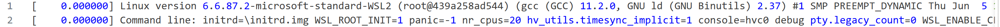

**架构初始化与虚拟化检测（0.000000秒）**：内核随后初始化了 x86_64 架构特定的代码。它首先声明了支持的 CPU 厂商：Intel GenuineIntel 和 AMD AuthenticAMD。在现代 x86 系统中，这个阶段会检测 CPU 的特性标志（CPUID 指令的结果），确定处理器支持哪些扩展指令集。

内核接着检测到了虚拟化环境："Hypervisor detected: Microsoft Hyper-V"。这个发现改变了内核的许多行为假设。在虚拟化环境中，一些通常由硬件提供的功能（如中断、定时器、内存管理）实际上是由虚拟机监控程序模拟的。Hyper-V 报告了一系列权限标志和特性位，告诉 Linux 内核它可以使用哪些半虚拟化（paravirtualization）优化。

**时钟源初始化（0.000000秒）**：准确的时间测量对操作系统至关重要。内核初始化了两个时钟源：`hyperv_clocksource_tsc_page` 和 `hyperv_clocksource_msr`。前者使用一个由 Hyper-V 维护的共享内存页来读取时间，这种方法非常高效，因为不需要陷入虚拟机监控程序；后者通过模型特定寄存器（MSR）读取时间，稍慢但更通用。内核检测到 CPU 的时间戳计数器（TSC）频率为 2995.200 MHz，这将用于高精度的时间测量。

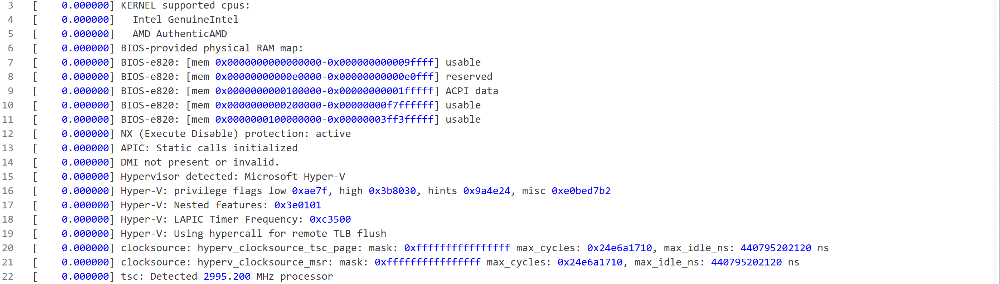

**内存布局建立（0.000000-0.000282秒）**：在这个微小的时间窗口内，内核完成了对物理内存的初步认识。通过 BIOS-e820 内存映射（这是一个历史悠久的 x86 标准），内核了解到系统有多个内存区域：

- 地址 0x00000000-0x0009ffff（640KB）：可用的低端内存，这是 PC 兼容性设计的遗留，被称为"常规内存"（Conventional Memory）
- 地址 0x000e0000-0x000e0fff：保留区域，用于存放 ACPI RSDP（根系统描述指针）
- 地址 0x00100000-0x001fffff（1MB-2MB）：ACPI 数据表所在区域，包含 XSDT、FACP、DSDT、SRAT、APIC 等完整的 ACPI 表结构
- 地址 0x00200000-0xf7ffffff（约 4GB）：主要的可用内存区域，这是 4GB 以下的主要可用内存
- 地址 0x0100000000-0x03ff3fffff（高于 4GB）：更多可用内存，4GB 以上的可用内存，现代系统的主要内存池

其中比较关键的有：

- **ACPI 子系统初始化（0.000165-0.000194秒）**：ACPI（高级配置与电源接口）是现代 x86 系统的标准固件接口。内核在物理地址 0x000E0000 处找到了 RSDP（根系统描述指针），这是 ACPI 表链的入口点。通过解析 RSDP，内核找到了 XSDT（扩展系统描述表），进而找到了一系列描述硬件配置的表：

  - FACP（固定 ACPI 描述表）：包含固定硬件特性
  - DSDT(差异化系统描述表,约 120KB):包含设备和方法的 AML 字节码定义
  - SRAT（系统资源亲和表）：描述 NUMA 节点和处理器的对应关系
  - APIC（高级可编程中断控制器表）：描述中断控制器配置

  这些表都被内核保留在内存中，供后续使用。

- **NUMA 拓扑发现（0.000213秒）**：通过 SRAT 表，内核检测到 NUMA 支持但仅存在一个节点，因此实际上是 UMA 架构，只是虚拟机监控程序提供了 NUMA 接口。所有 20 个逻辑处理器（APIC ID 0x00 到 0x13）都属于 NUMA 节点 0。在我们的虚拟化环境中，Hyper-V 将所有虚拟 CPU 放在同一个 NUMA 节点，简化了内存访问模式。

内核还启用了 NX（No-eXecute）保护，这是一个重要的安全特性，防止代码从数据页执行。

在四分之一毫秒内，内核完成了从"原始内存块"到"结构化内存管理系统"的转变：这个阶段为后续的伙伴系统、slab 分配器、页面回收等高层内存管理机制奠定了坚实基础。x86-64 的复杂性源于四十年的向后兼容负担，但也造就了其无与伦比的灵活性和成熟度

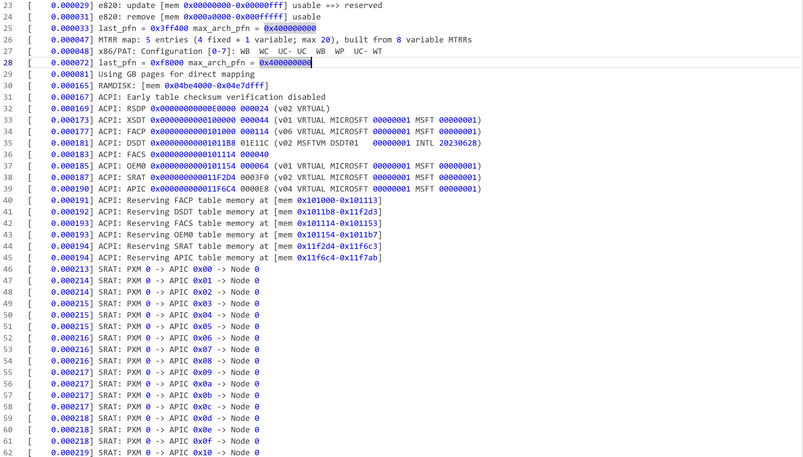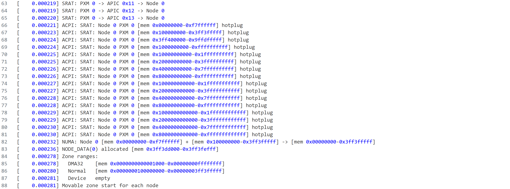

**ACPI 子系统初始化（0.000165-0.000194秒）**：ACPI（高级配置与电源接口）是现代 x86 系统的标准固件接口。内核在物理地址 0x000E0000 处找到了 RSDP（根系统描述指针），这是 ACPI 表链的入口点。通过解析 RSDP，内核找到了 XSDT（扩展系统描述表），进而找到了一系列描述硬件配置的表：

- FACP（固定 ACPI 描述表）：包含固定硬件特性
- DSDT（差异化系统描述表）：包含设备和方法的定义
- SRAT（系统资源亲和表）：描述 NUMA 节点和处理器的对应关系
- APIC（高级可编程中断控制器表）：描述中断控制器配置

这些表都被内核保留在内存中，供后续使用。

**内存管理子系统初始化（0.000278-0.056315秒）**：这是内核启动的第一个主要时间消耗点。在 56 毫秒的时间里，内核建立了完整的内存管理基础设施。

内核首先划分了内存区域（zones）。在 x86_64 架构上，通常有 DMA、DMA32 和 NORMAL 三个区域，分别用于不同类型的设备 DMA 操作和普通内存分配。

日志显示："Memory: 4074596K/16632444K available"。让我们仔细解读这个数字：系统总共识别到约 16GB（16632444KB ≈ 16.2GB）的物理内存，其中约 4GB（4074596KB ≈ 3.9GB）可供内核和用户程序使用。那么其余的 12GB 去哪了呢？答案在后面的详细分解中：

保留内存包括硬件保留区域（如 ACPI 表、BIOS 区域）和内核数据结构（如页表、内存位图）。剩余的约 12GB 内存实际上是可用的，**Hyper-V 采用气球驱动（balloon）按需分配内存**。

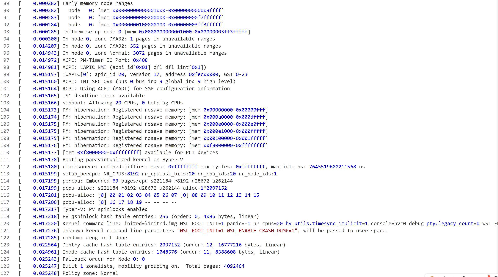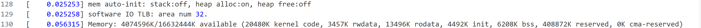

### 对称多处理器（SMP）初始化阶段

**唤醒辅助处理器（0.071761秒）**：在完成了基本的内存管理设置后，内核进入了一个至关重要的阶段——对称多处理器（SMP）初始化。日志中的 "smp: Bringing up secondary CPUs ..." 标志着这个阶段的开始。

在现代多核处理器系统中，引导处理器（BSP，Bootstrap Processor）负责执行内核的初始化代码，而其他处理器（AP，Application Processors）则处于等待状态。一旦 BSP 完成了基本初始化，它就会依次唤醒每个 AP，让它们也开始执行内核代码。在我们的系统中，有 20 个逻辑处理器，这意味着有 19 个辅助处理器需要被唤醒。

这个过程涉及复杂的处理器间通信（IPI，Inter-Processor Interrupt）机制。BSP 通过 APIC（高级可编程中断控制器）向每个 AP 发送 INIT 和 STARTUP IPI，指示它们开始执行内核代码。每个 AP 启动后，需要初始化自己的页表、中断描述符表、段描述符等架构特定的数据结构，然后向 BSP 报告自己已经就绪。

在 Hyper-V 虚拟化环境中，这个过程被优化了。虚拟机监控程序可以并行初始化多个虚拟 CPU，而不需要模拟物理 CPU 的逐个唤醒过程。这也解释了为什么我们没有看到每个 CPU 单独的初始化消息——它们几乎是同时完成的。启动顺序反映了 Intel 混合架构(P-core + E-core)的特性,偶数编号是物理核心,奇数编号是超线程

**释放可选代码（0.071761秒）**：在 SMP 初始化完成后，内核释放了 44KB 的 "SMP alternatives" 内存。这是一个有趣的优化技术。Linux 内核在编译时会为某些代码生成多个版本：单处理器版本和多处理器版本。在启动时，内核会根据检测到的处理器数量，选择合适的代码路径并打补丁（code patching）。一旦补丁完成，那些未被选择的代码版本就可以安全地释放了。

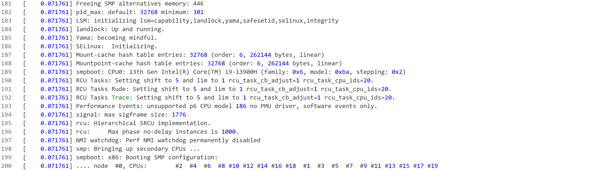

### 设备驱动初始化：虚拟硬件的发现与配置

**PCI 子系统初始化（0.136165-0.846937秒）**：Linux 内核的设备驱动模型建立在 PCI（外设组件互连）总线的基础上。即使在虚拟化环境中，大多数设备也通过虚拟 PCI 总线暴露给客户操作系统。

日志开始于一条看似矛盾的消息："PCI: Fatal: No config space access function found"，紧接着又是 "PCI: System does not support PCI"。这实际上反映了 WSL2 环境的特殊性：它没有传统的 PCI 配置空间访问机制（如通过 I/O 端口 0xCF8/0xCFC），但随后 Hyper-V 提供了自己的虚拟 PCI 实现。

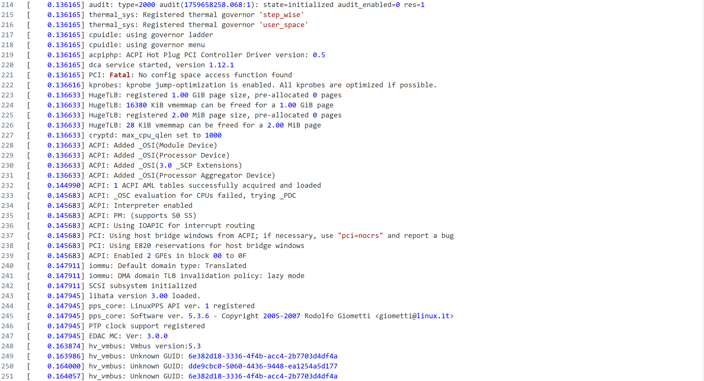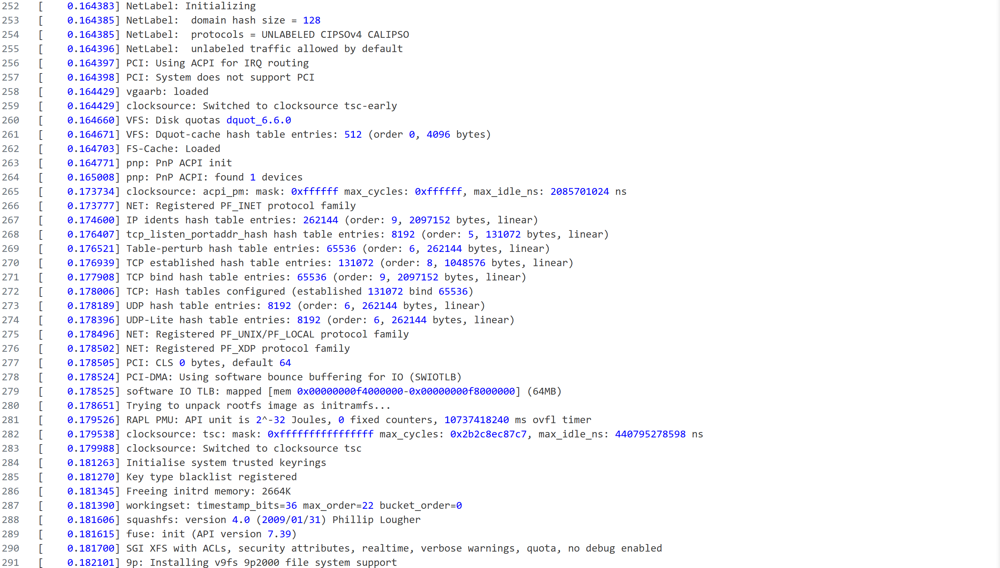

内核随后检测到四个虚拟 PCI 主机桥（host bridge），每个都代表一个虚拟设备：

**第一个设备（PCI 地址 5582:00:00.0）**在时间戳 0.190908 秒被探测到。这是一个 virtio 块设备，设备 ID 为 1af4:1043（其中 1af4 是 Red Hat 的厂商 ID，1043 是 virtio 块设备的设备 ID）。设备被分配了三个内存区域（BAR，Base Address Register）：

- BAR 0：0x9ffe00000-0x9ffe00fff（4KB），用于通用配置
- BAR 2：0x9ffe01000-0x9ffe01fff（4KB），用于设备特定配置  
- BAR 4：0x9ffe02000-0x9ffe02fff（4KB），用于通知区域

这些内存映射的 I/O（MMIO）区域允许驱动程序与设备通信，而不需要特殊的 I/O 指令。virtio 是一种半虚拟化技术，它比全虚拟化更高效，因为客户操作系统知道自己在虚拟环境中运行，可以使用专门优化的协议与虚拟机监控程序通信。

**第二和第三个设备（PCI 地址 4390:00:00.0 和 e772:00:00.0）**的设备 ID 都是 1414:008e（其中 1414 是 Microsoft 的厂商 ID）。这些是 Hyper-V 合成设备，可能用于视频或网络功能。

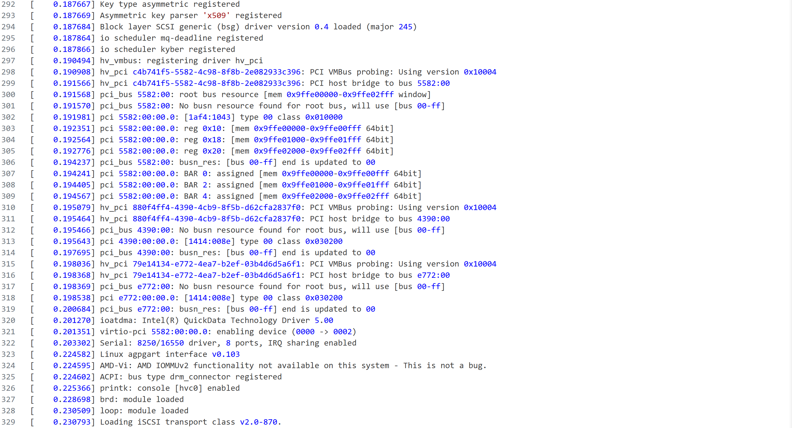

**第四个设备（PCI 地址 d861:00:00.0，时间戳 0.840520-0.846937秒）**最为特殊，它是一个 virtio 文件系统设备（设备 ID 1af4:105a）。这个设备被分配了一个巨大的内存区域：BAR 4 从 0xc00000000 到 0xdffffffff，跨越了惊人的 8GB 地址空间！这个区域用于 WSL2 的计划 9 文件系统（Plan 9 Filesystem over virtio），它允许 Linux 客户机直接访问 Windows 宿主机的文件系统，这就是我们能在 WSL2 中访问 `/mnt/c/` 等 Windows 驱动器的原因。需要说明的是：这个 8GB 的 BAR 是**虚拟地址空间映射**，不是物理内存占用。它使用 DAX（Direct Access）技术，将 Windows 主机文件系统的页面缓存直接映射到 Linux 客户机的地址空间，实现零拷贝访问。

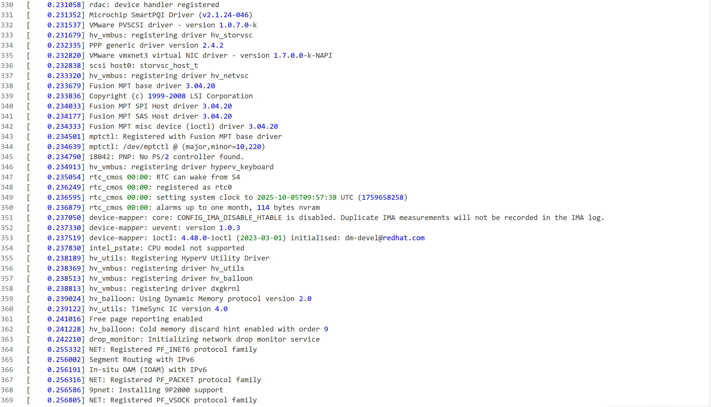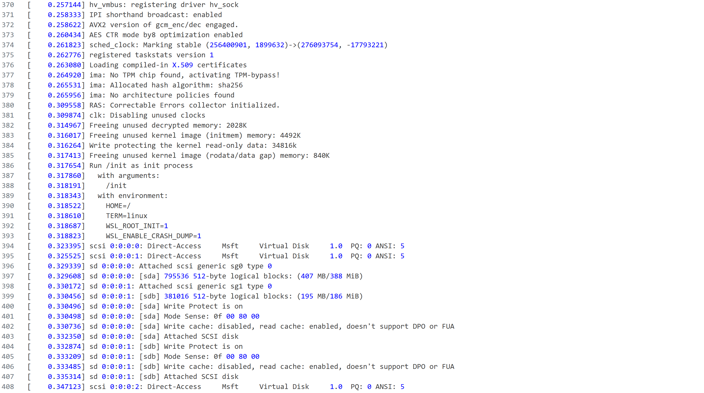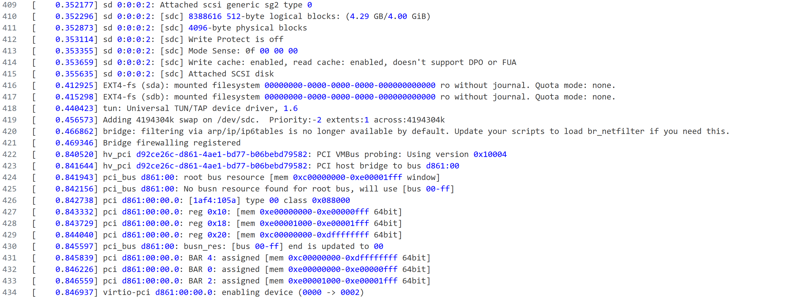

### 内存管理的后续优化

**内存块大小确定（0.129135秒）**：内核的内存热插拔子系统设置了内存块大小为 128MB。在支持内存热插拔的系统中，物理内存被划分为固定大小的块，每个块可以独立地添加或移除。虽然 WSL2 通常不需要热插拔内存，但内核保留了这个机制以支持 Hyper-V 的动态内存功能。

**释放初始内存盘（0.181345秒）**：内核释放了 2664KB（约 2.6MB）的 initrd（初始内存盘）内存。initrd 包含了启动早期需要的驱动程序和工具，一旦根文件系统被挂载，initrd 的内容就不再需要了，可以安全释放以回收内存。

**Hyper-V 动态内存初始化（0.239024-48.330690秒）**：这是一个跨越约 48 秒的过程。Hyper-V 的动态内存（balloon）驱动程序初始化，使用协议版本 2.0。日志显示启用了冷内存丢弃提示（cold memory discard hint），这是一个内存优化技术，允许虚拟机告诉宿主机哪些内存页很久没有使用，可以被回收。

日志中的 "Max. dynamic memory size: 16244 MB" 出现在时间戳 48.330690 秒，这表明动态内存配置是一个异步过程，它与其他初始化并行进行。最大动态内存大小约为 16GB，这与我们的物理内存配置一致。

**释放未使用的内核内存（0.314967-0.317413秒）**：内核在完成初始化后，释放了几类不再需要的内存：

- 解密内存（decrypted memory）：2028KB，这可能与内存加密特性相关
- 初始化代码和数据（initmem）：4492KB，这些内存仅在启动时使用
- 只读数据和数据段之间的间隙：840KB

这些释放操作总共回收了约 7.4MB 的内存，使其可供用户程序使用。

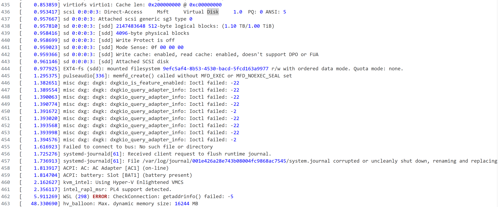

当内核完成所有初始化并挂载根文件系统后，它将控制权交给了 init 进程——在现代 Linux 系统中，这通常是 systemd（进程 ID 为 1）。systemd 的任务是启动所有系统服务，最终呈现一个可用的用户环境。

总的来说，**RISC-V（uCore Lab1）的启动流程**非常简洁，只有三个主要阶段：

1. **复位向量（0x1000）**：处理器复位后，程序计数器被设置为地址 0x1000。在 QEMU 的 virt 板级模型中，CPU 复位后从地址 0x1000 开始执行（此为 QEMU 约定），随后跳转到 OpenSBI 固件。

2. **OpenSBI 固件（0x80000000）**：OpenSBI（Open Supervisor Binary Interface）是 RISC-V 的标准运行时固件，提供机器模式（M-mode）服务。QEMU 会将 OpenSBI 固件加载到物理内存的高地址区域（通常是 0x80000000 处），由其初始化硬件并跳转至内核入口 0x80200000。

3. **内核入口（0x80200000）**：操作系统内核接管控制，初始化虚拟内存、进程管理、设备驱动等子系统，最终启动用户程序。

整个流程清晰、线性、易于理解。地址都是固定的，不需要复杂的地址重定位。

**x86（WSL2 Linux）的启动流程**则复杂得多，涉及多个层次：

1. **UEFI 固件**（在物理机上）：包含 SEC（安全阶段）、PEI（EFI 前期初始化）、DXE（驱动执行环境）、BDS（引导设备选择）等多个阶段。WSL2 由于是虚拟化环境，跳过了这些阶段，直接由 Hyper-V 加载内核。

2. **引导加载器**（在物理机上会有 GRUB）：负责加载内核镜像和初始内存盘到内存，设置内核启动参数，然后跳转到内核入口点。WSL2 中这个角色由 Hyper-V 承担。但Hyper-V 并不执行 GRUB 的全部功能，它只是 **直接加载内核映像**，并非引导加载器意义上的 “bootloader”。

3. **内核初始化**：与 RISC-V 类似，但复杂度高得多。需要初始化 ACPI 子系统、APIC 中断控制器、PCI 总线、多核处理器、复杂的内存管理（支持 NUMA、内存热插拔、大页等）。

4. **initrd/initramfs**：临时根文件系统，包含必要的驱动程序和工具，用于挂载真正的根文件系统。

5. **systemd**：用户态初始化系统，管理服务启动和系统状态转换。

## 实验总结

本实验围绕 RISC-V 架构下操作系统启动流程展开，结合 QEMU 模拟器、GCC 交叉编译器和 GDB 调试工具，验证了从 CPU 复位到内核初始化的完整链路。实验一聚焦计算机启动基本流程：上电复位阶段（PC=0x1000）、MROM 加载 OpenSBI 固件（0x80000000），以及 Bootloader 到内核交接（0x80200000）。通过阅读 entry.S 汇编代码，阐释了栈初始化（la sp, bootstacktop）和控制权转移（tail kern_init）的机制，并解答练习问题：前者设置栈指针以支持函数调用，后者跳转 C 入口以接管初始化。同时，分析链接脚本与 init.c 的协作，确保 BSS 段清零和内存布局（.text、.data、.bss、栈）正确。

实验二深入 RISC-V 特权模式（M/S/U）和内核/操作系统概念，区分宏/微/混合内核的优劣。使用 GDB 连接 QEMU gdbstub，逐指令追踪启动：从 MROM 跳转 OpenSBI（读取 hart ID 和固件入口），到内核入口执行栈设置和 memset 清零。观察 OpenSBI 输出平台信息，确认特权级切换（ecall 机制）和 SMP 初始化差异。

拓展部分对比现代 x86（WSL2 Linux）启动：Hyper-V 简化 UEFI/GRUB，直接加载内核；dmesg 时间线揭示内存管理、SMP 唤醒、PCI 设备枚举和动态内存优化（~48s异步）。systemd 分析暴露服务依赖瓶颈，总启动时 ~10s，可通过裁剪非关键单元优化。

总体收获：掌握启动链抽象模型（复位→固件→内核→用户空间），理解 RISC-V 简洁与x86 复杂的架构差异，奠定后续 OS 研究基础。
