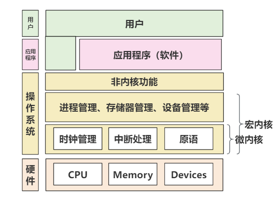
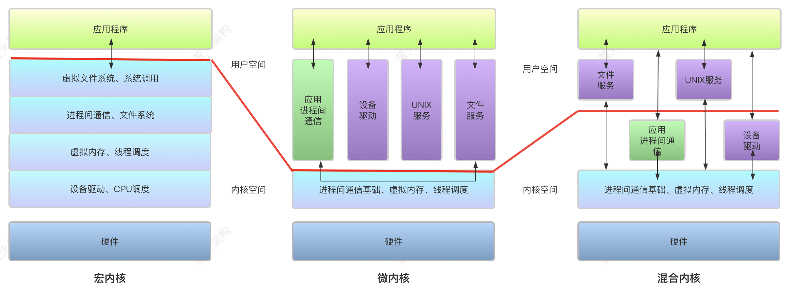
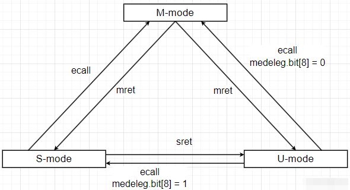

# **OS Lab1**

 

## 重要知识点

### 内核与操作系统

​	**内核**是操作系统的核心。**内核是操作系统执行的第一道程序，被率先加载到内存中开始系统行为。**内核始终保持在主内存中直到系统被关闭，将用户输入的命令转换成计算机硬件能理解的机器语言。同时，内核是系统应用软件和硬件的桥梁，直接与硬件联系，并告之它由应用软件发起的请求。操作系统不能脱离内核工作，内核是系统正常运行最重要的程序。内核的主要职责是：进程管理、磁盘管理、任务调度、内存管理等，具体如下：

1. **文件管理：**为了更有效地搜索和使用文件，内核使用文件系统来组织文件，并通过文件系统保持对文件数据存储、文件状态、访问设置的监视。
2. **进程管理：**在多进程环境下，内核决定哪一道进程被CPU优先运行，以及分配的运行时间片长度是多少，即进程调度。当进程不再被需要的时候，将被内核自动销毁。
3. **内存管理：**内核检测内存空间，可以生成或销毁内存，以确保应用程序被正确执行。



<center><b>图1 计算机系统的层次结构

内核分为宏内核、微内核和混合内核三种。

1. **宏内核，**也被称为单体内核，是一种把所有的服务都集中在一起的内核设计。它的优点是性能高，因为所有服务都在内核中运行，调用过程简单，效率高。但是，这种设计也有缺点，如果内核中的一个服务出现问题，可能会影响到整个系统的稳定性。
2. **微内核，**只提供最基本的服务，如进程调度、内存管理等，其他的服务，如文件系统、网络协议等，都在内核之外的用户空间中运行。这种设计的优点是结构简单，容易理解和修改，如果一个服务出现问题，也不会影响到其他服务。但是，这种设计的缺点是性能较低，因为服务之间的调用需要在内核和用户空间之间进行切换，效率较低。
3. **混合内核，**基于微内核的架构设计，把一些性能要求高的服务放在内核中，比如设备驱动、应用进程间通信等，而其他的服务则放在用户空间中。这种设计既有宏内核的性能优势，又有微内核的稳定性优势。但是，这种设计的缺点是复杂性高，需要仔细地选择哪些服务放在内核中，哪些服务放在用户空间中。

​	

​						**图2 内核分类**[^  1  ]

​	针对这三者而言，在性能上，宏内核最好，因为所有服务都在内核中，调用效率高；微内核最差，因为需要频繁地在内核和用户空间之间切换；混合内核介于两者之间。
于安全性而言，微内核最好，因为各个服务相互独立，一个服务出问题不会影响到其他服务；宏内核最差，因为所有服务都在一起，一个服务出问题可能会导致整个系统崩溃；混合内核介于两者之间。

​	**操作系统**是用来管理计算机系统资源的软件，内核是用户和系统硬件的桥梁。操作系统提供的接口允许用户直接看到其输入命令的响应结果，例如Window的命令行cmd和Linux的Shell终端。没有操作系统，系统就不可能运行，部分嵌入式系统看似没有操作系统，但仍然对硬件作了一层简单封装，也可理解为Tiny OS。操作系统的主要职责是创建应用软件可以运行的环境。操作系统同样是运行在计算机系统中的持久化程序，直至系统关闭。它是计算机系统运行的第一道程序，一旦操作系统被加载到内存，计算机就做好了执行用户程序的准备。在操作系统中，内核是最重要的程序。除了内核的职责外，操作系统额外负责安全性与隐私、中断与挂起等服务，具体如下：

1. **安全性：**为了保护用户数据安全，操作系统对计算机进行了密码保护，保护程序不被非法途径泄露。
2. **工作分析：**操作系统跟踪资源的使用情况，这些分析数据可以用来监视、反映资源对特定用户或用户群体的利用率，便于系统调整。
3. **与用户和其他软件合作：**操作系统也向用户分配解释器、汇编、编译器和其他系统级软件，便于用户和其他应用调用接口。
4. **控制系统性能：**为控制系统性能，操作系统时刻监视其运行状态，最主要是测量应用发起服务接口请求，和系统返回响应之间的时间。在操作系统的帮助下，通过提供解决问题的关键性信息可以提供系统性能。
5. **错误自检：**操作系统密切监测系统漏洞来防止运行崩溃。
6. **设备管理：**操作系统保持对所有接入计算机的硬件设备的监视和跟踪，决定了每个外设是否可以访问计算机资源以及访问的允许时长是多少。

### RISCV的四种特权级别

​	RISC-V 硬件线程 hart（**har**dware **t**hread）由一或多个 CSRs（**C**ontrol and **s**tatus **r**egisters）编码决定了其运行的权级模式。目前已经定义了三个权级，如下表所示：

| 级别 | 编码 |          名称          | 缩写 |
| :--: | :--: | :--------------------: | :--: |
|  0   |  00  |     用户(**U**ser)     |  U   |
|  1   |  01  | 监管者(**S**upervisor) |  S   |
|  2   |  10  |          保留          |      |
|  3   |  11  | 机器权级(**M**achine)  |  M   |

​	RISC-V 指令集架构采用多特权级别设计作为其核心安全机制，通过层次化的权限管理实现系统资源的隔离与保护。该架构明确定义了四个层次化的特权模式，按照权限等级由高至低依次为：

- 机器模式（M-mode）：权限等级最高。在这个模式下，程序**可以执行所有操作**，包括直接访问和修改所有硬件资源。机器模式通常用于硬件初始化、系统引导、中断和异常处理等关键任务。由于其高度特权，机器模式通常只允许特定的、受信任的代码运行。
- 监管者模式（S-mode）：权限等级介于用户模式和机器模式之间。通常用于**操作系统内核的运行**。在监管模式下，程序可以执行一些特权操作，如访问物理内存、管理设备驱动程序等。它允许操作系统管理硬件资源，为多个用户模式的程序提供服务和调度。
- 用户模式（U-mode）：权限等级最低。在这个模式下运行的程序（如应用程序）**不能直接访问硬件资源**或执行特权操作。用户模式提供了最基本的程序执行环境，用于隔离和保护操作系统内核和其他程序。它确保了应用程序的稳定性和安全性，防止它们对系统造成损害。

这些模式的存在意义在于提供了一种灵活而安全的计算环境。通过限制不同程序的权限，RISC-V 架构能够防止恶意软件或不受信任的程序对系统造成损害。同时，它也允许操作系统有效地管理硬件资源，确保多个程序能够公平地共享这些资源。==下图==是特权指令引起的特权模式切换示意图：



​					**图x RISC-V特权模式切换**[^  2  ]

​	由图可以看出，`ecall` 指令是 RISC-V 中用于实现受控的权限提升的关键指令。当在 U 模式（用户态）执行 `ecall`，会触发异常，从而陷入到 S 模式（内核态）。这是系统调用的底层机制。当在 S 模式（内核态）执行 `ecall`，会触发异常，从而陷入到 M 模式（机器态）。这也正是我们本次实验中涉及到的调用 `OpenSBI` 服务的方式。

​	对比在软件层面的概念对：**内核态和用户态，**他们分别对应到RISC-V 的特权等级就是用户态对应U-Mode，内核态对应S-Mode。

通常，用户程序只运行在用户态，在以下三种情况下会切换到内核态进行处理：

1. 系统调用：当应用程序需要访问操作系统服务如文件读写、进程创建时，通过 int 指令或 syscall 指令主动请求内核执行操作。
2. 异常：运行时若发生异常如缺页异常、非法指令、除零错误等，CPU 会自动切换到内核态，由操作系统处理异常。
3. 外部中断：外设如磁盘、网卡完成任务后向 CPU 发送中断信号，CPU 根据中断向量表跳转到内核态处理事件。

这种机制通过限制用户程序的直接硬件访问权限，确保系统的安全性和稳定性，仅在必要时通过上述三种方式切换到内核态。

## 练习二

### RISC-V启动流程简述

​	在本实验在中WSL(Ubuntu 22.04)进行操作，目标为**使用GDB验证启动流程**，跟踪 QEMU 模拟的 RISC-V 从加电开始，直到执行内核第一条指令（跳转到 0x80200000）的整个过程。此流程涉及五个关键组成部分：

1. **MROM（Machine ROM）**

   在 QEMU 模拟的 RISC-V 启动流程中，CPU 复位后 PC 被初始化为 0x1000，对应虚拟的 MROM 区域（Machine ROM）。它的主要任务是读取硬件信息例如硬件线程ID，查找下一阶段固件（本实验中是OpenSBI）的入口地址，并将控制权跳转过去。MROM 不进行复杂初始化，也不会产生输出，**仅起到“引导跳板”的作用，确保 CPU 从复位状态正确进入 OpenSBI。**

2. **OpenSBI**

   OpenSBI是运行在 **M模式** 下的引导固件。它负责初始化底层硬件环境（如时钟、中断、串口、PMP 权限等），在QEMU启动时，OpenSBI作为bootloader会将操作系统内核从硬盘加载到内存地址 **0x80200000**，并把CPU的控制权交给操作系统。此时QEMU 终端上会输出 OpenSBI 的启动信息，例如平台名称、HART 数量和内核入口地址等。

3. **内核（Kernel）**

   运行在 **S 模式**，是操作系统的主体。当内核加载到内存中后，CPU 开始执行内核入口文件（如 entry.S），设置栈、初始化 C 运行时环境，并最终进入 kern_init()。该阶段会打印内核初始化信息，标志着系统从固件阶段过渡到操作系统阶段。

4. **QEMU**

   是本实验中用于模拟 RISC-V 硬件平台的虚拟机。它模拟 CPU、内存、外设等硬件资源，并提供 GDB 远程调试接口gdbstub，允许我们通过 GDB 精确控制模拟 CPU 的执行。在实验过程中，QEMU 负责运行 MROM 与 OpenSBI 的固件镜像、加载内核镜像，并配合 GDB 实现断点设置、单步调试与寄存器状态查看。

5. **GDB**

   **GDB** 是由 GUN 软件系统社区提供的**调试工具**，同 GCC 配套组成了一套完整的开发环境，GDB 是 Linux 和许多 类Unix系统的标准开发环境。在本实验中用来“观察与控制”QEMU 内部虚拟 CPU 的工具；通过 target remote连接到 QEMU 的 gdbstub 后，GDB 能在 MROM、OpenSBI、内核的任意地址设置断点、单步执行、查看寄存器和内存，从而精确地验证启动链发生的时序与状态。

具体的启动流程图如下所示：

```mermaid
flowchart TD
  A[Power on<br/>PC = <b>0x1000] --> B[MROM@ <b>0x1000]
  B -->|读取hart id/读取固件入口地址| C[Jump to OpenSBI @ <b>0x80000000]
  C -->|OpenSBI 初始化平台<br/>加载内核到 <b>0x80200000| D[Kernel image @ <b>0x80200000]
  C -->|打印平台信息到 QEMU 终端| T[QEMU]
  D -->|跳转到 kernel entry<br/>进入内核初始化流程| E[kern_init -> C runtime]
  subgraph 调试
    G[GDB] ---|target remote| Q[QEMU内置的远程调试接口<br>gdbstub]
    Q ---|pauses/resumes<br>控制执行| B
    Q ---|pauses/resumes<br>控制执行| C
    Q ---|pauses/resumes<br>控制执行| D
  end

  style A fill:#f9f,stroke:#333,stroke-width:1px
  style B fill:#ffd,stroke:#333,stroke-width:1px
  style C fill:#ddf,stroke:#333,stroke-width:1px
  style D fill:#dfd,stroke:#333,stroke-width:1px
  style E fill:#efe,stroke:#333,stroke-width:1px
  style G fill:#fff,stroke:#666,stroke-width:1px
  style Q fill:#fff,stroke:#666,stroke-width:1px
  style T fill:#fff,stroke:#666,stroke-width:1px
```

<center><b>图x 启动流程图

### 具体实验流程

#### 配置工具	

​	配置riscv-elf-toolchains工具链的环境变量到文件 `~/.bashrc`，它是bash shell启动时自动执行的脚本，里面通常包含自定义的环境变量、别名、函数等。 `source ~/.bashrc`命令让当前shell立即执行，改动立即生效。QEMU同理。

```bash
echo 'export PATH=/home/lin_gzh/riscv-elf-toolchains/bin:$PATH' >> ~/.bashrc
source ~/.bashrc
```

#### 启动环境

执行命令：输入make gdb运行GDB，实际上执行的是一系列操作的集合如下代码所示:

1. **file bin/kernel：**让GDB加载我们编译好的内核文件，包含宝贵的调试符号。
2. **set arch riscv:rv64：**告诉GDB调试的是RISC-V 64位的程序。
3. **target remote localhost:1234：**让GDB连接gdbstub(localhost:1234)，这是 **QEMU内置的远程调试接口**，一个轻量级的 **GDB 服务器**，遵守 GDB 的远程调试协议，通常监听在本地端口 1234。然后 GDB 就能远程控制 QEMU 内部的“虚拟CPU”,实现设置断点（如 b *0x80200000）、单步执行（si）、查看寄存器（info registers）和查看内存与反汇编（x/10i $pc）等操作。

```bat
newuser@LAPTOP-MBRBQ4H4:/mnt/d/大三上课程/OS/实验/labcode/labcode/lab1$ make gdb
riscv64-unknown-elf-gdb \
    -ex 'file bin/kernel' \
    -ex 'set arch riscv:rv64' \
    -ex 'target remote localhost:1234'
GNU gdb (GDB) 16.3.90.20250610-git
Copyright (C) 2024 Free Software Foundation, Inc.
License GPLv3+: GNU GPL version 3 or later <http://gnu.org/licenses/gpl.html>
This is free software: you are free to change and redistribute it.
There is NO WARRANTY, to the extent permitted by law.
Type "show copying" and "show warranty" for details.
This GDB was configured as "--host=x86_64-pc-linux-gnu --target=riscv64-unknown-elf".
Type "show configuration" for configuration details.
For bug reporting instructions, please see:
<https://www.gnu.org/software/gdb/bugs/>.
Find the GDB manual and other documentation resources online at:
    <http://www.gnu.org/software/gdb/documentation/>.
```

打开一个新的终端，执行make 运行QEMU。这里QEMU为“被调试的目标”，它按照我们的要求启动内核，然后在某个端口上等待；同时，我们使用GDB调试器，去连接QEMU，让GDB向我们报告QEMU内部虚拟CPU的一举一动，可以像调试普通程序一样调试内核。

#### 从0x1000处执行初始化固件的汇编代码

```assembly
The target architecture is set to "riscv:rv64".
Remote debugging using localhost:1234
0x0000000000001000 in ?? ()
(gdb) p/x $pc
$1 = 0x1000
```

首先在GDB执行`p/x $pc`查看当前程序计数器PC，输出`$1 = 0x1000`表示最初执行的指令位于**复位地址 0x1000**

```assembly
(gdb) x/10i 0x1000
=> 0x1000:      auipc   t0,0x0
   0x1004:      addi    a2,t0,40
   0x1008:      csrr    a0,mhartid
   0x100c:      ld      a1,32(t0)
   0x1010:      ld      t0,24(t0)
   0x1014:      jr      t0
   0x1018:      unimp
   0x101a:      .insn   2, 0x8000
   0x101c:      unimp
   0x101e:      unimp
```

然后执行`x/10i 0x1000`这里是以指令格式反汇编0x1000地址处机器码，用具体的地址计算说明如何配合把控制权交给OpenSBI，逐条观察解释：

1. `auipc t0,0x0`：**PC寻址指令：auipc rd, imm**，把 imm（立即数）左移12位并带符号扩展到64位后，得到一个新的立即数，，再加上当前 PC 值，然后存储到 rd 寄存器中。

   这里 imm=0，因此实际上 `t0=PC=0x1000`。建立一个**PC 相对基址**，后续通过对 t0 加上小偏移就能访问“当前段附近”的数据

2. `addi a2,t0,40`：将t0 + 40放入寄存器a2中 。

3. `csrr a0,mhartid`：读取 CSR 寄存器 mhartid（当前硬件线程编号），放进 a0。固件常需要知道当前是哪个 hart。

4. `ld a1,32(t0)`：从 t0+32 地址即 0x1020 处装载 8 字节到 a1。通常是读取某个指针或参数（例如指向 OpenSBI/固件镜像的地址或参数表）。

5. `ld t0,24(t0)`：从 t0+24 地址即 0x1018 处装载 8 字节到 t0。这条指令很关键，它把 t0 改成**要跳转到的目标地址**，这个值就是OpenSBI在内存中的入口地址。

6. `jr t0`：伪指令，跳转到 t0 指向的地址，实际上把控制权交给下一阶段(OpenSBI)。

7. `unimp` / `.insn` 等：这些是 GDB 无法识别或伪装或保留的指令，或者 MROM 中的数据填充，可以忽略。

​	这段在 0x1000 的代码是 CPU 上复位后的第一段固化代码（MROM）。它的作用非常有限但关键：读取 hart id，定位并跳转到固件（OpenSBI）的入口地址，从而把控制权交给 OpenSBI。MROM 通常很短，一个平台只需做最初级的跳转。

**我们以字节显示0x1018处的数据，发现确实是0x80000000**


<center><b>图x 验证OpenSBI的入口地址
#### OpenSBI加载内核到0x80200000处

程序接着设置断点0x80200000，输入c运行到断点处：

```
(gdb) tbreak *0x80200000
Note: breakpoint 2 also set at pc 0x80200000.
Temporary breakpoint 3 at 0x80200000: file kern/init/entry.S, line 7.       
(gdb) c
Continuing.
```

**file kern/init/entry.S, line 7：**GDB 有符号信息（用 file bin/kernel 加载了内核的符号），因此能把地址 0x80200000 映射回源代码 kern/init/entry.S的第 7 行。

当程序执行并命中该断点，la sp, bootstacktop初始化栈指针。说明 CPU 的 PC 确实到了内核入口，并且当前执行位置就是 `kern_entry` 的那一行。

```assembly
Temporary breakpoint 2, kern_entry () at kern/init/entry.S:7
7           la sp, bootstacktop
(gdb) p/x $pc
$3 = 0x80200000
(gdb) x/40i 0x80200000
=> 0x80200000 <kern_entry>:     auipc   sp,0x3
   0x80200004 <kern_entry+4>:   mv      sp,sp
   0x80200008 <kern_entry+8>:   j       0x8020000a <kern_init>
   0x8020000a <kern_init>:      auipc   a0,0x3
   0x8020000e <kern_init+4>:    addi    a0,a0,-2
   0x80200012 <kern_init+8>:    auipc   a2,0x3
   0x80200016 <kern_init+12>:   addi    a2,a2,-10
   0x8020001a <kern_init+16>:   addi    sp,sp,-16
   0x8020001c <kern_init+18>:   li      a1,0
   0x8020001e <kern_init+20>:   sub     a2,a2,a0
   0x80200020 <kern_init+22>:   sd      ra,8(sp)
   0x80200022 <kern_init+24>:   jal     0x80200490 <memset>
   0x80200026 <kern_init+28>:   auipc   a1,0x0
   0x8020002a <kern_init+32>:   addi    a1,a1,1154
   0x8020002e <kern_init+36>:   auipc   a0,0x0
   0x80200032 <kern_init+40>:   addi    a0,a0,1178
   0x80200036 <kern_init+44>:   jal     0x80200054 <cprintf>
   0x8020003a <kern_init+48>:   j       0x8020003a <kern_init+48>
   0x8020003c <cputch>: addi    sp,sp,-32
   0x8020003e <cputch+2>:       sd      ra,24(sp)
   0x80200040 <cputch+4>:       sd      a1,8(sp)
   0x80200042 <cputch+6>:       jal     0x80200088 <cons_putc>
   0x80200046 <cputch+10>:      ld      a1,8(sp)
   0x80200048 <cputch+12>:      ld      ra,24(sp)
   0x8020004a <cputch+14>:      lw      a5,0(a1)
   0x8020004c <cputch+16>:      addiw   a5,a5,1
   0x8020004e <cputch+18>:      sw      a5,0(a1)
   0x80200050 <cputch+20>:      addi    sp,sp,32
   0x80200052 <cputch+22>:      ret
   0x80200054 <cprintf>:        addi    sp,sp,-96
   0x80200056 <cprintf+2>:      addi    t1,sp,40
   0x8020005a <cprintf+6>:      sd      a1,40(sp)
   0x8020005c <cprintf+8>:      sd      a2,48(sp)
```

逐段观察分析：

**A.内核入口kern_entry:设置栈顶并跳转到kern_int:**

```assembly
0x80200000 <kern_entry>:     auipc   sp,0x3
0x80200004 <kern_entry+4>:   mv      sp,sp
0x80200008 <kern_entry+8>:   j       0x8020000a <kern_init>
```

1. **auipc sp,0x3：**将栈指针 sp 设为 `PC + (0x3 << 12)`，这里的意图是把栈指针 `sp` 指向一个在内核镜像中预先定义的栈顶。
2. **mv sp,sp：**这是一个伪指令等价于 `addi sp,sp,0` **无操作**。可能是由汇编伪指令展开或对齐产生的代码，实际不改变寄存器。
3. **j 0x8020000a <kern_init>**：跳转到内核 C 入口处（kern_init）。

**B.kern_init（准备 .bss 并调用初始化函数并打印）：**

```assembly
   0x8020000a <kern_init>:      auipc   a0,0x3
   0x8020000e <kern_init+4>:    addi    a0,a0,-2
   0x80200012 <kern_init+8>:    auipc   a2,0x3
   0x80200016 <kern_init+12>:   addi    a2,a2,-10
   0x8020001a <kern_init+16>:   addi    sp,sp,-16
   0x8020001c <kern_init+18>:   li      a1,0
   0x8020001e <kern_init+20>:   sub     a2,a2,a0
   0x80200020 <kern_init+22>:   sd      ra,8(sp)
   0x80200022 <kern_init+24>:   jal     0x80200490 <memset>
   0x80200026 <kern_init+28>:   auipc   a1,0x0
   0x8020002a <kern_init+32>:   addi    a1,a1,1154
   0x8020002e <kern_init+36>:   auipc   a0,0x0
   0x80200032 <kern_init+40>:   addi    a0,a0,1178
   0x80200036 <kern_init+44>:   jal     0x80200054 <cprintf>
   0x8020003a <kern_init+48>:   j       0x8020003a <kern_init+48>
```

1. **auipc a0,0x3 和 addi a0,a0,-2：**搜索资料发现`auipc+addi` 的组合是典型的用来构造某个在内核镜像中静态数据（如 `.bss` 范围、字符串或地址表）的地址，`auipc` 给出一个高位基址（PC + 0x3000），`addi` 再加上或减去一个小偏移，得到最终的地址。。这里 a0 很可能被设置为 `memset` 要清零的目标地址（例如 BSS 段起始）。寄存器a2同理，将a2设成另一个地址，可能是bss段末尾。
2. **addi sp,sp,-16：**分配16字节栈空间
3. **li a1,0：**把寄存器 `a1` 置 0（`memset` 的填充值通常为 0）
4. **sub  a2,a2,a0**：如果 a2 是 end，a0 是 start，这就是 BSS 的长度。
5. **sd ra,8(sp)：**把返回地址 `ra` 存到栈。
6. **jal 0x80200490 <memset>：**调用 C 函数 `memset`，做初始化。在RISC-V中，memset函数用于在内存块中填充特定值。它通常用于初始化新申请的内存，返回指向被填充内存的指针。
7. **jal 0x80200054 <cprintf>：**调用 `cprintf` 输出启动信息。`auipc` + `addi` 又一次用来构造 `cprintf` 要打印的字符串地址,把 format 字符串地址放到 a0和a1，再 调用函数打印内核信息。
8. **j 0x8020003a <kern_init+48>**：最终跳到自身形成无限循环。

​	entry.S里的kernel entry 负责建立内核运行时最基本的环境（设置栈、初始化数据段、保存返回地址、调用必要的初始化函数），然后进入 C 语言的 `kern_init()` 做更高层的初始化（调试输出、设备初始化等）。


#### OpenSBI输出

在0x80200000处打断点并运行，发现此时OpenSBI输出下述信息：

```yaml
newuser@LAPTOP-MBRBQ4H4:/mnt/d/大三上课程/OS/实验/labcode/labcode/lab1$ make debug
OpenSBI v1.0
   ____                    _____ ____ _____
  / __ \                  / ____|  _ \_   _|
 | |  | |_ __   ___ _ __ | (___ | |_) || |
 | |  | | '_ \ / _ \ '_ \ \___ \|  _ < | |
 | |__| | |_) |  __/ | | |____) | |_) || |_
  \____/| .__/ \___|_| |_|_____/|____/_____|
        | |
        |_|

Platform Name             : riscv-virtio,qemu
Platform Features         : medeleg
Platform HART Count       : 1
Platform IPI Device       : aclint-mswi
Platform Timer Device     : aclint-mtimer @ 10000000Hz
Platform Console Device   : uart8250
Platform HSM Device       : ---
Platform Reboot Device    : sifive_test
Platform Shutdown Device  : sifive_test
Firmware Base             : 0x80000000
Firmware Size             : 252 KB
Runtime SBI Version       : 0.3

0000000080200000
Domain0 Next Arg1         : 0x0000000087000000
Domain0 Next Mode         : S-mode
Domain0 SysReset          : yes

Boot HART ID              : 0
Boot HART Domain          : root
Boot HART ISA             : rv64imafdcsuh
Boot HART Features        : scounteren,mcounteren,time
Boot HART PMP Count       : 16
Boot HART PMP Granularity : 4
Boot HART PMP Address Bits: 54
Boot HART MHPM Count      : 0
Boot HART MIDELEG         : 0x0000000000001666
Boot HART MEDELEG         : 0x0000000000f0b509
```

​	当 CPU 从复位跳到 OpenSBI并且 OpenSBI 完成最早期设备初始化（尤其是串口 UART）后，固件会把自己的运行信息打印到控制台（QEMU 终端）。上述所示 banner 与平台信息是在 OpenSBI 初始化并能使用控制台后打印的，在这之前通常不会有输出，因为还没初始化串口阶段。

```yaml
OpenSBI v1.0
Platform Name             : riscv-virtio,qemu
Platform Features         : medeleg
Platform HART Count       : 1
Platform IPI Device       : aclint-mswi
Platform Timer Device     : aclint-mtimer @ 10000000Hz
Platform Console Device   : uart8250
Platform HSM Device       : ---
Platform Reboot Device    : sifive_test
Platform Shutdown Device  : sifive_test
Firmware Base             : 0x80000000
Firmware Size             : 252 KB
Runtime SBI Version       : 0.3
```

这些字段分别是：

1. **OpenSBI v1.0：固件版本与标识，表明正在运行的是 OpenSBI 固件。
2. **Platform Name**：固件识别的模拟平台名称，这里是 **riscv-virtio,qemu（**说明 QEMU 的 virt 平台）。
3. **Platform Features**（**medeleg**）：固件支持的某些功能或委派特性。
4. **Platform HART Count**：该平台上 HART（硬件线程） 数量，本例为 1。
5. **Platform IPI/Timer/Console/… Device**：列出所使用的中断定时器、IPI（核心间中断）、Console 设备类型、重启/关机设备等具体虚拟外设。
6. **Firmware Base / Firmware Size**：OpenSBI在物理内存中的基址和大小（这里基址 0x80000000，大小 252 KB）。
7. **Runtime SBI Version**：SBI 接口的运行时版本号（固件暴露给上层的版本）。

**domain域信息：**

```yaml
0000000080200000
Domain0 Next Arg1         : 0x0000000087000000
Domain0 Next Mode         : S-mode
Domain0 SysReset          : yes
```

这几行 “Domain0” 信息描述了 OpenSBI 准备启动的内核环境：它将把控制权从 M 模式交给 S 模式的内核入口地址 0x80200000，同时通过寄存器 a1 向内核传递设备树地址 0x87000000，确保内核启动时能够识别硬件布局；此外，系统支持通过 SBI 接口执行重启。 这些参数共同构成了内核启动前的关键“跳转上下文”。

**最后是Boot HART等内容：**

```yaml
Boot HART ID : 0
Boot HART Domain : root
Boot HART ISA : rv64imafdcsuh
Boot HART Features : scounteren,mcounteren,time
Boot HART PMP Count : 16
Boot HART PMP Granularity : 4
Boot HART PMP Address Bits: 54
Boot HART MHPM Count : 0
Boot HART MIDELEG : 0x0000000000001666
Boot HART MEDELEG : 0x0000000000f0b509
```

1. **Boot HART ID / Domain**：说明哪个 hart 负责引导。
2. **Boot HART ISA**：该 hart 支持的 ISA 扩展集合（`rv64imafdcsuh` 表示 RV64 + 各类扩展：I, M, A, F, D, C, S, U, H 等），告诉上层内核 CPU 能力。
3. **Boot HART Features**：列出额外功能或 CSR。
4. **PMP Count / Granularity / Address Bits**：描述物理内存保护条目数量与粒度。
5. **MHPM / MIDELEG / MEDELEG**：这些寄存器值与性能计数器和异常/中断委派相关，说明哪些异常/中断固件把处理权委派给 S 模式等。

> [!IMPORTANT]
>
> 为什么执行到0x80000000断点处没有打印这些信息？
>
> 当 CPU 从复位向量（0x1000）进入 OpenSBI 固件（0x80000000）后，系统最初仍处于 M 模式早期初始化阶段，此时外设尚未启用，无法输出信息。OpenSBI 需先完成基础环境配置（如中断委派、PMP、定时器、内存映射等）并初始化控制台设备（UART）。只有当 UART 初始化完毕、能够与 QEMU 虚拟串口通信后，固件才开始通过 `uart8250` 输出启动信息。因此，我们在 GDB 继续运行到 0x80200000 之前，才第一次在终端看到 OpenSBI 的 banner 与平台信息打印，这标志着固件初始化已完成并准备跳转到内核入口。

#### 总结与体会

​	通过本次练习二，我深入理解了RISC-V架构下操作系统启动的全流程，从CPU复位后的MROM引导，到OpenSBI的M-mode初始化，再到内核加载至S-mode并进入kern_init()，整个链条清晰地展示了固件与内核的协作机制。使用GDB远程调试QEMU，不仅让我亲手验证了PC从0x1000跳转到0x80000000再到0x80200000的时序，还通过反汇编和寄存器查看，体会到汇编指令如auipc和ecall在特权模式切换中的关键作用。同时这次实践也让我深入领会GDB、OpenSBI、QEMU等工具的使用与功能，为之后的操作系统实验打下一个比较好的基础。

[^  1  ]:[微内核、宏内核、混合内核，三者到底有什么区别？-CSDN博客](https://blog.csdn.net/bossma/article/details/135536872)
[^  2  ]:[RISC-V特权模式及切换 - 技术栈](https://jishuzhan.net/article/1929367218697056257)