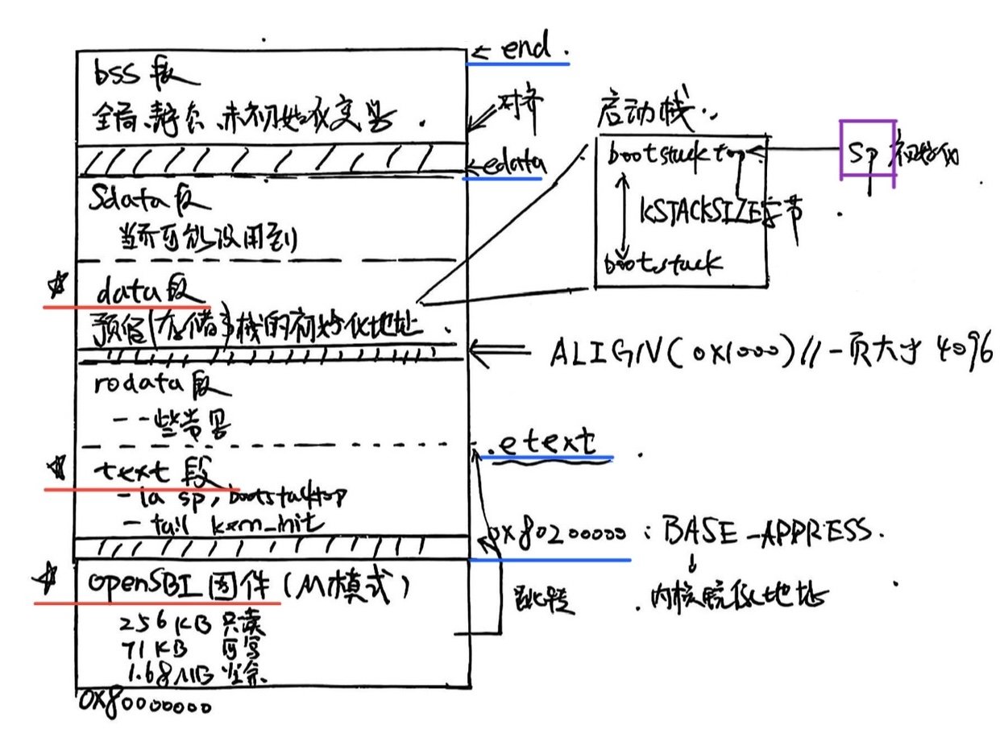

# Lab1 练习一：理解内核启动中的程序入口操作

## 实验概述

### 实验目标
本实验旨在理解操作系统内核启动的底层机制，通过分析RISC-V架构下的内核启动流程，掌握从硬件复位到内核初始化的完整过程。具体地，了解 Qemu 模拟器的启动流程，还需要一些程序内存布局和编译流程（特别是链接）相关知识。

### 练习一实验环境
- **硬件模拟**：QEMU模拟的RISC-V 64位处理器
- **固件**：OpenSBI (运行在M模式)


### 实验内容
分析内核启动入口文件 `entry.S`（RISC-V 汇编语言）中的关键指令，理解：
1. 重要知识点——基本概念与原理：（自己补充）
    1. 计算机启动的基本流程。
    2. 内核栈的初始化过程。
    3. 从汇编代码到C代码的跳转机制。

2. 阅读 `kern/init/entry.S` 内容代码，结合操作系统内核启动流程。 （基本要求）
    1. 说明指令 `la sp, bootstacktop` 完成了什么操作，目的是什么？（RISC-V 汇编）
    2. `tail kern_init` 完成了什么操作，目的是什么？（RISC-V 汇编，跳转到C语言函数）

3. 链接脚本（GNU ld 脚本语言）的说明。

## 重要知识点（实验原理）

### 计算机启动的流程

经查阅资料与自己梳理修改（切分的更详细一些），一个电脑从按下电源键到操作系统启动的流程如下：

1. 上电与复位阶段 (Power-On / Reset)
2. MROM阶段 （Machine ROM）
3. 固件加载阶段（Firmware）/引导加载阶段（Bootloader）
4. 内核阶段（Kernel Initialization）
5. 用户空间阶段（User Space）

总结就是：电源启动 → 固件自检 → Bootloader 加载内核 → 内核初始化 → 启动用户空间程序。

而练习一主要关注的是第3阶段（Bootloader）和第4阶段（内核初始化）的交接部分，即从OpenSBI作为bootloader的工作过程到内核初始化，再到进入kern_init()的过程。

因此实验中，我们默认已经完成了上电与复位，还有固件自检阶段，但仍然会给出简要介绍。

#### 这个过程中的基本问题（计算机启动的基本问题）

为了更好的叙述本次实验，首先简单介绍一下前两个阶段，防止过分生硬。

##### 上电阶段的大致流程

首先是刚才提到的前两个阶段，上电阶段的大致流程如下：


其中`0x1000`是Qemu模拟器中实现的RISC-V架构的复位向量，即CPU复位后的默认执行地址。这一阶段具体会涉及电源管理（如电源供应器（PSU）开始工作并使得电压轨（3.3V、5V、12V等）逐步稳定）。同时复位脉冲产生，CPU会进入初始状态，时钟系统（晶振、时钟分频器等部件）开始工作。

##### MROM阶段

这一阶段是我自己细分出的阶段，在介绍前需要先明晰出两个概念：固件和MROM。

1. 固件：固件是介于硬件和软件之间的特殊程序，通常在ROM中，我比较熟知的是BIOS或UEFI。对于RISV-V架构，固件通常被称为OpenSBI（Open-Source Supervisor Binary Interface）。
2. MROM：MROM是Machine ROM的缩写，MROM是固化在CPU内部的只读存储器，包含CPU复位后执行的第一段代码，不可修改，由CPU厂商预置。 也就是实际上这个会**更先执行**。具体作用会在下面详细说明。

在这一阶段，MROM 会执行以下操作：


可以看到上一阶段结束后，立刻会运行MROM中的代码，这段代码用于加载OpenSBI固件，在这一阶段，MROM 会执行以下操作：

1. 建立最小的运行环境 —— 设置堆栈指针、初始化寄存器，使 CPU 具备执行更复杂程序的基本条件；
2. 定位外部固件（OpenSBI）的位置 —— 在真实硬件上通常存放于 NOR Flash 等非易失性存储器中；而在 QEMU 中，则被映射到内存的 `0x80000000` 起始处；
3. 将控制权转交给 OpenSBI —— 当 MROM 确认固件位置后，会将程序计数器（PC）跳转到 OpenSBI 的入口地址，正式开始执行固件代码。

至此，MROM 的职责完成，系统进入 OpenSBI 固件阶段。OpenSBI 作为运行在 M 模式（Machine Mode） 下的软件层，将继续负责完成更高层次的初始化工作：

1. 建立中断控制和内存管理环境；
2. 为操作系统内核提供标准化的 SBI（Supervisor Binary Interface） 接口；
3. 并最终加载操作系统内核（例如 `os.bin`）到指定的物理内存地址（通常为 `0x80200000`），然后将控制权交给内核。

实践中，在Qemu模拟器的输出结果中，也可以看到固件的基本信息：

```yaml
    Firmware Base: 0x80000000
    Firmware Size: 327 KB
    Firmware RW Offset: 0x40000
    Firmware RW Size: 71 KB
```
即MROM阶段达成的效果是：


##### 固件阶段/引导加载阶段

简单介绍完前两个阶段，下面就是本次实验的重点阶段，开始前我在这里更愿意介绍一下这个名字的由来：固件（Firmware）。

1. Firm → 固定的、稳固的；
2. ware → “东西”或“程序”；

也就是说这个**程序**既不像硬件那样“写死在电路里”（MROM），也不像软件那样“经常被修改、存放在磁盘上”，而是“**介于硬件与软件之间”**的程序。

 > 从**功能**上看：固件是“让硬件能工作的最小软件”： 
    >1. 它知道硬件的基本结构；
    >2. 它能初始化硬件（如内存、时钟、中断）；
    >3. 它能把更高级的软件（操作系统）加载进来。
    —— 引用自AI

注意：这里采用的是**狭义**的“固件（Firmware）”（也是实验指导中使用的概念），主要指像 OpenSBI、BIOS、UEFI、U-Boot 这类，“能初始化硬件、并加载操作系统”的软件。广义的固件还包含刚才所说的MROM甚至OS程序。

回归正题，固件阶段/引导加载阶段的大致流程如下：


可以看到这一阶段主要是OpenSBI加载内核，并最终加载操作系统内核（例如 `os.bin`）到指定的物理内存地址（通常为 `0x80200000`），然后将控制权交给内核。

而在这一阶段之前会涉及硬件检测、设备初始化等操作，但与本次实验关系不大，因此这里不展开介绍。

### 内核阶段

#### 内核栈的初始化过程（entry.S阅读讲解）


下面也是将要涉及`Entry.S`的初始化过程，回顾整个流程，目前为止：


总结来说，OpenSBI 的核心任务之一，就是把汇编代码（`entry.S`）所在的整个内核镜像二进制（`os.bin`）加载进内存，然后把控制权交给它执行。注意：这里为了报告书写的逻辑流畅，我们暂且不关心链接脚本，直接假设加载进来了`os.bin`。

那么当前的计算机状态可以概括为下面这个表格：

| 环境   | 状态                                   |
| ---- | ------------------------------------ |
| 当前地址 | 0x80200000（entry.S 开始）               |
| 模式   | S 模式（Supervisor）                     |
| 栈指针  | ❌ 还没设置                               |
| 内存布局 | 各段（.text, .data, .bss）已经在内存，但还没完全初始化 |
| CPU  | 准备执行 entry.S 第一条汇编指令                 |


因此，我们直接逐行阅读这个entry.s ，观察它做了什么，先贴出代码：

```ld
    .section .text,"ax",%progbits
    .globl kern_entry
    kern_entry:
        la sp, bootstacktop
        tail kern_init 
    .section .data
        .align PGSHIFT
        .global bootstack
    bootstack:
        .space KSTACKSIZE
        .global bootstacktop
    bootstacktop:
```


首先简单说下语法，汇编语言分成了机器指令（如等下要说的`la`）和伪指令（如`section、globl`）。机器指令 是 CPU 执行的，伪指令 是汇编器在“编译时”处理的。这些伪指令都以 . 开头，是 GNU 汇编器 (GAS) 的统一语法`.section 段名, "标志", %类型`。

```ld
    .section .text,"ax",%progbits
```


    

首先，`.text` 是 ELF 文件中的“代码区”，放所有代码，`ax` 表示这个段是：

1. a → allocatable（可分配进内存）

2. x → executable（可执行）

`%progbits` 表示这是普通的程序数据，而不是特殊调试信息。

```ld   
    .globl kern_entry
```

这里定义一个全局符号 kern_entry，让链接器能在其他文件里看到它。用于配合链接脚本中的`ENTRY(kern_entry)` 指定入口点。先跳过这里，等下详细讲解其中的内容。

之后就是data section，用于存储已定义完的全局与静态变量（bss段相反）。
```ld
    .section .data
        .align PGSHIFT    // 对齐
        .global bootstack // 声明一个全局变量（地址）
    bootstack: // 上面的那个地址
        .space KSTACKSIZE // 分配KSTACKSIZE大小的空间
        .global bootstacktop // 声明一个全局变量（地址）
    bootstacktop: // 上面的那个地址
```


这里的Page Shift就是mmu.h中的PGSHIFT，即12，然后KSTACKSIZE就是memlayout.h中的KSTACKSIZE，即2 * 4096 = 8192。（分配了两个页）

```c
    #define PGSHIFT    12      

    #define KSTACKSIZE   (KSTACKPAGE * PGSIZE)  // sizeof kernel stack
```

`.align`的作用就是让接下来的数据或指令的起始地址是某个整数倍。可以具体讲解一下：首先可以举个例子，4字节对齐（alignment = 4），那么接下来的数据或指令的起始地址是4的倍数，比如0x1000、0x1004、0x1008等。换句话说如果当前地址不是对齐的，就在前面空出一点地方，让下一个变量/指令的地址刚好落在对齐边界上。

```ld
    .align n 
```

表示：让当前位置的地址是 2^n 的整数倍。具体地在计算机的地址中就是`0x1000`、`0x2000`、`0x3000`等(2^{{1000}_H} =  2^{{12}_D}  = 4096)。

最后回到

```ld
        la sp, bootstacktop
        tail kern_init 
```
这两条指令，`la`是load address的缩写，即加载地址，`sp`是栈指针，`bootstacktop`是栈顶地址。也就是第一句的作用是加载**栈顶地址**到**栈顶指针**。

`tail`是跳转指令，跳转到`kern_init`内核初始化函数。而这个函数是在C语言中编写的，也就是把控制权交给C语言写的代码。（编译后其实都是os.bin的二进制）。而`tial`与`call`的区别是，`tail`不再保留返回地址，而`call`会保留返回地址。


---

总结：到此，电脑开机的流程与entry.s的阅读与讲解就完成了。我们首先总结，正面回答**练习一**中的问题：

1. **指令 la sp, bootstacktop 完成了什么操作，目的是什么？**

     1. **完成了什么操作**： 完成了加载**栈顶地址**到**栈顶指针**的操作。

    2. **目的是什么**：目的是初始化栈帧。由于每次调用函数、保存局部变量、压栈返回地址等操作都需要用到栈，因此需要提前设置好栈顶指针。但现在刚刚启动CPU，栈顶指针还没有初始化，所以需要提前设置好栈顶指针。

2. **tail kern_init 完成了什么操作，目的是什么？**

    1. **完成了什么操作**：完成了跳转**内核初始化函数**的操作（把 CPU 的执行流跳转到 C 函数  `kern_init()`）。
    
    2. **目的是什么**：代码层面理解，就是把控制权交给 C 语言入口点 kern_init()，让 C 接管后续初始化。但编译后本质都是os.bin的二进制。

---

我们后面说下init.c中的内容，与链接脚本的作用，因为其也是至关重要的。inti.c 中只是声明了一个数组edata[]和end[]，用于初始化bss段。关键是链接脚本：

链接脚本生成的二进制镜像（os.bin）是一个独立文件，OpenSBI 会把它加载并运行。


>除了定义Base Address的`. = BASE_ADDRESS;`和定义内核入口点`ENTRY(kern_entry)`外，链接脚本剩余的部分是一整条SECTIONS指令，用来指定输出文件的所有SECTION; "." 是SECTIONS指令内的一个特殊变量/计数器，对应内存里的一个地址。

这里可以区分两个地址：kern_entry的地址（CPU 跳转到这里取第一条指令）。另一个是Base Address，即0x80200000，即内核镜像的起始地址。是所有段开始的地方。但这里两者恰好相等：

```ld
    . = BASE_ADDRESS;
    .text : {
        *(.text.kern_entry)
        *(.text .stub .text.* .gnu.linkonce.t.*)
    }//意思是：从.的当前值（当前地址）开始放置一个叫做text的section. 
    // 花括号内部的*(.text.kern_entry .text .stub .text.* .gnu.linkonce.t.*)是正则表达式
    // 如果输入文件中有一个section的名称符合花括号内部的格式
    // 那么这个section就被加到输出文件的text这个section里
```

因为第一个段就是text，且这个段的第一个函数就是kern_entry，所以kern_entry的地址就是0x80200000。

剩下的还有一个`PROVIDE(etext = .);`，用于定义一个符号etext，其值为当前地址。（就是end text address）。

同理： c程序中的

```c
    int kern_init(void) {
        extern char edata[], end[];
        memset(edata, 0, end - edata);
        ... // 其他代码
    }
```

edata和end，也来自这个链接脚本的provide语句（语义是如果这个符号没有被定义过，就把当前地址给他）：

```ld
    PROVIDE(edata = .);
        /* 初始化为零的数据 */
        .bss : {
            *(.bss)
            *(.bss.*)
            *(.sbss*)
        }
    PROVIDE(end = .);
```

到这里，就把c程序、汇编程序与链接脚本讲清楚了。他们一个是用于后续更复杂的管理，一个用于最初的栈帧初始化和引导作用，最后一个是用于连接器连接所有程序的。

---


最后，我绘制了一个图，展现Lab1的所有代码运行完后，内存区域的布局，地址由低到高：





<!-- 
## 1. 代码分析
- 分析 entry.S 中的关键指令


- 解释每条指令的作用和目的


## 2. 重要知识点总结
列出本实验中的重要知识点，如：
- 内核栈的初始化
- 汇编语言与C语言的接口
- 系统启动流程

## 3. 与OS原理的对应关系
- 栈在操作系统中的作用
- 系统启动流程
- 汇编语言在系统编程中的重要性

## 4. 缺失的重要知识点
列出OS原理中重要但实验未涉及的内容 -->