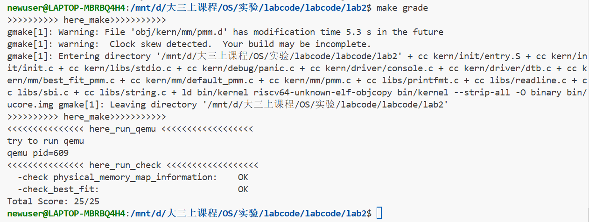
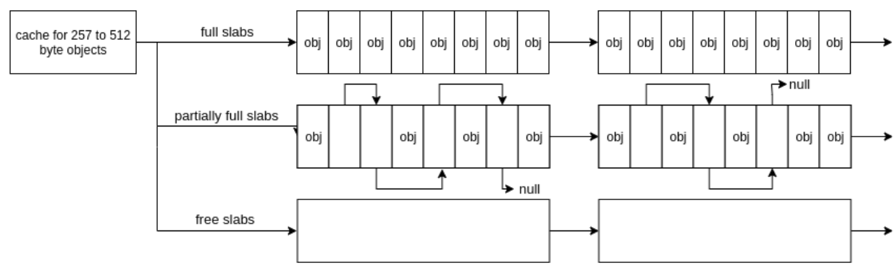
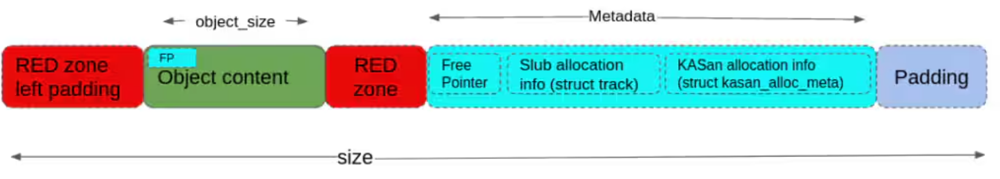
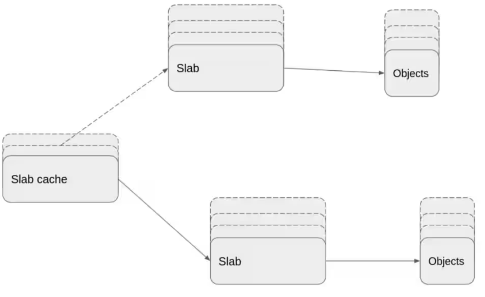
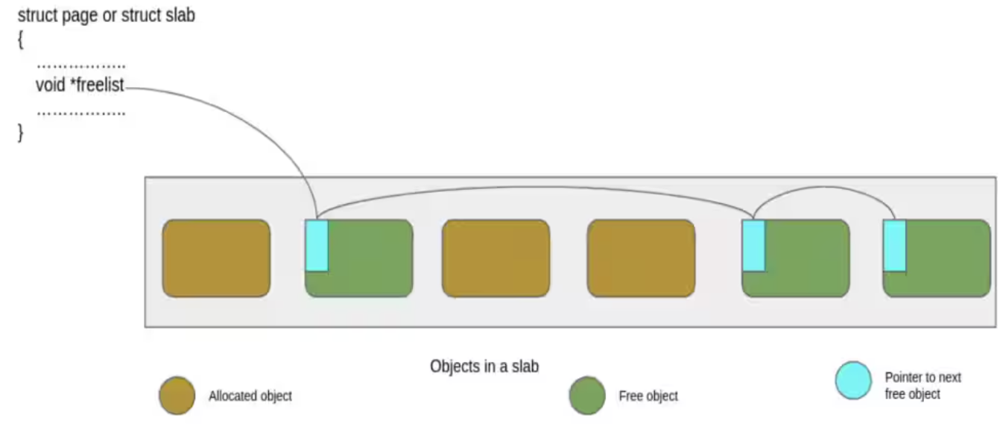
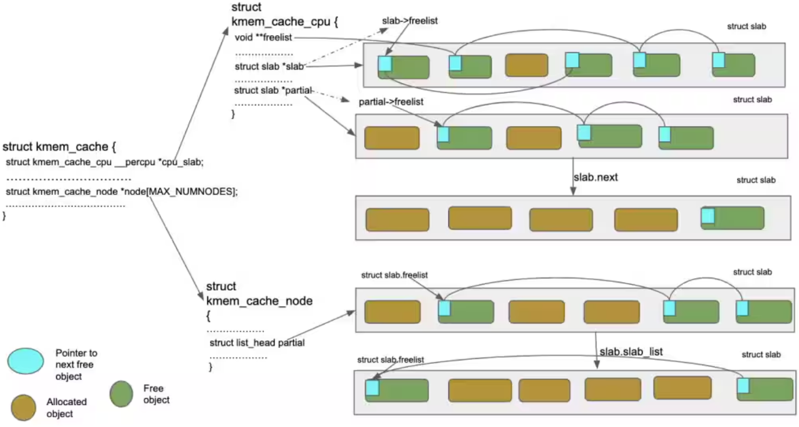

# LAB2实验报告

巩岱松2312325

梁朝阳2311561 

郭子涵2312145

## 练习1

### 程序物理内存分配流程

完整的物理内存初始化与分配过程分析如下：

**Step1 初始化阶段：**

系统初始化如下所示，然后调用default_init_memmap（）函数，初始化一块连续的物理内存区域。

```html
系统启动
  ↓
pmm_init()
  ↓
  ├── init_pmm_manager()
  │     ├── pmm_manager = &default_pmm_manager 选择内存管理器
  │     └── default_init() 初始化 free_list 和 nr_free
  ├── page_init() 探测物理内存
  │     ├── 设置 va_pa_offset
  │     ├── 获取物理内存信息 (get_memory_base/size)
  │     ├── 计算 npage 并设置 pages 数组
  │     ├── 标记所有页为已保留 (SetPageReserved)
  │     └── init_memmap() → default_init_memmap()
  │           ├── 初始化空闲页属性
  │           ├── 设置 base->property = n
  │           ├── 更新 nr_free += n
  │           └── 将页块插入 free_list (按地址排序)
  ├── check_alloc_page()
  │     └── default_check() 执行一系列内存分配/释放测试
  └── 记录启动页表地址 (satp_virtual, satp_physical)
```

**Step2 物理内存的分配:**

当应用程序或内核请求内存时：应用请求 → alloc_pages(n) → default_alloc_pages(n)，寻找合适的块，然后进行块处理和分割。

**Step3 内存释放过程：**

应用释放 → free_pages(base, n) → default_free_pages(base, n)，重置页面状态，然后插入链表并进行块合并。

### 分析相关函数

**1.default_init函数：**	

​	完成物理内存管理器最初的状态清理：把空闲块链表置为空、把全局空闲页计数器置为 0，为后续把实际可用页通过 `init_memmap` 注册进来做好准备。

```c
static void
default_init(void) {
    list_init(&free_list);
    nr_free = 0;
}
```

​	这两行代码先调用 `list_init(&free_list)` 将 `free_list` 初始化为一个空的循环双向链表，链表头自指向，表示当前没有任何空闲块节点，然后 `nr_free = 0` 把记录空闲页总数的变量归零。

**2.default_init_memmap(base, n)：**

初始化一块连续的物理内存区域，将其标记为空闲并添加到空闲页面链表中。

具体实现分析：

**步骤1：初始化每个页面的状态。**`struct Page *base`: 这是一个指向 `struct Page` 结构体的指针,代表了一块连续物理内存区域的起始页;n 表示从base指针开始，连续可用物理页面的数量。page具体结构如下所示:

```c
//lab2/kern/memlayout.h
struct Page {
    int ref;                        // 页面被引用的次数 (reference count)
    uint64_t flags;                 // 页面的状态标志 (例如 PG_reserved, PG_property)
    unsigned int property;          // 记录空闲块中连续页面的数量
    list_entry_t page_link;         // 用于将页面链接到空闲链表中的节点，将这个page结构体实例链接到free_list中，所有空闲块的首页通过他们的page_link字段串联起来，形成一个完整的双向循环链表.
};
```

首先检查 n>0，并对这n页的每页执行清理。然后通过assert(PageReserved(p))确保每页当前被标记为保留状态，随后清除页面的所有标志位并将属性字段置为0，set_page_ref(p, 0) 引用计数清零。这里的目的是把这段物理页从“保留态”转为“可分配态”。

```c
static void
default_init_memmap(struct Page *base, size_t n) {
    assert(n > 0);
    struct Page *p = base;
    for (; p != base + n; p ++) {
        assert(PageReserved(p));
        p->flags = p->property = 0;
        set_page_ref(p, 0);
    }
```

**步骤2：设置基页属性。**完成页的清理后，把块首的属性设为 n 并用 `SetPageProperty(base)` 标记它为空闲块的首页，接着 `nr_free += n` 更新全局空闲页计数。此时链表还未插入该首页。	

```c
    base->property = n;
    SetPageProperty(base);
    nr_free += n;
```

**步骤3：按地址顺序插入链表。**把 `base->page_link` 插入 `free_list`：如果链表为空则直接 `list_add`；否则遍历链表找第一个比 `base` 地址大的节点并用 `list_add_before` 插入，这样保持 `free_list` 按物理地址升序排列；如果遍历到末尾还没找到比 `base` 大的节点，则把它加到末尾。按地址有序的链表方便以后释放时仅检查前驱或后继就能判断是否可以合并。

```c
    if (list_empty(&free_list)) {
        list_add(&free_list, &(base->page_link));
    } else {
        list_entry_t* le = &free_list;
        while ((le = list_next(le)) != &free_list) {
            struct Page* page = le2page(le, page_link);
            if (base < page) {
                list_add_before(le, &(base->page_link));
                break;
            } else if (list_next(le) == &free_list) {
                list_add(le, &(base->page_link));
            }
        }
    }
}
```

**3.default_alloc_pages(n)：**

实现First-Fit算法，从空闲链表中查找第一个足够大的内存块进行分配，必要时分割块。

具体实现如下：

**步骤1：快速检查空闲内存。**首先确保请求页大于0，如果请求页数超过总的空闲页数，则返回NULL表示分配失败。

```c
static struct Page *
default_alloc_pages(size_t n) {
    assert(n > 0);
    if (n > nr_free) {
        return NULL;
    }
```

**步骤2：查找第一个足够大的块。**这段是 First-Fit 的核心：从链表头按顺序遍历每个空闲块首页 `p`（用 le2page 将链表节点转换为Page结构体），检查其property值是否大于等于请求页数 。遇到第一个满足的块就把它赋给 `page` 并跳出循环。

```c
    struct Page *page = NULL;
    list_entry_t *le = &free_list;
    while ((le = list_next(le)) != &free_list) {
        struct Page *p = le2page(le, page_link);
        if (p->property >= n) {
            page = p;
            break;
        }
    }
```

**步骤3：块处理与可能的分割。**如果找到了合适块，则先记下该节点的前驱 `prev`（用于后续把剩余块插回原位），然后从空闲链表中删去找到的块。若找到的块比请求更大，则在 `page + n` 处创建一个新的空闲块头 `p`，设置 `p->property = page->property - n` 并 `SetPageProperty(p)` 标记为块首页，然后使用之前保存的 `prev` 调用 `list_add(prev, &(p->page_link))` 把余块插回链表，插在原来的前驱之后，从而保持地址顺序。这种做法切分出前面的 n 页给申请者，余块保留下来作为新的空闲块。分配结束后 `nr_free -= n` 更新全局空闲页数，并 `ClearPageProperty(page)` 清除返回区块首的空闲标志，表明这些页现在已分配，不再是空闲块的首页。最后返回 page 或 NULL。

```c
    if (page != NULL) {
        list_entry_t* prev = list_prev(&(page->page_link));
        list_del(&(page->page_link));
        if (page->property > n) {
            struct Page *p = page + n;
            p->property = page->property - n;
            SetPageProperty(p);
            list_add(prev, &(p->page_link));
        }
        nr_free -= n;
        ClearPageProperty(page);
    }
    return page;
}
```

**4.default_free_pages：**

释放一块连续的物理内存，将其重新加入空闲链表，并尝试与相邻的空闲块合并以减少内存碎片。具体实现如下：

**步骤1：重置页面状态。**函数先确保 n>0，并对 `base` 到 `base+n-1` 每页做检查与清理。`assert(!PageReserved(p) && !PageProperty(p))` 保证这些页当前既不是保留页也不是已有空闲块的首页，避免重复初始化，随后清除所有页面标志位，将页面引用计数设为0。

```c
static void
default_free_pages(struct Page *base, size_t n) {
    assert(n > 0);
    struct Page *p = base;
    for (; p != base + n; p ++) {
        assert(!PageReserved(p) && !PageProperty(p));
        p->flags = 0;
        set_page_ref(p, 0);
    }
```

**步骤2：设置基页属性。**记录此块中连续空闲页的数量n ,并标记此页为空闲块的第一页。同时 `nr_free += n` 立即把全局空闲页数增加。注意这里先更新 `nr_free`，再做链表插入和合并，确保在出错断言或后续检查时 `nr_free` 与链表状态最终一致。

```c
    base->property = n;
    SetPageProperty(base);
    nr_free += n;
```

**步骤3：按地址顺序插入链表。**把 `base->page_link` 按地址升序插入 `free_list`。若链表为空直接加；否则遍历找到第一个比 `base` 地址大的节点 `page` 并在它前面插入。这样保持链表地址顺序，便于后续只检查前驱或后继来决定是否能合并。

```c
    if (list_empty(&free_list)) {
        list_add(&free_list, &(base->page_link));
    } else {
        list_entry_t* le = &free_list;
        while ((le = list_next(le)) != &free_list) {
            struct Page* page = le2page(le, page_link);
            if (base < page) {
                list_add_before(le, &(base->page_link));
                break;
            } else if (list_next(le) == &free_list) {
                list_add(le, &(base->page_link));
            }
        }
    }
```

**步骤四：尝试与前一个块合并。**插入后首先尝试与前驱合并：用 `list_prev` 得到前驱节点 `le` 并转为页 `p`，若 前页加上前面块的property正好紧邻当前的base，则让前块de  property 加上当前base的peoperty，调用 `ClearPageProperty(base)` 清除被 base 的首页标志，然后用 `list_del` 把 `base` 的链表节点移除，因为 `base` 已被合并进 `p`，最后把 `base = p`，更新当前块头指针，以便后续再尝试与后继合并。

```c
    list_entry_t* le = list_prev(&(base->page_link));
    if (le != &free_list) {
        p = le2page(le, page_link);
        if (p + p->property == base) {
            p->property += base->property;
            ClearPageProperty(base);
            list_del(&(base->page_link));
            base = p;
        }
    }
```

**步骤五：尝试与后一块合并。**在完成base 和前驱块的合并后，再取后继块，判断是否紧邻。如果相邻则把后块`p`的大小并入 `base->property`，再用`ClearPageProperty(p)` 清除后块的首页标志，然后用 `list_del` 把后块节点移除。至此释放和合并处理完毕，`nr_free` 在前面已更新，链表与 `nr_free` 保持一致。

```c
    le = list_next(&(base->page_link));
    if (le != &free_list) {
        p = le2page(le, page_link);
        if (base + base->property == p) {
            base->property += p->property;
            ClearPageProperty(p);
            list_del(&(p->page_link));
        }
    }
}
```

这个物理内存管理系统通过维护有序的空闲页面链表，实现了高效的First-Fit内存分配算法。

### 代码改进思考

1. **搜索效率和内存碎片问题：**First-Fit 算法最主要的缺陷在于随着系统运行时间增长，小的内存碎片往往会集中在链表前部。因为每次分配后，如果块被分割，小的剩余块会保留在原位置，随着时间推移，链表前部会积累越来越多的小碎片，每次分配都必须遍历这些无法满足需求的小碎片，然后才能找到合适的块。这导致两个严重问题：首先搜索效率降低：分配操作的平均时间复杂度实际上会远高于理论的O(n），然后碎片集中：小碎片集中在链表前部，大块被推到后面。可以尝试的优化思路是实现一种**延迟合并与位置调整策略**。系统可以在空闲时段或当碎片达到阈值时，重新组织空闲链表，将小碎片合并或移至链表末尾，保持链表前部有较大的连续块，从而提高搜索效率。
2. **块分割与合并策略：**首先目前只要块大于请求大小就分割，这可能产生过多小碎片，其次合并范围也很有限，只在释放时检查前后相邻块，不主动处理非相邻碎片。可以尝试的优化思路是实现**智能分割阈值与积极合并策略**：设定最小剩余块大小阈值，当剩余部分小于此值时不分割，定期扫描空闲链表，识别并合并碎片区域，特别是链表前部，当检测到碎片化超过阈值时，触发内存重组。通过这些策略，系统可以在保持高性能的同时，显著减少内存碎片，提高大块内存的可用性。

## 练习2

### 编写best_fit代码

Best-Fit算法的核心思想：**在所有满足需求的空闲块中，选择大小最接近需求的块**。

**第一处：补充best_fit_init_memmap()函数。**

初始化部分还是首先清空当前页框的标志和属性信息，并将页框的引用计数设置为0。

按地址顺序插入链表部分：如果链表非空，遍历链表找第一个比 `base` 地址大的节点并用 `list_add_before` 插入，这样保持 `free_list` 按物理地址升序排列；如果遍历到末尾还没找到比 `base` 大的节点，则把它加到末尾。

```c#
static void
best_fit_init_memmap(struct Page *base, size_t n) {
    assert(n > 0);
    struct Page *p = base;
    for (; p != base + n; p ++) {
        assert(PageReserved(p));
        /*LAB2 EXERCISE 2: 2312145*/ 
        // 清空当前页框的标志和属性信息，并将页框的引用计数设置为0
        p->flags = p->property = 0;
        set_page_ref(p, 0);
    }
    base->property = n;
    SetPageProperty(base);
    nr_free += n;
    if (list_empty(&free_list)) {
        list_add(&free_list, &(base->page_link));
    } else {
        list_entry_t* le = &free_list;
        while ((le = list_next(le)) != &free_list) {
            struct Page* page = le2page(le, page_link);
            /*LAB2 EXERCISE 2: 2312145*/ 
            // 编写代码
            // 1、当base < page时，找到第一个大于base的页，将base插入到它前面，并退出循环
            // 2、当list_next(le) == &free_list时，若已经到达链表结尾，将base插入到链表尾部
            if (base < page) {
                list_add_before(le, &(base->page_link));
                break;
            } else if (list_next(le) == &free_list) {
                list_add(le, &(base->page_link));
            }
        }
    }
}
```

**第二处：修改best_fit_alloc_pages()物理内存分配函数**

这段代码是 Best_fit 的精髓所在。定义 min_size，遍历整个链表如果空闲块的页足够分配并且还比最小的 min_size 小，那么就要更新min_size和 page ，找到最佳匹配块。

然后就是进行块处理和分割，同样参照first_fit的代码思路**。**找到合适块后先记下该节点的前驱 `prev`，然后从空闲链表中删去找到的块。若找到的块比请求更大，则在 `page + n` 处创建一个新的空闲块头 `p`，设置 `p->property = page->property - n` 并 `SetPageProperty(p)` 标记为块首页，然后使用之前保存的前驱，调用 `list_add(prev, &(p->page_link))` 把余块插回链表，插在原来的前驱之后，从而保持地址顺序。这种做法切分出前面的 n 页给申请者，余块保留下来作为新的空闲块。分配结束后 `nr_free -= n` 更新全局空闲页数，并 `ClearPageProperty(page)` 清除返回区块首的空闲标志，表明这些页现在已分配，不再是空闲块的首页。最后返回 page 或 NULL。

```c#
    while ((le = list_next(le)) != &free_list) {
        struct Page *p = le2page(le, page_link);
        if (p->property >= n && p->property < min_size) {
            page = p;
            min_size = p->property;
        }
    }
    if (page != NULL) {
        list_entry_t* prev = list_prev(&(page->page_link));
        list_del(&(page->page_link));
        if (page->property > n) {
            struct Page *p = page + n;
            p->property = page->property - n;
            SetPageProperty(p);
            list_add(prev, &(p->page_link));
        }
        nr_free -= n;
        ClearPageProperty(page);
    }
    return page;
}
```

**第三处：补全best_fit_free_pages()物理内存释放函数。**

参照first_fit的代码：**首先，重置页面状态。**函数先确保 n>0，并对 `base` 到 `base+n-1` 每页做检查与清理。检查这些页当前既不是保留页也不是已有空闲块的首页，随后清除所有页面标志位，将页面引用计数设为0。**其次，补全设置基页属性。**记录此块中连续空闲页的数量n ,标记为空闲块的第一页，同时增加全局空闲页数 `nr_free += n` 。**然后，按地址顺序插入链表。**把 `base->page_link` 按地址升序插入 `free_list`。若链表为空直接加；否则遍历找到第一个比 `base` 地址大的节点 `page` 并在它前面插入。这样保持链表地址顺序，便于后续只检查前驱或后继来决定是否能合并。**最后，尝试与前一个块合并。**插入后首先尝试与前驱合并：用 `list_prev` 得到前驱节点 `le` 并转为页 `p`，若前页正好紧邻当前的base，则让前块的property 加上当前base的peoperty，调用 `ClearPageProperty(base)` 清除被 base 的首页标志，然后用 `list_del` 把 `base` 的链表节点移除， `base = p`，更新当前块头指针，以便后续再尝试与后继合并。

```c#
static void
best_fit_free_pages(struct Page *base, size_t n) {
    assert(n > 0);
    struct Page *p = base;
    for (; p != base + n; p ++) {
        assert(!PageReserved(p) && !PageProperty(p));
        p->flags = 0;
        set_page_ref(p, 0);
    }
    /*LAB2 EXERCISE 2: 2312145*/ 
    // 编写代码
    // 具体来说就是设置当前页块的属性为释放的页块数、并将当前页块标记为已分配状态、最后增加nr_free的值
    base->property = n;
    SetPageProperty(base);
    nr_free += n;

    if (list_empty(&free_list)) {
        list_add(&free_list, &(base->page_link));
    } else {
        list_entry_t* le = &free_list;
        while ((le = list_next(le)) != &free_list) {
            struct Page* page = le2page(le, page_link);
            if (base < page) {
                list_add_before(le, &(base->page_link));
                break;
            } else if (list_next(le) == &free_list) {
                list_add(le, &(base->page_link));
            }
        }
    }

    list_entry_t* le = list_prev(&(base->page_link));
    if (le != &free_list) {
        p = le2page(le, page_link);
        /*LAB2 EXERCISE 2: 2312145*/ 
        // 编写代码
        // 1、判断前面的空闲页块是否与当前页块是连续的，如果是连续的，则将当前页块合并到前面的空闲页块中
        // 2、首先更新前一个空闲页块的大小，加上当前页块的大小
        // 3、清除当前页块的属性标记，表示不再是空闲页块
        // 4、从链表中删除当前页块
        // 5、将指针指向前一个空闲页块，以便继续检查合并后的连续空闲页块
        if (p + p->property == base) {
            p->property += base->property;
            ClearPageProperty(base);
            list_del(&(base->page_link));
            base = p;
        }
    }

    le = list_next(&(base->page_link));
    if (le != &free_list) {
        p = le2page(le, page_link);
        if (base + base->property == p) {
            base->property += p->property;
            ClearPageProperty(p);
            list_del(&(p->page_link));
        }
    }
}
```

### 测试代码

在best_fit_pmm.c的文件后半部分编写了测试代码best_fic_check()。

**测试1：链表完整性检查。**首先遍历空闲链表中的每个块，确保每个块的首页都设置PageProperty标志，统计所有块的总页数。然后检查统计链表的总页数和nr_free是否相等。

```c#
int count = 0, total = 0;
list_entry_t *le = &free_list;
while ((le = list_next(le)) != &free_list) {
    struct Page *p = le2page(le, page_link);
    assert(PageProperty(p));
    count ++, total += p->property;
}
assert(total == nr_free_pages());
```

**测试2：基础功能测试。**调用basic_check()函数，是物理内存管理器的基本功能测试，主要验证单页分配和释放等功能的正确性。

```c++
static void
basic_check(void) {
    struct Page *p0, *p1, *p2;
    p0 = p1 = p2 = NULL;    //基本页面分配测试，连续分配三个单页，确保系统能够正确分配页面
    assert((p0 = alloc_page()) != NULL);
    assert((p1 = alloc_page()) != NULL);
    assert((p2 = alloc_page()) != NULL);

    assert(p0 != p1 && p0 != p2 && p1 != p2);//页面唯一性测试
    assert(page_ref(p0) == 0 && page_ref(p1) == 0 && page_ref(p2) == 0);//检查引用计数

    assert(page2pa(p0) < npage * PGSIZE);//地址有效性检查页面地址不应超出系统物理内存范围
    assert(page2pa(p1) < npage * PGSIZE);
    assert(page2pa(p2) < npage * PGSIZE);
	//空链表测试环境准备
    list_entry_t free_list_store = free_list;
    list_init(&free_list);
    assert(list_empty(&free_list));

    unsigned int nr_free_store = nr_free;
    nr_free = 0;

    assert(alloc_page() == NULL);
	//页面释放和技术测试
    free_page(p0);
    free_page(p1);
    free_page(p2);
    assert(nr_free == 3);
	//重分配测试
    assert((p0 = alloc_page()) != NULL);
    assert((p1 = alloc_page()) != NULL);
    assert((p2 = alloc_page()) != NULL);

    assert(alloc_page() == NULL);
    free_page(p0);
    assert(!list_empty(&free_list));

    struct Page *p;
    assert((p = alloc_page()) == p0);
    assert(alloc_page() == NULL);
	//回复测试环境与清理
    assert(nr_free == 0);
    free_list = free_list_store;
    nr_free = nr_free_store;

    free_page(p);
    free_page(p1);
    free_page(p2);
}
```

**条件编译指令：**best_fit_check()函数存在条件编译指令，查找资料发现，当定义ucore_test宏的时候，这些代码才会编译，用于教学环境中自动评分每通过一个测试点加一分。

```assembly
#ifdef ucore_test
score += 1;
cprintf("grading: %d / %d points\n",score, sumscore);
#endif
```

**测试4：高级内存分配测试。**测试多页连续分配

```c
struct Page *p0 = alloc_pages(5), *p1, *p2;
assert(p0 != NULL);
assert(!PageProperty(p0));
```

**局部测试环境准备。**

```c
list_entry_t free_list_store = free_list;
list_init(&free_list);
assert(list_empty(&free_list));
assert(alloc_page() == NULL);

unsigned int nr_free_store = nr_free;
nr_free = 0;
```

**测试5：Best_Fit核心特性测试。**创建了两个空闲块，内存分配状态：

```html
p0[0] | p0[1] p0[2] | p0[3] | p0[4] |
已分配 |   空闲(2页)  | 已分配 | 空闲(1页) |
```

验证此时无法分配4页因为最大连续空闲内存块只有2页，然后让p1指向请求分配1页的块，再分配2页成功，p1指向p0+4即1页块候选快，验证了best_fit的策略。

```c
    free_pages(p0 + 1, 2);
    free_pages(p0 + 4, 1);
    assert(alloc_pages(4) == NULL);
    assert(PageProperty(p0 + 1) && p0[1].property == 2);
    // * - - * *
    assert((p1 = alloc_pages(1)) != NULL);
    assert(alloc_pages(2) != NULL);      // best fit feature
    assert(p0 + 4 == p1);
```

**测试6：块合并测试。**将5页全部释放掉，如果合并就可以再分配完整的5页块。

```c#
    p2 = p0 + 1;
    free_pages(p0, 5);
    assert((p0 = alloc_pages(5)) != NULL);
    assert(alloc_page() == NULL);
```

**测试7：最终验证。**检验回复前的nr_free，恢复并释放测试页面后，空闲链表的总页数应与测试前相同。最终测试完毕。

```c#
assert(nr_free == 0);
nr_free = nr_free_store;

free_list = free_list_store;
free_pages(p0, 5);

// 验证链表完整性恢复
le = &free_list;
while ((le = list_next(le)) != &free_list) {
    struct Page *p = le2page(le, page_link);
    count --, total -= p->property;
}
assert(count == 0);
assert(total == 0);
```

### 测试运行

​	在pmm.c文件中修改为：**pmm_manager = &best_fit_pmm_manager;**pmm.c在项目中提供同意的内存管理框架，具体的分配策略由不同的来pmm_manager实现。

​	执行make指令编译整个项目，执行make qemu启动模拟器运行编译好的内核，得到的输出结果如下：

```bat
newuser@LAPTOP-MBRBQ4H4:/mnt/d/大三上课程/OS/实验/labcode/labcode/lab2$ make qemu

OpenSBI v0.4 (Jul  2 2019 11:53:53)
   ____                    _____ ____ _____
  / __ \                  / ____|  _ \_   _|
 | |  | |_ __   ___ _ __ | (___ | |_) || |
 | |  | | '_ \ / _ \ '_ \ \___ \|  _ < | |
 | |__| | |_) |  __/ | | |____) | |_) || |_
  \____/| .__/ \___|_| |_|_____/|____/_____|
        | |
        |_|

Platform Name          : QEMU Virt Machine
Platform HART Features : RV64ACDFIMSU
Platform Max HARTs     : 8
Current Hart           : 0
Firmware Base          : 0x80000000
Firmware Size          : 112 KB
Runtime SBI Version    : 0.1

PMP0: 0x0000000080000000-0x000000008001ffff (A)
PMP1: 0x0000000000000000-0xffffffffffffffff (A,R,W,X)
DTB Init
HartID: 0
DTB Address: 0x82200000
Physical Memory from DTB:
  Base: 0x0000000080000000
  Size: 0x0000000008000000 (128 MB)
  End:  0x0000000087ffffff
DTB init completed
(THU.CST) os is loading ...
Special kernel symbols:
  entry  0xffffffffc02000d6 (virtual)
  etext  0xffffffffc020164e (virtual)
  edata  0xffffffffc0205018 (virtual)
  end    0xffffffffc0205078 (virtual)
Kernel executable memory footprint: 20KB
memory management: best_fit_pmm_manager
physcial memory map:
  memory: 0x0000000008000000, [0x0000000080000000, 0x0000000087ffffff].
check_alloc_page() succeeded!
satp virtual address: 0xffffffffc0204000
satp physical address: 0x0000000080204000
```

从最后的可以看出，此代码成功通过所有的测试，包括分配、释放、分割和合并等功能。

```bash
memory management: best_fit_pmm_manager
...
check_alloc_page() succeeded!
```

同时还输出了一些详细信息，比如：

1.系统和内存信息，系统通过DTB检测到128MB的物理内存，起始地址是0x0000000008000000，结束地址是0x0000000087ffffff。

```bat
Physical Memory from DTB:
  Base: 0x0000000080000000
  Size: 0x0000000008000000 (128 MB)
  End:  0x0000000087ffffff
```

2.内核信息：内核占用了20KB的内存空间，内核结束地址为0xffffffffc0205078，这之后的内存空间可供分配使用。

```bat
Special kernel symbols:
  entry  0xffffffffc02000d6 (virtual)
  etext  0xffffffffc020164e (virtual)
  edata  0xffffffffc0205018 (virtual)
  end    0xffffffffc0205078 (virtual)
Kernel executable memory footprint: 20KB
```

3.内存管理初始化与物理内存映射：下述第一行确认系统已成功初始化并选择了best_fit_pmm_manager作为物理内存管理器。同时映射的物理内存起始和结束地址和DTB检测的相同。

```bat
memory management: best_fit_pmm_manager
physcial memory map:
  memory: 0x0000000008000000, [0x0000000080000000, 0x0000000087ffffff].
```

4.最后输出的是页表信息，显示了页表的虚拟地址和物理地址。

采用**make grade命令**执行实验中的自动评分,验证物理内存映射信息正确性,检查Best-Fit算法实现是否通过测试，最后给出总分（25/25满分）



<center><b>图1 best_fit代码执行结果


### 代码改进思考

1. **性能优化方面：** 目前的实现需要遍历整个空闲链表来找到最佳匹配块，时间复杂度为O(n)。随着系统运行时间增加，空闲块可能变得碎片化且数量增多，导致分配操作越来越慢。可以考虑分类管理:，将空闲块按大小分类存储在不同的链表或树结构中，例如使用红黑树、AVL树等平衡树结构按大小组织空闲块，将查找时间降至O(log n)，加快查找速度。
2. 对于**分割策略，**当我们只要找到比请求块大的块我们就分割，可能会导致过多的小碎片，增加管理开销并降低大块分配的成功率。我们可以设定一个分割阈值，设置最小分割大小，当剩余部分小于阈值时，不进行分割，宁可"浪费"一些空间，从而减少系统中的小碎片数量，降低管理开销。
3. **内存局部性优化方面：**当前Best-Fit仅考虑大小匹配度，忽略了内存访问的局部性原则。相关数据结构分散在内存各处可能导致缓存效率低下。例如可以增加在同等大小的多个匹配块中，优先选择靠近最近分配区域的块的策略，进而提高CPU缓存命中率，减少缓存未命中惩罚，减少TLB失效等。

## 总结与心得体会

​	通过本次lab2实验，我深入理解了物理内存管理的核心机制，从First-Fit的简单高效到Best-Fit的精确匹配，学习空闲链表的维护、块分割与合并策略。这不仅加深了我对操作系统底层原理的认知，还让我体会到算法设计在实际系统中的权衡，例如碎片化与性能的矛盾等。

# Buddy System 设计思路文档

一个用C++实现的伙伴系统内存管理器。

## 项目结构

```
OS_lab/
├── CMakeLists.txt          # CMake构建文件
├── test.cpp               # 测试程序
├── include/               # 头文件目录
│   ├── buddy_system.h     # 伙伴系统头文件
│   └── index_caculate.h   # 索引计算头文件
└── src/                   # 源文件目录
    └── buddy_system.cpp   # 伙伴系统实现
```

## 构建和运行

### 使用CMake（推荐）

```bash
# 创建构建目录
mkdir build && cd build

# 配置项目
cmake ..

# 编译
make

# 运行测试
./test
```

## 功能特性

- 内存分配和释放
- 自动内存合并
- 内存大小查询
- 可视化内存树显示
- 支持0字节分配（转换为1字节）

## 详细设计思路

### 代码实现详解

#### 1. 数据结构定义

```cpp
struct buddy_st {
    int level;              // 最大层级，决定总内存大小
    unsigned char tree[];   // 柔性数组，存储二叉树节点状态
};
```

**代码讲解**：
这个结构体是整个伙伴系统的核心数据结构。`level`字段表示二叉树的最大层级，决定了总内存大小（2^level字节）。`tree[]`是一个柔性数组，用于存储二叉树中每个节点的状态。柔性数组的设计非常巧妙，它允许我们在分配结构体时同时分配数组空间，实现零内存浪费。

**设计要点**：

- 总节点数：`2 * (1 << level) - 1`（完全二叉树的节点数公式）
- 内存大小：`1 << level` 字节
- 每个节点用1个字节存储状态，内存效率高

#### 2. 节点状态系统

```cpp
#define NODE_UNUSED 0    // 未使用
#define NODE_USED 1      // 已使用（只有叶子节点可能）
#define NODE_SPLIT 2     // 已分割
#define NODE_FULL 3      // 已满
```

**状态转换规则**：

- 只有叶子节点可能为`NODE_USED`状态
- 内部节点只能是`NODE_UNUSED`、`NODE_SPLIT`或`NODE_FULL`

#### 3. 内存分配算法 (`buddy_alloc`)

**步骤1：大小对齐**

```cpp
if(size_needed == 0){
    size_to_alloc = 1;  // 0字节转换为1字节
} else {
    size_to_alloc = next_pow_of_2(size_needed);  // 向上舍入到2的幂次
}
```

**代码讲解**：
伙伴系统要求所有内存块都是2的幂次大小，因此需要将请求大小向上舍入。这里处理了边界情况：0字节请求被转换为1字节。`next_pow_of_2`函数使用位运算快速计算大于等于输入值的最小2的幂次，例如7会被舍入到8，15会被舍入到16。

**步骤2：深度优先搜索**

```cpp
while(true) {
    if(size_to_alloc == cur_length) {
        // 找到合适大小的块，尝试分配
        if(buddy->tree[cur_index] == NODE_UNUSED) {
            buddy->tree[cur_index] = NODE_USED;
            _mark_parent(buddy, cur_index);
            return index2offset(cur_index, cur_level, buddy->level);
        }
    } else if(size_to_alloc < cur_length) {
        // 块太大，需要分割
        if(buddy->tree[cur_index] == NODE_UNUSED) {
            buddy->tree[cur_index] = NODE_SPLIT;
            cur_index = left_child_index(cur_index);
            cur_length /= 2;
            continue;
        }
    }
    // 回溯和右移逻辑...
}
```

**代码讲解**：
这是分配算法的核心搜索逻辑。算法采用深度优先搜索策略，优先分配最左侧的可用块。当找到合适大小的块时，将其标记为`NODE_USED`并返回偏移量。当块太大时，将其标记为`NODE_SPLIT`并继续向左子节点搜索。这种策略确保了内存分配的局部性，减少了碎片。

**步骤3：父节点状态更新 (`_mark_parent`)**

```cpp
while(true) {
    int brother_node_index = brother_index(index);
    if(兄弟节点也被使用) {
        index = parent_index(index);
        buddy->tree[index] = NODE_FULL;
    } else {
        break;  // 停止向上更新
    }
}
```

**代码讲解**：
当分配一个节点后，需要向上更新父节点的状态。如果兄弟节点也被使用，则父节点应该标记为`NODE_FULL`，表示其所有子节点都被使用。这个函数会递归向上检查，直到遇到无法合并的节点为止。这种状态维护机制确保了树结构的一致性。

#### 4. 内存释放算法 (`buddy_free`)

**步骤1：定位节点**

```cpp
while(true) {
    if(buddy->tree[cur_index] == NODE_USED) {
        // 找到目标节点
        _combine_parent(buddy, cur_index);
        return;
    } else if(buddy->tree[cur_index] == NODE_SPLIT || buddy->tree[cur_index] == NODE_FULL) {
        // 继续向下搜索
        if(offset < left + cur_length) {
            cur_index = left_child_index(cur_index);
        } else {
            cur_index = right_child_index(cur_index);
            left += cur_length;
        }
    }
}
```

**代码讲解**：
释放算法首先需要定位到要释放的节点。通过比较偏移量和当前块的范围，算法可以确定目标节点在左子树还是右子树中。这种搜索方式的时间复杂度是O(log n)，非常高效。

**步骤2：节点合并 (`_combine_parent`)**

```cpp
while(true) {
    int buddy = index - 1 + (index & 1) * 2;  // 计算兄弟节点
    if(buddy < 0 || self->tree[buddy] != NODE_UNUSED) {
        // 无法合并，标记为未使用
        self->tree[index] = NODE_UNUSED;
        // 向上更新父节点状态
        while(((index = parent_index(index)) >= 0) && self->tree[index] == NODE_FULL) {
            self->tree[index] = NODE_SPLIT;
        }
        return;
    }
    index = parent_index(index);  // 继续向上合并
}
```

**代码讲解**：
这是伙伴系统的核心特性：相邻的空闲块会自动合并。算法首先计算兄弟节点的索引，如果兄弟节点也是空闲的，则向上合并到父节点。合并过程会递归进行，直到无法继续合并为止。

#### 5. 索引计算系统

**核心转换函数**：

```cpp
// 节点索引转内存偏移量
int index2offset(int index, int level, int max_level) {
    return ((index + 1) - (1 << level)) << (max_level - level);
}

// 内存偏移量转节点索引
int offset2index(int offset, int level, int max_level) {
    return ((offset + (1 << level)) - 1) >> (max_level - level);
}
```

**代码讲解**：
这两个函数是索引系统的核心，用于在二叉树节点索引和内存偏移量之间进行转换。`index2offset`将节点索引转换为对应的内存偏移量，`offset2index`则相反。这些函数使用位运算优化，避免了除法运算，性能极高。

**树遍历辅助函数**：

```cpp
int parent_index(int index)      // 父节点索引
int left_child_index(int index)  // 左子节点索引
int right_child_index(int index) // 右子节点索引
int brother_index(int index)     // 兄弟节点索引
```

**代码讲解**：
这些辅助函数提供了树遍历的基本操作。它们都使用简单的数学公式计算，例如左子节点索引为`index * 2 + 1`，右子节点索引为`index * 2 + 2`。这些函数使得树遍历操作变得简洁高效。

#### 6. 可视化系统 (`buddy_show`)

```cpp
void _show(struct buddy_st *self, int index, int level) {
    switch(self->tree[index]) {
        case NODE_UNUSED:
            printf("(%d:%d)", offset, size);  // (偏移:大小)
            break;
        case NODE_USED:
            printf("[%d:%d]", offset, size);  // [偏移:大小]
            break;
        case NODE_FULL:
            printf("{");  // 递归显示子节点
            _show(self, left_child, level + 1);
            _show(self, right_child, level + 1);
            printf("}");
            break;
        default:  // NODE_SPLIT
            printf("(");  // 递归显示子节点
            _show(self, left_child, level + 1);
            _show(self, right_child, level + 1);
            printf(")");
            break;
    }
}
```

**代码讲解**：
这个可视化系统使用递归方式显示整个内存树的状态。不同的符号表示不同的节点状态：`()`表示未使用块，`[]`表示已使用块，`{}`表示满节点，`()`表示分割节点。这种可视化方式使得调试和验证变得非常直观，可以清楚地看到内存的分配和释放过程。


#### 7. 2的幂次计算

```cpp
static inline int is_pow_of_2(int x){
    return !(x & (x - 1));
}

static inline int next_pow_of_2(int x){ // 把右侧所有位都变成1
    if (is_pow_of_2(x)) 
        return x;
    x |= x >> 1;
    x |= x >> 2;
    x |= x >> 4;
    x |= x >> 8;
    x |= x >> 16;
    return x + 1;
}
```

**代码讲解**：
这两个函数是伙伴系统的关键工具函数，用于处理2的幂次计算。

`is_pow_of_2`函数使用位运算技巧快速判断一个数是否为2的幂次。原理是：如果x是2的幂次，那么x的二进制表示中只有一个1，而x-1会将这个1变为0，并将右边的所有0变为1。因此`x & (x-1)`的结果为0，取反后返回1。

`next_pow_of_2`函数计算大于等于x的最小2的幂次。算法使用位运算技巧：通过一系列右移和或运算，将x的最高位1右边的所有位都设置为1，然后加1得到下一个2的幂次。例如，对于x=7（二进制111），经过运算后得到15（二进制1111），加1后得到16（二进制10000）。

**性能优势**：

- 使用位运算，避免了循环和除法运算
- 时间复杂度为O(1)，性能极高
- 内联函数设计，减少函数调用开销


### 整体设计思路总结

#### 核心思想

1. **二叉树映射**：将内存空间映射到完全二叉树，每个节点代表一个内存块
2. **状态驱动**：通过节点状态精确描述内存使用情况
3. **递归操作**：分配和释放都采用递归策略，自动维护树结构一致性

#### 算法特点

- **时间复杂度**：O(log n)，其中n是内存池大小
- **空间效率**：使用柔性数组，零内存浪费
- **内存对齐**：自动向上舍入到2的幂次，减少碎片
- **缓存友好**：连续的内存访问模式


## 测试说明


### 完整测试流程

测试程序包含7个测试用例，验证了伙伴系统的各种功能：

1. 基本分配功能
2. 大块分配
3. 小块分配
4. 中等块分配
5. 内存释放和合并
6. 最大分配测试
7. 边界情况测试

### 详细结果分析

#### 测试1：基本分配功能

**测试代码**：

```cpp
int m1 = test_alloc(b, 4);  // 分配4字节
test_size(b, m1);           // 验证大小
```

**预期结果**：

```
alloc at offset: 0 (sz= 4)
((([0:4](4:4))(8:8))(16:16))
size 0 (sz = 4)
```

**结果分析**：

- 成功分配4字节内存，返回偏移量0
- 内存树显示：`[0:4]`表示0-3字节被分配，其余部分保持空闲
- 大小查询返回4，验证分配正确
- 系统将32字节内存分割为4个8字节块，然后进一步分割第一个8字节块

#### 测试2：大块分配

**测试代码**：

```cpp
int m2 = test_alloc(b, 9);  // 分配9字节，向上舍入到16字节
test_size(b, m2);
```

**预期结果**：

```
alloc at offset: 16 (sz= 9)
((([0:4](4:4))(8:8))[16:16])
size 16 (sz = 16)
```

**结果分析**：

- 请求9字节，系统向上舍入到16字节（2^4）
- 分配在偏移量16处，占用16-31字节
- 内存树显示：`[16:16]`表示16字节块被完全使用
- 实际分配大小是16字节，符合伙伴系统的2的幂次要求

#### 测试3：小块分配

**测试代码**：

```cpp
int m3 = test_alloc(b, 3);  // 分配3字节，向上舍入到4字节
test_size(b, m3);
```

**预期结果**：

```
alloc at offset: 4 (sz= 3)
(({[0:4][4:4]}(8:8))[16:16])
size 4 (sz = 4)
```

**结果分析**：

- 请求3字节，系统向上舍入到4字节（2^2）
- 分配在偏移量4处，占用4-7字节
- 内存树显示：`[4:4]`表示4字节块被使用
- 父节点变为`{}`，表示其子节点都被使用

#### 测试4：中等块分配

**测试代码**：

```cpp
int m4 = test_alloc(b, 7);  // 分配7字节，向上舍入到8字节
```

**预期结果**：

```
alloc at offset: 8 (sz= 7)
{{{[0:4][4:4]}[8:8]}[16:16]}
```

**结果分析**：

- 请求7字节，系统向上舍入到8字节（2^3）
- 分配在偏移量8处，占用8-15字节
- 内存树显示：`[8:8]`表示8字节块被使用
- 根节点变为`{}`，表示整个内存树都被分割

#### 测试5：内存释放和合并

**测试代码**：

```cpp
test_free(b, m3);  // 释放3字节块
test_free(b, m1);  // 释放4字节块，测试相邻块合并
test_free(b, m4);  // 释放8字节块
test_free(b, m2);  // 释放16字节块，测试完全合并
```

**预期结果**：

```
free 4
((([0:4](4:4))[8:8])[16:16])
free 0
(((0:8)[8:8])[16:16])
free 8
((0:16)[16:16])
free 16
(0:32)
```

**结果分析**：

- **释放m3（偏移4）**：4字节块被释放，父节点从`{}`变为`()`
- **释放m1（偏移0）**：0-3字节被释放，与4-7字节合并成8字节块`(0:8)`
- **释放m4（偏移8）**：8-15字节被释放，与0-7字节合并成16字节块`(0:16)`
- **释放m2（偏移16）**：16-31字节被释放，与0-15字节合并成完整的32字节`(0:32)`
- 验证了伙伴系统的核心特性：相邻空闲块自动合并

#### 测试6：最大分配测试

**测试代码**：

```cpp
int m5 = test_alloc(b, 32);  // 分配整个32字节
test_free(b, m5);            // 立即释放
```

**预期结果**：

```
alloc at offset: 0 (sz= 32)
[0:32]
free 0
(0:32)
```

**结果分析**：

- 成功分配整个32字节内存空间
- 内存树显示：`[0:32]`表示整个内存被使用
- 立即释放后恢复为空闲状态`(0:32)`
- 验证了系统的最大分配能力

#### 测试7：边界情况测试

**测试代码**：

```cpp
int m6 = test_alloc(b, 0);  // 分配0字节，转换为1字节
test_free(b, m6);           // 释放1字节块
```

**预期结果**：

```
alloc at offset: 4 (sz= 0)
((([0:4](([4:1](5:1))(6:2)))[8:8])[16:16])
free 4
((([0:4](4:4))[8:8])[16:16])
```

**结果分析**：

- 0字节请求被转换为1字节（最小分配单位）
- 系统分配了1字节内存，但实际占用4字节（最小块大小）
- 内存树显示复杂的嵌套结构，体现了精细的内存分割
- 释放后恢复到之前的状态
- 验证了边界情况的正确处理

### 测试结果总结

**内存分配效率**：

- 所有分配请求都成功处理
- 大小向上舍入符合伙伴系统要求
- 分配策略优先使用左侧内存，保持局部性

**内存合并效果**：

- 相邻空闲块能够正确合并
- 释放顺序影响合并效果
- 最终能够完全回收所有内存

**系统稳定性**：

- 边界情况（0字节）得到正确处理
- 最大分配测试验证了系统容量
- 内存树状态始终保持一致性

**性能表现**：

- 分配和释放操作都是O(log n)时间复杂度
- 内存利用率较高，碎片较少
- 可视化输出清晰，便于调试和验证

# slab 设计思路文档

## 概念与辨析

slab分配器的设计基于对象缓存理念。它使用预分配的对象缓存池——通过页分配器预留若干页框，将其分割为对象并维护相关元数据。这些元数据既用于遍历对象链表，也记录对象状态信息。显然该理念存在多种实现方式，不同环境适用不同方案。

**锁竞争** = 多个CPU核心排队使用同一个资源；

**全局内存访问** = CPU需要访问远离自己的共享内存

**RISC-V uCore 物理内存映射**：

物理地址空间布局： 0x00000000 - 0x7FFFFFFF: 保留区域、设备映射等 0x80000000 - 0x87FFFFFF: DRAM物理内存 (128MB) 0x88000000 - 0xFFFFFFFF: 设备映射区域

关键参数： DRAM_BASE = 0x80000000   (物理内存起始地址) nbase = 0x80000000 >> 12 = 0x80000 (起始页框号)

## slab

从高层次来看，SLUB 分配器有 3 个主要部分：**缓存**、**slab**和**对象**。特定类型或大小的**对象**（即内核分配的内容）被组织到**缓存**中。属于**缓存的对象**被进一步分组为**slab**， 其具有固定大小并包含固定数量的**对象。**在此上下文中，对象**只是特定大小的分配**。除此之外，缓存还会持续监控哪些 slab 已满、哪些 slab 部分已满以及哪些 slab 为空。slab 中的空闲对象会形成一个链表，指向该 slab 中的下一个空闲对象。因此，当内核想要通过 SLUB 分配器进行分配时，它将找到正确的缓存（取决于类型/大小），然后找到部分 slab 来分配该对象。



### 数据结构

其中只有“对象内容”是始终存在的。这是slab对象的实际有效载荷。其他字段的存在与否取决于已启用的SLUB调试选项。**每个slab缓存都由一个kmem_cache对象表示，该对象包含slab缓存管理所需的所有信息。**将要分配的空闲对象保存在一个名为**“freelist”**的列表中，下一个空闲对象由“空闲指针（FP）”指向。这个空闲指针通常位于对象的开头。FP在对象中的位置可能会根据内核版本和/或调试选项而变化，但它始终存在于为对象分配的区域内的某个位置。让我们看一下上面图中提到的每个字段。非本次实验的重点不再详细介绍。



### SLUB分配器的slab缓存布局

每个 **slab 缓存（slab cache）** 由一个或多个 **slab** 组成。
每个 slab 又由一个或多个 **页面（page）** 构成，这些页面用于存放固定大小的对象（object）。
当一个 slab 由多个页面组成时，会使用 **复合页面（compound page）**，因此一个 slab 实际上对应一个普通页面或一个复合页面。

slab 与对象均以链表形式组织，系统维护了多个 slab 和对象的链表。
下图展示了一个 slab 缓存的顶层结构：



每个 slab 缓存由一个 **kmem_cache** 对象表示。`kmem_cache` 中包含指向每 CPU 缓存结构的指针 **cpu_slab**，该指针指向一个 **kmem_cache_cpu** 对象，后者保存了当前 CPU 上的 slab 缓存信息。
每个 slab 则由一个 **slab 对象** 表示，而 **kmem_cache_node** 表示分配器使用的内存节点（NUMA node）。在 slab 内，对象以链表形式维护。 `slab`（或 `page`）对象中的 `freelist` 成员指向该 slab 中的**第一个空闲对象**。下图展示了一个 slab 的内部布局：



每个 slab 缓存维护多个层级的 slab 列表：

- **CPU 活动 slab**：`kmem_cache.cpu_slab.slab`
- **每 CPU 的部分 slab 列表**：`kmem_cache.cpu_slab.partial`（取决于配置选项）
- **每节点的部分 slab 列表**：`kmem_cache.nodes.partial`

在 CPU 层面的部分 slab 列表中，slab 之间通过 `slab.next` 连接；在节点层面的部分 slab 列表中，则通过 `slab.slab_list` 连接。

对象**总是从 CPU 的活动 slab 中分配**。当活动 slab 的对象全部分配完毕后，系统会选择其他 slab 中的第一个空闲对象，并将该 slab 设为新的活动 slab。

每个 slab 缓存还包含一个每 CPU 的空闲对象列表（`kmem_cache.cpu_slab.freelist`），该列表由活动 slab 上的空闲对象组成。因此，活动 slab 上的对象可能同时出现在两个不同的空闲列表中：

- 无锁空闲列表：`kmem_cache_cpu.freelist`
- 常规空闲列表：`slab/page.freelist`

在支持双字原子交换（如 **x86_64**、**aarch64**）的体系结构上，对无锁空闲列表的对象分配和释放可在**不加锁、不屏蔽中断、不禁止抢占**的情况下完成。分配时总是优先尝试从无锁空闲列表获取对象。

并非所有涉及 slab 对象的操作都可以无锁完成。例如，对常规空闲列表（`slab.freelist`）、slab 列表等的修改仍需加锁。

SLUB 分配器使用以下几种锁来确保并发安全：

- **slab_mutex**：全局互斥锁，保护 slab 缓存列表（`slab_caches`），用于同步缓存结构的元数据修改和内存热插拔回调。
- **kmem_cache_node→list_lock**：节点级自旋锁，保护每个节点的部分及完整 slab 列表及其计数器。该锁为集中式锁（按节点而非 CPU），可能造成一定性能开销。
- **kmem_cache_cpu→lock**：每 CPU 的自旋锁，保护 `kmem_cache_cpu` 结构（即 `kmem_cache.cpu_slab`），防止同一 CPU 上的中断或抢占干扰。
- **slab_lock(slab)**：封装自页锁的位自旋锁，用于保护 slab 的空闲列表、在用对象计数、对象数组及冻结属性。当底层架构不支持 cmpxchg 操作，或启用了 SLUB 调试选项时，需要使用该锁。
- **object_map_lock**：全局自旋锁，仅在调试模式下使用。



从上图可以看出，`kmem_cache_cpu.freelist` 与 `kmem_cache_cpu.slab.freelist` 都指向当前活动 slab 上的对象。它们引用的对象属于同一 slab，但属于两个不同的链表。在后续的对象分配机制中，我们将更深入地分析这两者的区别与交互。

一个 slab 可以处于以下三种状态之一：

- **满（Full）**：所有对象已被分配。
- **部分（Partial）**：部分对象空闲。
- **空（Empty）**：所有对象均空闲。

空 slab 可被销毁并回收，其底层页面返回给页面分配器。一个 slab 既可能是当前 CPU 的活动 slab，也可能存在于 CPU 层的部分 slab 列表，或节点层的部分 slab 列表中。任何部分列表中的 slab 要么是部分空的，要么是完全空的；**满 slab 不会出现在这些列表中**。由于释放对象时可通过对象地址快速定位其所属 slab，因此无需显式维护满 slab 列表（除调试用途外）。

一个 slab 可以由一个或多个页面组成，这与对象大小无关。即使对象远小于一个页面，一个 slab 仍可能跨越多个页面。slab 中包含的页面数量取决于 `kmem_cache.oo`，即每个 slab 可容纳的对象数。当 slab 由多个页面构成时，系统会分配一个**复合页面**（由物理上连续的多个页面组成）。从 **Linux 5.17** 起，`slab_cache`、`freelist` 及其他 slab 相关成员被移动到了独立的 **slab 对象** 中。

无论 slab 由页面对象还是 slab 对象表示，`slab.freelist` 或 `page.freelist` 都指向该 slab 中的第一个空闲对象。对于复合页面组成的 slab，头页面的 `freelist` 指向整个 slab 的第一个空闲对象，而该对象可能位于任意页面上（包括尾页）。

### 实验目标

在 uCore Lab2 的基础上实现简化版 SLUB 分配器，包括：

1. 设计二层内存架构：PMM（页级）+ SLUB（对象级）
2. 实现 8 个预定义大小的对象缓存（16-2048 字节）
3. 支持 per-CPU freelist 优化和 partial slab 管理
4. 通过完整的测试套件验证正确性
5. 修复地址转换相关的关键 Bug

| 文件名          | 路径                  | 作用                           |
| --------------- | --------------------- | ------------------------------ |
| **slub.h**      | `kern/mm/slub.h`      | 头文件：数据结构定义、接口声明 |
| **slub.c**      | `kern/mm/slub.c`      | 实现文件：核心分配算法         |
| **slub_test.c** | `kern/mm/slub_test.c` | 测试套件：10 组测试用例        |

## 核心头文件：slub.h

### 常量定义

```c
// 支持的对象大小范围（字节）
#define SLUB_MIN_SIZE       16      // 最小对象：16 字节，定义 SLUB 服务的下限。
#define SLUB_MAX_SIZE       2048    // 最大对象：2048 字节，定义 SLUB 服务的上限（更大的对象交给 PMM）。
#define SLUB_SIZE_COUNT     8       // 预定义大小数量

// CPU 本地缓存批处理参数
#define SLUB_CPU_BATCH      8       // 每次批量迁移的对象数量，性能优化：减少对全局 partial 链表的访问频率。
#define SLUB_CPU_LIMIT      32      // CPU freelist 上限，防止过度占用：避免过多对象滞留在本地缓存，保证 Slab 页能够及时回收。
```

SLUB 的管理是分层的，由 `kmem_cache` 将管理职责分散到 `kmem_cache_cpu` 和 `kmem_cache_node`。

#### kmem_cache_node - 节点管理结构

```c
struct kmem_cache_node {
    struct list_entry partial;      // 部分使用的 slab 页链表，管理 NUMA 节点或全局范围内的非满非空的 Slab 页。
    unsigned long nr_partial;       // partial 链表中的页数
};
```

**作用**：管理"部分使用"的 slab 页（既不是满页也不是空页）

#### kmem_cache_cpu - CPU 本地结构

```c
struct kmem_cache_cpu {
    void *freelist;                 // 指向下一个空闲对象，核心 LIFO 栈，实现无锁的 O(1) 快速分配。
    struct Page *page;              // 当前活跃 slab 页，避免频繁查找页结构，加速 freelist 消耗完后的填充操作。
    unsigned int freelist_count;    // CPU freelist 中缓存的对象数，用于与 SLUB_CPU_LIMIT 比较，触发回流。
};
```

**核心思想**：实现"快速路径"分配

#### kmem_cache - 缓存管理结构

```c
struct kmem_cache {
    const char *name;               // 缓存名称
    size_t size;                    // 对象大小
    size_t align;                   // 对齐要求
    unsigned int objects_per_slab;  // 每个 slab 的对象数
    
    struct kmem_cache_cpu cpu;      // CPU 本地缓存
    struct kmem_cache_node node;    // 节点管理
    
    // 统计信息
    unsigned long alloc_count;      // 总分配次数
    unsigned long free_count;       // 总释放次数
    unsigned long active_slabs;     // 活动页数
};
```

**完整架构**：
```
                kmem_cache (64B)
                       ↓
        ┌──────────────┴──────────────┐
        ↓                              ↓
  cpu (快速路径)              node (慢速路径)
  ├─ freelist                 ├─ partial 链表
  ├─ page (当前活跃)           └─ nr_partial
  └─ freelist_count
```

#### 扩展 Page 结构

```c
// 需要在 memlayout.h 的 struct Page 中添加：
struct Page {
    // ... 原有字段 ...
    
    // SLUB 字段（学号：2312325 添加）
    void *s_mem;                   // slab 中第一个对象的地址，用于计算对象索引和边界检查。
    void *freelist;                // 空闲对象链表头，存储页内剩余空闲对象，供 cpu 批量填充时使用。
    unsigned short inuse;          // 已分配对象数量，核心状态标志：inuse = 0 (空页)，0<inuse<objects (部分页)，inuse = objects (满页)。
    unsigned short objects;        // slab 中总对象数
    struct kmem_cache *slab_cache; // 所属的 kmem_cache，核心作用：在释放对象时，通过 virt_to_page(object) 找到页，再通过 page→slab_cache 快速找到正确的缓存池进行释放。
};
```

**字段说明**：

- **s_mem**：slab 起始地址，用于边界检查
- **freelist**：页内空闲对象链表，用于快速分配
- **inuse**：已分配对象计数，判断页状态（空/部分/满）
- **objects**：总对象数（固定值），用于计算 inuse 比例
- **slab_cache**：反向指针，释放时找到所属 cache

### 核心接口

#### 初始化接口

```c
void slub_init(void);
```

**功能**：创建 8 个预定义大小的缓存池

**调用时机**：
```c
// 在 kern/init/init.c 的 kern_init() 中：
void kern_init(void) {
    pmm_init();      // 1. 初始化页分配器
    slub_init();     // 2. 初始化 SLUB（依赖 PMM）
    // ...
}
```

**实现细节**：

```c
void slub_init(void) {
    for (int i = 0; i < 8; i++) {
        size_t size = 16 << i;  // 16, 32, 64, ..., 2048
        slub_caches[i] = kmem_cache_create("kmalloc-X", size, 0);
    }
    slub_initialized = 1;
}
```

#### 缓存管理接口

```c
// 创建新缓存
struct kmem_cache *kmem_cache_create(const char *name, size_t size, size_t align);

// 分配对象
void *kmem_cache_alloc(struct kmem_cache *cache);

// 释放对象
void kmem_cache_free(struct kmem_cache *cache, void *object);

// 销毁缓存
void kmem_cache_destroy(struct kmem_cache *cache);
```

#### 通用分配接口

```c
void *slub_alloc(size_t size);   // 类似 Linux 的 kmalloc
void slub_free(void *obj);       // 类似 Linux 的 kfree
```

**自动路由策略**：
```c
void *slub_alloc(size_t size) {
    if (size <= 16)    return kmem_cache_alloc(slub_caches[0]);
    if (size <= 32)    return kmem_cache_alloc(slub_caches[1]);
    // ...
    if (size <= 2048)  return kmem_cache_alloc(slub_caches[7]);
    
    // 超大对象直接从 PMM 分配页
    if (size > 2048) {
        size_t pages = (size + PGSIZE - 1) / PGSIZE;
        return alloc_pages(pages);
    }
}
```

## 核心实现：slub.c

### 内部工具函数

#### partial 链表管理

```c
// 将页加入 partial 链表，将一个部分使用的 Page 加入到 cache->node.partial 链表。
static void add_partial(struct kmem_cache *cache, struct Page *page) {
    if (page_on_partial(page)) {
        return;  // 已在链表中，避免重复添加
    }
    list_add(&(cache->node.partial), &(page->page_link));
    cache->node.nr_partial++;
}

// 从 partial 链表移除页，将一个 Page 从 partial 链表中移除。
static void remove_partial(struct kmem_cache *cache, struct Page *page) {
    if (!page_on_partial(page)) {
        return;  // 不在链表中
    }
    list_del(&(page->page_link));
    page->page_link.prev = page->page_link.next = NULL;//清空链表指针
    cache->node.nr_partial--;
}
```

**`partial` 链表** 用于存储那些**部分被使用** (既有空闲对象，也有正在使用对象) 的 Slab 页 (`struct Page`)。

#### CPU freelist 管理

这是 SLUB 的核心优化点。每个 CPU 都有一个本地的 `freelist`，用于快速存取对象，无需全局锁。

```c
// 压入对象到 CPU freelist（学号：2312325）
static inline void cpu_push(struct kmem_cache *cache, void *object) {
    *(void **)object = cache->cpu.freelist;  // object->next = freelist
    cache->cpu.freelist = object;            // freelist = object
    cache->cpu.freelist_count++;
}

// 从 CPU freelist 弹出对象
static inline void *cpu_pop(struct kmem_cache *cache) {
    void *object = cache->cpu.freelist;
    cache->cpu.freelist = *(void **)object;  // freelist = object->next
    cache->cpu.freelist_count--;
    return object;
}
```

**【设计要点：为什么采用 LIFO？】**

- **缓存友好性 (Cache Affinity)**：刚释放的对象最有可能仍然在当前 CPU 的缓存（L1/L2）中。LIFO 确保了这些对象最快被重新分配，提高了缓存命中率。
- **实现简单/高性能**：只需要对单个指针进行读写操作，时间复杂度为 O(1)。

#### 批量迁移

当 CPU 的本地 `freelist` 为空时，需要从一个 Slab 页中批量获取对象来“填充”本地缓存。

```c
// 批量填充 CPU freelist（学号：2312325）
static int refill_cpu_freelist(struct kmem_cache *cache) {
    struct Page *page = acquire_slab(cache);
    if (page == NULL) {
        return 0;  // 内存耗尽
    }

    unsigned int batch = SLUB_CPU_BATCH;
    while (batch-- > 0 && page->freelist != NULL) {
        void *object = page->freelist;
        page->freelist = *(void **)object;
        cpu_push(cache, object);
    }

    return cache->cpu.freelist != NULL;
}
```

**流程：**

1. 调用 `acquire_slab(cache)` 找到或分配一个可用的 Slab 页 (`page`)。
2. 循环 SLUB_CPU_BATCH 次（如 8 个对象）。
3. 每次从 `page->freelist` 弹出一个对象。
4. 将该对象推入 `cache->cpu.freelist` (使用 cpu_push)。

#### 防止过度占用

CPU freelist 虽然高效，但如果对象长期停留在本地，会阻止其所在的 Slab 页被回收，导致内存浪费。

```c
// 回流对象到 slab（学号：2312325）
static void flush_cpu_freelist(struct kmem_cache *cache) {
    while (cache->cpu.freelist != NULL && 
           cache->cpu.freelist_count > SLUB_CPU_LIMIT) {
        void *object = cpu_pop(cache);
        struct Page *page = virt_to_page(object);
        
        // 归还到页内 freelist
        *(void **)object = page->freelist;
        page->freelist = object;
        
        // 如果不是 CPU 页且部分使用，加入 partial
        if (page != cache->cpu.page && page->inuse < page->objects) {
            add_partial(cache, page);
        }
    }
}
```

在释放对象时，如果 CPU 本地 `freelist` 的对象数量超过预设的阈值 (`SLUB_CPU_LIMIT`，如 32)。

调用 `flush_cpu_freelist` 将多余的对象（超过限制的部分）弹出，并归还到其原始的 Slab 页 (`page->freelist`)。

### 地址转换（关键 Bug 修复）

#### 1. 地址转换流程


- **VA → PA**：通过 `PADDR(va)` 宏，将内核虚拟地址转换为其对应的物理地址。
- **PA → PPN**：将物理地址右移 PGSHIFT（通常是 12，即 4096 字节），得到物理页号 (PPN)。

```c
struct Page *virt_to_page(void *addr) {
    uintptr_t va = (uintptr_t)addr;
    uintptr_t pa = PADDR(va);         // 虚拟地址 -> 物理地址
    ppn_t ppn = pa >> PGSHIFT;        // 物理地址 -> 物理页号
    
    // 修复：减去物理内存起始页号偏移（学号：2312325）
    size_t page_index = ppn - nbase;  
    
    return &pages[page_index];
}
```

**Bug 根源**：

在 RISC-V uCore 这样的系统中，物理内存的起始地址 (DRAM_BASE) 是 0x80000000，对应的起始物理页号 (nbase) 是 0x80000。如果直接使用 PPN 作为索引，例如 0x80400，这个值远大于 pages 数组的实际大小，会导致**数组越界** (Out-of-Bounds Access) 错误，访问到内核中的非法内存。通过减去物理内存起始页号 (nbase)，将 PPN **归零化**，使其匹配到 `pages` 数组中正确的相对偏移索引。

### Slab 页管理

#### 初始化 freelist

```c
void init_slab_freelist(struct kmem_cache *cache, struct Page *page) {
    void *addr = page_to_virt(page);
    size_t obj_size = cache->size;
    unsigned int objects = cache->objects_per_slab;
    
    // 设置页元数据
    page->s_mem = addr;
    page->inuse = 0;
    page->objects = objects;
    page->slab_cache = cache;
    page->flags |= PG_slab;
    
    // 构建链表：obj[0] -> obj[1] -> ... -> obj[N-1] -> NULL
    void *current = addr;
    for (unsigned int i = 0; i < objects - 1; i++) {
        void *next = (char *)current + obj_size;
        *(void **)current = next;  // current->next = next
        current = next;
    }
    *(void **)current = NULL;
    
    page->freelist = addr;  // 指向第一个对象
}
```

这是**页内**空闲对象的 LIFO 链表。

- **流程：** 通过循环，从页的起始地址开始，按照 `obj_size` 依次计算下一个对象的地址。
- **指针嵌入：** 使用 `*(void **)current = next` 的技巧，将下一个空闲对象的地址存储在当前对象的**头部**（利用对象本身的内存空间作为指针）。
- **LIFO 结构：** 最终形成一个单向链表 $obj[0]→obj[1]→⋯→obj[N−1]→NULL$。
- **头指针：** `page->freelist = addr`，指向链表的第一个对象（即 obj[0]）。

#### 分配新 slab

```c
struct Page *allocate_slab(struct kmem_cache *cache) {
    struct Page *page = alloc_page();  // 从 PMM 分配
    if (page == NULL) {
        return NULL;
    }
    
    // 完全清除页面状态（学号：2312325 - Bug 修复）
    page->flags = 0;
    page->property = 0;
    page->ref = 0;
    
    // 清空链表指针（重要！）
    page->page_link.prev = NULL;
    page->page_link.next = NULL;
    
    // 设置 slab 标志
    page->flags = PG_slab;
    
    // 初始化 freelist
    init_slab_freelist(cache, page);
    
    cache->active_slabs++;
    return page;
}
```

该函数从 PMM (物理内存管理器) 获取一个新页，并将其初始化为 Slab。

**关键 Bug 修复：清除旧状态**

- PMM 分配的页可能是以前用过的，旧的标志 (`flags`、`property`、`ref`) 必须**完全清除**。
- **重要：清空链表指针** (`page->page_link.prev = NULL; page->page_link.next = NULL;`)。如果不清空，可能会残留旧的链表数据，导致 `add_partial` 错误地认为该页已经在一个链表中，从而跳过添加到 `partial` 链表的操作。

#### 释放 slab

```c
void free_slab(struct kmem_cache *cache, struct Page *page) {
    assert(page->inuse == 0);  // 确保完全空闲
    
    // 完全重置页面状态（学号：2312325 - Bug 修复）
    page->flags = 0;
    ClearPageProperty(page);
    page->property = 0;
    page->ref = 0;
    
    // 清理 SLUB 字段
    page->slab_cache = NULL;
    page->freelist = NULL;
    page->s_mem = NULL;
    page->inuse = 0;
    page->objects = 0;
    
    // 归还到 PMM
    free_page(page);
    cache->active_slabs--;
}
```

当一个 Slab 页上的所有对象都被释放，`page->inuse == 0` 时，该页可以归还给 PMM。

**前提检查：** 使用 `assert(page->inuse == 0)` 确保只有完全空闲的页才会被释放。

**关键 Bug 修复：重置页面状态**

- PMM 的 `free_page` 函数通常会对页面的状态标志进行严格检查（例如，不允许 PG_property 或 PageReserved 标志存在）。
- 因此，必须**完全重置**所有 PMM 相关的字段 (`flags = 0`, `property = 0`, `ref = 0`)，解除所有 SLUB 相关的状态，确保页以**干净**的状态返回给 PMM。

**清理 SLUB 字段：** 将 SLUB 相关的元数据指针 (`slab_cache`, `freelist`, `s_mem`) 清空，防止悬空指针。

### 核心分配算法

#### 分配对象

分配算法旨在优先利用 CPU 本地缓存（快速路径）实现无锁分配，只有当本地缓存耗尽时才进入慢速路径（批量填充）。

```c
void *kmem_cache_alloc(struct kmem_cache *cache) {
    cache->alloc_count++;
    
    // ========== 快速路径 ==========
    if (cache->cpu.freelist == NULL) {
        if (!refill_cpu_freelist(cache)) {
            return NULL;  // 内存耗尽
        }
    }

    void *object = cpu_pop(cache);
    struct Page *page = virt_to_page(object);
    page->inuse++;

    // 维护 slab 状态
    if (page->inuse == page->objects) {
        // 满载 → 从 partial 移除
        if (page_on_partial(page)) {
            remove_partial(cache, page);
        }
        // 如果是 CPU 页且完全用尽，清空引用
        if (page == cache->cpu.page && 
            cache->cpu.freelist == NULL && 
            page->freelist == NULL) {
            cache->cpu.page = NULL;
        }
    }

    return object;
}
```

1. **快速路径：本地缓存命中**

- **检查：** 检查当前 CPU 的 `cache->cpu.freelist` 是否为空。
- **命中 (非空)：**
  - 调用 `cpu_pop(cache)` 从本地 LIFO 栈中弹出一个对象 (`object`)。
  - 通过 `virt_to_page(object)` 找到其所属的 Slab 页 (`page`)。
  - **更新计数：** `page->inuse++`，标记该对象已被使用。
  - **返回：** 直接返回对象，完成一次极快的 O(1) 分配。

2. **慢速路径：本地缓存未命中（批量填充）**

- **触发：** 当 `cache->cpu.freelist == NULL` 时。
- **动作：** 调用 `refill_cpu_freelist(cache)` 批量填充本地缓存。
  - `refill_cpu_freelist` 的三级优先级 (`acquire_slab`)：
    1. **当前 CPU 页内空闲：** 优先从 `cache->cpu.page->freelist` 获取。
    2. **Partial 队列：** 其次从 `cache->node.partial` 链表获取一个部分使用的页。
    3. **新页分配：** 如果以上皆空，则从 PMM 调用 `allocate_slab` 获取并初始化一个全新的 Slab 页。
  - **批量搬运：** 将 Slab 页内的空闲对象（SLUB_CPU_BATCH 个）批量移动到 `cache->cpu.freelist`。
- **回退：** 如果填充失败（内存耗尽），返回 NULL。

3. **Slab 状态维护 (分配后)**

对象分配成功后，必须检查并维护 Slab 页的状态：

- **检查满载：** 如果 page→inuse==page→objects，说明该页已满。
- **Partial 移除：** 如果该页之前在 `partial` 链表上，必须调用 `remove_partial` 将其移除（满页不应再被视为部分空闲）。
- **CPU 页清空：** 如果当前页是 `cache->cpu.page`，且在本次分配后，CPU 本地**和**页内空闲链表都耗尽了，说明这个页已经完全耗尽，将 `cache->cpu.page` 置为 NULL，以便下次 `refill` 时寻找新页。

#### 释放对象

释放算法需要将对象归还到正确的位置（CPU 本地或 Slab 页内），并执行必要的内存回收和状态更新。

```c
void kmem_cache_free(struct kmem_cache *cache, void *object) {
    cache->free_count++;
    
    struct Page *page = virt_to_page(object);
    assert(page->flags & PG_slab);
    assert(page->slab_cache == cache);
    
    page->inuse--;

    // ========== 分支处理 ==========
    if (page == cache->cpu.page) {
        // 分支A：释放到 CPU 页
        cpu_push(cache, object);
        flush_cpu_freelist(cache);

        if (page->inuse == 0 && cache->cpu.freelist_count == 0) {
            cache->cpu.page = NULL;
        }
    } else {
        // 分支B：释放到非 CPU 页
        *(void **)object = page->freelist;
        page->freelist = object;

        if (page->inuse == 0) {
            // 完全空闲 → 释放回 PMM
            remove_partial(cache, page);
            free_slab(cache, page);
            return;
        }

        if (page->inuse < page->objects) {
            // 部分使用 → 加入 partial
            add_partial(cache, page);
        }
    }
}
```

1. **前置步骤**

- **计数：** `cache->free_count++`。
- **地址转换：** 通过 `virt_to_page(object)` 找到所属页。
- **断言检查：** 确保该页是 Slab 页 (`PG_slab`) 且属于当前 `cache`。
- **计数更新：** `page->inuse--`。

**2. 分支 A：释放到当前 CPU 活跃页 (快速路径)**

如果释放的对象属于**当前 CPU 正在使用的页** (`page == cache->cpu.page`)：

1. **优先本地缓存：** 调用 `cpu_push(cache, object)` 将对象放入 CPU 本地 freelist。
2. **防溢出回流：** 调用 `flush_cpu_freelist(cache)` 检查本地 freelist 是否超过 SLUB_CPU_LIMIT，如果超过，将多余的对象回流到其所属的 Slab 页。
3. **CPU 页解除关联：** 如果页已完全空闲 (`page->inuse == 0`) 且 CPU 本地缓存已清空 (`cache->cpu.freelist_count == 0`)，则将 `cache->cpu.page` 置为 NULL。

**3. 分支 B：释放到非 CPU 活跃页 (慢速路径)**

如果释放的对象属于**其他 CPU 或非活跃页**：

1. **归还页内：** 通过指针嵌入将对象放回**页内** freelist 的头部：

   ```c
   *(void **)object = page->freelist;
   page->freelist = object;
   ```

2. **回收检查 (完全空闲)：** 如果 page→inuse==0：

   - 说明该页已从部分使用 → 完全空闲。
   - 调用 `remove_partial(cache, page)` 将其从 `partial` 链表移除。
   - 调用 `free_slab(cache, page)` 将页归还给 PMM (物理内存管理器)，实现内存回收。

3. **状态更新 (部分空闲)：** 如果 page→inuse<page→objects：

   - 说明该页已从满页 → 部分空闲，或仍然是部分空闲。
   - 调用 `add_partial(cache, page)`，确保它在 `partial` 链表中，以便下次 `refill` 时可以被重用。

## 系统测试

| **测试函数**             | **测试目标**                | **关键验证点**                                               |
| ------------------------ | --------------------------- | ------------------------------------------------------------ |
| `test_basic_alloc_free`  | **基础分配与释放**          | $\mathbf{slub\_alloc(64)}$ 能成功分配内存，写入数据后**数据不被破坏**，并且 $\mathbf{slub\_free()}$ 能正确释放。 |
| `test_multiple_allocs`   | **多对象独立性**            | 分配 $\mathbf{10}$ 个对象，验证它们之间**不重叠**，并且写入的**数据互不干扰**。 |
| `test_different_sizes`   | **不同大小的分配**          | 测试 $\mathbf{16}$ **字节**到 $\mathbf{2048}$ **字节**的典型 $\text{kmalloc}$ 大小，验证 $\text{SLUB}$ **根据大小选择对应 $\mathbf{Cache}$** 的功能，并检查数据完整性。 |
| `test_realloc_same_size` | **重复分配与重用**          | 重复分配和释放同一大小（$\mathbf{256}$ **字节**）的对象 $\mathbf{100}$ 次，测试 $\text{SLUB}$ **对空闲对象的重用机制**是否高效且无误。 |
| `test_cross_slab`        | **跨 $\mathbf{Slab}$ 分配** | 故意分配 **超过一个 $\mathbf{slab}$ 所能容纳的对象数量**，测试 $\text{SLUB}$ 是否能正确地**分配新的 $\mathbf{slab}$** 页面来满足请求。 |
| `test_mixed_operations`  | **混合操作与重用**          | 分配、部分释放，然后再次分配，验证 $\text{SLUB}$ 能**重用先前释放的空闲对象**（如 `obj4` 应该重用 `obj2` 的空间）。 |
| `test_boundary_sizes`    | **边界条件分配**            | 测试最小尺寸（$\mathbf{1}$ **字节**）、对齐边界尺寸（$\mathbf{16}$ **字节**、$\mathbf{17}$ **字节**）以及最大 $\text{SLUB}$ 尺寸（$\mathbf{2048}$ **字节**）和**超大尺寸**（$\mathbf{2049}$ **字节**）的分配。特别是验证超大尺寸是否绕过 $\text{SLUB}$ 机制，**直接进行页分配**（`!(page_2049->flags & PG_slab)`）。 |
| `test_stress`            | **压力测试**                | 在 $\mathbf{500}$ **次循环**中，**轮换不同大小**的对象进行批量分配和释放，以长时间、高频率地测试分配器的**稳定性和内存耗尽处理**。 |
| `test_cache_statistics`  | **统计信息更新**            | 分配和释放对象后，检查对应 $\text{Cache}$ 的 **`alloc_count`** 和 **`free_count`** 是否正确更新。 |
| `test_null_handling`     | **空指针处理**              | 验证 $\mathbf{slub\_free(NULL)}$ 和 $\mathbf{slub\_alloc(0)}$ 等不合法操作是否能**被安全处理**（不导致系统崩溃，并返回正确结果）。 |

```c
#include <slub.h>
#include <stdio.h>
#include <string.h>
#include <assert.h>

// 测试统计
static int tests_passed = 0;
static int tests_failed = 0;

#define TEST_BEGIN(name) \
    do { \
        cprintf("\n[TEST] %s ... ", name); \
    } while (0)

#define TEST_PASS() \
    do { \
        cprintf("PASS\n"); \
        tests_passed++; \
    } while (0)

#define TEST_FAIL(msg) \
    do { \
        cprintf("FAIL: %s\n", msg); \
        tests_failed++; \
    } while (0)

#define TEST_ASSERT(cond, msg) \
    do { \
        if (!(cond)) { \
            TEST_FAIL(msg); \
            return; \
        } \
    } while (0)

// =============================================================================
// 测试用例
// =============================================================================

/* test_basic_alloc_free - 基本分配和释放
 */
static void test_basic_alloc_free(void) {
    TEST_BEGIN("Basic allocation and free");
    
    // 分配单个对象
    void *obj = slub_alloc(64);
    TEST_ASSERT(obj != NULL, "Failed to allocate 64 bytes");
    
    // 写入数据验证可用性
    memset(obj, 0xAA, 64);
    for (int i = 0; i < 64; i++) {
        TEST_ASSERT(((uint8_t *)obj)[i] == 0xAA, "Memory corruption detected");
    }
    
    // 释放对象
    slub_free(obj);
    
    TEST_PASS();
}

/* test_multiple_allocs - 多对象分配
 */
static void test_multiple_allocs(void) {
    TEST_BEGIN("Multiple allocations");
    
    const int count = 10;
    void *objects[count];
    
    // 分配多个对象
    for (int i = 0; i < count; i++) {
        objects[i] = slub_alloc(128);
        TEST_ASSERT(objects[i] != NULL, "Allocation failed");
        
        // 写入唯一标识
        *(int *)objects[i] = i;
    }
    
    // 验证对象独立性
    for (int i = 0; i < count; i++) {
        TEST_ASSERT(*(int *)objects[i] == i, "Object overwritten");
    }
    
    // 验证地址不重叠
    for (int i = 0; i < count; i++) {
        for (int j = i + 1; j < count; j++) {
            uintptr_t addr_i = (uintptr_t)objects[i];
            uintptr_t addr_j = (uintptr_t)objects[j];
            TEST_ASSERT(addr_i + 128 <= addr_j || addr_j + 128 <= addr_i,
                       "Objects overlap");
        }
    }
    
    // 释放所有对象
    for (int i = 0; i < count; i++) {
        slub_free(objects[i]);
    }
    
    TEST_PASS();
}

/* test_different_sizes - 不同大小分配
 */
static void test_different_sizes(void) {
    TEST_BEGIN("Different size allocations");
    
    size_t sizes[] = {16, 32, 64, 128, 256, 512, 1024, 2048};
    void *objects[8];
    
    // 分配不同大小
    for (int i = 0; i < 8; i++) {
        objects[i] = slub_alloc(sizes[i]);
        TEST_ASSERT(objects[i] != NULL, "Allocation failed");
        
        // 填充数据
        memset(objects[i], i, sizes[i]);
    }
    
    // 验证数据完整性
    for (int i = 0; i < 8; i++) {
        for (size_t j = 0; j < sizes[i]; j++) {
            TEST_ASSERT(((uint8_t *)objects[i])[j] == (uint8_t)i,
                       "Data corruption");
        }
    }
    
    // 释放
    for (int i = 0; i < 8; i++) {
        slub_free(objects[i]);
    }
    
    TEST_PASS();
}

/* test_realloc_same_size - 重复分配释放同一大小
 */
static void test_realloc_same_size(void) {
    TEST_BEGIN("Repeated alloc/free same size");
    
    const int iterations = 100;
    
    for (int i = 0; i < iterations; i++) {
        void *obj = slub_alloc(256);
        TEST_ASSERT(obj != NULL, "Allocation failed");
        
        // 写入测试数据
        *(int *)obj = i;
        TEST_ASSERT(*(int *)obj == i, "Data corrupted");
        
        slub_free(obj);
    }
    
    TEST_PASS();
}

/* test_cross_slab - 跨 slab 分配
 */
static void test_cross_slab(void) {
    TEST_BEGIN("Cross-slab allocation");
    
    struct kmem_cache *cache = get_cache_for_size(64);
    TEST_ASSERT(cache != NULL, "Cache not found");
    
    unsigned int obj_per_slab = cache->objects_per_slab;
    cprintf("(objects per slab: %u) ", obj_per_slab);
    
    // 分配超过一个 slab 的对象
    int count = obj_per_slab * 2 + 5;
    void **objects = (void **)slub_alloc(count * sizeof(void *));
    TEST_ASSERT(objects != NULL, "Failed to allocate tracking array");
    
    for (int i = 0; i < count; i++) {
        objects[i] = slub_alloc(64);
        TEST_ASSERT(objects[i] != NULL, "Allocation failed");
        *(int *)objects[i] = i;
    }
    
    // 验证所有对象
    for (int i = 0; i < count; i++) {
        TEST_ASSERT(*(int *)objects[i] == i, "Object corrupted");
    }
    
    // 释放
    for (int i = 0; i < count; i++) {
        slub_free(objects[i]);
    }
    slub_free(objects);
    
    TEST_PASS();
}

/* test_mixed_operations - 混合分配释放
 */
static void test_mixed_operations(void) {
    TEST_BEGIN("Mixed allocation and free");
    
    void *obj1 = slub_alloc(32);
    void *obj2 = slub_alloc(64);
    void *obj3 = slub_alloc(128);
    
    TEST_ASSERT(obj1 && obj2 && obj3, "Allocations failed");
    
    // 部分释放
    slub_free(obj2);
    
    // 继续分配
    void *obj4 = slub_alloc(64);  // 应该重用 obj2 的空间
    void *obj5 = slub_alloc(256);
    
    TEST_ASSERT(obj4 && obj5, "Allocations failed");
    
    // 写入验证
    *(int *)obj1 = 1;
    *(int *)obj3 = 3;
    *(int *)obj4 = 4;
    *(int *)obj5 = 5;
    
    TEST_ASSERT(*(int *)obj1 == 1, "obj1 corrupted");
    TEST_ASSERT(*(int *)obj3 == 3, "obj3 corrupted");
    TEST_ASSERT(*(int *)obj4 == 4, "obj4 corrupted");
    TEST_ASSERT(*(int *)obj5 == 5, "obj5 corrupted");
    
    // 全部释放
    slub_free(obj1);
    slub_free(obj3);
    slub_free(obj4);
    slub_free(obj5);
    
    TEST_PASS();
}

/* test_boundary_sizes - 边界大小测试
 */
static void test_boundary_sizes(void) {
    TEST_BEGIN("Boundary size allocations");
    
    // 最小尺寸
    void *obj_min = slub_alloc(1);
    TEST_ASSERT(obj_min != NULL, "Min size allocation failed");
    *(uint8_t *)obj_min = 0xFF;
    TEST_ASSERT(*(uint8_t *)obj_min == 0xFF, "Min size data corrupted");
    
    // 边界尺寸
    void *obj_16 = slub_alloc(16);
    void *obj_17 = slub_alloc(17);  // 应该使用 32 字节 cache
    void *obj_2048 = slub_alloc(2048);
    void *obj_2049 = slub_alloc(2049);  // 应该直接分配页
    
    TEST_ASSERT(obj_16 && obj_17 && obj_2048 && obj_2049, 
               "Boundary allocations failed");
    
    // 验证分配策略
    struct Page *page_16 = virt_to_page(obj_16);
    struct Page *page_17 = virt_to_page(obj_17);
    struct Page *page_2048 = virt_to_page(obj_2048);
    struct Page *page_2049 = virt_to_page(obj_2049);
    
    TEST_ASSERT(page_16->flags & PG_slab, "obj_16 should be slab");
    TEST_ASSERT(page_17->flags & PG_slab, "obj_17 should be slab");
    TEST_ASSERT(page_2048->flags & PG_slab, "obj_2048 should be slab");
    TEST_ASSERT(!(page_2049->flags & PG_slab), "obj_2049 should not be slab");
    
    slub_free(obj_min);
    slub_free(obj_16);
    slub_free(obj_17);
    slub_free(obj_2048);
    slub_free(obj_2049);
    
    TEST_PASS();
}

/* test_stress - 压力测试
 */
static void test_stress(void) {
    TEST_BEGIN("Stress test");
    
    const int iterations = 500;
    const int batch_size = 20;
    
    for (int iter = 0; iter < iterations; iter++) {
        void *batch[batch_size];
        
        // 批量分配
        for (int i = 0; i < batch_size; i++) {
            size_t size = 16 << (iter % 8);  // 轮换不同大小
            batch[i] = slub_alloc(size);
            
            if (batch[i] == NULL) {
                // 内存耗尽，释放已分配的并退出
                for (int j = 0; j < i; j++) {
                    slub_free(batch[j]);
                }
                cprintf("(memory exhausted at iteration %d) ", iter);
                goto stress_done;
            }
            
            // 写入唯一标识
            *(int *)batch[i] = i;
        }
        
        // 验证
        for (int i = 0; i < batch_size; i++) {
            TEST_ASSERT(*(int *)batch[i] == i, "Stress test data corrupted");
        }
        
        // 批量释放
        for (int i = 0; i < batch_size; i++) {
            slub_free(batch[i]);
        }
    }
    
stress_done:
    TEST_PASS();
}

/* test_cache_statistics - 统计信息测试
 */
static void test_cache_statistics(void) {
    TEST_BEGIN("Cache statistics");
    
    // 获取初始统计
    struct kmem_cache *cache = get_cache_for_size(128);
    TEST_ASSERT(cache != NULL, "Cache not found");
    
    unsigned long alloc_before = cache->alloc_count;
    unsigned long free_before = cache->free_count;
    
    // 执行分配释放
    const int count = 10;
    void *objects[count];
    
    for (int i = 0; i < count; i++) {
        objects[i] = slub_alloc(128);
    }
    
    TEST_ASSERT(cache->alloc_count == alloc_before + count,
               "Alloc count incorrect");
    
    for (int i = 0; i < count; i++) {
        slub_free(objects[i]);
    }
    
    TEST_ASSERT(cache->free_count == free_before + count,
               "Free count incorrect");
    
    TEST_PASS();
}

/* test_null_handling - NULL 处理测试
 */
static void test_null_handling(void) {
    TEST_BEGIN("NULL pointer handling");
    
    // 应该安全处理 NULL
    slub_free(NULL);  // 不应该崩溃
    
    void *obj = slub_alloc(0);  // 应该返回 NULL
    TEST_ASSERT(obj == NULL, "Zero size should return NULL");
    
    TEST_PASS();
}

// =============================================================================
// 主测试函数
// =============================================================================

int slub_test(void) {
    cprintf("\n");
    cprintf("=====================================\n");
    cprintf("     SLUB Allocator Test Suite\n");
    cprintf("=====================================\n");
    
    tests_passed = 0;
    tests_failed = 0;
    
    // 运行所有测试
    test_basic_alloc_free();
    test_multiple_allocs();
    test_different_sizes();
    test_realloc_same_size();
    test_cross_slab();
    test_mixed_operations();
    test_boundary_sizes();
    test_null_handling();
    test_cache_statistics();
    test_stress();  // 最后运行压力测试
    
    // 完整性检查
    cprintf("\n");
    slub_check();
    
    // 打印统计
    slub_print_stats();
    
    // 总结
    cprintf("\n");
    cprintf("=====================================\n");
    cprintf("     Test Summary\n");
    cprintf("-------------------------------------\n");
    cprintf("     Passed: %d\n", tests_passed);
    cprintf("     Failed: %d\n", tests_failed);
    cprintf("     Total:  %d\n", tests_passed + tests_failed);
    cprintf("=====================================\n");
    
    if (tests_failed == 0) {
        cprintf("\n✓ All tests PASSED!\n\n");
        return 0;
    } else {
        cprintf("\n✗ Some tests FAILED!\n\n");
        return -1;
    }
}
```

## 数据结构详解

### 全局架构

```
slub_caches[8] → [kmalloc-16, kmalloc-32, ..., kmalloc-2048]
                           ↓
                  struct kmem_cache
                  ├── cpu (per-CPU cache)
                  │   ├── freelist (快速路径对象链)
                  │   ├── page (当前活跃 slab)
                  │   └── freelist_count (缓存对象数)
                  ├── node (NUMA 节点，简化为单节点)
                  │   ├── partial (部分使用的 slab 链表)
                  │   └── nr_partial (partial 页数统计)
                  └── 统计信息 (alloc_count, free_count, active_slabs)
                           ↓
                     struct Page (扩展)
                     ├── s_mem (首对象地址)
                     ├── freelist (页内空闲链)
                     ├── inuse (已分配对象数)
                     ├── objects (总对象数)
                     └── slab_cache (所属缓存指针)
```

SLUB 采用三层结构管理内存，旨在实现**快速路径（CPU 本地）**和**慢速路径（全局/节点）**的分离。

| 结构名称                 | 核心字段                                   | 职责/功能                                                    |
| ------------------------ | ------------------------------------------ | ------------------------------------------------------------ |
| **`kmem_cache`**         | `cpu`, `node`, `size`                      | **顶层缓存池**。定义特定大小（如 64B）的对象池。将管理职责分派给 CPU 和 NODE。 |
| **`kmem_cache_cpu`**     | `freelist`, `page`                         | **快速路径**。每个 CPU 独享，实现无锁 O(1) 分配。`freelist` 是 LIFO 栈；`page` 是当前活跃的 Slab 页。 |
| **`kmem_cache_node`**    | `partial`, `nr_partial`                    | **慢速路径**。全局（或 NUMA 节点）管理。`partial` 链表存储所有**部分空闲**的 Slab 页，作为本地缓存耗尽时的备用来源。 |
| **`struct Page` (扩展)** | `s_mem`, `freelist`, `inuse`, `slab_cache` | **Slab 容器**。将 PMM 的页结构扩展为 SLUB 的 Slab 容器，存储页内对象的空闲链表和状态。 |

### 对象内存布局

#### 64B 对象在 4096B 页中
```
页地址：0x80200000
对象数：4096 / 64 = 64 个

┌─────────────────────────────────────┐
│ obj[0]  64B  (0x80200000-0x8020003F)│
│ ├─ next: 0x80200040                 │ ← freelist 指针
│ └─ data: 56B                        │
├─────────────────────────────────────┤
│ obj[1]  64B  (0x80200040-0x8020007F)│
│ ├─ next: 0x80200080                 │
│ └─ data: 56B                        │
├─────────────────────────────────────┤
│ ...                                 │
├─────────────────────────────────────┤
│ obj[63] 64B  (0x80200FC0-0x80200FFF)│
│ ├─ next: NULL                       │
│ └─ data: 56B                        │
└─────────────────────────────────────┘

page->freelist = 0x80200000
page->objects = 64
page->inuse = 0
```

**设计要点：** SLUB 避免了额外的元数据结构，而是利用**空闲对象自身的内存空间**来存储 freelist 指针。**实现：** 将 8 字节的指针 (`void *`) 存储在对象内存的**起始位置**。

## 算法流程详解

### 1. 分配完整流程

```
[应用层] slub_alloc(size=128)
           ↓
[路由层] get_cache_for_size(128) → slub_caches[3] (128B cache)
           ↓
[分配层] kmem_cache_alloc(cache)
           ↓
[快速路径] cache->cpu.freelist 非空？
           ├─ Yes → cpu_pop() → 返回对象 (90% 情况)
           └─ No  ↓
[慢速路径] refill_cpu_freelist()
           ↓
[获取页] acquire_slab()
         ├─ 1. CPU 页有空闲？ → 使用当前页
         ├─ 2. partial 非空？ → list_next(&partial)
         └─ 3. 都没有 → allocate_slab()
                         ├─ alloc_page() [从 PMM]
                         └─ init_slab_freelist()
           ↓
[批量迁移] while (batch-- && page->freelist) {
              object = page->freelist;
              page->freelist = *(void**)object;
              cpu_push(cache, object);  // 8 次
           }
           ↓
[再次快速] cpu_pop() → 返回对象
```

分配流程是分层和有优先级的，体现了 CPU→Partial→PMM 的查找顺序。

1. **路由层：** `slub_alloc(size)` 将请求路由到最匹配的 kmem_cache。
2. **快速路径 (90% 命中率)：** 检查 cache→cpu→freelist。如果非空，直接 cpu_pop 返回。
3. **慢速路径 (Refill)：** 如果本地 freelist 为空，触发 `refill_cpu_freelist()`：
   - **获取 Slab (`acquire_slab`)：** 优先级查找：
     1. 当前 CPU 页 (cache→cpu→page) 是否有空闲。
     2. NODE 级 partial 链表是否有空闲页。
     3. 通过 allocate_slab() 从 PMM 获取新页并初始化。
   - **批量迁移：** 将 Slab 页内的 freelist 对象批量 (SLUB_CPU_BATCH=8) 移动到 CPU 本地 freelist 中。
4. **返回：** 从新填充的 CPU freelist 中 cpu_pop() 返回对象。

### 释放完整流程

```
[应用层] slub_free(object)
           ↓
[识别层] page = virt_to_page(object)
         page->flags & PG_slab？
           ├─ Yes → cache = page->slab_cache
           └─ No  → free_page(page) [直接分配的页]
           ↓
[释放层] kmem_cache_free(cache, object)
           ↓
[分支判断] page == cache->cpu.page？
           ├─ Yes (释放到 CPU 页)
           │   ├─ cpu_push(cache, object)
           │   └─ flush_cpu_freelist(cache) [防止过度占用]
           │
           └─ No (释放到非 CPU 页)
               ├─ *(void**)object = page->freelist
               ├─ page->freelist = object
               ↓
               [状态维护] page->inuse == 0？
                   ├─ Yes (完全空闲)
                   │   ├─ remove_partial(cache, page)
                   │   └─ free_slab(cache, page) [释放到 PMM]
                   │
                   └─ No → page->inuse < objects？
                           └─ Yes (部分使用)
                               └─ add_partial(cache, page)
```

释放流程关键在于**识别** Slab 页并进行**状态维护**。

1. **识别层：** slub_free(object) 通过 virt_to_page 确定对象所属的页 Page。
2. **页类型判断：** 如果 Page→flags 没有 PG_slab，则直接归还给 PMM (`free_page`)。否则进入 kmem_cache_free。
3. **分支判断：** 决定归还位置。
   - **分支 A (CPU 活跃页)：** 归还给 cache→cpu→freelist，并立即检查 flush_cpu_freelist 确保不超限。
   - **分支 B (非活跃页)：** 归还给 page→freelist (页内链表)。
4. **状态维护与回收：**
   - **Full→Partial：** 如果 inuse 减少，且 0<inuse<objects，通过 add_partial 加入慢速路径。
   - **Partial→Empty：** 如果 inuse=0，立即通过 remove_partial 移除并 free_slab 释放到 PMM。

### 页状态转换

SLUB 通过精确管理 Slab 页的三种状态，实现了高效的内存复用和及时回收。

| 状态                   | inuse 范围 | 所属链表                | 触发转换事件                             | 策略                                              |
| ---------------------- | ---------- | ----------------------- | ---------------------------------------- | ------------------------------------------------- |
| **空闲 (Empty)**       | inuse=0    | PMM 链表                | allocate_slab()                          | 准备使用（或归还 PMM）。                          |
| **部分使用 (Partial)** | 0<inuse<N  | kmem_cache_node→partial | Full→Partial (释放) Empty→Partial (分配) | 挂入 partial 链表，作为 refill 的**首选来源**。   |
| **满载 (Full)**        | inuse=N    | 不在任何链表            | Partial→Full (分配)                      | 暂停管理，直到对象被释放，重新回到 Partial 状态。 |


# 扩展练习3

## OS 获取可用物理内存范围的方法

### 1. 通过 BIOS/UEFI 接口查询内存映射（推荐首选方法）

- **方法**：使用 ACPI 或 UEFI 提供的 `GetMemoryMap()` 函数。
- **优势**：标准化、可靠、无需自定义 bootloader。
- **局限**：需要 ACPI 支持的硬件；解析复杂，可能有兼容性问题。

### 2. 通过引导加载器（Bootloader）传递内存信息

- **方法**：引导加载器（如 GRUB）将内存 map 作为参数传递给 OS kernel。
- **优势**：依赖 bootloader 支持；自定义 OS 需实现兼容接口。
- **局限**：自定义 OS 需实现兼容接口。

### 3. 手动内存探测（Probing）作为后备

- **方法**：OS 在引导时，通过遍历内存地址，测试每个地址是否可访问，来确定可用内存范围。
- **优势**：简单、无需依赖硬件；适用于旧系统或无 ACPI 支持的硬件。

