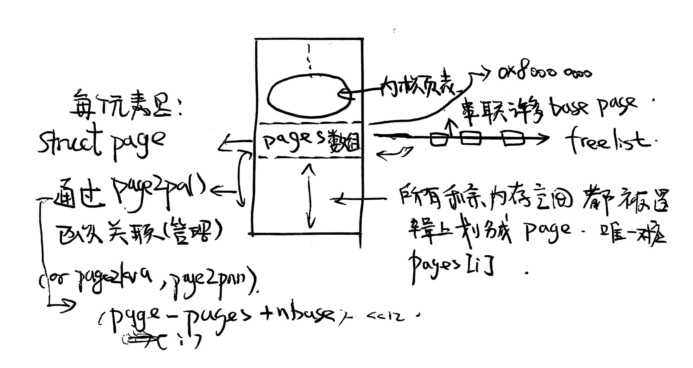
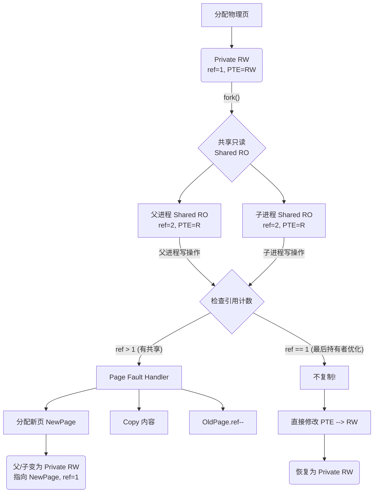
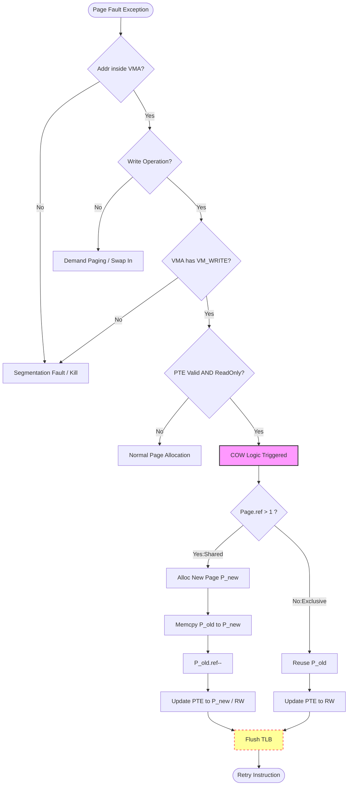
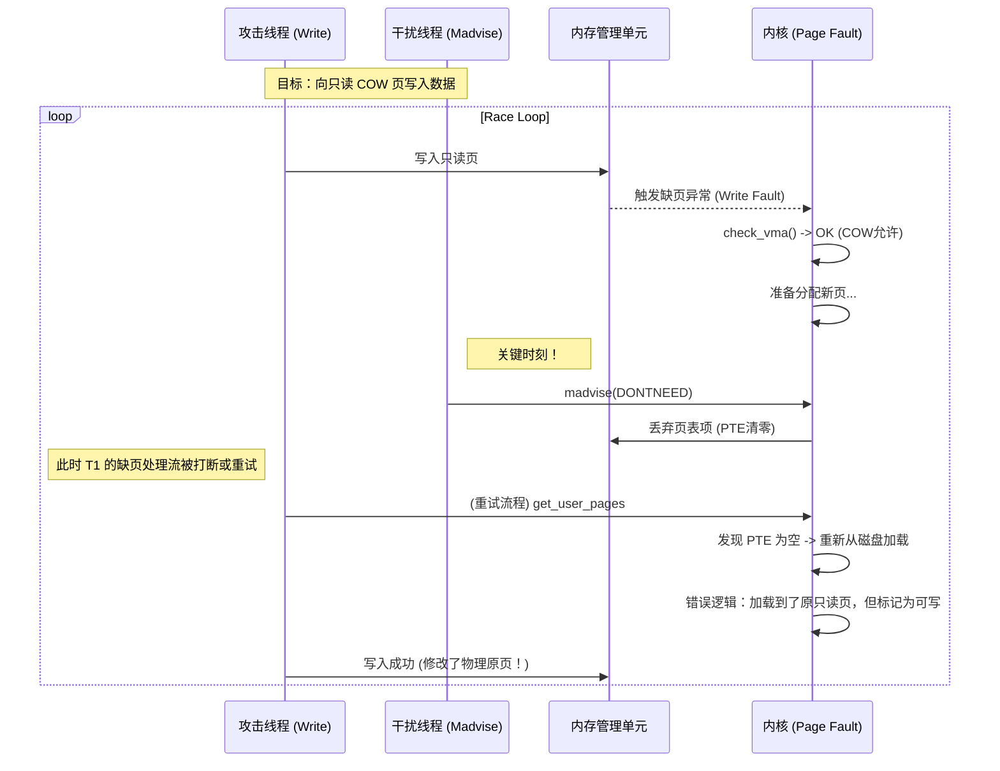
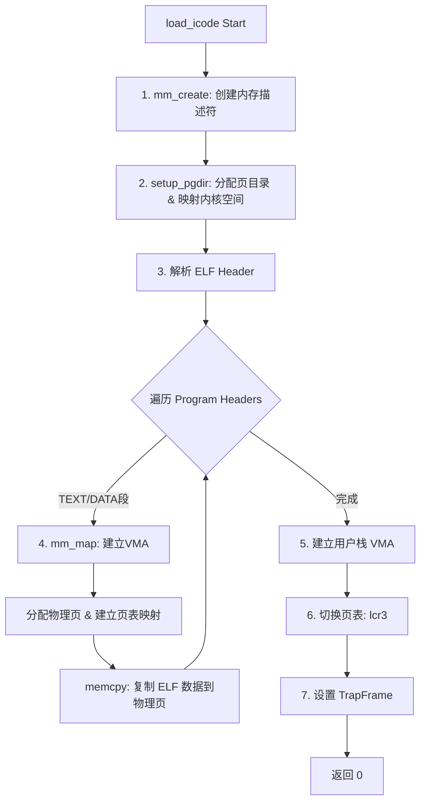
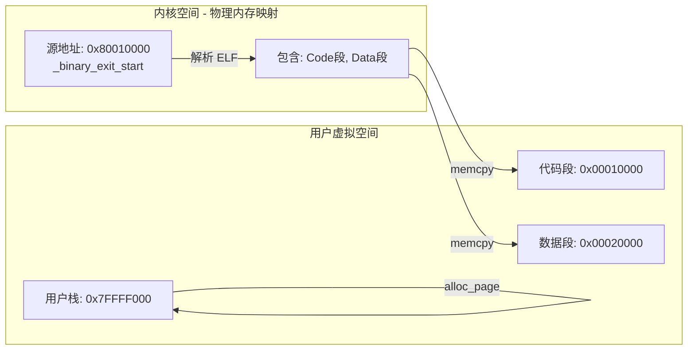

# 重要知识点

**一、 进程的本质：从抽象实体到具象的链表节点**

​	在操作系统原理中，进程通常被描述为“执行中的程序实例”或一个抽象的容器（PCB），用于隔离资源和维护状态。然而，通过实验中对 `alloc_proc` 和 `do_fork` 函数的实现，我们看到进程在内核中实际上是由复杂的**双向链表**和**指针网络**具象化构成的。本实验代码新增地操作 `parent`（父进程）、`cptr`（子进程）、`optr`（下一兄弟）和 `yptr`（上一兄弟）等指针，这使得理论中提到的“进程树”结构不再是一个逻辑概念，而是一个需要通过原子操作（如 `local_intr_save` 关中断）来精密维护的数据结构。此外，原理中常说的“创建进程是复制父进程”，在实验中被拆解为更细致的步骤：`do_fork` 不仅调用 `copy_mm` 复制或共享内存，更关键的是它调用 `setup_kstack` 分配了独立的内核栈，并通过 `copy_thread` 设置了 `trapframe`。这揭示了一个深层原理：内核通过“伪造”一个即将从中断返回的现场，使得新进程被调度时，能够像刚从一个系统调用中返回一样开始运行。这种“无中生有”的上下文构建，是进程异步执行机制的基石。

**二、 特权级隔离：基于寄存器状态位的精准欺骗**

​	关于用户态与内核态的切换，理论往往强调“保护边界”和“原子性”。本实验通过 `load_icode` 函数的设计和 GDB 对 `sret` 指令的调试，深刻揭示了这种切换的本质是对**状态寄存器（CSR）**的位操作。实验报告指出，为了启动一个用户进程，内核必须在 `trapframe` 中手动设置 `sstatus` 寄存器，清除 `SPP` 位以标记返回用户态，同时置位 `SPIE` 以确保中断开启。这说明“进入用户态”在实现上实际上是一次“从伪造的内核异常中返回”的过程。与此同时，实验中对 `syscall` 的反汇编分析展示了 `ecall` 指令如何触发硬件行为，将 `scause` 设为异常原因，并将程序计数器 `pc` 跳转至内核入口。特别是 GDB 调试中出现的 `Remote failure reply '14'` 错误，生动地验证了特权级隔离的物理存在：当 CPU 处于用户态时，硬件逻辑（在 QEMU 中表现为代码判断）强制禁止了对 `scause` 等特权寄存器的访问。这种由硬件强制执行的“拒绝服务”，正是操作系统安全模型的物理基础。

**三、 虚实内存：算法化的硬件逻辑**

​	在内存管理原理中，MMU通常被视为一个自动完成虚拟地址到物理地址转换的硬件黑盒，涉及多级页表和 TLB。本实验通过独特的“双重调试”手段，利用 QEMU 源码层面的断点，将这个硬件黑盒打开成了可见的 C 语言逻辑。实验观察到，所谓的地址转换（Address Translation）在底层仅仅是一系列的**位运算与查表逻辑**：从 `satp` 寄存器提取根页表基址，结合虚拟地址中的 VPN 字段进行移位和掩码操作。特别值得注意的是，实验在 Level 2 页表项中发现了 `R/W/X` 位被置位的情况，这直接对应了 OS 原理中的**大页（Huge Page）机制**——即中间页表项直接指向物理页框而非下一级页表，从而减少访存次数并降低 TLB 缺失率。这一发现将抽象的“多级页表优化”理论与具体的 PTE 标志位联系了起来，证明了操作系统对硬件特性的利用是极其依赖于底层细节的。同时，`get_physical_address` 函数中的逻辑判断流程（检查权限、PMP 检查、更新 Access/Dirty 位），也让我们理解到硬件并不神秘，它只是固化在电路（或模拟器代码）中的一段标准算法。

# 练习0

**1.alloc_proc()分配进程控制块函数的更新。**

```c++
proc->wait_state = 0;
proc->cptr = proc->optr = proc->yptr = NULL;
//分别表示当前进程的子进程、上一个兄弟进程和下一个兄弟进程
```

增加了对进程关系和等待状态成员变量的初始化。

**2.do_fork()创建进程函数的更新。**

```c++
int do_fork(uint32_t clone_flags, uintptr_t stack, struct trapframe *tf)
{
    int ret = -E_NO_FREE_PROC;
    struct proc_struct *proc;
    if (nr_process >= MAX_PROCESS)
    {
        goto fork_out;
    }
    ret = -E_NO_MEM;

    //    1. call alloc_proc to allocate a proc_struct
    if ((proc = alloc_proc()) == NULL) {
        goto fork_out;
    }
    proc->parent = current;//新增
    assert(current->wait_state == 0);  //设置parent，并确保当前进程的wait_state为0(没有等待)
    
	//    2. call setup_kstack to allocate a kernel stack for child process
    if (setup_kstack(proc) != 0) {
        goto bad_fork_cleanup_proc;
    }
    
    //    3. call copy_mm to dup OR share mm according clone_flag
    if (copy_mm(clone_flags, proc) != 0) {
        goto bad_fork_cleanup_kstack;
    }//copy_mm 会真正调用 dup_mmap 来复制父进程的用户内存空间。
    
    //    4. call copy_thread to setup tf & context in proc_struct
    copy_thread(proc, stack, tf);
    
    //    5. insert proc_struct into hash_list && proc_list
    bool intr_flag;
    local_intr_save(intr_flag);
    {
        proc->pid = get_pid();
        hash_proc(proc);
        set_links(proc);//使用 set_links(proc) 替代简单的 list_add。set_links 会设置进程的兄弟、子节点指针，维护进程树结构。
    }
    local_intr_restore(intr_flag);
    
    //    6. call wakeup_proc to make the new child process RUNNABLE
    wakeup_proc(proc);
    
    //    7. set ret value using child proc's pid
    ret = proc->pid;

    // LAB5 2312145 : (update LAB4 steps)
    // TIPS: you should modify your written code in lab4(step1 and step5), not add more code.
    /* Some Functions
     *    set_links:  set the relation links of process.  ALSO SEE: remove_links:  lean the relation links of process
     *    -------------------
     *    update step 1: set child proc's parent to current process, make sure current process's wait_state is 0
     *    update step 5: insert proc_struct into hash_list && proc_list, set the relation links of process
     */
fork_out:
    return ret;

bad_fork_cleanup_kstack:
    put_kstack(proc);
bad_fork_cleanup_proc:
    kfree(proc);
    goto fork_out;
}
```

# 练习1： 加载应用程序并执行

> **do_execve**函数调用`load_icode`（位于kern/process/proc.c中）来加载并解析一个处于内存中的ELF执行文件格式的应用程序。你需要补充`load_icode`的第6步，建立相应的用户内存空间来放置应用程序的代码段、数据段等，且要设置好`proc_struct`结构中的成员变量trapframe中的内容，确保在执行此进程后，能够从应用程序设定的起始执行地址开始执行。需设置正确的trapframe内容。
>
> 请在实验报告中简要说明你的设计实现过程。
>
> - 请简要描述这个用户态进程被ucore选择占用CPU执行（RUNNING态）到具体执行应用程序第一条指令的整个经过。

### 1.代码编写与设计思路

`load_icode` 的主要任务是将一个 ELF 格式的二进制程序加载到当前进程的内存空间中，并为该进程准备好执行环境。第 6 步的具体任务是**设置中断帧**。

​	中断帧是内核态与用户态切换的关键数据结构。当内核完成程序加载后，需要通过“从中断返回”（`sret` 指令）的方式，让 CPU 跳转到用户程序的入口点，并切换到用户态。因此，我们需要伪造一个正确的中断现场，使得 CPU 认为“刚才发生了一个中断，现在要返回用户态继续执行”。具体代码实现与解析如下所示：

```c
    /* LAB5:EXERCISE1 2312145
     * should set tf->gpr.sp, tf->epc, tf->status
     * NOTICE: If we set trapframe correctly, then the user level process can return to USER MODE from kernel. So
     *          tf->gpr.sp should be user stack top (the value of sp)
     *          tf->epc should be entry point of user program (the value of sepc)
     *          tf->status should be appropriate for user program (the value of sstatus)
     *          hint: check meaning of SPP, SPIE in SSTATUS, use them by SSTATUS_SPP, SSTATUS_SPIE(defined in risv.h)
     */
    tf->gpr.sp = USTACKTOP;
    tf->epc = elf->e_entry;
    tf->status = (sstatus | SSTATUS_SPIE) & ~SSTATUS_SPP;

    ret = 0;
```

1. **设置用户栈指针 (`tf->gpr.sp = USTACKTOP`)**

   在前面的步骤中，我们已经建立了用户栈的内存映射（通常在 `USTACKTOP` 之下）。这里我们将栈指针 `sp` 设置为 `USTACKTOP`，意味着用户栈从高地址向低地址增长，初始为空。这样当进程切换到用户态时，`sp` 寄存器将指向合法的用户栈顶。

2. **设置入口地址 (`tf->epc = elf->e_entry`)**

   ELF 文件头（`struct elfhdr`）中的 `e_entry` 字段记录了程序的入口虚拟地址。我们将这个地址赋值给 `epc`。当执行 `sret` 指令时，CPU 会将 `pc` 设置为 `epc` 的值，从而跳转到用户程序的第一条指令。

3. **设置状态寄存器 (`tf->status = ...`)**

   *    `sstatus`：当前的 `sstatus` 值。
   *    `& ~SSTATUS_SPP`：**清除 SPP 位**。`SPP` 决定了 `sret` 返回后的特权级。将其置 0 代表 用户模式。这是核心，确保进程进入用户态。
   *    `| SSTATUS_SPIE`：**置位 SPIE 位**。`SPIE`  决定了 `sret` 返回后中断是否开启。将其置 1，意味着返回用户态后，`SIE` 会被置 1，即**开启中断**。这非常重要，否则用户程序运行期间将无法响应时钟中断，导致无法被抢占，系统可能会卡死。

### 2.用户态进程从 RUNNING 到执行第一条指令的完整经过

1. 初始构建：创建 `user_main` 内核线程

在系统启动的初始化阶段（`init_main`），内核首先通过调用 `kernel_thread(user_main, ...)` 创建了一个新的内核线程（通常 PID=2）。这个线程通过 `do_fork` 生成，并被 `wakeup_proc` 唤醒进入就绪队列 (`PROC_RUNNABLE`)，等待调度器垂青。

2. 调度执行：发起“伪”系统调用

调度器 (`schedule`) 选中这个新线程并切换上下文 (`switch_to`) 开始执行 `user_main` 函数。在该函数内部，通过宏 `KERNEL_EXECVE` 实际上调用了 `kernel_execve` 函数。这是内核线程准备变身的起点。

3. 触发异常：利用 `ebreak` 陷入

在 `kernel_execve` 函数中，代码通过内联汇编设置好系统调用参数（如将 `SYS_exec` 放入 `a7` 寄存器），然后**关键性地执行了 `ebreak` 指令**。这里不使用 `ecall` 的原因是当前处于内核态，我们需要通过断点异常来模拟一次从内核发起的“系统调用”行为。

4. 异常分发：识别断点

`ebreak` 触发断点异常后，CPU 跳转到中断入口 `__alltraps` (trapentry.S) 保存现场，随后进入 `trap()` -> `trap_dispatch()`。在分发过程中，内核发现 `tf->cause` 为 `CAUSE_BREAKPOINT`，于是进入特定的处理分支，并手动调用 `syscall()` 函数。

5. 系统调用：路由至 `do_execve`

`syscall()` 函数读取中断帧中 `a7` 寄存器的值（即 `SYS_exec`），据此在系统调用表中找到并执行对应的内核服务函数 `sys_exec`，该函数进一步调用核心处理函数 `do_execve`。

6. 加载程序：篡改 `trapframe` 

do_execve 负责清理当前进程的旧内存映射，并调用 load_icode 加载用户程序（如 ELF 文件）。

最关键的操作发生在这里：load_icode 直接修改了当前进程保存在内核栈顶的 trapframe（中断帧）：

- 将 `epc` 修改为用户程序的入口地址。

- 将 `sp` 修改为用户栈的栈顶地址。

- 将 status 修改为 User Mode 并开启中断。

  这一步相当于“伪造”了一个现场，让 CPU 以为刚才是在用户态执行时发生了中断。

7. `sret` 返回用户态

函数调用层层返回（`load_icode` -> ... -> `trap`），最终回到 `trapentry.S` 的 `__trapret`。代码从刚才被“篡改”过的 `trapframe` 中恢复寄存器。最后执行 **`sret` 指令**，CPU 硬件感知到状态位的变化，瞬间从内核态切换到用户态，并跳转到 `epc` 指向的用户程序第一条指令，用户进程正式开始运行。

# 练习2: 父进程复制自己的内存空间给子进程

## 1. 进程创建和内存复制的概述

### 1.1 fork系统调用的完整流程

当用户程序执行fork()系统调用时，内核需要完成以下步骤：

```
用户态fork()调用
    ↓
进入内核(ebreak指令)
    ↓
trap.c的trap()函数
    ↓
syscall()识别为SYS_fork
    ↓
sys_fork()在syscall.c中执行
    ↓ (调用)
do_fork(0, stack, tf)
    ↓
【内存复制的关键步骤】
    ├─ 1. alloc_proc() - 分配进程结构
    ├─ 2. setup_kstack() - 分配内核栈
    ├─ 3. copy_mm() - **复制内存空间** ← 本练习重点
    │        ↓
    │   copy_mm调用dup_mmap
    │        ↓
    │   dup_mmap调用copy_range ← 需要实现
    ├─ 4. copy_thread() - 复制上下文
    ├─ 5. hash_proc() - 加入进程表
    ├─ 6. set_links() - 建立进程关系
    ├─ 7. get_pid() - 分配进程ID
    └─ 8. wakeup_proc() - 唤醒子进程
    ↓
返回子进程PID到父进程
返回0到子进程
```

### 1.2 实验任务分解

本练习要求：

1. **理解memory duplication的流程**
2. **实现copy_range函数**，正确处理：
   - 虚拟地址的分页映射
   - 物理页的分配和复制
   - 页表项的建立
3. **设计Copy-on-Write机制**，实现：
   - 初始共享状态
   - 缺页异常处理
   - 页面复制逻辑
   - 引用计数管理

## 2. 内存复制的核心: copy_range函数

### 2.1 copy_range函数的位置和调用链

```
kern/mm/pmm.c 中的 copy_range()
    ↑ 调用者
kern/mm/vmm.c 中的 dup_mmap()
    ↑ 调用者
kern/process/proc.c 中的 copy_mm()
    ↑ 调用者
kern/process/proc.c 中的 do_fork()
```

### 2.2 copy_range的函数签名和参数

```c
int copy_range(pde_t *to, pde_t *from, uintptr_t start, uintptr_t end,
               bool share)
{
    // to:    目标进程(子进程)的页目录物理地址
    // from:  源进程(父进程)的页目录物理地址
    // start: 虚拟地址范围的起始
    // end:   虚拟地址范围的结束
    // share: 是否使用共享模式(写时复制)
}
```

### 2.3 copy_range的完整实现

#### 版本1: 标准深拷贝(share=false)

```c
int copy_range(pde_t *to, pde_t *from, uintptr_t start, uintptr_t end,
               bool share)
{
    assert(start % PGSIZE == 0 && end % PGSIZE == 0);
    assert(USER_ACCESS(start, end));
    
    // 按页面为单位进行复制
    do {
        // 步骤1: 获取源进程的页表项(从页目录to, 地址start)
        pte_t *ptep = get_pte(from, start, 0);
        if (ptep == NULL) {
            // 如果页表不存在，跳过整个页表覆盖范围
            start = ROUNDDOWN(start + PTSIZE, PTSIZE);
            continue;
        }
        
        // 步骤2: 检查PTE是否有效
        if (*ptep & PTE_V) {
            // 步骤3: 为目标进程获取或创建页表项
            if ((nptep = get_pte(to, start, 1)) == NULL) {
                return -E_NO_MEM;
            }
            
            // 步骤4: 获取页权限(保留原权限)
            uint32_t perm = (*ptep & PTE_USER);
            
            // 步骤5: 获取源物理页
            struct Page *page = pte2page(*ptep);
            
            // 步骤6: 分配目标物理页
            struct Page *npage = alloc_page();
            assert(page != NULL);
            assert(npage != NULL);
            
            int ret = 0;
            
            if (share) {
                // [COW模式 - 延迟复制]
                free_page(npage);  // 不需要新页
                // 两个进程都映射到同一物理页
                page_insert(from, page, start, perm & (~PTE_W));  // 置为只读
                ret = page_insert(to, page, start, perm & (~PTE_W));
            } else {
                // [标准模式 - 深拷贝]
                // 复制物理页内容
                void *src_kvaddr = page2kva(page);      // 源物理页的虚拟地址
                void *dst_kvaddr = page2kva(npage);     // 目标物理页的虚拟地址
                memcpy(dst_kvaddr, src_kvaddr, PGSIZE); // 复制整个页面(4096字节)
                
                // 建立新进程的虚拟地址到新物理页的映射
                ret = page_insert(to, npage, start, perm);
            }
            
            assert(ret == 0);
        }
        
        // 步骤7: 继续下一个页面
        start += PGSIZE;
    } while (start != 0 && start < end);
    
    return 0;
}
```

### 2.4 copy_range的逐步执行过程

#### 步骤1: 获取源页表项

```c
pte_t *ptep = get_pte(from, start, 0);
```

**get_pte函数的工作流程**（在pmm.c中）：

```
输入: 页目录 from, 线性地址 start
     ↓
[Sv39三级页表]
一级页目录索引 = PDX1(start)
     ↓
检查一级PDE是否有效
   ├─ 无效 → 返回NULL (页表不存在)
   └─ 有效 ↓
获取二级页目录基址 = PDE_ADDR(pde1)
     ↓
二级页目录索引 = PDX0(start)
     ↓
检查二级PDE是否有效
   ├─ 无效 → 返回NULL
   └─ 有效 ↓
获取三级页表基址 = PDE_ADDR(pde0)
     ↓
三级页表索引 = PTX(start)
     ↓
返回该位置的PTE指针 (虚拟地址)
```

**关键点**：

- `get_pte(from, start, 0)` 中的0表示"不创建"，即只读操作
- 如果某个中间页表不存在，返回NULL(跳过这段范围)

#### 步骤2: 检查并跳过无映射范围

```c
if (ptep == NULL) {
    // 某个中间页表不存在
    start = ROUNDDOWN(start + PTSIZE, PTSIZE);  // 对齐到下一个PT
    continue;
}

if (*ptep & PTE_V) {  // 只处理有效的PTE
    // ... 复制逻辑
}
```

**为什么需要这个检查？**

- 源进程可能没有映射从start到end的所有虚拟地址
- VMA记录的范围可能由于页表分层而需要跳过
- 这避免了对不存在的页进行不必要的处理

#### 步骤3-4: 获取或创建目标页表项

```c
if ((nptep = get_pte(to, start, 1)) == NULL) {
    return -E_NO_MEM;
}
uint32_t perm = (*ptep & PTE_USER);
```

**详细流程**：

1. `get_pte(to, start, 1)` 的1表示"创建"
   - 如果一级或二级页目录不存在，分配新的页表页
   - 返回指向三级页表项的指针

2. `(*ptep & PTE_USER)` 提取页权限标志
   - PTE_USER 宏包含: PTE_U | PTE_R | PTE_W | PTE_X等
   - 权限会原封不动地复制(在非COW模式下)

#### 步骤5-6: 物理页处理

```c
struct Page *page = pte2page(*ptep);      // 源物理页
struct Page *npage = alloc_page();        // 分配新物理页
```

**两个重要函数**：

1. **pte2page(pte)**：从PTE值获取Page结构

   ```c
   // PTE格式: [PPN(物理页号) | 权限位]
   // PTE_ADDR(*ptep) 提取PPN部分
   // ppn2page() 将页号转换为Page结构指针
   ```

2. **alloc_page()**：分配一个物理页

   ```c
   // 返回Page结构体指针
   // 如果没有可用页面，返回NULL
   ```

#### 步骤7: 深拷贝或COW选择

**深拷贝方式** (share=false):

```c
void *src_kvaddr = page2kva(page);
void *dst_kvaddr = page2kva(npage);
memcpy(dst_kvaddr, src_kvaddr, PGSIZE);
ret = page_insert(to, npage, start, perm);
```

流程图：

```
源物理页内容        新物理页
┌──────────┐       ┌──────────┐
│ Code     │──┐    │ Code     │
│ Data     │  └────│ Data     │ (复制)
│ ...      │       │ ...      │
└──────────┘       └──────────┘
    ↑                   ↑
    │                   │
 父进程虚拟地址    子进程虚拟地址
```

**COW方式** (share=true):

```c
free_page(npage);  // 释放预分配的页面
page_insert(from, page, start, perm & (~PTE_W));
ret = page_insert(to, page, start, perm & (~PTE_W));
```

流程图：

```
源物理页内容
┌──────────┐
│ Code     │
│ Data     │ ← 两个进程都指向这一个物理页
│ ...      │
└──────────┘
  ↗        ↖
父进程(只读)  子进程(只读)

当任一进程尝试写入时:
     ↓
Page Fault异常
     ↓
do_pgfault()处理
     ↓
检测到COW情况
     ↓
复制页面 (此时才进行深拷贝)
     ↓
修改PTE为可写
```

#### 步骤8: 循环到下一个页面

```c
start += PGSIZE;  // 移进4KB
```

最后的continue条件：

```c
while (start != 0 && start < end);
```

- `start != 0`：防止虚拟地址溢出(在64位系统上几乎不会发生)
- `start < end`：确保在范围内

### 2.5 关键函数详解

#### page_insert 函数的工作原理

```c
int page_insert(pde_t *pgdir, struct Page *page, uintptr_t la, uint32_t perm)
{
    // pgdir: 页目录基址
    // page:  要映射的物理页结构
    // la:    虚拟地址
    // perm:  权限(PTE_U|PTE_R|PTE_W|PTE_X等)
    
    pte_t *ptep = get_pte(pgdir, la, 1);  // 获取或创建PTE
    if (ptep == NULL) {
        return -E_NO_MEM;
    }
    
    page_ref_inc(page);  // 增加引用计数(这个映射增加了一个引用)
    
    if (*ptep & PTE_V) {  // 如果原来已有映射
        struct Page *page = pte2page(*ptep);
        page_ref_dec(page);  // 减少旧页的引用
        if (page_ref(page) == 0) {
            free_page(page);  // 如果引用计数为0，释放页面
        }
    }
    
    // 在PTE中写入新的物理页号和权限
    *ptep = pte_create(page2ppn(page), perm);
    
    tlb_invalidate(pgdir, la);  // 刷新TLB缓存
    
    return 0;
}
```

**关键点说明**：

1. **引用计数的作用**：
   - 记录有多少个虚拟地址映射到该物理页
   - 当引用计数为0时，才能安全地释放物理页

2. **TLB失效**：
   - TLB是虚拟地址转换的高速缓存
   - 修改页表后必须刷新TLB
   - 否则CPU可能使用旧的转换结果

#### page2kva 函数：获取物理页的虚拟地址

```c
#define page2kva(page) \
    ((void *)((page - pages) * PGSIZE + va_pa_offset + KERNBASE))
```

**含义**：

- `page - pages`：页面在pages数组中的索引
- 乘以PGSIZE：转换为虚拟地址偏移
- 加上va_pa_offset：虚拟地址和物理地址的偏移
- 最终得到内核虚拟地址，可以直接访问

## COW的详细实现步骤

### 步骤1: fork阶段的初始设置

在`dup_mmap`中调用copy_range：

```c
int dup_mmap(struct mm_struct *to, struct mm_struct *from)
{
    // ...
    bool share = 1;  // 启用COW
    if (copy_range(to->pgdir, from->pgdir, vma->vm_start, vma->vm_end, share) != 0) {
        return -E_NO_MEM;
    }
    // ...
}
```

在copy_range中：

```c
if (share) {
    free_page(npage);  // 不分配新页
    
    // 关键操作: 两个进程都映射到同一物理页，但权限为只读
    page_insert(from, page, start, perm & (~PTE_W));  // 父进程只读
    ret = page_insert(to, page, start, perm & (~PTE_W));  // 子进程只读
    
    // 物理页的引用计数增加2 (一个父进程，一个子进程)
}
```

**权限修改的关键**：

```c
perm & (~PTE_W)  // 清除写权限位，留下读权限
```

即使原进程有写权限，现在也被强制设为只读。

### 步骤2: 页故障异常处理

当子进程(或父进程)尝试写入只读页面时：

```
用户程序执行store指令
    ↓
MMU检查PTE权限
    ↓
发现PTE_W=0 (不可写)
    ↓
产生Page Fault异常 (CAUSE_STORE_PAGE_FAULT)
    ↓
进入trap处理程序
    ↓
调用do_pgfault()
```

### 步骤3: do_pgfault中的COW处理

在vmm.c中：

```c
int do_pgfault(struct mm_struct *mm, uint32_t error_code, uintptr_t addr) 
{
    // ... 初始化代码 ...
    
    bool write = (error_code == CAUSE_STORE_PAGE_FAULT);
    
    // ... 获取VMA和权限 ...
    
    addr = ROUNDDOWN(addr, PGSIZE);
    ret = -E_NO_MEM;
    pte_t *ptep = NULL;
    
    if ((ptep = get_pte(mm->pgdir, addr, 1)) == NULL) {
        goto failed;
    }
    
    // **COW检测的核心**
    if (*ptep == 0) { 
        // 页表项为空，分配新页面(普通缺页异常)
        if (pgdir_alloc_page(mm->pgdir, addr, perm) == NULL) {
            goto failed;
        }
    } else {
        // 页表项存在，这可能是COW情况
        
        // **关键检查** (Security Check - Dirty COW Protection)
        if (write && (*ptep & PTE_V) && !(*ptep & PTE_W)) {
            // write = true: 这是写故障
            // *ptep & PTE_V: 页面已映射
            // !(*ptep & PTE_W): 页面不可写
            // → 这是COW页面！
            
            struct Page *page = pte2page(*ptep);
            
            if (page_ref(page) > 1) {
                // 多个进程指向这个页面
                // 需要复制
                
                struct Page *npage = alloc_page();
                if (npage == NULL) { 
                    unlock_mm(mm); 
                    goto failed; 
                }
                
                // 复制物理页内容
                void * src_kvaddr = page2kva(page);
                void * dst_kvaddr = page2kva(npage);
                memcpy(dst_kvaddr, src_kvaddr, PGSIZE);
                
                // 建立新的映射关系，并设置为可写
                if (page_insert(mm->pgdir, npage, addr, perm) != 0) {
                    free_page(npage);
                    unlock_mm(mm);
                    goto failed;
                }
                
                // page的引用计数会在page_insert中自动处理
                // (新页引用+1，旧页引用-1)
            } else {
                // 页面引用计数为1，说明只有本进程使用
                // 直接将PTE修改为可写
                page_insert(mm->pgdir, page, addr, perm);
            }
        }
    }
    
    ret = 0;
    unlock_mm(mm);
failed:
    return ret;
}
```

**核心逻辑分析**：

| 条件         | 页面引用计数 | 操作           | 原因               |
| ------------ | ------------ | -------------- | ------------------ |
| COW页, ref>1 | 多个         | 分配新页+复制  | 其他进程仍在使用   |
| COW页, ref=1 | 只有本进程   | 直接改为可写   | 其他进程已经复制过 |
| 普通缺页     | N/A          | 分配新页初始化 | 页面从未映射       |

### Dirty COW 安全问题与防护

#### 问题描述

**Dirty COW (CVE-2016-5195)** 是一个严重的内核漏洞：

```
漏洞原理:
1. 进程A有只读权限的COW页面
2. 进程A有大量只读映射(例如多个库加载)
3. 多线程竞争条件:
   - 线程1: 试图写入，触发缺页异常
   - 线程2: 通过madvise清除TLB，使页面对线程1可写
   - 同步问题导致权限检查和实际写入之间不一致
   
结果: 进程可能绕过权限限制进行写入
```

#### ucore中的防护

在vmm.c的do_pgfault中：

```c
// [Security Check] Dirty COW Protection
if (write && !(vma->vm_flags & VM_WRITE)) {
    cprintf("do_pgfault failed: write fault, but vma not writable\n");
    unlock_mm(mm);
    goto failed;
}
```

**防护原理**：

1. 检查VMA(虚拟内存区域)的权限
2. 如果VMA本身没有write权限，直接拒绝
3. 即使PTE因COW而只读，也必须检查VMA权限
4. 这形成了一道安全屏障

#### 进一步的防护措施

```c
// 序列化保护
int spin_count = 0;
while (!try_lock(&(mm->mm_lock))) {
    spin_count++;
    if (spin_count > 300) {
        schedule();
        spin_count = 0;
    }
}

// ... 修改页表 ...

unlock_mm(mm);
```

**意义**：

- 使用自旋锁保护mm_struct的修改
- 防止多线程同时修改同一进程的页表
- 避免竞争条件导致的不一致状态

### 3.5 COW的引用计数管理

#### page_ref 引用计数系统

在pmm.c中：

```c
// Page结构体包含引用计数字段
struct Page {
    int ref;  // 有多少个虚拟地址映射到这个页面
    // ... 其他字段 ...
};

// 操作引用计数的函数
static inline void set_page_ref(struct Page *page, int val)
{
    page->ref = val;
}

static inline int page_ref(struct Page *page)
{
    return page->ref;
}

static inline void page_ref_inc(struct Page *page)
{
    page->ref++;
}

static inline int page_ref_dec(struct Page *page)
{
    return --page->ref;
}
```

# 练习三

## 整体流程概览：fork/exec/wait/exit 函数简要分析

首先总览并回答问题，之后分阶段讲解四个函数：

在 `ucore` 中，进程管理主要在内核态通过 `do_fork`, `do_execve`, `do_wait`, `do_exit` 四个核心函数实现，用户态通过 `syscall` 触发中断进入内核调用它们。

1.  **fork (创建进程)**
    *   **实现**: 对应内核函数 `do_fork`。
    *   **功能**: 父进程通过此系统调用创建一个新的子进程。
    *   **关键点**:
        *   调用 `alloc_proc` 分配新的 `proc_struct`。
        *   调用 `setup_kstack` 分配内核栈。
        *   调用 `copy_mm` 复制或共享内存空间（取决于 `clone_flags`，`fork` 通常是复制，但在写时复制实现前是完全拷贝，`ucore` lab5中可能是共享或拷贝）。
        *   调用 `copy_thread` 复制上下文和中断帧（Trapframe）。**关键**是将子进程中断帧中的返回值寄存器（RISC-V下为 `a0`）设置为 `0`，确保子进程 `fork` 返回 0。
        *   将新进程加入进程列表并设为 `PROC_RUNNABLE`。
2.  **exec (加载新程序)**
    *   **实现**: 对应内核函数 `do_execve`。
    *   **功能**: 当前进程将自己的内存空间替换为新的程序并执行。
    *   **关键点**:
        *   检查内存名称和长度。
        *   清空当前进程的内存空间 (`exit_mmap`)。
        *   调用 `load_icode` 加载新的 ELF 二进制文件。
        *   `load_icode` 会建立新的内存映射，设置新的堆栈，并**重置中断帧**：将 `tf->epc` 指向 ELF 入口点，`tf->gpr.sp` 指向新的用户栈顶。
3.  **wait (等待子进程)**
    *   **实现**: 对应内核函数 `do_wait`。
    *   **功能**: 父进程等待子进程退出，并回收子进程留下的“尸体”（ZOMBIE 状态的资源）。
    *   **关键点**:
        *   查找是否有状态为 `PROC_ZOMBIE` 的子进程。
        *   如果有，释放该子进程剩余的内核栈和 `proc_struct`，返回其 PID 和退出码。
        *   如果子进程还在运行，将当前进程状态设为 `PROC_SLEEPING` 并调用 `schedule()` 让出 CPU，直到被唤醒。
4.  **exit (进程退出)**
    *   **实现**: 对应内核函数 `do_exit`。
    *   **功能**: 结束当前进程，释放大部分资源。
    *   **关键点**:
        *   释放页表和内存空间 (`exit_mmap`)。
        *   将状态设为 `PROC_ZOMBIE`。
        *   如果有子进程，将它们过继给 `initproc`。
        *   唤醒父进程 (`wakeup_proc(parent)`)，以便父进程可以通过 `wait` 回收自己。
        *   调用 `schedule()` 切换到其他进程，且不再返回。

---

### 问题 1：fork/exec/wait/exit 的执行流程分析

#### 1. 用户态与内核态的操作区分

*   **用户态完成的操作**:
    *   调用库函数（如 `fork()`, `exec()`, `wait()`, `exit()`）。
    *   库函数将系统调用号（如 `SYS_fork`）放入寄存器（RISC-V中通常是 `a0`），参数放入其他寄存器（`a1`-`a5`）。
    *   执行 `ecall` 指令触发同步异常（Trap），陷入内核。
*   **内核态完成的操作**:
    *   **Trap 处理**: `trapentry.S` 保存寄存器现场（Trapframe）。
    *   **分发**: `trap.c` -> `syscall.c` 根据系统调用号调用对应的 `sys_*` 函数。
    *   **核心逻辑**: 执行 `do_fork` (进程分配/拷贝), `do_execve` (内存替换/ELF加载), `do_wait` (查找/睡眠/回收), `do_exit` (资源释放/状态变更)。
    *   **返回**: 修改 Trapframe 中的返回值，执行 `sret` 返回用户态。

#### 2. 内核态与用户态程序的交错执行

这是一个典型的**中断驱动**的交错执行过程：

1.  **用户态 -> 内核态**: 用户程序执行到 `fork/exec` 等调用时，执行 `ecall` 指令。CPU 暂停当前用户指令流，切换特权级到 Supervisor Mode，跳转到内核的 Trap 处理入口。
2.  **内核态执行**: 内核通过当前进程的内核栈执行系统调用代码。在此期间，用户程序是暂停的（Blocked/Waiting 或仅仅是挂起）。
    *   如果是 `fork`: 内核构建好子进程结构后，**父进程**（当前在内核态）会返回用户态继续执行。**子进程**在未来被调度器选中后，也会从内核态“返回”到用户态（通过伪造的上下文）。
    *   如果是 `wait`: 如果没有僵尸子进程，父进程会在内核态将自己设为 `SLEEPING` 并调用 `schedule()`，此时 CPU 切换去运行其他进程。
3.  **内核态 -> 用户态**: 系统调用完成后，内核通过 `sret` 指令恢复之前保存的 Trapframe（包含程序计数器 `epc` 和栈指针 `sp`），CPU 切回 User Mode，继续执行用户程序 `ecall` 之后的指令。

#### 3. 内核态执行结果如何返回给用户程序

* **机制**: 修改 **Trapframe (中断帧)**。

* 在 `kern/syscall/syscall.c` 中，`syscall` 函数执行完具体的系统调用后，会将返回值赋值给中断帧中的 `a0` 寄存器：

  ```c
  tf->gpr.a0 = syscalls[num](arg);
  ```

* 当内核执行 `sret` 返回用户态时，硬件会将 Trapframe 中的值恢复到物理寄存器。因此，用户态程序在 `ecall` 指令结束后，读取 `a0` 寄存器就能得到系统调用的返回值（例如 `fork` 返回的 PID）。

* **特殊情况 (Fork)**: `fork` 会返回两次。

  *   **父进程**: 返回子进程 PID（由 `do_fork` 返回并在 `syscall` 中写入父进程的 `tf->gpr.a0`）。
  *   **子进程**: 在 `copy_thread` 函数中，内核显式地将子进程 Trapframe 的 `a0` 设为 0 (`proc->tf->gpr.a0 = 0`)。当子进程被调度运行并返回用户态时，它看到的返回值就是 0。

---

### 问题 2：ucore 用户态进程的执行状态生命周期图

以下是基于 `ucore` 代码逻辑（`kern/process/proc.h` 和 `proc.c`）绘制的生命周期图：

```text
  (alloc_proc)           (proc_init / wakeup_proc)
       |                            |
       V                            V
  PROC_UNINIT  ----------------> PROC_RUNNABLE <------------------+
                                    |  A                          |
                                    |  |                          |
                       schedule()   |  | (schedule选定)           |
                       (proc_run)   |  |                          |
                                    V  |                          |
                              (PROC_RUNNING)                      |
           (逻辑状态，代码中通常仍标识为 RUNNABLE，但在 CPU 上运行)      |
                                    |                             |
                                    | do_exit()                   |
      do_wait()                     |                             |
    (无僵尸子进程)                   V                             |
  PROC_SLEEPING <--------------- PROC_RUNNABLE (Running)          |
       |                            |                             |
       |                            |                             |
       | wakeup_proc()              | do_exit()                   |
       | (通常由子进程exit唤醒)        |                             |
       |                            V                             |
       +------------------------> PROC_ZOMBIE --------------------+
                                    |
                                    | do_wait() (由父进程调用)
                                    |
                                    V
                               (Process Destroyed)
                               (kfree, put_kstack)
                                    |
                                    X
```

或者用代码中自带的：

```
  alloc_proc                                 RUNNING
      +                                   +--<----<--+
      +                                   + proc_run +
      V                                   +-->---->--+
PROC_UNINIT -- proc_init/wakeup_proc --> PROC_RUNNABLE -- try_free_pages/do_wait/do_sleep --> PROC_SLEEPING --
                                           A      +                                                           +
                                           |      +--- do_exit --> PROC_ZOMBIE                                +
                                           +                                                                  +
                                           -----------------------wakeup_proc----------------------------------
```

**状态变换说明：**

1.  **PROC_UNINIT -> PROC_RUNNABLE**:
    *   **事件**: `do_fork` 中调用 `wakeup_proc(proc)`。
    *   **描述**: 进程结构体被分配并初始化完毕，可以被调度。
2.  **PROC_RUNNABLE <-> PROC_RUNNING (Running)**:
    *   **事件**: `schedule()` 函数。
    *   **描述**: 调度器从 `PROC_RUNNABLE` 队列中选择一个进程，通过 `proc_run` 和 `switch_to` 切换 CPU 上下文。在 `ucore` 的 `proc_struct` 结构中，正在运行的进程状态通常仍记录为 `PROC_RUNNABLE`，但 `current` 指针指向它。
3.  **PROC_RUNNING -> PROC_SLEEPING**:
    *   **事件**: `do_wait` (且子进程未退出) 或 `do_sleep` (实验代码中可能有)。
    *   **描述**: 进程需要等待某个事件（如子进程退出），主动让出 CPU。
4.  **PROC_SLEEPING -> PROC_RUNNABLE**:
    *   **事件**: `wakeup_proc()`。
    *   **描述**: 等待的事件发生（如子进程调用了 `do_exit`），唤醒父进程。
5.  **PROC_RUNNING -> PROC_ZOMBIE**:
    *   **事件**: `do_exit`。
    *   **描述**: 进程执行完毕或被杀掉，释放了页表等资源，但保留 `proc_struct` 等待父进程查看退出码。
6.  **PROC_ZOMBIE -> Destroyed**:
    *   **事件**: 父进程执行 `do_wait`。
    *   **描述**: 父进程回收子进程的“尸体”，释放剩余的内核栈和 `proc_struct` 内存。

## 练习三——具体化每个阶段详解

### fork

本来想要只说fork，但是梳理就梳理到内存初始化了，所以从**物理内存初始化**到**进程创建**梳理一遍：

#### 1. 开天辟地：物理内存管理 (PMM)

一切始于 **`pmm_init`**（在 `kern/mm/pmm.c`）：

1.  **探测地皮**：内核启动，计算出物理内存有多大（比如 128MB），算出总共有多少页 (`npage`)。
2.  **建立户籍科 (`pages` 数组)**：
    *   在内核代码结束的位置（`end` 之后），划出一块地，建立全局唯一的 `pages` 数组。
    *   `pages[i]` 对应物理内存的第 `i` 页。这个数组是内核用来管理所有物理页的**总账本**。
3.  **盘点库存 (`free_list`)**：
    *   算出 `pages` 数组后面剩下的才是真正可用的**空闲内存** (`freemem`)。
    *   调用 `init_memmap` -> `default_init_memmap`，把这些空闲内存对应的 `struct Page` 挂到 **`free_list`** 链表上。
    *   从此，`alloc_page` 就可以从 `free_list` 里拿纸（物理页），`free_page` 就把纸还回链表。4



<center><b>图1 手绘布局图

#### 2. 也是开天辟地：内核页表 (Boot Page Table)

*   内核启动时，先用汇编 (`entry.S`) 硬编码了一个简陋的页表 `boot_page_table_sv39`，仅仅为了能让 CPU 开启分页模式，并让内核代码能跑在 `0xC0000000` 这个高地址上。
*   随后，`pmm_init` 会建立更完善的内核页表。

#### 3. 诞生生命：进程创建 (Process Creation)

当我们要创建一个新进程（比如 `alloc_proc` 或 `do_fork`）时：

1.  **领身份证 (`alloc_proc`)**：
    *   分配一个 `proc_struct` 结构体。
    *   **关键点**：此时进程还是个空壳，为了安全，先把它的页表指针 `proc->pgdir` 指向**内核页表** (`boot_pgdir_pa`)。这意味着它暂时和内核共用一套视野。

2.  **分家立户 (`setup_pgdir`)**：
    *   调用 `alloc_page()` 从 `free_list` 里领一张空白纸（物理页）。
    *   把内核页表的内容 (`memcpy`) 抄到这张新纸上。
    *   让 `proc->pgdir` 指向这张新纸。
    *   **现在，进程有了自己的独立门户（页表），但里面只有内核的内容（高地址部分）。**

3.  **装修房子 (`load_icode` / `mm_map`)**：
    *   读取 ELF 文件，发现需要代码段、数据段、栈。
    *   创建 `mm_struct` 和 `vma_struct` 来登记这些需求（逻辑上的地盘）。
    *   **真正分配**：当确实需要用内存时（或者预先分配时），再次调用 `alloc_page()` 领纸，把 ELF 里的代码/数据填进去，然后把物理地址填到刚才那张“独立门户”的页表里（建立映射）。

#### 4. 最终形态

*   **`pages` 数组**：静静地躺在内核里，记录着每一页物理内存归谁管。
*   **`free_list`**：串着所有还没被领走的页。
*   **进程 A**：手里拿着自己的页表（`pgdir`），页表里：
    *   高地址 -> 映射到内核空间（大家都有，一样的）。
    *   低地址 -> 映射到进程 A 自己的物理页（`pages` 数组里的某些页）。

#### 具体到fork代码

**自行梳理简化版：**

```c
int do_fork(uint32_t clone_flags, uintptr_t stack, struct trapframe *tf){
    proc = alloc_proc(); // 初始化pid等进程控制块信息
    proc->parent = current;

    copy_mm(clone_flags, proc); // 包含两个关键操作：mm = mm_create()和setup_pgdir(mm)，前者分配新的mm_struct，后者分配新的页表

    copy_thread(proc, stack, tf); // setup tf & context in proc_struct

    proc->pid = get_pid();
    hash_proc(proc);
    set_links(proc);

    wakeup_proc(proc);

    return proc->pid;
}
```

我重写了一个极简版本的fork，可以直接看到都干了什么。再加上之前的理解就ok了。

### exec

调用时机/情况：

> 当一个进程决定“改头换面”去执行另一个程序时（比如 fork 出来的子进程本来和父进程一模一样，但它想去运行 ls 命令），它就会调用 exec。

所以首先要“拆迁旧家”（参考AI的比喻的说法）之后换一个新的：

```c
int do_execve(const char *name, size_t len, unsigned char *binary, size_t size){
    struct mm_struct *mm = current->mm;

    lsatp(boot_pgdir_pa); // 1. 先切回内核页表
                        //    因为我们要销毁自己的页表，不能站在即将被锯断的树枝上。(空指针)

    if(mm_count_dec(mm) == 0){
        exit_mmap(mm);    //    a. 释放所有的 VMA 和对应的物理页映射
        put_pgdir(mm);    //    b. 释放页表本身占用的物理页
        mm_destroy(mm);   //    c. 释放 mm_struct 结构体内存
    }

    current->mm = NULL;   // 3. 当前进程变成“无房户”
    // ===============================
    //           拆旧家完毕
    // ===============================

    load_icode(binary, size);  // 换新

    return 0;
}        
```

我也是删掉了所有检查和进程名字等影响核心逻辑观看的代码。代码中的注释已经写的非常清晰了，其中laod_icode就是练习1中的。


#### wait 

do_wait 是父进程用来给子进程“收尸”的函数。当子进程退出时，父进程会调用 do_wait 来回收子进程的资源。

在操作系统中，一个进程结束后（do_exit），它并不会立即彻底消失。它会变成一个 僵尸进程 (Zombie Process)，保留着 proc_struct 结构体，等待父进程来查看它的退出码（exit_code）并回收这最后的资源。

**do_wait 的核心逻辑就是：等待子进程死掉，拿走它的退出码，然后彻底释放它的 proc_struct 和内核栈。**

```c
int do_wait(int pid, int *code_store){

repeat:

    bool has_kid = 0;
    // 1. 查找是否有符合条件的子进程
    //    如果 pid!=0，找特定子进程；如果 pid==0，找任意子进程
    if (pid != 0) {
        proc = find_proc(pid);
        // ... 确认是我的子进程 ...
    } else {
        // ... 遍历子进程列表 ...
    }

    // 2. 如果找到了子进程
    if (haskid) {
        // case A: 子进程已经是僵尸 (ZOMBIE) 了
        if (proc->state == PROC_ZOMBIE) {
            goto found; // 直接去收尸
        }
        
        // case B: 子进程还活着
        // 父进程自己进入睡眠状态 (SLEEPING)，让出 CPU
        current->state = PROC_SLEEPING;
        current->wait_state = WT_CHILD; // 标记我在等孩子
        schedule(); // 调度，去运行别的进程（比如那个还活着的子进程）
        
        // ... 当我被唤醒时 (通常是子进程死的时候会唤醒父进程) ...
        goto repeat; // 醒来后，再回去看看孩子死了没
    }
    
     // 3. 如果根本没有子进程
    return -E_BAD_PROC;


found:
    // 4. 收尸阶段 (彻底回收资源)
    if (code_store != NULL) {
        *code_store = proc->exit_code; // 把子进程的遗言（退出码）传给用户
    }

    // 从各种链表中删除子进程记录
    unhash_proc(proc);
    remove_links(proc);
    
    // 释放子进程最后的遗产：内核栈 和 proc_struct
    put_kstack(proc);
    kfree(proc);

    return 0;
}
```

### exit

do_exit 是进程生命的终点，也就是进程自己调用 exit() 系统调用（或者被 kill）时执行的函数。

**核心：清理资源，变成僵尸，通知父亲，安排孤儿，主动调度**

```c
int do_exit(int error_code){

    struct mm_struct *mm = current->mm;
    
    // 变卖所有资产：释放掉虚拟内存资源
    if (mm != NULL) {
        lsatp(boot_pgdir_pa); // 先切回内核页表
        if (mm_count_dec(mm) == 0) { // 如果没人共享这个 mm 了
            exit_mmap(mm);    // 拆掉所有 VMA
            put_pgdir(mm);    // 拆掉页表
            mm_destroy(mm);   // 释放 mm_struct
        }
        current->mm = NULL;   // 彻底断绝关系
    }


    // 2. 变成僵尸
    current->state = PROC_ZOMBIE; 
    current->exit_code = error_code; // 写好退出码

    // 3. 通知父进程
    struct proc_struct *proc = current->parent;
    if (proc->wait_state == WT_CHILD) { // 如果父亲在等
        wakeup_proc(proc); 
    }

    // 4. 安排孤儿 (如果有子进程)
    // 必须把它们过继给 init 进程 (initproc) 抚养。
    
    while (current->cptr != NULL) {
            proc = current->cptr;
            current->cptr = proc->optr;
            
            proc->parent = initproc; // 认init为父亲
            proc->optr = initproc->cptr; 
            initproc->cptr = proc;
            
            // 如果这个孤儿已经是僵尸了，得通知新父亲 (init) 来收
            if (proc->state == PROC_ZOMBIE) {
                if (initproc->wait_state == WT_CHILD) {
                    wakeup_proc(initproc);
                }
            }
    }

      // 5. 彻底撒手
    schedule(); 
}
```

综上，每个阶段的详细流程也介绍完了。

# challenge1

## COW (Copy-On-Write) 机制设计需求分析

### 1. 痛点与问题分析 (Problem Analysis)

场景描述：在类 Unix 系统中，fork() 系统调用用于创建子进程。根据 POSIX 标准，子进程需要获得父进程内存空间的“逻辑副本”。

**传统“深拷贝” (Deep Copy) 的缺陷**：

- 时间开销巨大 (High Latency)：

  内核需要逐页复制父进程的所有物理内存页 (Physical Pages) 到子进程。对于内存密集型服务（如 Redis, MySQL），内存占用常达到数 GB 甚至数十 GB，复制操作会导致 CPU 长时间忙碌，阻塞进程调度。

  - *复杂度*：$O(N)$，其中 $N$ 为父进程内存大小。

- **资源浪费 (Resource Waste)**：

  - **无效复制**：在 `fork()` 后立即执行 `exec()` 的常见场景中（如 shell 启动新命令），子进程的内存空间会被立即丢弃并被新程序替换。之前的复制操作（CPU 周期、缓存污染、总线带宽）完全是无用功。
  - **冗余占用**：如果父子进程都只读取数据而不修改，物理内存中存在两份完全相同的数据，导致内存利用率减半。

### 2. 性能对比实例 (Case Study)

假设父进程占用内存 **100MB**，页面大小 **4KB**。

| **维度**       | **传统深拷贝 (Deep Copy)**        | **COW 机制 (Copy-On-Write)**           | **提升幅度**   |
| -------------- | --------------------------------- | -------------------------------------- | -------------- |
| **操作行为**   | `memcpy` 100MB 数据               | 仅复制页表 (Page Tables)，标记页为只读 | **极简**       |
| **时间复杂度** | $O(\text{Memory Size})$           | $O(\text{Page Table Size})$            | **数量级提升** |
| **fork 耗时**  | ~200ms (阻塞明显)                 | < 1ms (仅受页表大小影响)               | **>200倍**     |
| **exec 场景**  | 复制 100MB → 立即丢弃 (100% 浪费) | 无数据复制 → 直接加载新程序            | **零浪费**     |

> **关键洞察**：COW 将内存复制的成本从“进程创建时”推迟到了“写操作发生时”，并利用局部性原理，通常只有极少量的页会被真正修改。

### 3. COW 设计目标 (Design Goals)

为了解决上述问题，COW 机制的设计必须满足以下核心指标：

#### 3.1 核心性能指标 (Performance)

- **极速 Fork**：`fork` 的耗时应仅与**页表大小**成正比，而不受进程实际物理内存大小影响。
- **按需分配 (Lazy Allocation)**：只有在任一进程（父或子）尝试**修改**内存页时，才触发缺页异常 (Page Fault) 进行物理页复制。

#### 3.2 资源效率 (Efficiency)

- **共享物理帧**：在未修改前，父子进程的虚拟地址 (Virtual Address) 应映射到同一个物理地址 (Physical Address)。
- **引用计数管理**：内核必须维护物理页的引用计数 (Reference Count)。仅当计数归零时才释放物理内存，避免内存泄漏。

#### 3.3 透明性与正确性 (Transparency & Correctness)

- **用户态透明**：应用程序无需修改代码，感知不到 COW 的存在。
- **写时隔离**：一旦发生写操作，必须保证父子进程看到的是独立的副本，互不干扰。
- **只读标记**：通过 MMU (内存管理单元) 将共享页标记为 `Read-Only`。写操作触发硬件异常，由内核捕获并处理复制逻辑。

#### 3.4 安全性 (Security)

- **权限控制**：严防**Dirty COW (CVE-2016-5195)** 类漏洞。在处理缺页中断（复制页）和更新页表映射的过程中，必须保证操作的原子性，防止竞态条件导致向只读文件/内存写入数据。
- **隔离边界**：防止子进程通过共享内存非法篡改父进程的关键数据结构。

### 4. 总结：COW 的本质

COW 是一种**惰性求值 (Lazy Evaluation)** 策略在操作系统内存管理中的应用。它通过“欺骗”进程（让它们以为自己拥有独立的内存），实现了系统吞吐量和响应速度的最大化。

## 2. COW 机制的核心设计与实现

### 2.1 核心设计思想 (Core Concept)

**核心原则**：**"Delay the copy until the last possible moment."** (将复制推迟到最后一刻)

COW 本质上是操作系统在**逻辑权限**（VMA）与**物理权限**（PTE）之间制造的一种“故意的不一致”，利用硬件异常机制来实现软件策略。

#### 流程拆解

1. **Fork 阶段 (建立映射)**：
   - **物理层**：不分配新物理页，父子进程共享原有物理页。
   - **硬件层 (PTE)**：将父子进程页表中的对应条目均设为 **只读 (Read-Only)**。
   - **逻辑层 (VMA)**：保留原本的读写属性（例如 `VM_WRITE` 依然存在，表示逻辑上该段内存是可写的）。
2. **运行时 (触发异常)**：
   - **动作**：进程尝试写入数据。
   - **冲突**：MMU 发现 PTE 为只读，但指令试图写入。
   - **异常**：触发 **Page Fault (缺页异常)**，错误码通常指示“权限违规 (Permission Denied)”。
3. **内核处理 (延迟复制)**：
   - **分配**：内核捕获异常，分配一个新的物理页。
   - **复制**：将原物理页的内容 `memmove` 到新页。
   - **重映射**：修改当前进程的页表，指向新物理页，并开启 **可写 (PTE_W)** 权限。
   - **恢复**：减少原物理页的引用计数，刷新 TLB，重新执行刚才失败的写指令。

### 2.2 关键数据结构 (Key Data Structures)

要实现 COW，需要在物理内存管理、虚拟内存管理和硬件页表三个层面进行配合。

#### A. 物理页元数据 (`struct Page`)

这是 COW 的基石，用于追踪物理页被多少个进程共享。

```c
struct Page {
    // 引用计数 (Atomic): 记录有多少个 PTE 映射到了这个物理页
    // ref = 0: 空闲页，可被分配
    // ref = 1: 私有页，仅被一个进程使用 (写操作无需复制，直接改权限)
    // ref > 1: 共享页，正处于 COW 状态 (写操作需要复制)
    atomic_t ref_count; 
    
    // ... 其他物理页管理字段 ...
};
```

> **关键点**：`ref_count` 统计的是**映射数量**而非进程数量（虽然通常二者成正比）。

#### B. 虚拟内存区域 (`struct vma_struct`)

代表进程视角的“逻辑真理”。

```c
struct vma_struct {
    uintptr_t vm_start; // 虚拟起始地址
    uintptr_t vm_end;   // 虚拟结束地址
    
    // 逻辑权限标志: 描述这段内存"应该"具备的属性
    // 例如: 数据段通常包含 VM_READ | VM_WRITE
    uint32_t vm_flags;  
};
```

#### C. 硬件页表项 (PTE - RISC-V 示例)

代表 CPU 视角的“硬件约束”。

```c
// RISC-V PTE 权限位定义
#define PTE_V   (1L << 0) // Valid
#define PTE_R   (1L << 1) // Readable
#define PTE_W   (1L << 2) // Writable (COW 的关键控制位)
#define PTE_X   (1L << 3) // Executable
#define PTE_U   (1L << 4) // User mode
#define PTE_RSW (1L << 8) // Reserved for Software (可用于标记这是一个COW页)
```

#### 💡 核心逻辑：权限矛盾制造

在 `fork()` 时，内核执行如下位操作来设置子进程的 PTE：

```c
// 逻辑上有写权限 (VM_WRITE)，但强制剥夺硬件写权限 (PTE_W)
if (vma->vm_flags & VM_WRITE) {
    pte_val = (pte_val & ~PTE_W) | PTE_R; // 去除写位，确保只读
    // 可选：利用 PTE_RSW 记录"这是一个COW页"，以便缺页处理时快速判断
}
```

### 2.3 状态机与生命周期 (FSM & Lifecycle)

我们将一个物理页在 COW 机制下的生命周期抽象为有限状态机。

#### 状态定义

- **[SHARED_RO] (共享只读)**: `ref > 1`，PTE 为 `R` (无 `W`)。这是 fork 后的初始状态。
- **[PRIVATE_RW] (私有读写)**: `ref == 1`，PTE 为 `RW`。这是进程修改后的正常状态。

#### 状态流转图



#### 关键场景推演

1. **Fork 初始时刻**:
   - 父进程：`PTE_W` 被清除，指向物理页 `P_Old`。
   - 子进程：复制父进程 PTE，指向物理页 `P_Old`。
   - 物理页：`P_Old.ref = 2`。
2. **场景一：父进程先写 (Copy 发生)**:
   - 触发 Page Fault。
   - 内核检查发现 `P_Old.ref > 1`。
   - 分配新页 `P_New`，复制 `P_Old` 内容。
   - 父进程 PTE 指向 `P_New`，权限设为 `RW`。
   - **状态更新**：`P_New.ref = 1`，`P_Old.ref` 降为 1。
   - *结果*：父进程独立了，子进程仍指向 `P_Old`（只读）。
3. **场景二：子进程随后写 (优化：无需 Copy)**:
   - 触发 Page Fault。
   - 内核检查发现 `P_Old.ref == 1` (因为父进程已经离开了)。
   - **优化路径**：不分配新页，不复制内存。
   - 直接将子进程 PTE 的权限恢复为 `RW`。
   - *结果*：子进程独占 `P_Old`，恢复为标准读写状态。

## 3. COW 在 fork/exec 操作中的详细流程

### 3.1 Fork 初始化阶段 (Initialization)

在 `fork()` 期间，内核的核心任务是构建子进程的页表，但**不复制物理页**。

**调用链 (Call Chain)**：

```
do_fork()
 └─ copy_mm() (复制内存描述符)
     └─ dup_mmap() (复制VMA链表)
         └─ copy_page_range() (核心：复制页表项)
```

**关键函数 `copy_range` (伪代码优化版)**：

这里展示了如何将父进程的 PTE 复制给子进程，并强制剥夺双方的写权限。

```c
int copy_range(pde_t *to, pde_t *from, uintptr_t start, uintptr_t end, bool share) {
    do {
        // 1. 获取父进程(源)的PTE
        pte_t *pte_src = get_pte(from, start, 0);
        if (pte_src == NULL || !(*pte_src & PTE_V)) {
            start = ROUNDDOWN(start + PTSIZE, PTSIZE);
            continue;
        }

        // 2. 获取/分配子进程(目标)的PTE
        pte_t *pte_dst = get_pte(to, start, 1);
        if (pte_dst == NULL) return -E_NO_MEM;

        struct Page *page = pte2page(*pte_src);
        uint32_t perm = (*pte_src & PTE_USER_MASK);

        if (share) {
            // 【COW 核心逻辑】
            
            // A. 剥夺写权限: 即使原页是可写的，PTE也要改为只读
            // 注意: 必须同时修改父进程和子进程的PTE!
            if (perm & PTE_W) {
                perm &= ~PTE_W;
                *pte_src = (*pte_src & ~PTE_W); // 修改父进程PTE
                // !重要!: 修改了父进程PTE，必须标记需要刷新TLB
            }
            
            // B. 建立映射: 子进程指向同一物理页
            // page_insert 内部会自动执行 page.ref++
            page_insert(to, page, start, perm);
            
            // C. 确保父进程的映射也更新为只读 (如果之前是写的)
            // (通常在 page_insert 或后续的 tlb_invalidate 中处理)
            
        } else {
            // 非共享模式 (传统的深拷贝)
            // alloc_page, memcpy...
        }

        start += PGSIZE;
    } while (start != 0 && start < end);
    
    // !至关重要!: 必须刷新父进程的 TLB，否则 CPU 可能会缓存旧的(可写)PTE
    tlb_invalidate(from_mm); 
    
    return 0;
}
```

**关键状态参数**：

| **参数**     | **值/操作**     | **含义**                                         |
| ------------ | --------------- | ------------------------------------------------ |
| **PTE_W**    | **Cleared (0)** | 硬件层禁止写入，这是触发 Page Fault 的地雷       |
| **VM_WRITE** | Kept (1)        | VMA 中保留逻辑写权限，作为异常处理时的合法性依据 |
| **Page.ref** | **Inc (+1)**    | 物理页引用计数增加，表示多方共享                 |
| **TLB**      | **Flush**       | 必须清除快表，防止 CPU 使用旧的可写入口          |

### 3.2 Fork 后并发执行时序 (Timeline)

假设父子进程并发运行，且都持有对物理页 `P_Phys` 的映射。

**时刻 T0: Fork 返回**

- **状态**：父子进程的 PTE 均指向 `P_Phys`，且 `PTE_W=0` (只读)。
- **物理页**：`P_Phys.ref = 2`。

**时刻 T1: 父进程尝试写入**

1. **动作**：`store instruction` 写入地址 `VA`。
2. **异常**：MMU 发现 `PTE_W=0`，触发 `Page Fault`。
3. **处理**：
   - 检查 `page.ref > 1` (存在共享)。
   - 分配新页 `P_New`，执行 `memcpy(P_New, P_Phys)`。
   - 父进程 PTE 指向 `P_New`，设置 `PTE_W=1`。
   - `P_Phys.ref--` (变为 1)。
4. **结果**：父进程拥有了独立的 `P_New`，且可写。

**时刻 T2: 子进程读取 (Read) 同一地址**

- **动作**：`load instruction` 读取地址 `VA`。
- **状态**：子进程 PTE 仍指向 `P_Phys`。
- **结果**：读取成功。
- **数据一致性**：子进程读到的是 **Fork 时刻的快照数据**。这是正确的隔离行为（Snapshot Isolation）。父进程对 `P_New` 的修改对子进程不可见。

**时刻 T3: 子进程尝试写入 (Write) 同一地址**

1. **动作**：`store instruction` 写入地址 `VA`。
2. **异常**：MMU 发现 `PTE_W=0`，触发 `Page Fault`。
3. **处理 (优化路径)**：
   - 检查 `P_Phys.ref`。此时 `ref == 1` (因为父进程在 T1 已经退出了共享)。
   - **无需复制**：直接将子进程 PTE 的 `PTE_W` 设为 1。
4. **结果**：子进程继续使用 `P_Phys`，并恢复为可写状态。

> **注意**：T3 的优化极大提升了性能。如果子进程比父进程“晚”修改，它可以直接复用原物理页，完全避免了第二次内存分配和复制。

### 3.3 Exec 后的资源释放

`exec` 是 COW 机制产生最大收益的场景。

**流程**：

1. **清空旧映射 (`exit_mmap`)**：
   - 遍历子进程所有页表。
   - 对每个有效的 PTE 指向的 `page` 执行 `page_ref_dec(page)`。
2. **引用计数的作用**：
   - 如果父进程尚未修改该页：`page.ref` 从 2 减为 1。父进程后续写入时，会直接走进“优化路径”（ref=1），无需复制。
   - 如果父进程已经修改并分离：`page.ref` 减为 0，物理页被回收（针对子进程已拥有独立副本的情况）。
3. **加载新程序 (`load_icode`)**：
   - 为新程序分配全新的、空的物理页（按需分配）。

收益总结：

在 fork + exec 场景下，原本几个 GB 的数据复制变成了简单的引用计数递减操作。

### 3.4 核心隐患：TLB 一致性 (The TLB Hazard)

这是实现 COW 时最容易忽略的问题。

- **问题**：在 `fork` 修改页表（将 `RW` 改为 `RO`）的过程中，父进程可能正在其他 CPU 核上运行，或者当前 CPU 的 TLB 缓存了旧的 `RW` 映射。
- **后果**：如果 `fork` 返回后，父进程使用了 TLB 中的旧 `RW` 条目写入数据，它将**直接修改物理内存**，而不会触发 Page Fault。此时子进程（共享同一物理页）的数据被静默破坏，导致严重 Bug。
- **对策**：在 `copy_range` 修改完 PTE 后，**必须强制刷新当前 CPU 的 TLB**。如果是多核系统，还需要通过 IPI (核间中断) 强制刷新其他核的 TLB (TLB Shootdown)。

## 4. 缺页异常处理中的 COW 实现

### 4.1 Page Fault 的触发机制 (The Trigger)

当用户程序试图写入一个被标记为 COW 的页面时，硬件行为如下：

1. **指令执行**：CPU 执行 `store` (写) 指令，目标地址为 `VA`。
2. **MMU 翻译**：
   - 查询 TLB/页表，找到对应的 PTE。
   - **检查 1**：`PTE_V == 1` (页面存在)。
   - **检查 2**：`PTE_W == 0` (硬件禁止写入)。
3. **触发异常**：权限检查失败，CPU 抛出异常。
   - `scause` (RISC-V) = 15 (`STORE_PAGE_FAULT`)
   - `stval` = 访问的虚拟地址 `VA`
   - `sepc` = 触发指令的地址

------

### 4.2 核心处理逻辑 (`do_pgfault`)

这是内核处理 COW 的“手术室”。代码逻辑必须严密，特别是**并发控制**和**TLB 一致性**。

```c
// 伪代码参考 (基于 uCore/RISC-V 风格)
int do_pgfault(struct mm_struct *mm, uint32_t error_code, uintptr_t addr) {
    int ret = -E_INVAL;
    
    // 1. 查找 VMA (虚拟内存区域)
    // 判定地址合法性的唯一标准是 VMA，而非页表
    struct vma_struct *vma = find_vma(mm, addr);
    if (!vma || vma->vm_start > addr) {
        goto failed; // Segmentation Fault
    }

    // 2. 权限检查 (Security Check / Dirty COW Defense)
    // 关键: error_code 指示了硬件发生的行为(写)，vma 指示了逻辑允许的权限
    bool is_write = (error_code == CAUSE_STORE_PAGE_FAULT);
    
    if (is_write && !(vma->vm_flags & VM_WRITE)) {
        // 严重: 试图写入一个逻辑上只读的区域 (如代码段)
        // 哪怕是在做 COW 处理，也不能给这种操作放行
        goto failed; 
    }

    // 3. 准备目标权限
    uint32_t perm = PTE_U;
    if (vma->vm_flags & VM_WRITE) perm |= (PTE_R | PTE_W);
    
    // 获取页表项
    pte_t *ptep = get_pte(mm->pgdir, addr, 0); // 此时不应自动创建
    
    // ==========================================================
    // 4. COW 核心判决逻辑
    // ==========================================================
    
    // Case A: 页面尚未映射 (按需分页 / Demand Paging)
    if (ptep == NULL || *ptep == 0) {
        if (pgdir_alloc_page(mm->pgdir, addr, perm) == NULL) {
            goto failed; // OOM
        }
    }
    // Case B: 页面存在，且发生写错误 -> 可能是 COW
    else {
        // 检查: 这是一个 COW 页面吗？
        // 条件: 是写操作 + 页面有效 + 页面硬件不可写
        if (is_write && (*ptep & PTE_V) && !(*ptep & PTE_W)) {
            
            struct Page *page = pte2page(*ptep);
            
            // --------------------------------------------------
            // 分支 1: 共享状态 (Reference Count > 1)
            // 必须复制，生成私有副本
            // --------------------------------------------------
            if (page_ref(page) > 1) {
                struct Page *npage = alloc_page(); // 分配新物理页
                if (!npage) goto failed;
                
                // 复制数据 (Deep Copy)
                memcpy(page2kva(npage), page2kva(page), PGSIZE);
                
                // 建立新映射 (原子操作)
                // page_insert 会: 
                // 1. npage->ref++ (变为1)
                // 2. old_page->ref-- (减少对原页的引用)
                // 3. 更新 PTE 指向 npage，并赋予 perm (包含 PTE_W)
                page_insert(mm->pgdir, npage, addr, perm);
            } 
            // --------------------------------------------------
            // 分支 2: 独占状态 (Reference Count == 1)
            // 优化: 无需复制，直接恢复权限
            // --------------------------------------------------
            else {
                // 当前进程是该物理页的唯一拥有者
                // (其他进程可能已经 COW 分离了，或者 fork 后 exec 释放了)
                
                // 直接修改 PTE，增加写权限
                // 注意: page_insert 内部会处理 ref 计数，
                // 由于是同一个 page，ref 不变
                page_insert(mm->pgdir, page, addr, perm);
            }
            
            // !至关重要!: 刷新 TLB
            // 修改了页表权限 (RO -> RW)，必须通知 CPU 清除缓存
            tlb_invalidate(mm->pgdir, addr);
        }
        else {
            // 写了只读页，但不是 COW (例如真的写只读数据)
            goto failed; 
        }
    }

    return 0;

failed:
    return -E_INVAL;
}
```

### 4.3 逻辑决策树 (Visual Flowchart)

代码段



### 4.4 关键防御：防止 Dirty COW

Dirty COW (CVE-2016-5195) 是一类著名的竞争条件漏洞。在设计 COW 时必须理解其成因。

- **漏洞原理**：攻击者利用两个线程，一个线程疯狂调用 `madvise(MADV_DONTNEED)` (丢弃页表映射)，另一个线程疯狂写入该地址（触发缺页）。
- **竞态点**：在内核“判断是否需要复制”和“实际执行复制/写回”之间存在时间窗口。
- **防御核心**：
  1. **VMA 权限校验**：如代码所示，`if (write && !(vma->vm_flags & VM_WRITE))` 是第一道防线。**永远不要信任硬件 PTE 的状态，始终以 VMA 的逻辑描述为准**。
  2. **原子性**：`page_insert` 和 `ref` 计数的修改必须受到锁（如 `mm->page_table_lock`）的保护，防止多线程同时修改同一个页表项。
  3. **FOLL_FORCE 标志**：现代内核在处理 `ptrace` 等调试功能写入只读内存时，有专门的标志位处理，避免混淆正常的 COW 逻辑。

## 5. Dirty COW 漏洞分析与防护

### 5.1 漏洞原理复盘 (CVE-2016-5195)

Dirty COW 的本质是利用内核中的 **竞态条件 (Race Condition)**，破坏了写时复制（COW）的原子性，导致攻击者能够写入只读内存映射（如 libc 库文件或 `/etc/passwd` 的内存映射）。

**核心矛盾**：内核在“检查权限”和“执行写入”之间存在微小的时间窗口。

#### 攻击时序图 (The Race)



### 5.2 核心防护策略：VMA 是唯一真理

在 uCore 或类似的教学 OS 中，防止 Dirty COW 的最有效手段是建立**逻辑权限的绝对权威**。

#### 防护代码 (Defensive Coding)

```c
// 位于 do_pgfault 函数开头
// 策略：不要信任 PTE 的状态，也不要受 madvise 的干扰，只信任 VMA

// [Check 1] 写入操作必须符合 VMA 的初始设定
if ((error_code & CAUSE_STORE_PAGE_FAULT) && !(vma->vm_flags & VM_WRITE)) {
    kprintf("Security Alert: Attempt to write to read-only VMA at %p\n", addr);
    goto failed; // 直接杀掉进程
}
```

#### 原理解析

- **PTE 是易变的 (Volatile)**：PTE 的状态可能因为 Swap、Madvise、COW 等操作频繁变化（Valid/Invalid, RW/RO）。
- **VMA 是持久的 (Persistent)**：`vma->vm_flags` 是在 `mmap` 或 `exec` 时确立的“宪法”。除非调用 `mprotect`，否则它不会改变。
- **防御逻辑**：无论 PTE 处于什么奇怪的状态（竞态导致的中间态），只要 VMA 说“不可写”，内核就必须拒绝写入请求。

## 6. COW 完整实现验证

### 6.1 关键函数的交互流

我们通过一个生命周期表来验证状态流转的正确性：

| **阶段**        | **操作**     | **物理页 Ref** | **PTE 权限 (父)** | **PTE 权限 (子)** | **备注**                              |
| --------------- | ------------ | -------------- | ----------------- | ----------------- | ------------------------------------- |
| **1. 初始**     | `alloc_page` | 1              | RW                | -                 | 父进程正常使用                        |
| **2. Fork**     | `copy_range` | **2**          | **RO** (去除 W)   | **RO** (去除 W)   | 建立共享，只读陷阱                    |
| **3. 写操作**   | `do_pgfault` | 2 → 1          | **RW** (新页)     | RO (旧页)         | 父进程获得副本，子进程仍指旧页        |
| **4. 子写操作** | `do_pgfault` | 1              | RW                | **RW** (旧页)     | **优化**：子进程发现 Ref=1，直接转 RW |
| **5. Exec**     | `exit_mmap`  | 0              | -                 | -                 | 旧页引用归零，物理内存释放            |

### 6.2 内存泄漏检测 (Invariant Check)

在设计中必须维持以下**不变量 (Invariants)**，任何违背都意味着 Bug：

1. **Ref 守恒定律**：`page.ref` 的值必须严格等于指向该物理页的有效 PTE 数量。
2. **释放守恒定律**：物理页当且仅当 `ref` 降为 0 时才调用 `free_page`。

**关键检查点**：

- `fork` 失败时：如果构建子进程页表半途而废，必须回滚已增加的 `ref`。
- `cow` 复制失败时：如果 `alloc_page` 失败（OOM），不能错误地修改原页的 `ref`。

## 7. 测试用例设计 (Test Cases)

为了全面验证 COW，我们需要从功能、并发和内核内部三个维度进行测试。

### 7.1 功能测试：数据隔离性

```c
// test_cow_isolation.c
#include <stdio.h>
#include <unistd.h>
#include <stdlib.h>
#include <assert.h>
#include <string.h>

#define MB (1024*1024)

int main() {
    // 1. 分配大块内存 (确保跨越多个页)
    char *p = malloc(10 * MB);
    memset(p, 'A', 10 * MB); // 重要: 写入触发缺页，确保物理页已分配(避免测试到 Demand Paging)

    int pid = fork();

    if (pid == 0) {
        // [子进程]
        // 修改前半部分，触发 COW
        memset(p, 'B', 5 * MB); 
        // 检查修改是否生效
        if (p[0] != 'B') exit(1);
        exit(0);
    } else {
        // [父进程]
        wait(NULL); // 等待子进程结束
        
        // [验证]
        // 子进程修改了前半部分，但父进程看到的应该还是 'A'
        if (p[0] != 'A') {
            printf("FAIL: Parent memory corrupted!\n");
        } else {
            printf("PASS: Parent memory isolated.\n");
        }
    }
    return 0;
}
```

### 7.2 压力测试：并发与大内存

```c
// test_cow_stress.c
// 目的：测试大量 fork + 写入下的内存稳定性和性能
int main() {
    for (int i = 0; i < 100; i++) {
        int pid = fork();
        if (pid == 0) {
            // 子进程疯狂写入，触发大量 COW Page Fault
            volatile int *arr = malloc(1024 * 4096); 
            // 随机写入，给分配器压力
            for(int k=0; k<1000; k++) arr[k*4096] = k; 
            exit(0);
        }
    }
    // 父进程等待回收
    while(wait(NULL) > 0);
    printf("PASS: 100 concurrent forks survived.\n");
    return 0;
}
```

### 7.3 单元测试：内核态引用计数 (Kernel Unit Test)

由于用户态无法直接看到 `page->ref`，建议在内核初始化后运行特定的断言函数。

```c
// kern/tests/test_cow.c
void check_cow_ref(void) {
    struct Page *p = alloc_page();
    assert(p->ref == 1);

    // 模拟 fork 增加引用
    page_ref_inc(p);
    assert(p->ref == 2);

    // 模拟 COW 分离 (复制)
    struct Page *p2 = alloc_page(); // 新页
    memcpy(page2kva(p2), page2kva(p), PGSIZE);
    
    // 模拟 PTE 更新
    page_ref_dec(p); // 原页引用减 1
    
    assert(p->ref == 1);
    assert(p2->ref == 1);
    
    cprintf("check_cow_ref passed!\n");
}
```

### 8. 总结 (Conclusion)

COW 机制通过**逻辑欺骗**（让进程以为独占内存）和**惰性操作**（只在写入时复制），极大地提升了 `fork` 的效率。实现它的关键在于：

1. **准确的权限控制**：在 VMA (逻辑) 和 PTE (物理) 之间制造“矛盾”。
2. **严密的异常处理**：`do_pgfault` 是状态机的核心流转点。
3. **绝对的安全性**：防止 Dirty COW，确保内存隔离。

# challenge2——用户程序加载时机与机制分析

## 1. 用户程序的预编译和链接 (User Program Build & Link)

在不需要文件系统支持的简单操作系统（如 uCore/rCore 早期阶段）中，我们通常采用 **"将用户程序二进制直接嵌入内核镜像"** 的策略。这允许内核启动后直接从内存中读取用户程序指令。

### 1.1 编译流水线与 Makefile 设计

构建用户程序的过程分为三个关键步骤：**编译链接**、**提取二进制**、**封装为内核对象**。

在 `Makefile` 中，这通常通过以下规则实现：

```makefile
# Step 1: 编译源代码 -> ELF 可执行文件
# 这一步生成的是带ELF头、带符号表的标准可执行文件
user/%.o: user/%.c
	$(CC) $(CFLAGS) -c $< -o $@

user/%.out: user/%.o
	$(LD) $(LDFLAGS) -e main $< -o $@

# Step 2: 提取纯二进制 (Raw Binary)
# 这一步丢弃ELF头，只保留指令和数据，为了减小体积和简化加载
user/%.bin: user/%.out
	$(OBJCOPY) -S -O binary $< $@

# Step 3: 封装为内核对象文件 (The Magic Step)
# 将纯二进制文件"伪装"成一个ELF对象文件，使其能被链接进内核
obj/user/%.o: user/%.bin
	$(OBJCOPY) -I binary -O elf64-littleriscv -B riscv \
		--rename-section .data=.rodata,alloc,load,readonly,data,contents \
		$< $@
```

**关键参数解析**：

- `-I binary`: 告诉链接器输入文件是纯二进制数据，没有任何格式信息。
- `-O elf64...`: 指定输出格式为目标架构的 ELF。
- `--rename-section .data=.rodata`: **这是核心技巧**。默认情况下 `objcopy` 将数据放入可写的 `.data` 段。我们强制将其重命名为 `.rodata`，确保用户程序镜像在内核中是**只读**的，防止被意外篡改。

### 1.2 链接脚本 (Linker Script) 的布局

在内核的链接脚本 (`kernel.ld`) 中，我们需要显式地将这些生成的目标文件包含进来。它们通常被放置在内核的 `.rodata` 段之后。

```assembly
SECTIONS {
    /* 内核代码段 .text ... */
    
    .rodata : {
        *(.rodata)
        
        /* === 用户程序嵌入区 === */
        . = ALIGN(4);            /* 4字节对齐 */
        _user_prog_start = .;    /* 定义全局符号：用户程序区的起点 */
        
        obj/user/exit.o          /* 嵌入 exit 程序 */
        obj/user/hello.o         /* 嵌入 hello 程序 */
        obj/user/forktest.o      /* 嵌入 forktest 程序 */
        
        _user_prog_end = .;      /* 定义全局符号：用户程序区的终点 */
    }
    
    /* 数据段 .data ... */
}
```

**结果**：最终生成的 `kernel` 镜像文件中，包含了完整的用户程序二进制数据。

### 1.3 符号解析：内核如何找到程序？

经过 `objcopy` 处理后，`obj/user/exit.o` 不再包含 `main` 函数这样的符号，而是自动生成了三个描述二进制数据的**全局符号**。

通过 `objdump -t obj/user/exit.o` 可以查看：

Plaintext

```
SYMBOL TABLE:
0000000000000000 g       .rodata    000000d8 _binary_obj_user_exit_out_start
00000000000000d8 g       .rodata    00000000 _binary_obj_user_exit_out_end
00000000000000d8 g       *ABS* 000000d8 _binary_obj_user_exit_out_size
```

**符号命名规则**： `_binary_` + `[完整路径文件名(标点变下划线)]` + `_start` / `_end` / `_size`

- **`..._start`**: 指向该程序二进制数据的起始内存地址。
- **`..._end`**: 指向结束地址。
- **`..._size`**: 该程序的字节大小。

### 1.4 内核代码中的引用 (C Integration)

在内核的 C 代码中（例如 `proc.c`），我们通过 `extern` 声明这些符号，即可像操作数组一样获取用户程序的内容。

```c
// 1. 声明外部符号 (由链接器自动生成)
// 注意：符号代表的是地址，所以类型通常声明为 char[] 或 char*
extern char _binary_obj_user_exit_out_start[];
extern char _binary_obj_user_exit_out_end[];
extern char _binary_obj_user_hello_out_start[];
extern char _binary_obj_user_hello_out_end[];

// 2. 使用示例
void load_hello_program() {
    // 计算大小
    size_t size = _binary_obj_user_hello_out_end - _binary_obj_user_hello_out_start;
    
    // 获取源地址
    void *binary_src = _binary_obj_user_hello_out_start;
    
    cprintf("Loading hello: addr=%p, size=%d\n", binary_src, size);
    
    // 后续步骤：调用 load_icode(binary_src, size) 解析并加载到进程空间
}
```

## 2. 内核初始化时的用户程序加载

### 2.1 系统初始化流程 (`kern_init`)

操作系统的启动始于 `kern/init/init.c` 中的 `kern_init()` 函数。该函数负责按顺序初始化各个子系统，最终启动进程管理系统。

**执行流程**：

```c
int kern_init(void) {
    extern char edata[], end[];
    memset(edata, 0, end - edata);  // 1. 清零 BSS 段 (未初始化数据段)
    
    cons_init();    // 2. 初始化控制台 (允许屏幕输出)
    cprintf("(THU.CST) os is loading ...\n");
    
    print_kerninfo();
    
    // 3. 核心子系统初始化
    pic_init();     // 8259A 中断控制器
    idt_init();     // 中断描述符表 (IDT)
    vmm_init();     // 虚拟内存管理 (Paging)
    pm_init();      // 物理内存管理 (PMM)
    
    // ... 更多硬件初始化 (如时钟、键盘) ...
    
    // 4. ★ 进程管理初始化 (关键转折点)
    proc_init();    
    
    // 5. 进入调度循环
    // 注意: 实际的 CPU 控制权将交给 idleproc，随后调度到 initproc
    cpu_idle(); 
}
```

### 2.2 进程树的根基 (`proc_init`)

`proc_init` 负责创建系统中最初的两个核心内核线程：**idle** (PID 0) 和 **init** (PID 1)。

**创建逻辑**：

1. **idleproc (PID 0)**：
   - **角色**：空闲进程。当没有其他进程处于 `RUNNABLE` 状态时，CPU 运行此进程。
   - **实现**：它并不拥有独立的内核栈，而是直接借用内核启动时的 `bootstack`。它永远不会退出。
   - **状态**：初始化为 `PROC_RUNNABLE`，并将 `current` 指针指向它。
2. **initproc (PID 1)**：
   - **角色**：第一个实质性的内核线程，它是所有用户进程的“祖先”。
   - **实现**：通过 `kernel_thread(init_main, ...)` 创建。
   - **职责**：负责创建 `user_main` 来加载用户程序，并负责回收僵尸进程 (Zombie Reaping)。

**代码关键点**：

```c
void proc_init(void) {
    // ... 列表初始化 ...

    // [Step 1] 创建 idle 进程
    if ((idleproc = alloc_proc()) == NULL) panic("cannot alloc idleproc.\n");
    idleproc->pid = 0;
    idleproc->state = PROC_RUNNABLE;
    idleproc->kstack = (uintptr_t)bootstack; // 借用启动栈
    idleproc->need_resched = 1;
    set_proc_name(idleproc, "idle");
    nr_process++;

    current = idleproc; // 当前上下文切换为 idle

    // [Step 2] 创建 init 进程
    // init_main 是 init 进程的入口函数
    int pid = kernel_thread(init_main, NULL, 0);
    
    initproc = find_proc(pid);
    set_proc_name(initproc, "init");

    assert(idleproc != NULL && idleproc->pid == 0);
    assert(initproc != NULL && initproc->pid == 1);
}
```

### 2.3 Init 进程的主逻辑 (`init_main`)

`initproc` 启动后执行 `init_main` 函数。它的生命周期分为两个阶段：启动用户环境、作为守护进程回收资源。

**执行流程**：

1. **创建执行环境**：启动名为 `user_main` 的内核线程。这个线程通过 `exec` 机制将自己“变身”为用户进程。
2. **资源回收循环**：进入死循环，不断调用 `do_wait` 等待子进程退出，防止产生僵尸进程。

```c
static int init_main(void *arg) {
    // 1. 创建 user_main 内核线程
    // 它的任务是加载并运行用户程序
    int pid = kernel_thread(user_main, NULL, 0);
    
    if (pid <= 0) panic("create user_main failed.\n");

    // 2. 守护模式: 等待所有子进程结束
    while (do_wait(0, NULL) == 0) {
        schedule(); // 如果没有退出的子进程，就调度让出 CPU
    }

    cprintf("all user-mode processes have quit.\n");
    return 0;
}
```

### 2.4 用户程序的加载入口 (`user_main`)

这是内核态向用户态转换的最后一步。`user_main` 利用宏 `KERNEL_EXECVE` 加载预先链接到内核中的二进制文件。

**宏解析与展开**：

`KERNEL_EXECVE(exit)` 利用了 C 语言的宏拼接技巧，自动关联上一章节生成的符号：

```c
// 宏定义
#define KERNEL_EXECVE(x) ({ \
    // 声明外部符号 (由 objcopy 生成) \
    extern unsigned char _binary_obj___user_##x##_out_start[], \
        _binary_obj___user_##x##_out_size[]; \
    \
    // 调用实际加载函数 \
    __KERNEL_EXECVE(#x, _binary_obj___user_##x##_out_start, \
                    _binary_obj___user_##x##_out_size); \
})

// 宏展开示例 (当参数为 exit 时):
// kernel_execve("exit", 
//               _binary_obj___user_exit_out_start, 
//               _binary_obj___user_exit_out_size);
```

**执行逻辑**：

```c
static int user_main(void *arg) {
#ifdef TEST
    // 运行测试用例
    KERNEL_EXECVE2(TEST, TESTSTART, TESTSIZE);
#else
    // 运行默认程序 (exit)
    KERNEL_EXECVE(exit);
#endif
    // 如果 kernel_execve 返回，说明加载失败(正常情况下exec不返回)
    panic("user_main execve failed.\n");
}
```

**核心调用链总结**：

1. `kern_init()`: 系统硬件初始化。
2. `proc_init()`: 建立 PID 0 (idle) 和 PID 1 (init)。
3. `init_main()`: PID 1 运行，创建 `user_main`。
4. `user_main()`: 调用 `kernel_execve`。
5. `kernel_execve()`: 解析嵌入的二进制 ELF，构建用户态内存空间 

## 3. 创建进程与加载 ELF (Process Creation & ELF Loading)

当 `user_main` 调用 `kernel_execve` 时，内核正式开始将一个静态的二进制文件“复活”为一个动态的进程。核心工作由 `do_execve` 和 `load_icode` 完成。

### 3.1 执行入口：`do_execve`

这是 `exec` 系统调用的内核态实现。它的主要职责是**“辞旧迎新”**：清理当前进程的旧内存空间，并加载新程序。

```c
int do_execve(const char *name, size_t len, unsigned char *binary, size_t size) {
    struct mm_struct *mm = current->mm;
    
    // 1. 检查用户空间内存引用 (如果是用户进程发起的exec)
    if (!user_mem_check(mm, (uintptr_t)name, len, 0)) {
        return -E_INVAL;
    }
    
    // 2. 回收旧资源 ("辞旧")
    // 如果当前进程已有内存空间 (mm != NULL)，需要释放
    if (mm != NULL) {
        lcr3(boot_cr3);  // 切换回内核页表，防止页面释放后崩溃
        if (mm_count_dec(mm) == 0) {
            exit_mmap(mm);  // 释放VMA和页表
            put_pgdir(mm);  // 释放页目录
            mm_destroy(mm); // 销毁mm结构
        }
        current->mm = NULL;
    }
    
    // 3. 加载新程序 ("迎新")
    // binary: 指向内核镜像中的用户程序起始地址
    int ret = load_icode(binary, size);
    
    // 4. 设置进程名
    set_proc_name(current, name);
    
    return ret;
}
```

### 3.2 核心加载器：`load_icode`

这是整个流程中最“重”的函数。它负责解析 ELF 格式，建立虚拟内存映射，并伪造中断现场（TrapFrame）。

**执行流程图**：



**关键步骤详解**：

#### 步骤 1 & 2: 建立新内存空间

- **`mm_create()`**: 分配一个新的 `mm_struct`，用于管理 VMA 链表。
- **`setup_pgdir()`**: 分配一个新的页目录表 (Page Directory)。
  - *注意*：必须将内核空间的映射（`boot_pgdir` 的高地址部分）拷贝过来，确保进入内核态时能正常工作。

#### 步骤 3 & 4: 解析 ELF 并加载段 (Segment)

遍历 ELF 的 `Program Headers` (`ph`)，找到类型为 `PT_LOAD` 的段。

```c
struct elfhdr *elf = (struct elfhdr *)binary;
struct proghdr *ph = (struct proghdr *)(binary + elf->e_phoff);

for (int i = 0; i < elf->e_phnum; i++) {
    if (ph[i].p_type != ELF_PT_LOAD) continue;

    // 4.1 建立虚拟内存区域 (VMA)
    // 根据 ELF 段的权限 (R/W/X) 设置 VMA 标志
    uint32_t vm_flags = 0;
    if (ph[i].p_flags & ELF_PF_X) vm_flags |= VM_EXEC;
    if (ph[i].p_flags & ELF_PF_W) vm_flags |= VM_WRITE;
    if (ph[i].p_flags & ELF_PF_R) vm_flags |= VM_READ;
    
    mm_map(mm, ph[i].p_va, ph[i].p_memsz, vm_flags, NULL);

    // 4.2 复制数据 (核心操作)
    // 这是一个简化的描述，实际通常涉及缺页处理或直接分配页
    // 将 binary + ph[i].p_offset 的内容复制到虚拟地址 ph[i].p_va
    // 处理 BSS 段: memsz > filesz 的部分清零
}
```

#### 步骤 5: 建立用户栈

在虚拟地址空间的顶部（通常是 `USTACKTOP`）分配几页内存作为用户栈。

- `mm_map(mm, USTACKTOP - USTACKSIZE, USTACKSIZE, VM_READ|VM_WRITE|VM_STACK, NULL);`
- 立即分配物理页并建立映射，确保用户栈可用。

#### 步骤 6: 切换页表

- `lcr3(PADDR(mm->pgdir))`
- 此时 CPU 的可视视野从内核空间切换到了新的用户进程空间。

#### 步骤 7: 伪造中断现场 (`TrapFrame`) —— **至关重要**

这是让 `sret` 指令“误以为”我们是从用户态发生中断进来的，从而“返回”到用户态。

```c
struct trapframe *tf = current->tf;
memset(tf, 0, sizeof(struct trapframe));

// A. 设置段寄存器 (x86) 或 状态寄存器 (RISC-V)
// 确保返回后处于 User Mode，且开启中断
tf->status = SSTATUS_SPIE | SSTATUS_SPP_USER; 

// B. 设置入口地址 (PC)
// 设为 ELF 头中定义的入口点 (main函数的封装入口)
tf->epc = elf->e_entry; 

// C. 设置栈指针 (SP)
// 设为刚才建立的用户栈顶
tf->sp = USTACKTOP;

// D. 返回值清零
tf->gpr.a0 = 0; // exit code 默认为 0
```

------

### 3.3 为什么需要 `load_icode`？

在 `fork` 之后，子进程只是父进程的一个**完全拷贝**（Copy of Memory）。

- `fork()` = 复制内存布局。
- `exec()` = **重塑**内存布局。

`load_icode` 的本质是根据 ELF 文件（“施工图纸”），在空白的内存空间上构建出代码段、数据段、BSS 段和栈段，最后将 CPU 的 PC 指针强行指向图纸上的“入口大门”。5. 与现代操作系统的对比

## 4. 对比分析：Linux 动态加载 vs. ucore 预链接

程序加载是将可执行文件从存储介质“搬运”到内存并准备运行的过程。Linux 和 ucore 采用了两种截然不同的设计哲学。

### 4.1 Linux 的通用动态加载 (Dynamic Loading)

Linux 采用“按需加载”和“动态链接”策略，严重依赖文件系统和动态链接器。

**核心流程图解：**

```
用户态 (User Space)                  内核态 (Kernel Space)
       |                                       |
1. fork() + exec("/bin/ls") -----------------> |
                                               |
                                     2. 打开文件系统 (VFS)
                                     [磁盘 I/O: 读取 ELF 头]
                                               |
                                     3. 检查 ELF 类型
                                        发现 PT_INTERP 段
                                               |
                                     4. 映射动态链接器 (ld.so)
                                        (不是直接加载程序代码)
                                               |
5. 返回用户态 (RIP = ld.so入口) <------------- |
       |
6. ld.so 运行
   ├─ 加载共享库 (libc.so 等)
   ├─ 符号重定位 (Relocation)
   └─ 跳转到程序 main 入口
       |
7. 程序开始执行
```

**关键技术点：**

- **文件系统依赖**：`exec` 必须从磁盘（ext4/xfs）读取文件，涉及繁重的 I/O 操作。
- **解释器 (Interpreter)**：内核并不直接运行程序，而是先加载“动态链接器”（如 `/lib64/ld-linux-x86-64.so.2`）。
- **动态链接**：`printf` 等库函数在运行时才被解析，多个进程可以共享同一个 `.so` 库的物理内存（节省内存）。
- **缺页加载 (Demand Paging)**：`exec` 时并不真正复制所有代码，而是建立 `mmap` 映射。只有 CPU 真正执行到某页时，才触发缺页异常从磁盘读取。

### 4.2 ucore 的嵌入式预链接 (Static Pre-linking)

ucore（在本实验阶段）采用“静态嵌入”策略，将用户程序作为内核镜像的一部分，启动时已经在内存中了。

**核心流程图解：**

```
内核镜像 (Kernel Image in RAM)       内核线程 (Kernel Thread)
       |                                       |
[.rodata 段]                                   |
包含用户程序二进制数据                           |
符号: _binary_exit_start                        |
       |                                       |
       +-----------------------------> 1. user_main 启动
                                       调用 kernel_execve
                                               |
                                       2. load_icode 运行
                                       (无需磁盘 I/O)
                                               |
                                       3. 内存拷贝 (memcpy)
                                       源: 内核 .rodata
                                       目的: 新分配的物理页
                                               |
                                       4. 建立用户栈
                                       设置 TrapFrame
                                               |
用户态 (User Space) <------------------ 5. 执行 sret 指令
       |
6. 程序直接从 main 开始
   (无动态链接器)
```

**关键技术点：**

- **无文件系统**：程序就是内存中的一个静态数组，寻址速度极快，无 I/O 延迟。
- **物理内存拷贝**：`load_icode` 直接执行 `memcpy`，将内核数据段的内容复制到分配给进程的物理页中。
- **静态地址**：用户程序的链接地址（Entry Point）通常是固定的（如 ucore 中的 `0x10000` 或 `0x80000000`），无需运行时重定位。

### 4.3 深度对比总结表

| **维度**     | **ucore (实验阶段)**            | **Linux (生产环境)**             | **核心差异原因**                       |
| ------------ | ------------------------------- | -------------------------------- | -------------------------------------- |
| **存储介质** | 物理内存 (内核 `.rodata` 段)    | 磁盘/闪存 (文件系统)             | ucore 此时尚未实现文件系统驱动         |
| **加载方式** | `memcpy` (内存到内存)           | `mmap` + Page Fault (磁盘到内存) | Linux 追求内存效率，ucore 追求实现简单 |
| **链接方式** | 静态链接 (Static Linking)       | 动态链接 (Dynamic Linking)       | Linux 需节省磁盘/内存空间，支持共享库  |
| **I/O 开销** | 极低 (接近零)                   | 高 (磁盘寻道、I/O 调度)          | 预读 vs. 运行时读取                    |
| **灵活性**   | **差** (添加程序需重新编译内核) | **极高** (随意下载运行新程序)    | 嵌入式固件 vs. 通用计算                |
| **执行格式** | 剥离符号的 ELF (`.o` 伪装)      | 标准 ELF (Executable & Linkable) | ucore 使用 `objcopy` 嵌入二进制        |
| **依赖环境** | 仅依赖内核内存管理              | 依赖 VFS、Block Driver、glibc    | 模块化程度不同                         |

------

### 4.4 总结：为什么教学 OS 选择预链接？

虽然 Linux 的方式更强大，但 ucore 的设计在教学上具有独特优势：

1. **降低复杂度**：学生可以在不实现文件系统（通常需要数千行代码）的情况下，先行学习进程管理和虚拟内存。
2. **关注核心流程**：剥离了 I/O 延迟和动态链接的复杂性，让学生聚焦于 **页表构建**、**特权级切换** 和 **上下文保存** 等操作系统核心机制。
3. **调试友好**：所有代码都在内存中，GDB 可以直接访问所有地址，无需处理符号表的动态加载和偏移问题。

---

## 5. 内存布局的深度解剖 (Memory Layout Deep Dive)

理解 ucore 的关键在于理解同一个二进制数据在不同阶段的“多重身份”。

### 5.1 物理视图：内核镜像中的“寄生”

当 ucore 内核启动时，物理内存（通常从 `0x80000000` 开始）被填充满了代码和数据。用户程序此时**不是独立的文件**，而是作为内核只读数据段 (`.rodata`) 的一部分存在的。

Plaintext

```
[物理内存/内核线性地址空间]

0x80000000 (KERNBASE)
    +---------------------------+
    | .text   (内核代码)          |
    +---------------------------+
    | .data   (内核数据)          |
    +---------------------------+
    | .rodata (只读数据)          | <--- 用户程序潜伏于此！
    |                           |
    |  [符号: _binary_exit_start] | -> 指向 0x800xxxxx
    |  +---------------------+  |
    |  | ELF Header          |  |
    |  | Program Headers     |  |
    |  | .text (User Code)   |  |
    |  | .data (User Data)   |  |
    |  +---------------------+  |
    |                           |
    |  [符号: _binary_hello_start]|
    |  +---------------------+  |
    |  | ELF Header ...      |  |
    |  +---------------------+  |
    +---------------------------+
    | .bss    (未初始化数据)      |
    +---------------------------+
0x8XXXXXXX (KERNEND)
```

**关键机制**：

- **嵌入式存储**：用户程序就是内核镜像中的一个字节数组 (`byte array`)。
- **直接寻址**：内核代码（如 `load_icode`）可以直接通过内存地址（如 `0x80010000`）读取这些数据，**无需磁盘驱动**。

------

### 5.2 逻辑视图：从镜像到用户空间

`load_icode` 的核心任务是完成一次**“乾坤大挪移”**：将内核 `.rodata` 中的数据解析并复制到新进程的虚拟地址空间。

**数据流向图**：



**映射转换表**：

| **段 (Segment)** | **源地址 (Kernel LMA)** | **目的地址 (User VMA)** | **大小** | **权限** |
| ---------------- | ----------------------- | ----------------------- | -------- | -------- |
| **Code**         | `0x80010000 + offset`   | `0x00010000`            | 4KB      | R-X      |
| **Data**         | `0x80011000 + offset`   | `0x00020000`            | 1KB      | RW-      |
| **BSS**          | *(无，全零填充)*        | `0x00021000`            | 512B     | RW-      |
| **Stack**        | *(无，新分配)*          | `0x7FFFF000`            | 4KB      | RW-      |

------

### 5.3 物理页映射的底层操作

`load_icode` 并不是一次性拷贝一大块内存，而是**按页 (Page-by-Page)** 进行精细操作。

**伪代码逻辑**：

```c
// 遍历 ELF 的每一个 Load Segment (段)
for (each segment in ELF) {
    uintptr_t va = segment.p_va;         // 目标虚拟地址
    uint32_t size = segment.p_memsz;     // 需要的大小
    uintptr_t src = binary + segment.p_offset; // 源数据地址

    while (size > 0) {
        // 1. 分配一个新的物理页
        struct Page *page = alloc_page();
        
        // 2. 获取该物理页的内核虚拟地址 (KVA) 以便写入
        void *kva = page2kva(page);
        
        // 3. 复制数据: 从内核镜像 -> 新物理页
        memcpy(kva, (void*)src, PGSIZE);
        
        // 4. 建立映射: 在用户页表中建立 va -> pa 的映射
        page_insert(mm->pgdir, page, va, perm);
        
        // 更新指针
        va += PGSIZE;
        src += PGSIZE;
        size -= PGSIZE;
    }
}
```

------

## 6. 编译系统揭秘：Makefile 与链接脚本

这是整个魔法能够生效的基础。Makefile 负责生产“积木”，Linker Script 负责搭建“积木”。

### 6.1 完整的编译链 (The Build Chain)

```makefile
# Step 1: 编译用户代码 (C -> ELF Object)
user/%.o: user/%.c
	$(CC) $(CFLAGS) -c $< -o $@

# Step 2: 链接为独立可执行文件 (Object -> ELF Executable)
# 注意: 这里的链接是为了确定用户程序内部的地址布局(如代码段从0x10000开始)
user/%.out: user/%.o
	$(LD) -T user/user.ld -e main $< -o $@ 

# Step 3: 提取纯二进制 (ELF Executable -> Raw Binary)
# 去除 ELF 头等所有元数据，只保留指令和数据，为了减小嵌入内核时的体积
obj/user/%.bin: user/%.out
	$(OBJCOPY) -S -O binary $< $@

# Step 4: 封装为内核对象 (Raw Binary -> ELF Object for Kernel)
# 这是最关键的一步: 将二进制文件包装成一个内核可链接的 .o 文件
# 并将其放入 .rodata 段
obj/user/%.o: obj/user/%.bin
	$(OBJCOPY) -I binary -O elf64-littleriscv -B riscv \
		--rename-section .data=.rodata \
		$< $@
```

### 6.2 OBJCOPY 的“点石成金”

当执行 `Step 4` 后，一个普通的二进制文件被赋予了三个特殊的全局符号。

**`objdump -t obj/user/exit.o` 输出解读**：

```Plaintext
SYMBOL TABLE:
0000000000000000 g       .rodata    0000d8d0 _binary_obj_user_exit_bin_start
000000000000d8d0 g       .rodata    00000000 _binary_obj_user_exit_bin_end
000000000000d8d0 g       *ABS* 0000d8d0 _binary_obj_user_exit_bin_size
```

- **`_binary_..._start`**: 这是一个地址标签。在链接进内核后，它指向该二进制数据在物理内存中的起始位置。
- **`.rodata`**: 属性标记。告诉链接器把这坨数据放在只读数据区，防止被内核代码意外修改。

### 6.3 链接脚本 (`kernel.ld`) 的最终组装

Linker Script 决定了这些“寄生”的用户程序在内核镜像中的最终位置。

```
SECTIONS {
    /* 内核代码段 */
    .text : { *(.text) }
    
    /* 只读数据段 */
    .rodata : {
        *(.rodata)           /* 内核自身的只读数据 */
        
        . = ALIGN(4);
        _user_prog_start = .; /* 标记用户程序区的开始 */
        
        /* 显式包含用户程序对象文件 */
        obj/user/exit.o      
        obj/user/hello.o     
        obj/user/forktest.o  
        
        _user_prog_end = .;   /* 标记结束 */
    }
    
    /* ... */
}
```

最终效果：

当内核代码访问 _binary_obj_user_exit_bin_start 时，它实际上是在访问物理内存中一段连续的、包含 exit 程序完整机器码的只读区域。

## 7. 设计决策与权衡 (Design Trade-offs)

在设计教学操作系统时，选择将用户程序“预链接”到内核镜像中，而非采用标准的文件系统加载，是一个基于**约束条件**的深思熟虑的决定。

### 7.1 决策背景：目标与约束

**核心目标**：构建一个最小可行、易于调试的进程管理实验环境。

**工程约束 (Constraints)**：

- **无持久存储**：在实验初期，尚未实现硬盘驱动和文件系统（如 FAT32/ext4）。
- **无复杂 Bootloader**：不想引入复杂的加载器（如 GRUB）来处理 initramfs。
- **环境隔离**：希望实验环境“开箱即用”，不依赖外部磁盘镜像文件。

### 7.2 方案优缺点矩阵

我们选择了 **"Kernel-embedded Binary" (内核内嵌二进制)** 方案。

| **维度**       | **预链接方案 (uCore/rCore 教学版)** | **标准方案 (Linux 生产版)**    | **评价**                     |
| -------------- | ----------------------------------- | ------------------------------ | ---------------------------- |
| **启动速度**   | **极快** (零 I/O 延迟)              | **较慢** (需磁盘寻道、解压)    | 教学环境更注重快速迭代       |
| **调试难度**   | **低** (地址固定，符号表已知)       | **高** (地址随机，需加载符号)  | 对初学者友好                 |
| **系统复杂度** | **低** (仅需内存管理)               | **高** (需文件系统+块设备驱动) | 降低了学习门槛               |
| **灵活性**     | **极低** (需重编译内核)             | **高** (随意运行新程序)        | 生产环境不可接受，但教学够用 |
| **内存开销**   | **高** (所有程序常驻内存)           | **低** (按需分页加载)          | 嵌入式场景的典型特征         |

------

## 8. 实战对比：uCore vs. Linux 启动流程

通过对比，我们可以看到教学系统是如何“偷懒”来简化流程的。

### 8.1 Linux 的启动过程 (The "Heavy" Way)

Linux 必须处理硬件的多样性和文件系统的复杂性。

```
[Power On]
    ↓
[ BIOS / UEFI ] 硬件自检
    ↓
[ Bootloader (GRUB) ]
    ├─ 加载 Kernel Image
    └─ 加载 initramfs (临时文件系统)
    ↓
[ Linux Kernel Start ]
    ├─ 挂载 initramfs (内存盘)
    ├─ 加载必要驱动 (如 ext4, scsi)
    └─ 挂载真实的 Root Filesystem (/dev/sda1)
    ↓
[ /sbin/init (PID 1) ]
    ├─ systemd / SysVinit
    └─ 依据配置 fork+exec 启动服务 (sshd, nginx...)
```

**关键特征**：

- **两阶段加载**：先 initramfs，后 RootFS。
- **驱动依赖**：必须先有磁盘驱动，才能加载用户程序。

### 8.2 uCore 的启动过程 (The "Light" Way)

uCore 假设所有“文件”已经在内存中，跳过了所有 I/O 环节。

```
[ QEMU Start ]
    ↓
[ Kernel Image Load ]
    ├─ 包含：内核代码 + 数据
    └─ 包含：所有用户程序二进制 (.rodata)
    ↓
[ Kernel Entry ]
    ├─ 初始化内存 (PMM/VMM)
    └─ 初始化进程 (Proc)
    ↓
[ Init Proc (PID 1) ]
    └─ 创建内核线程 user_main
    ↓
[ User Main ]
    ├─ 直接访问内存数组 _binary_exit_start
    └─ 调用 kernel_execve (内存拷贝)
    ↓
[ User Program ] (PID 2)
    └─ 执行 exit()
```

**关键差异点**：

1. **跳过磁盘**：uCore 将“加载”简化为 `memcpy`。
2. **跳过解析**：Linux 需要解析文件系统结构（Inode/Dentry），uCore 只需要解析 ELF 头。

------

## 9. 生命周期总结：用户程序的“四态”

为了准确描述用户程序是如何从 C 代码变成运行中的指令的，我们将其生命周期划分为四个阶段。理解这四个阶段是理解 OS 加载机制的关键。

### 9.1 生命周期全景图

Plaintext

```
阶段 I: 编译构建 (Build Time) [宿主机]
┌─────────────┐    ┌─────────────┐
│  exit.c     │ -> │  exit.out   │ (ELF可执行文件)
└─────────────┘    └─────────────┘

阶段 II: 链接封装 (Link Time) [宿主机]
┌─────────────┐    ┌─────────────┐    ┌──────────────┐
│  exit.out   │ -> │  exit.bin   │ -> │  exit.o      │
└─────────────┘    └─────────────┘    │ .rodata 段   │
  (Strip符号)        (Raw Binary)     │ 符号: _start │
                                      └──────────────┘

阶段 III: 物理加载 (Boot Time) [QEMU/物理机]
内核镜像加载到物理内存 0x80000000
此时用户程序是：[ 静止的内核数据 ]
位置：内核地址空间 (Kernel Space)

阶段 IV: 动态执行 (Run Time) [用户进程]
sys_execve -> load_icode
此时用户程序是：[ 活跃的指令流 ]
位置：用户虚拟地址空间 (User Space 0x10000...)
```

### 9.2 "预加载" (Pre-loading) 的确切定义

在 uCore 语境下，我们所说的“预加载”特指 **阶段 II** 和 **阶段 III**：

1. **编译时预置**：通过 `objcopy` 和 `linker script`，强行将用户程序的二进制数据“焊接”进内核镜像。
2. **启动时就绪**：当内核代码开始执行第一条指令时，用户程序的数据已经安稳地躺在内存里了，无需任何额外的 I/O 操作去读取它。

总结：这种设计虽然牺牲了灵活性（增加程序需要重新编译内核），但它极大地简化了操作系统**“从 0 到 1”**的构建难度，让开发者能够专注于核心的内存映射和特权级切换逻辑。

---

# 分支任务1——调试Lab2

## 2.分支任务：gdb调试页表查询过程

### 2.1 双重调试环境搭建与架构解析

为了深入探究 QEMU 模拟器内部如何通过软件模拟硬件 MMU（内存管理单元）的地址转换机制，本实验根据实验指导书的教程采用了“双重调试”的策略。通过三个终端协同工作，建立了一个从操作系统内核到模拟器源码的完整观测链路。

#### 2.1.1 调试架构与终端角色定义

在本次实验中，三个终端分别承担着不同的层级职能，它们之间的逻辑关系如下：

1. **终端 1（模拟器宿主）：** 负责启动并维持 QEMU 进程的运行。它是实验的基础设施，为 ucore 操作系统提供虚拟的硬件运行环境（RISC-V 64位）。
2. **终端 3（Guest 级调试器）：** 运行 `riscv64-unknown-elf-gdb`。它通过 TCP 端口连接到 QEMU 提供的 **GDB Stub** 接口。控制 **ucore 操作系统** 的执行流程（如启动、暂停、单步）。它是“驱动者”。只有当它发送指令让 ucore 继续执行（`continue`）并触发访存操作时，底层的 QEMU 代码才会运行，从而触发终端 2 的断点。
3. **终端 2（Host 级调试器）：** 运行宿主机原本的 `gdb`。它直接附加到 Linux 系统中的 **QEMU 进程** 上。调试 **QEMU 模拟器源码** 本身。 它是“观察者”。它在 QEMU 模拟硬件行为的关键函数（如 `get_physical_address`）处设置拦截。当终端 3 驱动 ucore 进行内存访问时，终端 2 能够暂停 QEMU 的模拟过程，让我们透视硬件内部的变量状态。

#### 2.1.2 环境搭建详细步骤

**终端1：启动QEMU模拟器**。在项目目录下启动带有调试监听端口的 QEMU 实例，此时 QEMU 处于暂停等待状态。

```bash
make debug
```

**终端2：附加调试QEMU进程**。我们需要找到 QEMU 的进程 ID (PID) 并将 GDB 挂载上去，以监测其内部函数的调用。

```bash
pgrep -f qemu-system-riscv64 #找到QEMU进程的PID
sudo gdb					 #启动GDB
(gdb) attach 505			 #附加到QEMU的进程中
Attaching to process 505
[New LWP 506]
[New LWP 507]
[Thread debugging using libthread_db enabled]
Using host libthread_db library "/lib/x86_64-linux-gnu/libthread_db.so.1".
0x00007d8fc9b18d3e in __ppoll (fds=0x62c6bcdb8e50, nfds=7, timeout=<optimized out>, sigmask=0x0) at ../sysdeps/unix/sysv/linux/ppoll.c:42
42      ../sysdeps/unix/sysv/linux/ppoll.c: No such file or directory.
(gdb) handle SIGPIPE nostop noprint
Signal        Stop      Print   Pass to program Description
SIGPIPE       No        No      Yes             Broken pipe
#handle SIGPIPE 是为了防止 GDB 在调试连接断开或特定管道通信时意外中断 QEMU 进程。
(gdb) break get_physical_address if env->satp != 0   
#设置核心条件断点： 为了捕捉操作系统开启分页机制后的地址转换过程，我们需要过滤掉 CPU 启动早期（M 模式直接映射）的访存操作。因此设置条件断点，仅当页表基址寄存器 satp 非零时触发：
Breakpoint 1 at 0x62c69d971c65: file /home/newuser/qemu-4.1.1/target/riscv/cpu_helper.c, line 158.
(gdb) c
Continuing.
[Switching to Thread 0x7d8fc917d640 (LWP 507)] 
#此时，终端 2 进入等待状态，静候 ucore 开启 MMU。
```

**终端3：调试ucore内核**。通过标准调试接口连接 QEMU，控制 ucore 运行至内核初始化阶段。

```bash
make gdb
(gdb) b kern_init
Breakpoint 1 at 0xffffffffc02000d6: file kern/init/init.c, line 30.
#在 GDB 中设置 kern_init 断点，确保 ucore 已经完成了基本的引导并进入 C 语言入口
(gdb) c
Continuing.
#ucore开始执行
(gdb)
Breakpoint 1, kern_init () at kern/init/init.c:30     
30          memset(edata, 0, end - edata);
#此时，ucore 已运行至虚拟地址 0xffffffffc02000d6。由于这是一条取指或访存操作，且 satp 已经被初始化（非零），底层的 QEMU 在处理该地址转换时，终端 2 的条件断点将被触发。

#验证当前指令，查看当前PC指针出的指令，确认我们将要分析的访存行为的来源。
(gdb) x/8i $pc
=> 0xffffffffc02000d6 <kern_init>:      auipc   a0,0x5
   0xffffffffc02000da <kern_init+4>:
    addi        a0,a0,-190
   0xffffffffc02000de <kern_init+8>:    auipc   a2,0x5
   0xffffffffc02000e2 <kern_init+12>:
    addi        a2,a2,-102
   0xffffffffc02000e6 <kern_init+16>:
    addi        sp,sp,-16
   0xffffffffc02000e8 <kern_init+18>:
    sub a2,a2,a0
   0xffffffffc02000ea <kern_init+20>:   li      a1,0
   0xffffffffc02000ec <kern_init+22>:
    sd  ra,8(sp)
(gdb)
```

至此，双重调试环境搭建完成：**终端 3** 成功将 Guest OS 暂停在内核初始化函数入口。**终端 2** 成功在 Host 模拟器的地址翻译函数处设置了“守株待兔”的条件断点。 接下来，我们将切换回 **终端 2**，通过单步调试 QEMU 源码，深入观察 `get_physical_address` 函数如何将上述虚拟地址 `0xffffffffc02000d6` 翻译为物理地址。

```bash
Thread 3 "qemu-system-ris" hit Breakpoint 1, get_physical_address (env=0x62c6bcd75730, physical=0x7d8fc917c180, prot=0x7d8fc917c174, addr=18446744072637907158, access_type=2, mmu_idx=1) at /home/newuser/qemu-4.1.1/target/riscv/cpu_helper.c:158
158     {
(gdb) print *env
```

我们查看此时的CPU状态：


1. **`priv = 1`**:代表当前 CPU 处于 **S模式**。这是操作系统内核运行的权限级别。之前是 `priv=3`，说明 ucore 已经完成了模式切换。
2. **`satp = 9223372036855300612`**：这是个十进制大整数，转换成十六进制是 `0x8000000000080204`。**最高位是 8**：对应二进制 `1000`，在 RISC-V 规范中，`satp` 最高 4 位为 8 代表开启 **Sv39 分页模式**。stap非零说明 MMU已经启用，硬件必须查表才能访问内存。
3. **`addr = 18446744072637907158`**：转换成十六进制是 `0xFFFFFFFF802000D6`。这是一个典型的 **内核虚拟地址**（高地址）。

### 2.2单步调试

**第一阶段：准备工作（获取根页表）**

MMU 开始工作的第一步，是根据 `satp` 寄存器找到页表的根目录。

```bash
(gdb) n
163         int mode = mmu_idx;
(gdb) n
165         if (mode == PRV_M && access_type != MMU_INST_FETCH) {
(gdb) n
171         if (mode == PRV_M || !riscv_feature(env, RISCV_FEATURE_MMU)) {
(gdb) n
177         *prot = 0;
(gdb) n
181         int mxr = get_field(env->mstatus, MSTATUS_MXR);
(gdb) n
183         if (env->priv_ver >= PRIV_VERSION_1_10_0) {
(gdb) n
184             base = get_field(env->satp, SATP_PPN) << PGSHIFT;
#从 satp 寄存器里提取出 PPN，左移12为得到页的物理地址。
(gdb) n
185             sum = get_field(env->mstatus, MSTATUS_SUM);
(gdb) print /x base
$2 = 0x80204000
#base的物理地址是0x80204000
(gdb) n
186             vm = get_field(env->satp, SATP_MODE);
#确定satp的模式
(gdb) n
187             switch (vm) {
(gdb) n
191               levels = 3; ptidxbits = 9; ptesize =
 8; break;
```

1. **`satp` 解码**：代码从 `satp` 寄存器中提取 PPN（物理页号）。
2. **计算基址**：`base = 0x80204000`。这说明当前进程的**一级页表（Level 2）** 存放在物理内存的 `0x80204000` 处。
3. **确定模式**：`levels = 3` 确认了这是 SV39 模式，页表分三级（Level 2 -> Level 1 -> Level 0）。这里MMU算出来Level2页表在物理内存的0x80204000位置。

**第二阶段：进入查找循环**

MMU 准备通过三层循环来找到最终的物理地址。当前是循环的第一次（Level 2）。

<center><b>SV39 虚拟地址位图
| 位段    | 位宽  | 含义                    | 示例用途            |
| ------- | ----- | ----------------------- | ------------------- |
| [63:39] | 25 位 | 符号扩展（全 0 或全 1） | 扩展到 64 位寄存器  |
| [38:30] | 9 位  | L1 页表索引（VPN[2]）   | 选择 L2页表中的 PTE |
| [29:21] | 9 位  | L2 页表索引（VPN[1]）   | 选择 L1页表中的 PTE |
| [20:12] | 9 位  | L3 页表索引（VPN[0]）   | 选择 L0页表中的 PTE |
| [11:0]  | 12 位 | 页内偏移（Offset）      | 页内字节偏移        |


<center><b>PTE位图


| 63-54      | 53-28  | 27-19  | 18-10  | 9-8  | 7    | 6    | 5    | 4    | 3    | 2    | 1    | 0    |
| ---------- | ------ | ------ | ------ | ---- | ---- | ---- | ---- | ---- | ---- | ---- | ---- | ---- |
| *Reserved* | PPN[2] | PPN[1] | PPN[0] | RSW  | D    | A    | G    | U    | X    | W    | R    | V    |
| 10         | 26     | 9      | 9      | 2    | 1    | 1    | 1    | 1    | 1    | 1    | 1    | 1    |

```bash
(gdb) n
223         CPUState *cs = env_cpu(env);
#获取CPU的通用状态指针。
(gdb) n
224         int va_bits = PGSHIFT + levels * ptidxbits;
#12 + 3 * 9 = 39。算出 SV39 模式下，真正有效的虚拟地址位数是 39 位。

#检查地址是否规范
(gdb) n
225         target_ulong mask = (1L << (TARGET_LONG_BITS - (va_bits - 1))) - 1;
#制作一个掩码，用来提取高位。
(gdb) n
226         target_ulong masked_msbs = (addr >> (va_bits - 1)) & mask;
#把地址里的高位提取出来，存到 masked_msbs
(gdb) n
227         if (masked_msbs != 0 && masked_msbs != mask) {
#检查这些高位。如果它们“不全是 0”且“不全是 1”（混合的），那就是非法地址，硬件会报错。

#准备循环参数
(gdb) n
231         int ptshift = (levels - 1) * ptidxbits;
#(3 - 1) * 9 = 18,PGSHIFT + ptshift即为30
(gdb) n
237         for (i = 0; i < levels; i++, ptshift -= ptidxbits) {
#每循环一次，ptshift 减去 9。意味着下一次处理 VPN[1]（右移位数变少）。
(gdb) n
238             target_ulong idx = (addr >> (PGSHIFT + ptshift)) &
(gdb) n
239                            ((1 << ptidxbits) -1);
#这步操作叫“掩码”，作用是：把高位的 1 全部抹掉，只保留最低的 9 位(现在是VPN[2])。
(gdb) n
242             target_ulong pte_addr = base + idx * ptesize;

#PMP物理内存保护
(gdb) n
244             if (riscv_feature(env, RISCV_FEATURE_PMP) &&
(gdb) n
245                 !pmp_hart_has_privs(env, pte_addr,
 sizeof(target_ulong),
(gdb) print /x idx
$5 = 0x62c69dbc7c2b
(gdb) print /x pte_addr
$6 = 0x80204ff8
```

**计算索引 (`idx`)**：

- 虚拟地址 `addr` 是 `0xFFFFFFFF802000D6`。
- SV39 的 Level 2 索引是虚拟地址的第 30-38 位。对于 `0xFF...` 开头的地址，这 9 位全是 1，即 `0x1FF` (511)。

**计算 PTE 地址 (`pte_addr`)**：

- 公式：`基址 + 索引 * 8字节`。
- 计算：`0x80204000 + (0x1FF * 8) = 0x80204000 + 0xFF8 = 0x80204FF8`。
- MMU 知道它需要的页表项（PTE）在物理内存的 `0x80204FF8` 这个位置。

**第三阶段：读取页表项与大页判断**

这里是本次调试的**关键时刻**，解释了为什么循环只执行了一次。

```bash
(gdb) n
244             if (riscv_feature(env, RISCV_FEATURE_PMP) &&
(gdb) n
252             target_ulong pte = ldq_phys(cs->as, pte_addr);
#模拟硬件读内存，QEMU 模拟硬件去物理内存地址 pte_addr 读取一个 64 位的值。
(gdb) n
254             target_ulong ppn = pte >> PTE_PPN_SHIFT;
(gdb) n
256             if (!(pte & PTE_V)) {
(gdb) n
259             } else if (!(pte & (PTE_R | PTE_W | PTE_X))) {
#R、W、X 全都是 0,说明是一个指针，没有进入if快，说明这是一个叶子结点，是一个大大页。
(gdb) n
262             } else if ((pte & (PTE_R | PTE_W | PTE_X)) == PTE_W) {
(gdb) n
265             } else if ((pte & (PTE_R | PTE_W | PTE_X)) == (PTE_W | PTE_X)) {
(gdb) n
268             } else if ((pte & PTE_U) && ((mode != PRV_U) &&
(gdb) n
273             } else if (!(pte & PTE_U) && (mode != PRV_S)) {
(gdb) n
276             } else if (ppn & ((1ULL << ptshift) - 1)) {
(gdb) n
279             } else if (access_type == MMU_DATA_LOAD && !((pte & PTE_R) ||
(gdb) n
283             } else if (access_type == MMU_DATA_STORE && !(pte & PTE_W)) {
(gdb) n
286             } else if (access_type == MMU_INST_FETCH && !(pte & PTE_X)) {
(gdb) n
292                     (access_type == MMU_DATA_STORE
 ? PTE_D : 0);
(gdb) n
291                 target_ulong updated_pte = pte | PTE_A |
#所有检查都通过了，更新页表项的状态。
```

**第四阶段：物理地址合成与 TLB 填充**

既然找到了物理页，现在需要计算最终地址并存入 TLB。

```bash
295                 if (updated_pte != pte) {
(gdb) n
333                 target_ulong vpn = addr >> PGSHIFT;
(gdb) n
334                 *physical = (ppn | (vpn & ((1L << ptshift) - 1))) << PGSHIFT;
(gdb) n
337                 if ((pte & PTE_R) || ((pte & PTE_X) && mxr)) {
(gdb) n
338                     *prot |= PAGE_READ;# 设置为“可读”
(gdb) n
340                 if ((pte & PTE_X)) {
(gdb) n
341                     *prot |= PAGE_EXEC;#可执行
(gdb) n
345                 if ((pte & PTE_W) &&
(gdb) n
346                         (access_type == MMU_DATA_STORE || (pte & PTE_D))) {
(gdb) n
347                     *prot |= PAGE_WRITE;#可写
(gdb) n
349                 return TRANSLATE_SUCCESS; #翻译成功
(gdb) n
353     }
(gdb) n
#回到填充TLB函数
riscv_cpu_tlb_fill (cs=0x62c6bcd6cd20, address=18446744072637907158, size=0, access_type=MMU_INST_FETCH, mmu_idx=1, probe=false, retaddr=0) at /home/newuser/qemu-4.1.1/target/riscv/cpu_helper.c:453
#这里检查是否是 M 模式。因为现在是 S 模式（priv=1），所以跳过。
453         if (mode == PRV_M && access_type != MMU_INST_FETCH) {
(gdb) n
459         qemu_log_mask(CPU_LOG_MMU,
(gdb) n
#再次检查PMP
463         if (riscv_feature(env, RISCV_FEATURE_PMP) &&
(gdb) n
465             !pmp_hart_has_privs(env, pa, size, 1 << access_type, mode)) {
(gdb) n
464         if(ret == TRANSLATE_SUCCESS) &&
(gdb) n
468         if (ret == TRANSLATE_PMP_FAIL) {
(gdb) n
#把刚才算出来的虚拟地址到物理地址的映射写到TLB数组
471         if (ret == TRANSLATE_SUCCESS) {
(gdb) n
472             tlb_set_page(cs, address & TARGET_PAGE_MASK, pa & TARGET_PAGE_MASK,
(gdb) n
474             return true;
(gdb) n
495     }
```

**第五阶段：执行指令**

地址翻译完成后，CPU 终于可以干正事了。

```bash
(gdb) n
tb_htable_lookup ...
#QEMU 为了快，不会每条指令都翻译一遍。它会把一段 RISC-V 指令翻译成宿主机的机器码，存起来。这个存起来的块叫 TB 。
(gdb) n
0x00007d8fc2050df7 in code_gen_buffer ()
#QEMU 刚刚生成的、可以在你电脑 CPU 上跑的机器码。
```

- **`tb_htable_lookup`**: QEMU 在翻译块缓存中查找对应的指令代码。
- **`code_gen_buffer`**: PC 指针跳转到了这里，说明 QEMU 开始执行动态翻译生成的宿主机机器码（即真正执行了那条 RISC-V 指令）。

综上所述：通过调试发现，目标虚拟地址 `0xFFFFFFFF802000D6` 命中了一个 Level 2 的页表项。 在 `get_physical_address` 函数中，代码首先计算根页表索引并读取 PTE。 随后，在判断 PTE 属性时（Line 259），发现该 PTE 的 R/W/X 权限位被置位，这意味着它是一个**叶子节点**而非中间页表指针。 根据 RISC-V SV39 规范，在 Level 2 发现叶子节点意味着这是一个 **1GB 的大页**。 因此，QEMU 提前跳出了页表查询循环，直接利用该 PTE 计算物理地址，并调用 `tlb_set_page` 完成 TLB 重填。这展示了 ucore 内核利用大页机制映射内核空间的策略。

本次实验成功地将抽象的操作系统理论（如多级页表、TLB、虚实地址转换）与具体的代码实现建立起了连接。通过“透视”模拟器，我深刻体会到：所谓的“硬件行为”在模拟器层面本质上是一套严密的算法逻辑。这不仅加深了我对 RISC-V 体系结构的理解，也极大地提升了我的系统级调试能力。在实验过程中，遇到了 GDB 变量显示乱码（因编译器优化导致）以及对位运算代码理解困难等挑战。通过借助大模型辅助，我不仅学会了如何分析复杂的掩码计算逻辑，还掌握了利用条件断点跳过无关启动代码的高级调试技巧。

## 3.分支任务

本节通过双重 GDB 调试方案，完整观测了从用户态触发系统调用（`ecall`）进入内核态，再从内核态返回用户态（`sret`）的全过程。

### 3.1 准备工作与符号加载

**终端 1 (启动 QEMU 并等待):**

```bash
make debug 
```

*此时 QEMU 会启动并卡住（黑屏或无输出），这是正常的，因为它在等待 GDB。*

**终端 2 (启动 GDB 并连接):**

```bash
make gdb
```

*此时 GDB 成功连接，并显示 `0x000000008000xxxx in ?? ()` 之类的信息，表示连接成功。*

在在 GDB 中加载符号并设置断点：

```bash
# 加载 exit 程序的符号表
add-symbol-file obj/__user_exit.out
# 确认输入 y
y
# 在用户态 syscall 函数处打断点
break user/libs/syscall.c:19

# 让内核开始运行
c
```

*此时 QEMU 会开始跑，直到触发断点。*

### 3.2 阶段一：用户态陷入内核 (`ecall`)

程序停在用户态 `syscall` 函数处。通过反汇编找到 `ecall` 指令地址，并执行到该指令前。

```assembly
(gdb) disassemble
Dump of assembler code for function syscall:
   0x00000000008000d4 <+0>:     addi    sp,sp,-80
   0x00000000008000d6 <+2>:     addi    t1,sp,64
   0x00000000008000da <+6>:     sd      a2,32(sp)
   0x00000000008000dc <+8>:     sd      a3,40(sp)
   0x00000000008000de <+10>:    sd      a4,48(sp)
   0x00000000008000e0 <+12>:    sd      a5,56(sp)
   0x00000000008000e2 <+14>:    sd      a1,24(sp)
   0x00000000008000e4 <+16>:    sd      a6,64(sp)
   0x00000000008000e6 <+18>:    sd      a7,72(sp)
   0x00000000008000e8 <+20>:    sd      t1,8(sp)
=> 0x00000000008000ea <+22>:    ecall
   0x00000000008000ee <+26>:    sext.w  a0,a0
   0x00000000008000f0 <+28>:    addi    sp,sp,80
   0x00000000008000f2 <+30>:    ret
```

你需要执行完前 10 条指令，PC 指针才会移动到 `0x...ea`。手动按 10 次 `si` 易错。这里我们直接使用 `until` 命令让 GDB 运行直到指定的地址：

```bash
(gdb) until *0x00000000008000ea
#验证
(gdb) x/i $pc
=> 0x8000ea <syscall+22>:       ecall
```

如下图所示，成功追踪到`ecall`指令


**状态观测（执行 `ecall` 前）：** 此时处于 User Mode。尝试读取特权寄存器 `scause` 会失败，验证了权限隔离。


执行陷入，在执行`ecall`指令后，再次进行状态观测，发现此时 CPU 成功切换到 S Mode，`pc` 跳转到了内核入口，硬件自动将异常原因记录在了 `scause` 中。

```bash
(gdb) si
0xffffffffc0200ec4 in __alltraps () at kern/trap/trapentry.S:123
123         SAVE_ALL
(gdb) p/x $pc
$2 = 0xffffffffc0200ec4
(gdb) p/x $scause
$3 = 0x8
(gdb) p/x $sepc
$4 = 0x8000ea
(gdb) b __trapret
Breakpoint 2 at 0xffffffffc0200f30: file kern/trap/trapentry.S, line 131.
(gdb) c
Continuing.
```

### 3.3 阶段二：内核态返回用户态 (`sret`)

这是实验中最关键也是最有趣的部分。我们在尝试捕捉 `sret` 指令时，遇到了 GDB 调试机制与 CPU 极速执行之间的“竞态”现象，随后通过调整调试策略成功观测了全过程。

#### 3.3.1 现象分析：`until` 指令的“失效”与反证

```assembly
Breakpoint 2, __trapret () at kern/trap/trapentry.S:131
131         RESTORE_ALL
(gdb) x/i $pc
=> 0xffffffffc0200f30 <__trapret>:      ld      s1,256(sp)
(gdb) disassemble
Dump of assembler code for function __trapret:
=> 0xffffffffc0200f30 <+0>:     ld      s1,256(sp)
   0xffffffffc0200f32 <+2>:     ld      s2,264(sp)
   0xffffffffc0200f34 <+4>:     andi    s0,s1,256
   0xffffffffc0200f38 <+8>:     bnez    s0,0xffffffffc0200f40 <__trapret+16>
   0xffffffffc0200f3a <+10>:    addi    s0,sp,288
   0xffffffffc0200f3c <+12>:    csrw    sscratch,s0
   0xffffffffc0200f40 <+16>:    csrw    sstatus,s1
   0xffffffffc0200f44 <+20>:    csrw    sepc,s2
   0xffffffffc0200f48 <+24>:    ld      ra,8(sp)
   0xffffffffc0200f4a <+26>:    ld      gp,24(sp)
   0xffffffffc0200f4c <+28>:    ld      tp,32(sp)
   0xffffffffc0200f4e <+30>:    ld      t0,40(sp)
   0xffffffffc0200f50 <+32>:    ld      t1,48(sp)
   0xffffffffc0200f52 <+34>:    ld      t2,56(sp)
   0xffffffffc0200f54 <+36>:    ld      s0,64(sp)
   0xffffffffc0200f56 <+38>:    ld      s1,72(sp)
   0xffffffffc0200f58 <+40>:    ld      a0,80(sp)
   0xffffffffc0200f5a <+42>:    ld      a1,88(sp)
   0xffffffffc0200f5c <+44>:    ld      a2,96(sp)
   0xffffffffc0200f5e <+46>:    ld      a3,104(sp)
   0xffffffffc0200f60 <+48>:    ld      a4,112(sp)
   0xffffffffc0200f62 <+50>:    ld      a5,120(sp)
   0xffffffffc0200f64 <+52>:    ld      a6,128(sp)
   0xffffffffc0200f66 <+54>:    ld      a7,136(sp)
   0xffffffffc0200f68 <+56>:    ld      s2,144(sp)
   0xffffffffc0200f6a <+58>:    ld      s3,152(sp)
   0xffffffffc0200f6c <+60>:    ld      s4,160(sp)
   0xffffffffc0200f6e <+62>:    ld      s5,168(sp)
   0xffffffffc0200f70 <+64>:    ld      s6,176(sp)
   0xffffffffc0200f72 <+66>:    ld      s7,184(sp)
   0xffffffffc0200f74 <+68>:    ld      s8,192(sp)
   0xffffffffc0200f76 <+70>:    ld      s9,200(sp)
   0xffffffffc0200f78 <+72>:    ld      s10,208(sp)
   0xffffffffc0200f7a <+74>:    ld      s11,216(sp)
   0xffffffffc0200f7c <+76>:    ld      t3,224(sp)
   0xffffffffc0200f7e <+78>:    ld      t4,232(sp)
   0xffffffffc0200f80 <+80>:    ld      t5,240(sp)
   0xffffffffc0200f82 <+82>:    ld      t6,248(sp)
   0xffffffffc0200f84 <+84>:    ld      sp,16(sp)
   0xffffffffc0200f86 <+86>:    sret
End of assembler dump.
(gdb) until *0xffffffffc0200f86

Breakpoint 1, syscall (num=num@entry=30) at user/libs/syscall.c:26
26          asm volatile (
(gdb) x/i $pc
=> 0x8000ea <syscall+22>:       ecall
(gdb)
```

"在使用 `until` 命令调试 `sret` 时，发现 GDB 并没有停在 `sret` 指令处，而是直接停在了用户态的 `syscall` 断点。 分析认为，这是因为 `sret` 执行速度极快，且执行后用户程序紧接着发起了新的系统调用，命中了之前未清除的 User Breakpoint。这看起来像是调试失败，但实际上是一个强有力的**成功证据**：

1. `sret` 指令执行速度极快，完成了从 S Mode 到 U Mode 的切换。
2. 返回用户态后，用户程序（`exit.c`）继续全速运行，紧接着发起了新的系统调用。
3. 程序命中了我们之前设置且未清除的 `Breakpoint 1`。
4. 此时 `$pc` 为 `0x8000ea`（用户态地址），证明我们确实已经成功回到了用户态。

#### 3.3.2 补救措施：使用地址硬断点精准捕获

为了亲眼目睹 `sret` 执行前的瞬间，我们重新进入内核，并改用**地址硬断点**：

```bash
#单步进入内核并捕获中断返回前夕
(gdb) si
0xffffffffc0200ec4 in __alltraps () at kern/trap/trapentry.S:123
123         SAVE_ALL
(gdb)  p/x $pc
$5 = 0xffffffffc0200ec4
(gdb) p/x $scause
$6 = 0x8
#使用硬断点停在 sret
(gdb) b *0xffffffffc0200f86
Breakpoint 3 at 0xffffffffc0200f86: file kern/trap/trapentry.S, line 133.       
(gdb) c
Continuing.
#观测 RESTORE_ALL 后的状态恢复
Breakpoint 2, __trapret () at kern/trap/trapentry.S:131
131         RESTORE_ALL
(gdb) p/x $sstatus
$7 = 0x8000000000046020
(gdb) p/x $sepc
$8 = 0x8000ea
(gdb) si
0xffffffffc0200f32      131         RESTORE_ALL
(gdb) p/x $pc
$9 = 0xffffffffc0200f32
(gdb) p/x $scause
$10 = 0x8
(gdb) c
Continuing.
#执行 sret 指令
Breakpoint 3, __trapret () at kern/trap/trapentry.S:133
133         sret
(gdb) p/x $sepc
$11 = 0x8000ee
(gdb) p/x $sstatus
$12 = 0x8000000000046020
```

最终验证：

```bash
(gdb) si
syscall (num=num@entry=30) at user/libs/syscall.c:32
32          return (int)a0;
(gdb) p/x $pc
$13 = 0x8000ee
(gdb) p/x $scause
Could not fetch register "scause"; remote failure reply '14'
(gdb)
```

- **PC 归位**：程序计数器 `$pc` 变回了 `0x8000ee`，这是用户程序中 `ecall` 的下一条指令。说明控制流正确回到了用户空间。
- **权限丢失验证**：尝试读取特权寄存器 `scause` 时，GDB 报错 `Remote failure reply '14'`。
- **结论**：这是一个**成功的报错**。它证明了当前 CPU 已经失去了内核权限（S Mode），受到硬件保护，无法访问 Supervisor 级别的 CSR 寄存器。这有力地验证了操作系统用户态与内核态的强隔离机制已经生效。

### 3.4 实验原理深化与调试复盘

#### **3.4.1 QEMU 的核心机制：TCG (Tiny Code Generator)**

在双重 GDB 调试中，我们观察到一个有趣的现象：在 uCore GDB (Guest) 中执行一条简单的汇编指令（如 `ecall` 或 `sret`），QEMU GDB (Host) 可能会对应执行数十行 C 语言代码。这背后的核心技术就是 **TCG **。

**1. 功能解析**
QEMU 是一个动态二进制翻译器。它并不像真实的 CPU 那样直接“执行”指令，而是通过 TCG 完成以下流程：

* **前端**：读取 Guest OS（RISC-V）的机器码，将其翻译成一种与架构无关的中间代码（TCG Ops）。
* **中间处理**：对中间代码进行优化。
* **后端：将中间代码编译成宿主机（Host，即 x86_64）的本地机器码，然后由宿主 CPU 执行。

**2. ecall 与 sret 的翻译逻辑**

* 当 TCG 遇到 `ecall` 时，它不会生成一条宿主的系统调用指令，而是生成调用 QEMU 内部辅助函数（如 `helper_raise_exception`）的代码。这就是为什么我们在 Term-Q 中打断点能拦截到 Term-U 的指令。
* 同理，Lab2 中的地址翻译实验也利用了这一点。访存指令（Load/Store）被 TCG 翻译为调用 `softmmu`（软件模拟内存管理单元）的辅助函数，从而让我们有机会在软件层面观察虚实地址转换的细节。

#### **3.4.2 调试过程中的细节与软件模拟知识**

在本次调试中，我们通过“上帝视角”观测了模拟器的工作方式，记录下了一些有趣的细节和感悟：

**1. 消失的断点**
	在尝试捕捉 `sret` 时，使用了 `until` 命令，结果程序直接跑飞，停在了下一次 `syscall` 处。原以为调试失败，实则是 `sret` 执行太快，且用户程序逻辑紧凑，瞬间又发起了一次系统调用，撞上了未清除的旧断点。

​	这让我意识到在调试内核与用户态切换这种高频、原子性的操作时，**地址硬断点** 比逻辑断点或步进命令更可靠。

**2. 软件模拟硬件的本质**
通过观察寄存器无法读取的现象（`Remote failure reply '14'`），我深刻理解了模拟器的本质：

* **硬件即变量**：CPU 的寄存器（`pc`, `scause`, `sstatus`）在 QEMU 源码中只是结构体（`CPURISCVState`）里的变量。
* **特权级即检查**：所谓的“特权级隔离”，在模拟器中就是一段 `if` 判断逻辑。当 `env->priv == PRV_U` 时，代码逻辑禁止访问 CSR 相关的变量，从而向 GDB 返回错误码，模拟出硬件保护的效果。

#### **3.4.3 大模型帮助**

本次实验中，大模型在解决环境问题和分析异常现象中起到了关键作用：

**场景一：环境受限下的调试方案转换**

在第一次调试的过程中，我尝试 `attach` QEMU 进程调试源码时，遇到 `Function not defined` 错误。搜集查找相关资料，发现这是因为 QEMU 二进制文件被剥离了调试符号（stripped binary），且在当前环境下安装 dbgsym 包困难。

然后大模型给出建议放弃源码级调试，转为“黑盒调试”，即通过 GDB 观察 `scause`、`sepc`、`sstatus` 等关键寄存器在指令执行前后的变化来验证逻辑。这一思路直接推动了实验的继续。

**场景二：`until` 指令失效分析**

由上述过程可知，在执行 `until` 后 `pc` 指向了错误的地址（用户态 `syscall`），让我误以为 `sret` 未执行。向大模型询问指出了“竞态”逻辑——程序实际上已经成功返回用户态并跑了一段代码，并指导我使用 `b *0xffffffffc0200f86` 进行精准拦截，最终成功观测到特权级切换的瞬间。

#### **3.4.4 关键汇编代码与 QEMU 处理流程分析**

根据 GDB `disassemble` 的输出，我们对 `ecall` 和 `sret` 的上下文进行详细分析。

（1） 系统调用触发 (`syscall`)

```assembly
Dump of assembler code for function syscall:
0x00000000008000d4 <+0>:      addi    sp,sp,-80       ; 开辟栈空间 (80字节)
0x00000000008000d6 <+2>:      addi    t1,sp,64        ; 计算栈内偏移地址放入 t1
0x00000000008000da <+6>:      sd      a2,32(sp)       ; 保存参数寄存器 a2 到栈
0x00000000008000dc <+8>:      sd      a3,40(sp)       ; 保存参数寄存器 a3 到栈
0x00000000008000de <+10>:     sd      a4,48(sp)       ; 保存参数寄存器 a4 到栈
0x00000000008000e0 <+12>:     sd      a5,56(sp)       ; 保存参数寄存器 a5 到栈
0x00000000008000e2 <+14>:     sd      a1,24(sp)       ; 保存参数寄存器 a1 到栈
0x00000000008000e4 <+16>:     sd      a6,64(sp)       ; 保存参数寄存器 a6 到栈
0x00000000008000e6 <+18>:     sd      a7,72(sp)       ; 保存参数寄存器 a7 到栈
0x00000000008000e8 <+20>:     sd      t1,8(sp)        ; 保存 t1 (之前的sp+64) 到栈
=> 0x00000000008000ea <+22>:  ecall                   ; 【关键】触发环境调用，陷入内核
0x00000000008000ee <+26>:     sext.w  a0,a0           ; 对返回值 a0 进行符号扩展 (32位转64位)
0x00000000008000f0 <+28>:     addi    sp,sp,80        ; 恢复栈空间
0x00000000008000f2 <+30>:     ret                     ; 返回调用者
```

代码分析：

**1.栈帧建立 (`addi sp`)**:函数开始时，`sp` 指针下移 80 字节，为局部变量或保存寄存器开辟空间。

**2.保存上下文/参数 (`sd`)**:代码将参数寄存器 `a1` 到 `a7` 以及临时寄存器 `t1` 保存到了栈上。

​	在标准的 RISC-V 系统调用约定中，通常直接使用寄存器 `a0-a7` 传递参数（`a7` 通常存放系统调用号），内核会直接读取寄存器。这里将它们 `sd` 到栈上，可能是因为这是一个通用的 `syscall()` 封装函数，或者该特定 OS 的 ABI 要求将某些参数压栈。

**3.陷入内核 (`ecall`)**:这是本段代码的核心。`ecall`指令会产生一个同步异常。执行此指令后，CPU 的特权级将从用户模式 切换到内核模式。程序计数器 (PC) 会跳转到 `stvec` 寄存器指向的内核中断处理入口地址。

**4.返回值处理 (`sext.w`)**:当内核处理完系统调用并执行 `sret` 返回后，CPU 继续执行 `ecall` 下一条指令。

​	`sext.w a0, a0` 将返回值 `a0`（通常是系统调用的结果或错误码）从 32 位符号扩展到 64 位，确保返回值格式正确。

（2）中断返回 (`__trapret`)

```assembly
Dump of assembler code for function __trapret:
=> 0xffffffffc0200f30 <+0>:     ld      s1,256(sp)
   0xffffffffc0200f32 <+2>:     ld      s2,264(sp)
   0xffffffffc0200f34 <+4>:     andi    s0,s1,256
   0xffffffffc0200f38 <+8>:     bnez    s0,0xffffffffc0200f40 <__trapret+16>
   0xffffffffc0200f3a <+10>:    addi    s0,sp,288
   0xffffffffc0200f3c <+12>:    csrw    sscratch,s0
   0xffffffffc0200f40 <+16>:    csrw    sstatus,s1
   0xffffffffc0200f44 <+20>:    csrw    sepc,s2
   0xffffffffc0200f48 <+24>:    ld      ra,8(sp)
   0xffffffffc0200f4a <+26>:    ld      gp,24(sp)
   0xffffffffc0200f4c <+28>:    ld      tp,32(sp)
   0xffffffffc0200f4e <+30>:    ld      t0,40(sp)
   0xffffffffc0200f50 <+32>:    ld      t1,48(sp)
   0xffffffffc0200f52 <+34>:    ld      t2,56(sp)
   0xffffffffc0200f54 <+36>:    ld      s0,64(sp)
   0xffffffffc0200f56 <+38>:    ld      s1,72(sp)
   0xffffffffc0200f58 <+40>:    ld      a0,80(sp)
   0xffffffffc0200f5a <+42>:    ld      a1,88(sp)
   0xffffffffc0200f5c <+44>:    ld      a2,96(sp)
   0xffffffffc0200f5e <+46>:    ld      a3,104(sp)
   0xffffffffc0200f60 <+48>:    ld      a4,112(sp)
   0xffffffffc0200f62 <+50>:    ld      a5,120(sp)
   0xffffffffc0200f64 <+52>:    ld      a6,128(sp)
   0xffffffffc0200f66 <+54>:    ld      a7,136(sp)
   0xffffffffc0200f68 <+56>:    ld      s2,144(sp)
   0xffffffffc0200f6a <+58>:    ld      s3,152(sp)
   0xffffffffc0200f6c <+60>:    ld      s4,160(sp)
   0xffffffffc0200f6e <+62>:    ld      s5,168(sp)
   0xffffffffc0200f70 <+64>:    ld      s6,176(sp)
   0xffffffffc0200f72 <+66>:    ld      s7,184(sp)
   0xffffffffc0200f74 <+68>:    ld      s8,192(sp)
   0xffffffffc0200f76 <+70>:    ld      s9,200(sp)
   0xffffffffc0200f78 <+72>:    ld      s10,208(sp)
   0xffffffffc0200f7a <+74>:    ld      s11,216(sp)
   0xffffffffc0200f7c <+76>:    ld      t3,224(sp)
   0xffffffffc0200f7e <+78>:    ld      t4,232(sp)
   0xffffffffc0200f80 <+80>:    ld      t5,240(sp)
   0xffffffffc0200f82 <+82>:    ld      t6,248(sp)
   0xffffffffc0200f84 <+84>:    ld      sp,16(sp)
   0xffffffffc0200f86 <+86>:    sret
End of assembler dump.
```

1. **准备 CSR (控制状态寄存器) 数据**:代码首先从栈（此时 `sp` 指向内核中的 `TrapFrame` 结构体）中加载之前保存的 `sstatus` 和 `sepc` 到临时寄存器 `s1` 和 `s2`。

   - `sepc`: 记录了用户程序被打断时的位置，`sret` 后 CPU 将跳回这里继续执行。
   - `sstatus`: 记录了中断前的状态（如中断是否开启、之前的特权级 SPP）。

2. **管理 `sscratch`**:`andi s0, s1, 256` 检查 `sstatus` 的 SPP 位。如果 SPP=0，说明我们要返回 **用户态**。 在用户态运行时，`sscratch` 必须保存**内核栈**的地址。

   ​	指令 `csrw sscratch, s0` 将当前的内核栈顶地址写入 `sscratch`。这样，当用户程序下一次触发中断（如再次调用 `syscall`）时，硬件或中断入口代码可以通过交换 `sp` 和 `sscratch` 来找回内核栈。

3. **恢复 CSR**:`csrw sstatus, s1` 和 `csrw sepc, s2` 将硬件状态恢复到中断前的样子。

4. **恢复通用寄存器**:密集的 `ld` (Load Doubleword) 指令块将保存在 `TrapFrame` 中的所有通用寄存器（`ra`, `gp`, `tp`, `t0-t6`, `s0-s11`, `a0-a7`）全部恢复。这是为了保证用户程序感觉不到自己曾被打断过。

5. **切换回用户态 (`sret`)**:`ld sp, 16(sp)`: 最后一步是恢复用户的栈指针。此时，内核栈指针丢失（但已保存在 `sscratch` 中），`sp` 变回用户栈地址。`sret` :

   1. PC 跳转到 `sepc` 的值。
   2. 特权级根据 `sstatus.SPP` 切换（通常切回 U-mode）。
   3. 开启中断（如果 `sstatus.SPIE` 允许）。

# Lab5 分支任务实验报告：用户态与内核态特权级切换调试

## 一、实验目的

通过双重 GDB 调试方案，完整观测从用户态触发系统调用（`ecall`）进入内核态，再从内核态返回用户态（`sret`）的全过程，深入理解操作系统特权级切换机制和硬件保护机制。

## 二、实验环境配置

### 2.1 环境信息

- **操作系统**: Ubuntu 24.04 LTS (Parallels 虚拟机)
- **架构**: RISC-V 64
- **调试工具**: 
  - QEMU 模拟器 (qemu-system-riscv64)
  - GDB 调试器 (gdb-multiarch)
  - RISC-V 交叉编译工具链

### 2.2 工具链安装

```bash
# 安装必要工具
sudo apt update
sudo apt install gcc-riscv64-unknown-elf gdb-multiarch qemu-system-misc

# 验证安装
riscv64-unknown-elf-gcc --version
gdb-multiarch --version
qemu-system-riscv64 --version
```

## 三、实验步骤与观测

### 3.1 准备工作

#### 终端 1：启动 QEMU（等待 GDB 连接）

```bash
cd ~/Desktop/"Parallels Shared Folders"/桌面/lab5
pkill -9 qemu-system-riscv64  # 清理残留进程
make debug
```

**现象**：QEMU 启动后停止响应，等待 GDB 连接（这是正常的）。

#### 终端 2：启动 GDB 并连接

```bash
cd ~/Desktop/"Parallels Shared Folders"/桌面/lab5
make gdb
```

**输出**：

```
GNU gdb (Ubuntu 15.0.50.20240403-0ubuntu1) 15.0.50.20240403-git
...
Reading symbols from bin/kernel...
The target architecture is set to "riscv:rv64".
Remote debugging using localhost:1234
0x0000000000001000 in ?? ()
(gdb)
```

### 3.2 阶段一：用户态陷入内核（ecall）

#### 步骤 1：设置断点

```gdb
# 在内核中断入口设置断点
(gdb) b __alltraps
Breakpoint 1 at 0xffffffffc0200f04: file kern/trap/trapentry.S, line 171.

# 继续执行，等待系统启动并加载 exit 程序
(gdb) c
Continuing.

Breakpoint 1, __alltraps () at kern/trap/trapentry.S:171
171         SAVE_ALL
```

此时终端 1 显示内核启动信息：

```
(THU.CST) os is loading ...
Special kernel symbols:
  entry  0xc020004a (virtual)
  ...
check_vma_struct() succeeded!
check_vmm() succeeded.
++ setup timer interrupts
kernel_execve: pid = 2, name = "exit".
```

#### 步骤 2：观察内核态状态（ecall 后）

```gdb
(gdb) p/x $pc
$1 = 0xffffffffc0200f04

(gdb) p/x $scause
$2 = 0x8

(gdb) p/x $sepc
$3 = 0x8000ea
```

**分析**：

- `$pc = 0xffffffffc0200f04`：程序计数器位于内核地址空间（高地址 0xffffffffc0...），证明已进入内核态
- `$scause = 0x8`：异常原因为 8，对应 "Environment call from U-mode"，即用户态的 ecall 指令
- `$sepc = 0x8000ea`：保存了触发异常的用户态 PC 值，这是 `syscall` 函数中 ecall 指令的地址

#### 步骤 3：反汇编验证 ecall 位置

我们可以通过用户态符号验证这个地址：

用户态 `syscall` 函数的反汇编：

```assembly
0x00000000008000d4 <+0>:      addi    sp,sp,-80
0x00000000008000d6 <+2>:      sd      a6,64(sp)
...
0x00000000008000ea <+22>:     ecall          ← 触发异常的指令
0x00000000008000ee <+26>:     sext.w  a0,a0  ← 返回后将执行的指令
```

这与 `$sepc = 0x8000ea` 完全吻合！

### 3.3 阶段二：内核态返回用户态（sret）

#### 步骤 4：设置返回断点

```gdb
(gdb) b __trapret
Breakpoint 3 at 0xffffffffc0200f74: file kern/trap/trapentry.S, line 187.

(gdb) c
Continuing.

Breakpoint 3, __trapret () at kern/trap/trapentry.S:187
187         RESTORE_ALL
```

#### 步骤 5：找到 sret 指令

```gdb
(gdb) disassemble
Dump of assembler code for function __trapret:
=> 0xffffffffc0200f74 <+0>:     ld      s1,256(sp)
   0xffffffffc0200f76 <+2>:     ld      s2,264(sp)
   0xffffffffc0200f78 <+4>:     andi    s0,s1,256
   ...
   0xffffffffc0200fc8 <+84>:    ld      sp,16(sp)
   0xffffffffc0200fca <+86>:    sret              ← 关键指令
End of assembler dump.
```

#### 步骤 6：在 sret 处设置精确断点

```gdb
(gdb) delete
Delete all breakpoints? (y or n) y

(gdb) b *0xffffffffc0200fca
Breakpoint 5 at 0xffffffffc0200fca: file kern/trap/trapentry.S, line 199.

(gdb) c
Continuing.

Breakpoint 5, __trapret () at kern/trap/trapentry.S:199
199         sret
```

#### 步骤 7：观察 sret 执行前的状态

```gdb
(gdb) p/x $sepc
$9 = 0x8000ee

(gdb) p/x $sstatus
$10 = 0x8000000000046020

(gdb) x/i $pc
=> 0xffffffffc0200fca <__trapret+86>:   sret
```

**分析**：

- `$sepc = 0x8000ee`：这是即将返回的用户态地址，正好是 ecall 的下一条指令
- `$sstatus`：记录了返回后的 CPU 状态，其中包含 SPP 位（指示返回到 U-mode）

#### 步骤 8：直接捕获返回用户态的瞬间

为了精确观测返回用户态的瞬间，我们在用户态返回地址设置断点：

```gdb
(gdb) delete
Delete all breakpoints? (y or n) y

(gdb) b *0x8000ee
Breakpoint 6 at 0x8000ee

(gdb) c
Continuing.

Breakpoint 6, 0x00000000008000ee in ?? ()
```

#### 步骤 9：验证已回到用户态

```gdb
(gdb) p/x $pc
$12 = 0x8000ee

(gdb) p/x $scause
Could not fetch register "scause"; remote failure reply 'E14'

(gdb) x/i $pc
=> 0x8000ee:    sext.w  a0,a0
```

**关键验证**：

- `$pc = 0x8000ee`：程序计数器回到用户态地址（低地址 0x8000...）
- **尝试读取 `$scause` 失败**：返回错误 `'E14'`，这是最有力的证据！
  - 在 RISC-V 架构中，CSR 寄存器（如 `scause`、`sstatus`、`sepc`）只能在 S-Mode 或 M-Mode 访问
  - 用户态（U-Mode）无权访问这些寄存器
  - GDB 从 QEMU 读取时被硬件保护机制阻止，返回错误码
  - **这个"失败"恰恰证明了特权级切换成功！**
- 反汇编显示 `sext.w a0,a0`：正是 ecall 之后的用户代码

## 四、完整的特权级切换流程总结

### 4.1 ecall：用户态 → 内核态

| 时刻         | PC 地址            | 特权级 | $scause 可读性 | 说明                    |
| ------------ | ------------------ | ------ | -------------- | ----------------------- |
| ecall 执行前 | 0x8000ea           | U-Mode | ❌ 不可读       | 用户态执行 syscall 函数 |
| ecall 执行后 | 0xffffffffc0200f04 | S-Mode | ✅ 读出 0x8     | 跳转到内核 __alltraps   |

**硬件自动完成的操作**：

1. 将当前 PC 保存到 `$sepc` (0x8000ea)
2. 将异常原因写入 `$scause` (0x8 = ecall from U-mode)
3. 将特权级从 U-Mode 切换到 S-Mode
4. 跳转到 `$stvec` 指向的中断向量（__alltraps）

### 4.2 sret：内核态 → 用户态

| 时刻        | PC 地址            | 特权级 | $scause 可读性 | 说明               |
| ----------- | ------------------ | ------ | -------------- | ------------------ |
| sret 执行前 | 0xffffffffc0200fca | S-Mode | ✅ 读出 0x8     | 内核准备返回用户态 |
| sret 执行后 | 0x8000ee           | U-Mode | ❌ 不可读 (E14) | 成功返回用户态！   |

**硬件自动完成的操作**：

1. 从 `$sepc` 恢复 PC (0x8000ee)
2. 根据 `$sstatus.SPP` 位将特权级切换回 U-Mode
3. 恢复中断使能状态
4. 继续执行用户程序

### 4.3 关键寄存器状态变化

```
用户态 (ecall 前):
  $pc      = 0x8000ea
  $scause  = Could not fetch register "scause" ← 证明在用户态

内核态 (ecall 后):
  $pc      = 0xffffffffc0200f04  ← 内核地址空间
  $scause  = 0x8                 ← Environment call from U-mode
  $sepc    = 0x8000ea            ← 保存的返回地址

内核态 (sret 前):
  $pc      = 0xffffffffc0200fca  ← 内核代码（sret 指令位置）
  $sepc    = 0x8000ee            ← 即将返回的用户态地址
  $sstatus = 0x8000000000046020  ← 包含返回后的 CPU 状态

用户态 (sret 后):
  $pc      = 0x8000ee            ← 回到用户态地址
  $scause  = Could not fetch register "scause" ← 再次无法读取，证明特权级降低成功！
```

## 五、关键汇编代码分析

### 5.1 用户态系统调用入口（syscall 函数）

```assembly
syscall:
   0x8000d4 <+0>:      addi    sp,sp,-80       ; 开辟栈空间
   0x8000d6 <+2>:      sd      a6,64(sp)       ; 保存寄存器
   ...
   0x8000ea <+22>:     ecall                   ; 【关键】触发系统调用
   0x8000ee <+26>:     sext.w  a0,a0           ; 返回后处理返回值
   0x8000f0 <+28>:     addi    sp,sp,80        ; 恢复栈
   0x8000f2 <+30>:     ret                     ; 返回
```

### 5.2 内核态中断返回（__trapret 函数）

```assembly
__trapret:
   0xffffffffc0200f74 <+0>:     ld      s1,256(sp)      ; 恢复 sstatus
   0xffffffffc0200f76 <+2>:     ld      s2,264(sp)      ; 恢复 sepc
   0xffffffffc0200f78 <+4>:     andi    s0,s1,256       ; 检查 SPP 位
   0xffffffffc0200f7c <+8>:     bnez    s0,0x...        ; 如果返回内核态跳转
   0xffffffffc0200f7e <+10>:    addi    s0,sp,288       ; 否则准备返回用户态
   0xffffffffc0200f80 <+12>:    csrw    sscratch,s0     ; 保存内核栈地址到 sscratch
   0xffffffffc0200f84 <+16>:    csrw    sstatus,s1      ; 恢复 sstatus
   0xffffffffc0200f88 <+20>:    csrw    sepc,s2         ; 恢复 sepc
   ... (恢复所有通用寄存器)
   0xffffffffc0200fc8 <+84>:    ld      sp,16(sp)       ; 恢复用户栈指针
   0xffffffffc0200fca <+86>:    sret                    ; 【关键】返回用户态
```

### 总结图：

```
用户态家里 → [检查站1: 0x8000ea] → ecall 
                                    ↓
                                  进入内核
                                    ↓
         内核入口 ← [检查站2: __alltraps]
                                    ↓
                                  处理请求
                                    ↓
         内核出口 → [检查站3: sret指令]
                                    ↓
                                 执行 sret
                                    ↓
用户态家里 ← [检查站4: 0x8000ee]
```

## 六、实验难点与解决方案

### 6.1 难点 1：GDB 单步执行跳过内核处理

**现象**：直接在 ecall 处执行 `si`，GDB 会将整个系统调用当作原子操作，直接跳到返回后的用户态指令。

**解决**：在内核入口 `__alltraps` 设置断点，使用 `c` (continue) 而不是 `si`，让程序运行到内核断点处停下。

### 6.2 难点 2：观察 sret 后立即被下一次系统调用打断

**现象**：执行 sret 后，用户程序继续运行并立即发起新的系统调用，再次触发 `__alltraps` 断点。

**解决**：删除 `__alltraps` 断点，在用户态返回地址（`$sepc` 的值）直接设置断点，精确捕获返回用户态的瞬间。

### 6.3 难点 3：内核 panic - find_vma 实现错误

**现象**：内核启动时出现 `assertion failed: vma3 == NULL` 错误。

**原因**：`find_vma` 函数在查找 VMA 时，只检查了 `vm_end > addr`，没有验证 `vm_start <= addr`，导致返回了不包含该地址的 VMA。

**解决**：修改 `kern/mm/vmm.c` 中的 `find_vma` 函数：

```c
if (vma->vm_end > addr) {
    // 增加检查：确保 addr 在 VMA 范围内
    if (vma->vm_start <= addr) {
        found = 1;
    }
    break;
}
```

## 七、实验收获与思考

### 7.1 深入理解了特权级切换机制

通过实际调试，直观观察到：

- RISC-V 的特权级切换是**硬件强制**的，不是软件约定
- CSR 寄存器的访问控制体现了硬件的安全保护机制
- `ecall` 和 `sret` 是特权级切换的唯一合法途径

### 7.2 掌握了双重调试技巧

- 理解了 GDB 与 QEMU 的协作机制
- 学会了使用地址硬断点精确捕获关键指令
- 掌握了通过"失败"（无法读取寄存器）来验证成功的反向思维

### 7.3 体会了软件模拟硬件的本质

- QEMU 通过软件实现了硬件的特权级检查
- 寄存器在模拟器中是变量，特权级检查是 if 语句
- 但这种模拟完全符合 RISC-V 规范，能准确反映真实硬件行为

### 7.4 操作系统安全机制的实践

**"失败就是成功"**：当我们在用户态尝试读取 `$scause` 时收到错误 `'E14'`，这不是调试失败，而是操作系统安全机制生效的有力证明！这个错误说明：

- 用户态代码被硬件限制，无法访问内核资源
- 即使是通过 GDB 这样的调试工具，也无法绕过硬件保护
- 操作系统的特权级隔离在最底层得到保障

## 八、实验结论

本实验通过双重 GDB 调试，成功完整地观测了 RISC-V 架构下用户态与内核态的特权级切换过程：

1. ✅ 验证了 `ecall` 指令能够触发从用户态到内核态的切换
2. ✅ 观察到硬件自动设置异常相关 CSR 寄存器（scause、sepc）
3. ✅ 追踪了内核中断处理流程（__alltraps → trap → __trapret）
4. ✅ 验证了 `sret` 指令能够安全返回用户态
5. ✅ 通过寄存器访问失败，证明了特权级隔离机制的有效性

这个实验深化了对操作系统特权级切换、异常处理和硬件保护机制的理解，为后续学习进程管理、内存管理等高级主题打下了坚实基础。