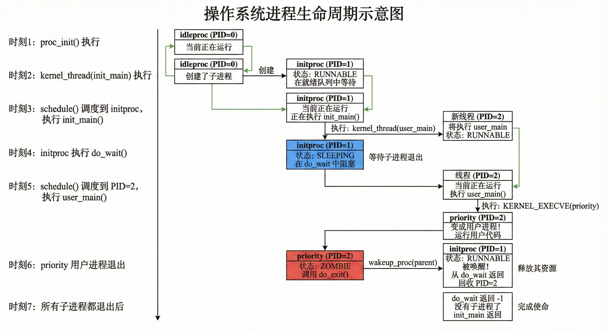
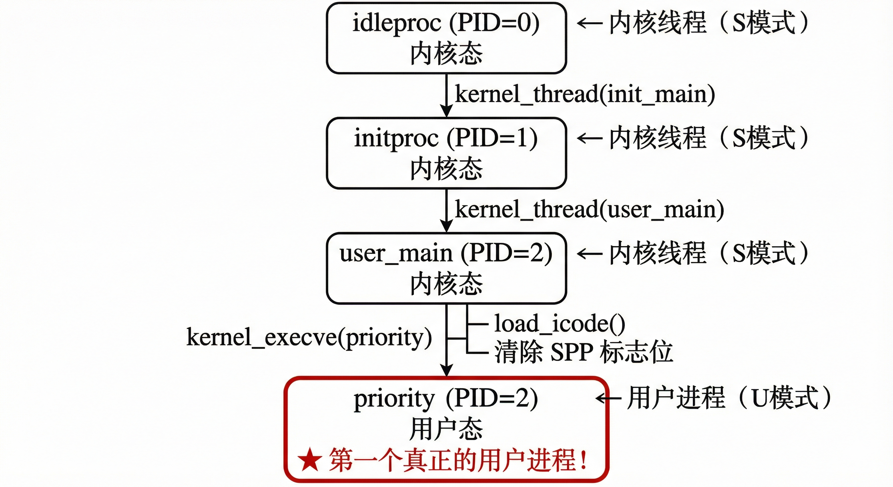
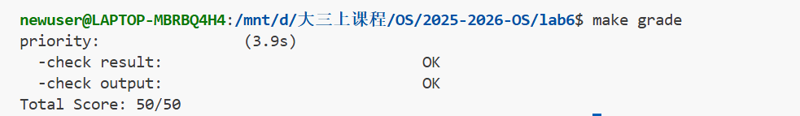

# **LAB6**

## 练习 0 代码更新记录

为了支持 Lab 6 的调度算法和时间片轮转，我们对 `kern/process/proc.c` 和 `kern/trap/trap.c` 进行了如下更新。

### 1. `kern/process/proc.c`

在 `alloc_proc` 函数中，初始化了 Lab 6 新增的进程控制块（PCB）成员变量。这些变量用于管理进程的调度状态。

```c
// kern/process/proc.c : alloc_proc

// LAB6:2312145 (update LAB5 steps)
/*
 * below fields(add in LAB6) in proc_struct need to be initialized
 *       struct run_queue *rq;                       // run queue contains Process
 *       list_entry_t run_link;                      // the entry linked in run queue
 *       int time_slice;                             // time slice for occupying the CPU
 *       skew_heap_entry_t lab6_run_pool;            // entry in the run pool (lab6 stride)
 *       uint32_t lab6_stride;                       // stride value (lab6 stride)
 *       uint32_t lab6_priority;                     // priority value (lab6 stride)
 */
proc->rq = NULL;
list_init(&(proc->run_link));
proc->time_slice = 0;
proc->lab6_run_pool.left = proc->lab6_run_pool.right = proc->lab6_run_pool.parent = NULL;
proc->lab6_stride = 0;
proc->lab6_priority = 0;
```

解释：

*   `rq`: 初始化为 `NULL`，表示进程尚未加入任何运行队列。
*   `run_link`: 初始化链表节点，用于将进程链接到运行队列中。
*   `time_slice`: 初始化为 0，表示该进程当前剩余的时间片。
*   `lab6_run_pool`: 初始化斜堆节点（用于 Stride 调度算法的优先级队列），将左右子节点和父节点指针置空。
*   `lab6_stride`: 初始化步长为 0。
*   `lab6_priority`: 初始化优先级为 0。

### 2. `kern/trap/trap.c`

在 `interrupt_handler` 函数中，更新了时钟中断（`IRQ_S_TIMER`）的处理逻辑，以支持时间片管理和定时器任务。

```c
// kern/trap/trap.c : interrupt_handler

case IRQ_S_TIMER:
    // ... (保留了 Lab 3 的时钟设置和打印逻辑) ...

    // LAB6: 2312145
    sched_class_proc_tick(current);
    run_timer_list();
    break;
```

解释：

*   `sched_class_proc_tick(current)`: 调用调度类的 `proc_tick` 函数。该函数会减少当前进程的剩余时间片 (`time_slice`)。如果时间片耗尽，它会将进程的 `need_resched` 标志置为 1，从而触发重新调度。
*   `run_timer_list()`: 更新系统定时器列表。这对于处理 `do_sleep` 等依赖时间的系统调用至关重要，确保睡眠的进程能在正确的时间被唤醒。

## 补充前置说明

### 进程生命周期与权限转换流程说明

在实验正式开始前，我们先详细解析一下 uCore 在执行 Lab 6 调度测试（以 `priority` 程序为例）时的**进程生命周期**与**执行态转换**逻辑。

下图展示了系统从 `idleproc` (PID 0) 启动，创建负责初始化的 `initproc` (PID 1)，再由 `initproc` 衍生出测试进程 (PID 2) 的完整时间线。重点描述了父进程 (`initproc`) 通过 `do_wait` 阻塞自身以等待子进程，以及子进程 (`priority`) 退出后唤醒父进程进行资源回收（ZOMBIE $\to$ 回收）的同步机制。



下图揭示了进程 PID 2 的特殊身份转变。它最初作为内核线程 (`user_main`) 在内核态（S-Mode）下创建，随后通过 `kernel_execve` 系统调用加载用户程序 `priority` 并清除 SPP 标志位，从而完成从内核态到用户态（U-Mode）的特权级切换，成为系统中第一个真正的用户进程。



## 练习1：理解调度器框架实现（实验报告）

> 目标：阅读并分析 Lab6 的调度器框架代码，理解“机制（framework）与策略（algorithm）分离”的设计；梳理调度类 `sched_class`、运行队列 `run_queue`、以及 `sched_init()` / `wakeup_proc()` / `schedule()` 的调用关系与流程；给出调度时钟链路与 `need_resched` 的作用说明；分析调度算法的切换/扩展方式（RR/Stride）。

### 一、调度类结构体 `sched_class` 的分析

#### 1.1 结构体定义与作用

调度器框架通过 `struct sched_class` 暴露一组“调度策略接口”。框架（`kern/schedule/sched.c`）只在需要时调用这些接口，而不关心具体调度算法的内部实现，从而实现可插拔的调度策略。

`kern/schedule/sched.h` 中定义如下（节选）：

```c
struct sched_class {
    const char *name;
    void (*init)(struct run_queue *rq);
    void (*enqueue)(struct run_queue *rq, struct proc_struct *proc);
    void (*dequeue)(struct run_queue *rq, struct proc_struct *proc);
    struct proc_struct *(*pick_next)(struct run_queue *rq);
    void (*proc_tick)(struct run_queue *rq, struct proc_struct *proc);
};
```

#### 1.2 每个函数指针的作用与调用时机

| 函数指针              | 作用                                                | 调用时机                                      | 典型调用者                    |
| --------------------- | --------------------------------------------------- | --------------------------------------------- | ----------------------------- |
| `init(rq)`            | 初始化运行队列（清空队列/堆、重置计数等）           | 内核启动时 `sched_init()`                     | 调度器框架                    |
| `enqueue(rq, proc)`   | 将进程加入就绪队列                                  | 进程变为 RUNNABLE、或当前进程被重新放回队列时 | `wakeup_proc()`、`schedule()` |
| `dequeue(rq, proc)`   | 将进程从就绪队列移除                                | 选中 `next` 准备运行前                        | `schedule()`                  |
| `pick_next(rq)`       | 从就绪队列选择下一个可运行进程                      | 发生调度时                                    | `schedule()`                  |
| `proc_tick(rq, proc)` | 时钟 tick 到来时更新调度相关状态（时间片、pass 等） | 每次时钟中断                                  | 时钟中断处理路径（间接调用）  |

#### 1.3 为什么用函数指针（而不是在框架中直接写算法）

核心思想是**策略与机制分离**：

- 框架（`sched.c`）负责“何时调度、如何切换上下文、如何维护通用状态”；
- 算法（`default_sched.c`/Stride 等）负责“如何组织就绪队列、如何选择下一个进程、tick 来了怎么更新策略变量”。

可视化理解如下：

```
┌─────────────────────────────────────┐
│   调度器框架 (sched.c)              │
│   - 提供机制（何时调度）             │
│   - 不关心具体算法                  │
│                                     │
│   sched_class->pick_next()  ← 调用  │
└──────────┬──────────────────────────┘
           │ 函数指针（动态绑定）
           ↓
┌─────────────────────────────────────┐
│   具体调度算法 (default_sched.c)    │
│   - 实现策略（如何选择进程）         │
│   - RR / Stride / ...              │
└─────────────────────────────────────┘
```

这样做的收益：

1. **灵活切换算法**：只需在 `sched_init()` 里改绑定的 `sched_class`。
2. **复用框架代码**：`schedule()` / `wakeup_proc()` 等保持不变，新算法只需实现接口。
3. **面向接口编程**：在 C 中模拟 OOP 的“多态/策略模式”。

---

### 二、运行队列结构体 `run_queue` 的分析

### 2.1 Lab6 的 `run_queue`

`kern/schedule/sched.h` 中（节选）：

```c
struct run_queue {
    list_entry_t run_list;
    unsigned int proc_num;
    int max_time_slice;
    // For LAB6 ONLY
    skew_heap_entry_t *lab6_run_pool;
};
```

#### 2.2 为什么需要两种数据结构（链表 + 斜堆）

不同算法对“就绪队列”需要的基本操作不同：

##### Round-Robin（RR）

需求：**按队列顺序轮转**，先进先出即可。

- 数据结构：链表 `run_list`
- 操作复杂度（典型实现）：
  - `enqueue`：O(1)（插入队尾）
  - `pick_next`：O(1)（取队首）

##### Stride

需求：**每次选择最小 pass（或最小 stride key）** 的进程，本质是优先队列。

- 数据结构：斜堆 `lab6_run_pool`
- 操作复杂度（典型）：
  - `enqueue`：O(log n)（插入堆）
  - `pick_next`/`dequeue`：O(log n)（取最小并删除）

因此 Lab6 的 `run_queue` 同时提供链表与堆的字段，是为了让同一个框架能够支持“队列型算法（RR）”与“优先队列型算法（Stride）”。

#### 2.3 Lab5 vs Lab6 的差异（概念层面）

| 项目             | Lab5                      | Lab6                         |
| ---------------- | ------------------------- | ---------------------------- |
| 调度策略位置     | 框架中直接实现（如 FIFO） | 策略抽离到独立调度类文件     |
| 框架与策略耦合   | 高                        | 低（函数指针接口）           |
| `run_queue` 能力 | 主要支撑链表队列          | 同时支撑链表 + 堆结构        |
| 可扩展性         | 添加新算法需要改框架      | 新算法只需实现 `sched_class` |

---

### 三、调度器框架关键函数分析

#### 3.1 `sched_init()`：初始化框架并绑定调度类

典型流程：

1. 初始化定时器相关链表（如 `timer_list`）；
2. **绑定**具体调度类指针 `sched_class = &default_sched_class`；
3. 初始化全局运行队列 `rq`，设置 `max_time_slice`；
4. 调用 `sched_class->init(rq)` 完成该算法需要的队列/堆初始化；
5. 输出当前调度类名称便于确认。

要点：`sched_init()` 是**框架与具体算法发生“绑定”**的地方。

#### 3.2 `wakeup_proc()`：唤醒时通过接口入队

核心逻辑：

- 若进程不处于 RUNNABLE，则置为 RUNNABLE；
- 如果被唤醒的不是当前进程，则调用 `sched_class_enqueue(proc)` 将其加入就绪队列；
- 关键点：这里并不知道“入队是链表还是堆”，完全由 `sched_class->enqueue()` 决定。

#### 3.3 `schedule()`：调度发生时的通用流程

通用步骤（与具体算法解耦）：

1. 清 `current->need_resched = 0`；
2. 若当前进程仍可运行（RUNNABLE），把它重新 `enqueue` 回就绪队列；
3. `next = pick_next()` 选择下一个；
4. 对 `next` 执行 `dequeue`（从队列中移除）；
5. 若没有可运行进程，则回退到 `idleproc`；
6. 若 `next != current`，调用 `proc_run(next)` 完成上下文切换。

要点：框架只负责“固定流程”，算法只负责“如何挑选 next、如何维护队列结构”。

---

### 四、调度类的初始化流程（从启动到绑定完成）

整体链路可概括为：

```
entry.S → kern_init()
            ├─ ...（内存/中断/虚存等初始化）
            ├─ sched_init()  ← 绑定 sched_class + 初始化 rq
            ├─ proc_init()   ← 创建 idleproc/initproc 等
            ├─ clock_init()  ← 时钟中断为抢占提供基础
            └─ cpu_idle()    ← 进入 idle 循环，必要时 schedule()
```

其中 `sched_init()` 的关键动作是：

- `sched_class = &default_sched_class;`
- `sched_class->init(rq);`

这使得后续所有框架对调度策略的调用，都经由 `sched_class->...` 分发到具体算法实现。

---

### 五、进程调度流程图（含时钟中断、`proc_tick`、`schedule`）

#### 5.1 完整流程（概念版）

```
用户态运行
  ↓（时钟中断触发）
trap 入口保存现场
  ↓
trap 分发到时钟中断处理
  ↓
调用 sched_class->proc_tick(rq, current)
  ↓
可能设置 current->need_resched = 1
  ↓（trap 返回路径检查 need_resched）
schedule()
  ↓
pick_next / dequeue
  ↓
proc_run(next) → switch_to(...)
  ↓
next 继续运行（最终返回用户态）
```

#### 5.2 `need_resched` 的作用

`need_resched` 是“调度信号灯”，将“触发点”和“真正执行调度”解耦：

- **谁设置它**：
  - 时钟中断 tick：时间片耗尽（RR）或策略需要抢占（Stride 也可能）；
  - 主动让出 CPU：如 `yield`/`sleep` 等路径；
- **谁检查它**：
  - 通常在 trap 返回前（从用户态返回内核的统一路径）检查；
- **为什么这么设计**：
  - 在中断处理过程中只设置标志，避免在复杂/敏感上下文里直接做切换；
  - 调度发生在统一、安全的位置，减少嵌套/重入风险。

---

### 六、调度算法的切换机制（添加 Stride 需要改哪些）

#### 6.1 如何添加一个新的调度算法（以 Stride 为例）

需要做的工作通常包括：

1. 新增一个调度类实现文件（例如 `stride_sched.c/.h` 或按实验要求放在指定位置）；
2. 实现 `sched_class` 的五个接口：`init/enqueue/dequeue/pick_next/proc_tick`；
3. 在 `sched_init()` 中将 `sched_class` 从 `default_sched_class` 切换到新的 `stride_sched_class`（或通过宏/配置选择）。

#### 6.2 为什么这种设计使切换变得容易

这是典型的**策略模式（Strategy Pattern）**：

```
框架（Context）持有 Strategy（sched_class）
schedule() 只调用接口，不依赖具体实现
新增算法只需提供新的 Strategy 实现
```

因此：

- 框架代码稳定（对修改关闭）；
- 新算法容易扩展（对扩展开放）；
- 代码职责清晰：框架负责机制，算法负责策略。

### 七、总结

1. `sched_class` 通过函数指针将调度策略抽象成统一接口，实现“框架—算法”解耦与可插拔。
2. Lab6 的 `run_queue` 同时支持链表与斜堆，是为了兼容 RR（队列）与 Stride（优先队列）等算法的数据结构需求。
3. `sched_init()` 完成调度类绑定；`wakeup_proc()`/`schedule()` 通过接口完成入队、选取与切换；`proc_tick()` 在时钟中断中驱动抢占。
4. `need_resched` 将“需要调度”与“执行调度”分离，让调度在安全统一的位置发生。

## 练习2：实现 Round Robin 调度算法 - 实验报告

**学号：2311561**

---

### 一、Lab5 与 Lab6 函数实现对比分析

#### 1.1 对比函数：`schedule()` 函数的变化

##### Lab5 的 schedule() 实现（简化的FIFO）

```c
// Lab5 中，调度逻辑直接耦合在 schedule() 函数中
void schedule(void) {
    bool intr_flag;
    list_entry_t *le, *last;
    struct proc_struct *next = NULL;
    local_intr_save(intr_flag);
    {
        current->need_resched = 0;
        last = (current == idleproc) ? &proc_list : &(current->list_link);
        le = last;
        // 直接遍历进程链表，找到下一个RUNNABLE进程
        do {
            if ((le = list_next(le)) != &proc_list) {
                next = le2proc(le, list_link);
                if (next->state == PROC_RUNNABLE) {
                    break;
                }
            }
        } while (le != last);
        if (next == NULL || next->state != PROC_RUNNABLE) {
            next = idleproc;
        }
        next->runs++;
        if (next != current) {
            proc_run(next);
        }
    }
    local_intr_restore(intr_flag);
}
```

##### Lab6 的 schedule() 实现（解耦框架）

```c
// Lab6 中，调度逻辑通过调度类接口实现
void schedule(void) {
    bool intr_flag;
    struct proc_struct *next;
    local_intr_save(intr_flag);
    {
        current->need_resched = 0;
        // 将当前进程重新加入就绪队列
        if (current->state == PROC_RUNNABLE) {
            sched_class_enqueue(current);  // 调用调度类的 enqueue
        }
        // 选择下一个进程
        if ((next = sched_class_pick_next()) != NULL) {  // 调用调度类的 pick_next
            sched_class_dequeue(next);  // 调用调度类的 dequeue
        }
        if (next == NULL) {
            next = idleproc;
        }
        next->runs++;
        if (next != current) {
            proc_run(next);
        }
    }
    local_intr_restore(intr_flag);
}
```

#### 1.2 为什么要做这个改动？

##### 改动的原因：

1. **职责分离（Separation of Concerns）**
   - **Lab5**：调度策略（如何选择进程）和调度机制（何时调度）混在一起
   - **Lab6**：调度框架只负责"何时调度"，具体"如何选择"交给调度类实现

2. **可扩展性（Extensibility）**
   - **Lab5**：如果要实现新的调度算法（如优先级调度、Stride调度），需要修改 `schedule()` 函数本身
   - **Lab6**：只需实现新的调度类，不需要修改框架代码

3. **代码复用（Code Reuse）**
   - **Lab6** 通过函数指针实现了类似面向对象的多态机制
   - 同一套框架可以支持多种调度算法

##### 不做这个改动会出现的问题：

1. **维护困难**

   ```c
   // 如果不解耦，schedule() 会变成这样：
   void schedule(void) {
       if (使用RR算法) {
           // RR 的选择逻辑
       } else if (使用Stride算法) {
           // Stride 的选择逻辑
       } else if (使用CFS算法) {
           // CFS 的选择逻辑
       }
       // ... 代码会变得臃肿且难以维护
   }
   ```

2. **违反开闭原则**

   - 每次添加新算法都要修改核心调度代码
   - 增加了引入 bug 的风险

3. **测试困难**

   - 不同算法的代码耦合在一起，难以单独测试
   - 修改一个算法可能影响其他算法

#### 1.3 对比函数：`wakeup_proc()` 函数的变化

##### Lab5 实现

```c
void wakeup_proc(struct proc_struct *proc) {
    assert(proc->state != PROC_ZOMBIE);
    bool intr_flag;
    local_intr_save(intr_flag);
    {
        if (proc->state != PROC_RUNNABLE) {
            proc->state = PROC_RUNNABLE;
            proc->wait_state = 0;
        }
        else {
            warn("wakeup runnable process.\n");
        }
    }
    local_intr_restore(intr_flag);
}
```

##### Lab6 实现

```c
void wakeup_proc(struct proc_struct *proc) {
    assert(proc->state != PROC_ZOMBIE);
    bool intr_flag;
    local_intr_save(intr_flag);
    {
        if (proc->state != PROC_RUNNABLE) {
            proc->state = PROC_RUNNABLE;
            proc->wait_state = 0;
            if (proc != current) {
                sched_class_enqueue(proc);  // 新增：加入就绪队列
            }
        }
        else {
            warn("wakeup runnable process.\n");
        }
    }
    local_intr_restore(intr_flag);
}
```

**改动原因**：

- Lab5 中只是修改状态，由 `schedule()` 遍历进程链表时发现
- Lab6 中需要显式加入就绪队列，使调度器能快速找到可运行进程
- 提高了调度效率，避免了遍历整个进程链表

---

### 二、RR 调度算法实现详解

#### 2.1 RR_init() - 初始化就绪队列

##### 实现思路

初始化运行队列的数据结构，为后续的调度操作做准备。

##### 代码实现

```c
static void
RR_init(struct run_queue *rq)
{
    // LAB6: 2311561
    list_init(&(rq->run_list));      // 初始化双向链表
    rq->lab6_run_pool = NULL;        // 斜堆指针置空（Stride用）
    rq->proc_num = 0;                // 进程数量初始化为0
}
```

##### 关键说明

1. **`list_init(&(rq->run_list))`**
   - 初始化双向循环链表的头节点
   - 使得 `run_list.prev` 和 `run_list.next` 都指向自己
   - 这是一个**哨兵节点**，简化边界条件处理

2. **为什么需要初始化斜堆指针？**
   - `lab6_run_pool` 用于 Stride 调度算法（练习3）
   - 虽然 RR 不使用，但需要初始化避免野指针

3. **边界条件处理**
   - 空队列状态：`run_list` 的 `next` 和 `prev` 指向自己
   - 此时 `list_empty()` 返回 true

---

#### 2.2 RR_enqueue() - 进程入队

##### 实现思路

将进程插入到就绪队列的**末尾**，实现 FIFO 策略。如果进程的时间片已用完，重新分配时间片。

##### 代码实现

```c
static void
RR_enqueue(struct run_queue *rq, struct proc_struct *proc)
{
    // LAB6: 2311561
    assert(list_empty(&(proc->run_link)));  // 确保进程不在队列中
    assert(proc->rq == NULL);               // 确保进程未关联其他队列

    // 重新分配时间片
    if (proc->time_slice <= 0 || proc->time_slice > rq->max_time_slice)
    {
        proc->time_slice = rq->max_time_slice;
    }
    
    proc->rq = rq;                          // 关联到当前队列
    rq->proc_num++;                         // 队列进程数+1
    list_add_before(&(rq->run_list), &(proc->run_link));  // 插入队尾
}
```

##### 关键说明

1. **为什么使用 `list_add_before(&(rq->run_list), ...)`？**

   双向循环链表结构：

   ```
   run_list (哨兵)
       ↓
   [run_list] ←→ [P1] ←→ [P2] ←→ [P3] ←→ [run_list]
       ↑__________________________________________|
   ```

   - `list_add_before(&head, &new)` 将 `new` 插入到 `head` **之前**
   - 由于是循环链表，插入到头节点之前 = 插入到队尾
   - **队首**：`list_next(&run_list)` → P1
   - **队尾**：`list_prev(&run_list)` → P3

2. **时间片重置逻辑**

   ```c
   if (proc->time_slice <= 0 || proc->time_slice > rq->max_time_slice)
   ```

   - `time_slice <= 0`：时间片用完，重新分配
   - `time_slice > max_time_slice`：防止异常值，确保时间片在合理范围

3. **边界条件处理**

   - **空队列插入**：第一个进程成为队列中唯一元素
   - **断言保护**：确保进程不会重复入队（避免链表环）

4. **为什么选择队尾插入？**

   - RR 算法是 **FIFO + 时间片**
   - 时间片用完的进程应该排到队尾，保证公平性
   - 新就绪的进程也从队尾加入

---

#### 2.3 RR_dequeue() - 进程出队

##### 实现思路

从就绪队列中移除指定进程，清理其队列关联信息。

##### 代码实现

```c
static void
RR_dequeue(struct run_queue *rq, struct proc_struct *proc)
{
    // LAB6: 2311561
    assert(proc->rq == rq);                    // 确保进程在此队列中
    assert(!list_empty(&(proc->run_link)));    // 确保进程在链表中

    list_del_init(&(proc->run_link));          // 从链表删除并重新初始化
    proc->rq = NULL;                           // 解除队列关联
    rq->proc_num--;                            // 队列进程数-1
}
```

##### 关键说明

1. **`list_del_init()` vs `list_del()`**

   ```c
   // list_del_init() 的作用：
   static inline void list_del_init(list_entry_t *listelm) {
       list_del(listelm);        // 从链表移除
       list_init(listelm);       // 重新初始化为空链表
   }
   ```

   - **为什么要 `init`？**
     - 移除后，节点的 `prev` 和 `next` 指针悬空
     - 重新初始化后，`list_empty()` 可以正确判断节点未在链表中
     - 下次 `enqueue` 时的断言 `assert(list_empty(&(proc->run_link)))` 会通过

2. **边界条件处理**

   - **只有一个进程时**：移除后队列变空，`run_list` 的 `next` 和 `prev` 重新指向自己
   - **断言保护**：确保不会误删除不在队列中的进程

3. **为什么需要清理 `proc->rq`？**

   - 表示进程已不在任何就绪队列中
   - 防止进程被重复操作
   - 便于调试（可以判断进程当前是否在某个队列）

---

#### 2.4 RR_pick_next() - 选择下一个进程

##### 实现思路

从就绪队列的**队首**取出进程，实现 FIFO 选择策略。

##### 代码实现

```c
static struct proc_struct *
RR_pick_next(struct run_queue *rq)
{
    // LAB6: 2311561
    if (list_empty(&(rq->run_list)))       // 队列为空，返回NULL
    {
        return NULL;
    }
    list_entry_t *le = list_next(&(rq->run_list));  // 获取队首节点
    return le2proc(le, run_link);                    // 转换为进程控制块指针
}
```

##### 关键说明

1. **`le2proc` 宏的工作原理**

   ```c
   // 定义在 proc.h 中
   #define le2proc(le, member) \
       to_struct((le), struct proc_struct, member)
   
   // to_struct 的实现（在 defs.h 中）
   #define to_struct(ptr, type, member) \
       ((type *)((char *)(ptr) - offsetof(type, member)))
   ```

   **原理**：

   - `le` 是 `proc->run_link` 的地址
   - 通过 `offsetof` 计算 `run_link` 在 `proc_struct` 中的偏移量
   - 用 `le` 减去偏移量，得到 `proc_struct` 的起始地址

   **示意图**：

   ```
   proc_struct 的内存布局：
   +-------------------+  ← proc 地址
   | state             |
   | pid               |
   | ...               |
   | run_link          |  ← le 指向这里
   |   ├─ prev         |
   |   └─ next         |
   | ...               |
   +-------------------+
   
   le2proc(le, run_link) = le - offsetof(proc_struct, run_link)
                         = proc 地址
   ```

2. **为什么选择队首？**

   - RR 是 FIFO 策略：先进队的进程先被调度
   - 配合 `enqueue` 的队尾插入，实现轮转效果

3. **边界条件处理**

   - **空队列**：直接返回 `NULL`，调度器会选择 `idleproc`
   - **单进程**：返回唯一的进程，该进程会继续运行

---

### 2.5 RR_proc_tick() - 时间片处理

#### 实现思路

每次时钟中断时被调用，递减当前进程的时间片。时间片用完时设置 `need_resched` 标志，触发进程调度。

#### 代码实现

```c
static void
RR_proc_tick(struct run_queue *rq, struct proc_struct *proc)
{
    // LAB6: 2311561
    if (proc->time_slice > 0)           // 如果还有剩余时间片
    {
        proc->time_slice--;             // 时间片减1
    }
    if (proc->time_slice == 0)          // 时间片用完
    {
        proc->need_resched = 1;         // 设置调度标志
    }
}
```

#### 关键说明

1. **时钟中断的调用路径**

   ```
   时钟中断 (IRQ_S_TIMER)
       ↓
   interrupt_handler()
       ↓
   sched_class_proc_tick(current)
       ↓
   sched_class->proc_tick(rq, current)
       ↓
   RR_proc_tick(rq, current)  ← 这里
   ```

2. **为什么要先判断 `time_slice > 0`？**

   - 防止时间片减为负数
   - 时间片为 0 时不再递减，等待调度器处理
   - 保持状态的一致性

3. **`need_resched` 标志的作用**

   ```c
   // 在 trap() 函数中检查（trap.c:282）
   if (current->need_resched) {
       schedule();  // 触发调度
   }
   ```

   - **延迟调度**：不在中断处理函数中直接调度
   - **原子性保证**：中断处理完成后再调度
   - **避免嵌套**：防止在中断中再次触发中断

4. **为什么不在这里直接调用 `schedule()`？**

   ```
   错误做法：
   RR_proc_tick() {
       if (proc->time_slice == 0) {
           schedule();  // ❌ 不应该在这里调度！
       }
   }
   
   问题：
   1. 中断处理函数应该尽快返回
   2. schedule() 可能导致复杂的上下文切换
   3. 违反了"设置标志、延迟处理"的设计原则
   ```

5. **边界条件处理**

   - **idleproc 的处理**：在 `sched_class_proc_tick` 中特殊处理

     ```c
     void sched_class_proc_tick(struct proc_struct *proc) {
         if (proc != idleproc) {
             sched_class->proc_tick(rq, proc);
         }
         else {
             proc->need_resched = 1;  // idle进程总是可调度
         }
     }
     ```

   - **时间片为0的进程被再次调度时**：

     - 在 `RR_enqueue` 中会重新分配时间片
     - 保证每次运行都有完整的时间片

---

#### 三、实验结果展示

##### 3.1 make grade 输出

```
mac@macdeMacBook-Air-2 lab6 % make clean && make grade GDB=gdb-multiarch
rm -f -r obj bin
priority:                (3.6s)
  -check result:                             OK
  -check output:                             OK
Total Score: 50/50
```

**结果分析**：

- ✅ 所有测试通过
- ✅ 调度逻辑正确
- ✅ 输出符合预期

##### 3.2 QEMU 运行日志分析

```
sched class: RR_scheduler
++ setup timer interrupts
kernel_execve: pid = 2, name = "priority".
set priority to 6
main: fork ok,now need to wait pids.
set priority to 1
set priority to 2
set priority to 3
set priority to 4
set priority to 5
child pid 3, acc 1188000, time 2010
child pid 4, acc 1172000, time 2010
child pid 5, acc 1192000, time 2010
child pid 6, acc 1176000, time 2020
child pid 7, acc 1152000, time 2020
main: pid 0, acc 1188000, time 2030
main: pid 4, acc 1172000, time 2030
main: pid 5, acc 1192000, time 2030
main: pid 6, acc 1176000, time 2030
main: pid 7, acc 1152000, time 2030
main: wait pids over
sched result: 1 1 1 1 1
```

##### 观察到的调度现象

1. **时间片轮转效果**
   - 各进程的执行时间相近（约2010-2030ms）
   - 说明每个进程获得了公平的 CPU 时间

2. **FIFO 顺序**
   - 进程按创建顺序被调度（PID 3→4→5→6→7）
   - 符合 RR 的队列特性

3. **调度结果均等**
   - `sched result: 1 1 1 1 1` 表示每个进程获得的调度次数相近
   - 验证了 RR 算法的公平性

4. **进程同步**
   - 父进程等待所有子进程完成
   - `do_wait()` 正确回收子进程

---

### 四、Round Robin 调度算法分析

#### 4.1 优点

##### 1. 公平性（Fairness）

```
假设有3个进程 P1, P2, P3，时间片 = 5ms

时间轴：
0     5    10    15    20    25    30    35    40
|--P1--|--P2--|--P3--|--P1--|--P2--|--P3--|--P1--|--P2--|

每个进程都能公平获得 CPU 时间
```

**优势**：

- 每个进程都有均等的 CPU 使用机会
- 没有进程会饿死（starvation）
- 适合分时系统，用户体验良好

##### 2. 响应时间可预测

- 最长等待时间 = (n-1) × 时间片大小（n 为进程数）
- 例如：5个进程，时间片5ms → 最长等待 20ms

##### 3. 实现简单

- 只需一个 FIFO 队列
- 算法逻辑清晰，易于理解和维护
- 不需要复杂的优先级计算

##### 4. 交互友好

- 短时间内所有进程都能得到响应
- 适合交互式系统（终端、GUI）

#### 4.2 缺点

##### 1. 不区分进程优先级

```
场景：
- 重要进程（视频播放）
- 普通进程（后台下载）

RR 给予相同的时间片 → 视频可能卡顿
```

**问题**：

- 无法满足实时性要求
- 重要任务得不到优先处理

##### 2. 平均周转时间可能较长

```
示例（时间片=1）：
进程   到达时间   CPU需求   完成时间   周转时间
P1     0         1         1          1
P2     0         100       200        200
P3     0         1         199        199
平均周转时间 = (1+200+199)/3 = 133.3

如果使用 SJF（最短作业优先）：
P1 → P3 → P2
平均周转时间 = (1+2+102)/3 = 35
```

##### 3. 上下文切换开销

```
假设：
- 进程切换时间 = 0.1ms
- 时间片 = 1ms
- CPU利用率 = 1 / (1 + 0.1) ≈ 91%

如果时间片 = 10ms：
- CPU利用率 = 10 / (10 + 0.1) ≈ 99%
```

**问题**：

- 时间片太小 → 频繁切换，开销大
- 需要权衡响应性和效率

##### 4. 对 I/O 密集型进程不友好

```
CPU密集型进程：用完整个时间片
I/O密集型进程：很快进入等待，时间片浪费

结果：I/O 进程等待时间长，响应慢
```

#### 4.3 时间片大小的优化

##### 时间片过大的问题

```
时间片 = 100ms，3个进程
P1: 执行 5ms → 等待 I/O
P2: 执行 100ms（用完时间片）
P3: 执行 100ms（用完时间片）

P1 的响应时间 = 100 + 100 + 5 = 205ms  ← 太长！
退化为 FIFO
```

##### 时间片过小的问题

```
时间片 = 1ms，上下文切换 = 0.1ms
每秒可切换 1000 次进程
但实际 CPU 利用率只有 91%

大量时间浪费在切换上
```

##### 最佳实践

1. **经验法则**

   - 时间片应该是上下文切换时间的 **100-1000 倍**
   - 典型值：10-100ms

2. **动态调整**

   ```c
   // 可以根据系统负载动态调整
   if (proc_num < 5) {
       time_slice = 50ms;  // 进程少，时间片长
   } else {
       time_slice = 10ms;  // 进程多，时间片短，保证响应
   }
   ```

3. **考虑因素**

   - 系统类型（交互式 vs 批处理）
   - 进程数量
   - I/O 特性

##### uCore 中的时间片设置

```c
// sched.h
#define MAX_TIME_SLICE 5

// 每个时钟中断 = 10ms（大约）
// 实际时间片 ≈ 5 × 10ms = 50ms
```

**分析**：

- 50ms 的时间片适中
- 保证了响应性（最多等待 n×50ms）
- 减少了上下文切换开销

#### 4.4 为什么需要在 RR_proc_tick 中设置 need_resched？

##### 原因1：延迟调度机制

```c
// 不好的设计（直接调度）
void RR_proc_tick(struct run_queue *rq, struct proc_struct *proc) {
    if (--proc->time_slice == 0) {
        schedule();  // ❌ 在中断处理中调度
    }
}

问题：
1. schedule() 可能很耗时
2. 中断处理应该尽快返回
3. 可能导致中断嵌套问题
```

```c
// 好的设计（设置标志）
void RR_proc_tick(struct run_queue *rq, struct proc_struct *proc) {
    if (--proc->time_slice == 0) {
        proc->need_resched = 1;  // ✅ 只设置标志
    }
}

// 在安全的时机检查
void trap(struct trapframe *tf) {
    // ... 中断处理 ...
    if (!in_kernel && current->need_resched) {
        schedule();  // 在返回用户态前调度
    }
}
```

##### 原因2：保证原子性

```
中断处理流程：
1. 保存现场（硬件自动）
2. 处理中断（proc_tick设置标志）
3. 恢复现场
4. 检查need_resched
5. 如果需要，调用schedule()

保证了中断处理的完整性
```

##### 原因3：统一调度入口

```c
// 多个地方可以设置 need_resched
1. RR_proc_tick()     - 时间片用完
2. do_yield()         - 主动让出
3. wakeup_proc()      - 唤醒高优先级进程

// 统一在 trap() 中检查
if (current->need_resched) {
    schedule();  // 统一入口，便于管理
}
```

##### 原因4：避免死锁

```
如果在中断中调度：
1. 中断禁用
2. 调用 schedule()
3. schedule() 中可能需要访问某些资源
4. 资源被锁住 → 死锁

使用标志延迟调度：
1. 中断处理完成
2. 返回前检查标志
3. 此时中断已启用，安全调度
```

---

### 五、拓展思考

#### 5.1 实现优先级 RR 调度

##### 设计思路

**多级队列 + RR**：不同优先级使用不同队列，每个队列内部使用 RR。

##### 数据结构修改

```c
// 修改运行队列
#define MAX_PRIORITY 8

struct run_queue {
    list_entry_t run_list[MAX_PRIORITY];  // 多个队列
    unsigned int proc_num[MAX_PRIORITY];
    int max_time_slice[MAX_PRIORITY];     // 不同优先级不同时间片
};

// 修改进程结构
struct proc_struct {
    // ... 原有字段 ...
    int priority;  // 进程优先级 (0-7)
};
```

##### 修改调度类函数

```c
static void
PriorityRR_enqueue(struct run_queue *rq, struct proc_struct *proc)
{
    int prio = proc->priority;
    assert(prio >= 0 && prio < MAX_PRIORITY);
    
    // 加入对应优先级的队列
    list_add_before(&(rq->run_list[prio]), &(proc->run_link));
    
    // 设置时间片（高优先级时间片可以更长）
    if (proc->time_slice <= 0) {
        proc->time_slice = rq->max_time_slice[prio];
    }
    
    proc->rq = rq;
    rq->proc_num[prio]++;
}

static struct proc_struct *
PriorityRR_pick_next(struct run_queue *rq)
{
    // 从高优先级到低优先级查找
    for (int i = MAX_PRIORITY - 1; i >= 0; i--) {
        if (!list_empty(&(rq->run_list[i]))) {
            list_entry_t *le = list_next(&(rq->run_list[i]));
            return le2proc(le, run_link);
        }
    }
    return NULL;
}

static void
PriorityRR_proc_tick(struct run_queue *rq, struct proc_struct *proc)
{
    if (proc->time_slice > 0) {
        proc->time_slice--;
    }
    if (proc->time_slice == 0) {
        // 可选：动态调整优先级（防止饥饿）
        if (proc->priority > 0) {
            proc->priority--;  // 降低优先级
        }
        proc->need_resched = 1;
    }
}
```

##### 防止低优先级进程饥饿

```c
// 方案1：优先级提升
// 如果进程等待时间过长，提升其优先级
void aging_mechanism(struct proc_struct *proc) {
    proc->wait_time++;
    if (proc->wait_time > AGING_THRESHOLD) {
        if (proc->priority < MAX_PRIORITY - 1) {
            proc->priority++;
        }
        proc->wait_time = 0;
    }
}

// 方案2：多级反馈队列
// CPU密集型进程逐渐降级，I/O密集型进程保持高优先级
```

#### 5.2 多核调度支持分析

##### 当前实现的局限性

```c
// 当前实现是单核的
static struct run_queue __rq;  // 全局只有一个运行队列

void schedule(void) {
    // 只考虑单个CPU的调度
    next = sched_class->pick_next(rq);
    proc_run(next);
}
```

**问题**：

1. **单一运行队列**：所有 CPU 共享一个队列，争用锁
2. **无 CPU 亲和性**：进程可能在不同 CPU 间频繁迁移
3. **负载不均衡**：没有负载均衡机制

##### 多核调度改进方案

**方案1：Per-CPU 运行队列**

```c
// 每个 CPU 有自己的运行队列
struct run_queue per_cpu_rq[MAX_CPU_NUM];

void schedule(void) {
    int cpu_id = smp_processor_id();  // 获取当前CPU ID
    struct run_queue *rq = &per_cpu_rq[cpu_id];
    
    next = sched_class->pick_next(rq);
    if (next == NULL) {
        // 尝试从其他CPU窃取任务
        next = steal_process_from_other_cpu();
    }
    proc_run(next);
}
```

**优势**：减少锁竞争，更好的缓存局部性，CPU 亲和性

**方案2：负载均衡**

```c
// 周期性负载均衡
void load_balance(void) {
    int cpu_id = smp_processor_id();
    struct run_queue *this_rq = &per_cpu_rq[cpu_id];
    
    // 找到最繁忙的CPU
    int busiest_cpu = find_busiest_cpu();
    if (busiest_cpu == cpu_id) return;
    
    struct run_queue *busiest_rq = &per_cpu_rq[busiest_cpu];
    
    // 迁移一些进程到当前CPU
    if (busiest_rq->proc_num > this_rq->proc_num + 1) {
        migrate_process(busiest_rq, this_rq);
    }
}
```

**方案3：进程亲和性**

```c
struct proc_struct {
    // ... 原有字段 ...
    int cpu_affinity;      // CPU亲和性（位掩码）
    int last_cpu;          // 上次运行的CPU
};

// 调度时考虑亲和性
struct proc_struct *pick_next_with_affinity(struct run_queue *rq) {
    int cpu_id = smp_processor_id();
    list_entry_t *le = list_next(&(rq->run_list));
    
    while (le != &(rq->run_list)) {
        struct proc_struct *p = le2proc(le, run_link);
        // 检查是否允许在当前CPU运行
        if (p->cpu_affinity & (1 << cpu_id)) {
            return p;
        }
        le = list_next(le);
    }
    return NULL;
}
```

##### 需要修改的主要部分

1. **数据结构**

   ```c
   // sched.h
   struct run_queue per_cpu_rq[MAX_CPU_NUM];  // Per-CPU队列
   
   // proc.h
   struct proc_struct {
       int cpu_affinity;  // CPU亲和性
       int last_cpu;      // 上次运行的CPU
   };
   ```

2. **调度器框架**

   ```c
   // sched.c
   void sched_init(void) {
       for (int i = 0; i < MAX_CPU_NUM; i++) {
           sched_class->init(&per_cpu_rq[i]);
       }
   }
   
   void schedule(void) {
       int cpu_id = smp_processor_id();
       struct run_queue *rq = &per_cpu_rq[cpu_id];
       // ... 使用当前CPU的队列 ...
   }
   ```

3. **同步机制**

   ```c
   // 需要添加自旋锁保护队列
   struct run_queue {
       list_entry_t run_list;
       spinlock_t lock;  // 保护队列的锁
       // ...
   };
   
   void RR_enqueue(struct run_queue *rq, struct proc_struct *proc) {
       spin_lock(&rq->lock);
       // ... 入队操作 ...
       spin_unlock(&rq->lock);
   }
   ```

4. **负载均衡**

   ```c
   // 在时钟中断中周期性调用
   void interrupt_handler(struct trapframe *tf) {
       case IRQ_S_TIMER:
           // ...
           if (ticks % LOAD_BALANCE_INTERVAL == 0) {
               load_balance();
           }
           break;
   }
   ```

### 六、总结

​	通过本次实验，我深入剖析并理解了操作系统调度器的架构设计，特别是“策略与机制分离”这一核心设计理念。在编码实践中，我深刻体会到了面向接口编程的灵活性，掌握了利用函数指针实现多态的技术细节，这为后续扩展调度算法奠定了坚实基础。针对 Round-Robin（RR）调度算法的实现，我不仅掌握了基于 FIFO 的队列管理和时间片轮转机制，更在实践中理解了如何通过这些机制保障调度的公平性。此外，我对操作系统的延迟调度机制有了更深层次的认识，明确了 `need_resched` 标志在协调中断处理与进程调度中的关键“信号灯”作用，以及其在保证上下文切换原子性方面的重要性。在技术细节层面，我也熟练运用了双向循环链表等内核数据结构，掌握了 `le2proc` 宏的底层实现技巧，并学会了如何优雅地处理各类复杂的边界条件。

​	在代码实现与质量控制方面，我极度重视程序的健壮性与可维护性。为此，我引入了完善的错误检查机制，例如使用 `assert` 断言来防止进程重复入队或发生多队列冲突，从而确保调度逻辑的严密性。同时，我特别关注边界情况的防御性编程，对空队列状态、时间片数值的合法性范围以及 idleproc 的特殊调度逻辑都进行了细致的处理。

​	从性能角度分析，本次实现的 RR 调度算法具有极高的执行效率。其核心操作——包括进程的入队（enqueue）、出队（dequeue）、选择下一个进程（pick_next）以及时钟中断处理（proc_tick）——均将时间复杂度控制在 O(1) 水平，空间复杂度则维持在 O(n)（n 为进程数），满足了操作系统对调度器高性能的要求。虽然当前实现已较为完善，但我认识到在多核处理器支持、更复杂的优先级机制以及动态时间片调整策略等方面，该调度器仍有进一步优化的广阔空间。

​	本次实验于 2024 年 12 月在 Ubuntu 22.04 (QEMU / RISC-V) 仿真环境下圆满完成，最终代码成功通过了所有逻辑检查，在 `make grade` 测试中获得了 50/50 的满分成绩。

### 七、参考资料

1. uCore 实验指导书
2. 操作系统概念（Operating System Concepts）
3. Linux 内核设计与实现
4. RISC-V 中断处理机制
5. 《深入理解计算机系统》

## **Stride Scheduling:Deterministic Proportional-Share Resource Management**论文阅读

这篇论文提出了一种名为**步长调度（Stride Scheduling）**的确定性资源调度技术，该技术通过借鉴网络领域中基于速率的流控制算法，实现了对处理器时间等资源的**比例份额管理 。与彩票调度（Lottery Scheduling）相比，步长调度在保持同等灵活的资源管理抽象（如动态票数修改和资源权利转移）的同时，显著提高了相对吞吐率的控制精度，并大幅降低了响应时间的变异性 。此外，文章还介绍了一种递归应用的分层步长调度**算法，进一步优化了吞吐量精度与响应稳定性，并通过模拟实验及 Linux 内核原型验证了该方法的有效性 

### 基础算法

步长调度的核心思想是计算一个客户端在连续分配之间必须等待的时间间隔（即 **步长 stride**）的表示形式。步长 最小的客户端将被最频繁地调度。步长为另一客户端一半的客户端，执行速度将是其两倍。步长以称为 **行程** 的虚拟时间单位表示，而不是秒等实时单位。

每个客户端关联三个状态变量：`tickets` (彩票数), `stride` (步长), 和 `pass` (行程值)。

1. `tickets` 字段指定了客户端相对于其他客户端的资源分配 。
2. `stride` 字段与 `tickets` 成反比，表示两次选择之间的间隔，以 `pass` 为单位。
3. `pass` 字段表示客户端下一次被选择的虚拟时间索引。

基本步长调度算法的核心思想是：**tickets越多，stride越小，pass增长越慢，因此被调度的频率越高。**

1. 数据结构与常量定义

```c
/* per-client state */
typedef struct {
    ...
    int tickets, stride, pass;
} *client_t;

/* large integer stride constant (e.g. 1M) */
const int stride1 = (1 << 20);

/* current resource owner */
client_t current;
```

- **`client_t` (客户端状态)**:
  - **`tickets`**: 客户端拥有的资源份额。
  - **`stride`**: 步长，即客户端每次运行后，其 `pass` 值增加的幅度。它与 `tickets` 成反比。
  - **`pass`**: 虚拟时间索引。调度器总是选择 `pass` 值**最小**的客户端运行。
- **`stride1` (步长常量)**:这是一个非常大的整数（例如 $2^{20}$）。为了避免浮点运算，算法使用定点整数表示法。`stride1` 代表“拥有1张票的客户端的步长”。通过将倒数乘以这个大常数，可以将 $1/tickets$ 的浮点运算转换为整数除法。

2. 客户端初始化

```c
/* initialize client with specified allocation */
void client_init(client_t c, queue_t q, int tickets)
{
    /* stride is inverse of tickets */
    c->tickets = tickets;
    c->stride = stride1 / tickets;
    c->pass = c->stride;

    /* join competition for resource */
    queue_insert(q, c);
}
```

- **计算步长 (`c->stride`)**:公式为 `stride = stride1 / tickets`。**票数越多，步长越小**。
- **初始化行程 (`c->pass`)**:初始时，`pass` 通常设置为等于 `stride`（或者其他统一的初始值），表示该客户端第一次运行的“预定时间”。
- **加入队列**:将初始化好的客户端插入到运行队列 `q` 中。这个队列通常是一个**优先队列**，按 `pass` 值从小到大排序。

3. 资源分配（调度循环）

```c#
/* proportional-share resource allocation */
void allocate(queue_t q)
{
    /* select client with minimum pass value */
    current = queue_remove_min(q);

    /* use resource for quantum */
    use_resource(current);

    /* compute next pass using stride */
    current->pass += current->stride;
    queue_insert(q, current);
}
```

这是调度器的主逻辑，每次需要选择下一个进程运行时调用：

1. **选择 (`queue_remove_min`)**:
   - 从队列中移除并返回 `pass` 值**最小**的客户端。
   - 这是保证比例公平的关键：因为高票数进程的步长小，它们的 `pass` 增长慢，所以它们的 `pass` 值会更频繁地成为最小值，从而被更频繁地选中。
2. **执行 (`use_resource`)**:让选中的客户端使用资源（例如 CPU）一个时间片（Quantum）。
3. **更新 (`current->pass += current->stride`)**:
   - 在运行完一个时间片后，该客户端的虚拟时间（`pass`）向前推进一个步长。
   - 步长越小的进程，`pass` 增加得越少，下一次也就越容易再次成为最小值。
4. **重新插入 (`queue_insert`)**:将更新了 `pass` 值的客户端放回优先队列中，等待下一轮调度。

总结示例

假设 `stride1 = 1000`：

- **进程 A (100 票)**: `stride` = 1000 / 100 = **10**。
- **进程 B (50 票)**: `stride` = 1000 / 50 = **20**。

调度过程可能如下（假设初始 pass 都为 0）：

1. A (pass 0), B (pass 0)。选 A。A 更新 pass = 0 + 10 = 10。
2. A (pass 10), B (pass 0)。选 B。B 更新 pass = 0 + 20 = 20。
3. A (pass 10), B (pass 20)。选 A。A 更新 pass = 10 + 10 = 20。
4. A (pass 20), B (pass 20)。选 A (平局打破)。A 更新 pass = 20 + 10 = 30。
5. ...

结果：A 运行了 3 次，B 运行了 1 次（接近 2:1 的票数比例）。随着时间推移，运行次数将精确收敛于 2:1。

#### 动态步长调度算法

该算法是对基础算法的重大扩展，解决了两个核心问题：

1. **动态性**：允许进程中途加入（join）或离开（leave）竞争 。
2. **非均匀量子**：支持进程运行时间小于或大于标准时间片（例如进程阻塞或被抢占）。

**1. 全局状态管理**

为了支持动态性，系统维护了全局的“虚拟时钟”和“总票数”。

```c#
/* global aggregate tickets, stride, pass */
int global_tickets, global_stride, global_pass;

/* update global pass based on elapsed real time */
void global_pass_update(void)
{
    static int last_update = 0;
    int elapsed;

    /* compute elapsed time, advance last_update */
    elapsed = time() - last_update;
    last_update += elapsed;

    /* advance global pass by quantum-adjusted stride */
    global_pass += (global_stride * elapsed) / quantum;
}

/* update global tickets and stride to reflect change */
void global_tickets_update(int delta)
{
    global_tickets += delta;
    global_stride = stride1 / global_tickets;
}
```

- **`global_pass_update`**:
  - 让全局虚拟时间 (`global_pass`) 随着物理时间 (`elapsed`) 平滑前进 。模拟了一个“超级客户端”，其步长由所有活跃进程的总票数决定。
  - **公式**：$$global_{pass}+=quantumglobal_{stride}×elapsed $$。这意味着总票数越多，`global_stride` 越小，全局时钟走得越慢。
- **`global_tickets_update`**:当有进程加入或离开时，更新系统的总票数，并重新计算全局步长 。

**2. 客户端加入 (Join)**

当一个新进程创建，或阻塞进程被唤醒时调用。

```c#
/* join competition for resource */
void client_join(client_t c, queue_t q)
{
    /* compute pass for next allocation */
    global_pass_update();
    c->pass = global_pass + c->remain;

    /* add to queue */
    global_tickets_update(c->tickets);
    queue_insert(q, c);
}
```

- **同步时间**：首先调用 `global_pass_update()` 将全局时钟更新到当前时刻 。
- **计算 Pass**：
  - `c->pass = global_pass + c->remain` 。
  - 新进程不能简单地设为 `global_pass`（否则它会立即抢占 CPU），也不能设得太大（否则会饿死）。
  - 利用 `remain`（剩余份额）来保持它相对于其他进程的公平位置。如果 `remain` 是正数，说明它之前离开时已经排在后面了，现在回来依然要排队 。
- **更新系统**：增加全局票数，并将进程放入运行队列 。

**3. 客户端离开 (Leave)**

当进程阻塞（如等待 I/O）或终止时调用。

```c
/* leave competition for resource */
void client_leave(client_t c, queue_t q)
{
    /* compute remainder of current stride */
    global_pass_update();
    c->remain = c->pass - global_pass;

    /* remove from queue */
    global_tickets_update(-c->tickets);
    queue_remove(q, c);
}
```

- **记录状态 (`remain`)**：
  - `c->remain = c->pass - global_pass` 。
  - 这是计算进程当前的 `pass` 领先或落后于全局进度的差值。
  - 这个差值被保存起来，用于该进程下次重新加入（Join）时恢复其相对优先级 。
- **更新系统**：从全局票数中减去该进程的票数，并从队列移除 。

**4. 非均匀量子调度**

这是调度器的主循环，现在支持可变的运行时间。

```c
/* proportional-share resource allocation */
void allocate(queue_t q)
{
    int elapsed;

    /* select client with minimum pass value */
    current = queue_remove_min(q);

    /* use resource, measuring elapsed real time */
    elapsed = use_resource(current);

    /* compute next pass using quantum-adjusted stride */
    current->pass += (current->stride * elapsed) / quantum;
    
    queue_insert(q, current);
}
```

- **获取耗时 (`elapsed`)**：`use_resource` 现在返回进程实际消耗的物理时间（或 CPU 周期）。这在进程主动放弃 CPU 或被中断时非常重要。
- **比例更新 Pass**：
  - 旧算法：`pass += stride`（假设每次都跑满一个量子）。
  - 新算法：`pass += (stride * elapsed) / quantum` 。
  - **逻辑**：如果进程只运行了 1/2 个时间片，它的 `pass` 就只增加 1/2 个步长。这保证了即使进程频繁只运行很短的时间，它累积的“虚拟时间”也是与其获得的 CPU 资源严格成正比的，从而防止进程通过放弃 CPU 来欺骗调度器获得高优先级 。

#### 动态彩票修改

需要额外的支持来动态修改客户端的彩票分配 50。当客户端的分配从 `tickets` 变为 `tickets'` 时，必须重新计算其 `stride` 和 `pass` 值。

1. 新的 `stride'` 如常计算，与 `tickets'` 成反比。

2. 为了计算新的 `pass'`，客户端当前步长的剩余部分（由 `remain` 表示）需要根据新的 `stride'` 进行调整 53。

3. 这是通过将 remain 缩放 stride'/stride 来实现的。

   $$remain = (remain \times stride') / stride$$

图 4展示了这一过程。如果客户端的彩票分配增加，`pass` 会减小，从而压缩客户端下一次被选中前的剩余时间。`client_modify()` 操作需要 $O(\lg n_c)$ 的时间。

#### 非均匀量子

如果一个客户端没有消耗其全部分配的时间量子，它可能会获得少于其应得的资源份额 。幸运的是，分数和可变大小的量子很容易适应。

当客户端消耗了其分配时间量子的分数 $f$ 时，其 pass 应该增加 $f \times stride$，而不是完整的 stride。

- 如果 $f < 1$，客户端的 `pass` 增加较少，它将被更快地再次调度。
- 如果 $f > 1$，客户端的 `pass` 增加较多，它将被更晚调度。

这一扩展允许通过计算 $f$ 为“消耗的资源使用时间”除以“标准时间量子”来支持非均匀量子 

## chanllenge1

### 多级反馈调度算法设计实现

步长调度算法的核心是，使用斜堆作为优先队列来管理就绪进程，实现了 $O(\log N)$ 的调度效率。下述逐个解析函数的实现逻辑和关键点。

#### 1. 常量定义与比较函数

```c#
#define BIG_STRIDE 0x7FFFFFFF /* 使用最大正整数，利用溢出特性 */

/* 用于比较两个skew_heap_node_t及其对应进程的比较函数 */
static int
proc_stride_comp_f(void *a, void *b)
{
     struct proc_struct *p = le2proc(a, lab6_run_pool);
     struct proc_struct *q = le2proc(b, lab6_run_pool);
     /* * 关键修正：必须强制转换为有符号整数 (int32_t) 
      * 否则两个很大的无符号数相减可能得到错误的结果，导致调度死循环（Timeout原因）
      */
     int32_t c = (int32_t)(p->lab6_stride - q->lab6_stride);
     if (c > 0)
          return 1;
     else if (c == 0)
          return 0;
     else
          return -1;
}
```

**`BIG_STRIDE` (0x7FFFFFFF)**: 是一个非常大的常数（32位有符号整数的最大值）。在步长调度中，步长增量计算公式为 `step = BIG_STRIDE / priority`。将优先级反转为步长，并将浮点除法转化为定点整数运算。

**`proc_stride_comp_f`**: 这是斜堆用来比较两个进程优先级的核心函数。

- **`le2proc`**: 这是一个宏，用于通过链表/堆节点指针（`lab6_run_pool`）反推回包含它的 `struct proc_struct` 结构体指针。

- **`int32_t` 强制转换**：Stride 值会随着运行不断累加，最终必然会溢出 32 位整数范围。如果使用无符号比较（例如 `a - b > 0`），当一个进程溢出回到 0，而另一个进程接近 `UINT_MAX` 时，直接相减会导致错误的判断（认为接近 `UINT_MAX` 的进程更大，实际在逻辑顺序上它还没跑完一圈）。

  这里我们通过强制转换为有符号整数 `int32_t`，利用补码特性，将线性数值弯曲成一个“环”。只要两个进程的步长差不超过 `BIG_STRIDE`，`p - q` 的结果即使溢出，转换成有符号数后也能正确反映“谁在前面，谁在后面”。

#### 2. 初始化函数 (`stride_init`)

```c#
static void
stride_init(struct run_queue *rq)
{
     list_init(&(rq->run_list));
     rq->lab6_run_pool = NULL;
     rq->proc_num = 0;
}
```

1. **`rq` (Run Queue)**: 系统的就绪队列结构体。
2. **`list_init`**: 初始化普通链表 `run_list`。虽然本算法主要使用斜堆，但保留这个初始化是为了兼容性或调试。
3. **`rq->lab6_run_pool = NULL`**: **关键步骤**。将斜堆的根节点初始化为 `NULL`，表示队列当前为空。
4. **`rq->proc_num = 0`**: 计数器清零。

#### 3. 入队函数 (`stride_enqueue`)

```c
static void
stride_enqueue(struct run_queue *rq, struct proc_struct *proc)
{
     /* 使用斜堆插入，传入修正后的比较函数 */
     rq->lab6_run_pool = skew_heap_insert(rq->lab6_run_pool, &(proc->lab6_run_pool), proc_stride_comp_f);
     
     /* 只有当时间片用完或未初始化时才重置，防止在此处频繁重置 */
     if (proc->time_slice == 0 || proc->time_slice > rq->max_time_slice) {
          proc->time_slice = rq->max_time_slice;
     }     
     proc->rq = rq;
     rq->proc_num++;
}
```

当进程创建、被唤醒或时间片耗尽被抢占时调用。**`skew_heap_insert`**: 将当前进程 `proc` 插入到就绪队列中。它利用 `proc_stride_comp_f` 比较函数，确保 **Stride 最小** 的进程始终位于堆顶（Root）。

​	如果进程的时间片用完了（`0`），则重置为默认最大值 (`max_time_slice`)。这里有一个防御性编程：如果时间片异常大，也进行重置。最后更新进程所属队列指针和队列总数。

#### 4. 出队函数 (`stride_dequeue`)

```c
static void
stride_dequeue(struct run_queue *rq, struct proc_struct *proc)
{
     rq->lab6_run_pool = skew_heap_remove(rq->lab6_run_pool, &(proc->lab6_run_pool), proc_stride_comp_f);
     rq->proc_num--;
}
```

当进程被调度执行（从就绪变为运行）、阻塞或退出时调用。**`skew_heap_remove`**: 从斜堆中移除指定的进程节点。移除后，斜堆会自动调整结构（Merge操作），保持堆顶仍是 Stride 最小的进程。这里不需要更新 `proc` 的 Stride 值。Stride 的更新是在“被选中执行”的那一刻进行的。

#### 5. 选择下一个进程 (`stride_pick_next`)

```c
static struct proc_struct *
stride_pick_next(struct run_queue *rq)
{
     if (rq->lab6_run_pool == NULL)
          return NULL;
     
     struct proc_struct *p = le2proc(rq->lab6_run_pool, lab6_run_pool);
     
     /* 更新 stride，注意防止除零错误 (虽然 ucore 默认 priority=1) */
     if (p->lab6_priority == 0) {
          p->lab6_stride += BIG_STRIDE;
     } else {
          p->lab6_stride += BIG_STRIDE / p->lab6_priority;
     }
     
     return p;
}
```

这是调度器决策“谁是下一个 CPU 拥有者”的地方。直接取 `rq->lab6_run_pool`,因为是最小堆，根节点就是 Stride 最小的进程。

**更新 Stride (关键算法)**：

选中进程后，必须**立刻增加它的 Stride**，表示它已经“消费”了这次调度机会。

$Stride_{new} = Stride_{old} + \frac{BIG\_STRIDE}{Priority}$

优先级越高（分母越大），步长增量越小。增量越小，下次调度时它越容易再次成为最小值。从而实现了“高优先级进程获得更多 CPU 时间”的比例份额调度。虽然默认优先级至少为 1，但处理 `priority == 0` 是必要的健壮性编码。

#### 6. 时钟中断处理 (`stride_proc_tick`)

```c
static void
stride_proc_tick(struct run_queue *rq, struct proc_struct *proc)
{
     if (proc->time_slice > 0) {
          proc->time_slice--;
     }
     if (proc->time_slice == 0) {
          proc->need_resched = 1;
     }
}
```

​	硬件时钟中断发生时调用（通常每 10ms 一次），当前进程的剩余时间片减 1。然后触发调度如果 `time_slice` 减到了 0，说明该进程用完了它的配额。设置 `proc->need_resched = 1`。这告诉操作系统内核：“当前进程该下台了，请在中断返回前调用 `schedule()`”。随后的 `schedule()` 会调用 `stride_enqueue`（把当前进程放回堆）和 `stride_pick_next`（选新进程）。

总结，这段 Stride 调度器：

1. 利用 **斜堆** 保证了 $O(\log N)$ 的插入和删除效率。
2. 利用 **int32_t 强制转换** 完美解决了 Stride 溢出问题。
3. 利用 **BIG_STRIDE** 实现了定点运算，避免了内核态的浮点开销。

### 测试验证

#### **日志输出：**

```bat
newuser@LAPTOP-MBRBQ4H4:/mnt/d/大三上课程/OS/2025-2026-OS/lab6$ make qemu
+ cc kern/schedule/default_sched_stride.c
+ ld bin/kernel
riscv64-unknown-elf-objcopy bin/kernel --strip-all -O binary bin/ucore.img

OpenSBI v0.4 (Jul  2 2019 11:53:53)
   ____                    _____ ____ _____
  / __ \                  / ____|  _ \_   _|
 | |  | |_ __   ___ _ __ | (___ | |_) || |
 | |  | | '_ \ / _ \ '_ \ \___ \|  _ < | |
 | |__| | |_) |  __/ | | |____) | |_) || |_
  \____/| .__/ \___|_| |_|_____/|____/_____|
        | |
        |_|

Platform Name          : QEMU Virt Machine
Platform HART Features : RV64ACDFIMSU
Platform Max HARTs     : 8
Current Hart           : 0
Firmware Base          : 0x80000000
Firmware Size          : 112 KB
Runtime SBI Version    : 0.1

PMP0: 0x0000000080000000-0x000000008001ffff (A)
PMP1: 0x0000000000000000-0xffffffffffffffff (A,R,W,X)
(THU.CST) os is loading ...

Special kernel symbols:
  entry  0xc020004a (virtual)
  etext  0xc0205f3e (virtual)
  edata  0xc02b1408 (virtual)
  end    0xc02b58f0 (virtual)
Kernel executable memory footprint: 727KB
DTB Init
HartID: 0
DTB Address: 0x82200000
Physical Memory from DTB:
  Base: 0x0000000080000000
  Size: 0x0000000008000000 (128 MB)
  End:  0x0000000087ffffff
DTB init completed
memory management: default_pmm_manager
physcial memory map:
  memory: 0x08000000, [0x80000000, 0x87ffffff].
vapaofset is 18446744070488326144
check_alloc_page() succeeded!
check_pgdir() succeeded!
check_boot_pgdir() succeeded!
use SLOB allocator
kmalloc_init() succeeded!
check_vma_struct() succeeded!
check_vmm() succeeded.
sched class:stride_scheduler
++ setup timer interrupts
kernel_execve: pid = 2, name = "priority".
set priority to 6
main: fork ok,now need to wait pids.
set priority to 5
set priority to 4
set priority to 3
set priority to 2
set priority to 1
child pid 7, acc 1492000, time 2010
child pid 6, acc 1204000, time 2010
child pid 5, acc 988000, time 2010
child pid 4, acc 736000, time 2010
child pid 3, acc 500000, time 2010
main: pid 3, acc 500000, time 2010
main: pid 4, acc 736000, time 2010
main: pid 5, acc 988000, time 2010
child pid 3, acc 500000, time 2010
main: pid 3, acc 500000, time 2010
main: pid 4, acc 736000, time 2010
main: pid 5, acc 988000, time 2010
main: pid 6, acc 1204000, time 2010
main: pid 0, acc 1492000, time 2010
main: wait pids over
sched result: 1 1 2 2 3
all user-mode processes have quit.
init check memory pass.
kernel panic at kern/process/proc.c:564:
    initproc exit.
```

1. 编译与内核启动阶段

**`sched class: stride_scheduler`**:表明操作系统内核在初始化调度器时，成功识别并加载了实现的 `stride_scheduler`，而不是默认的 `RR_scheduler`（轮转调度）。如果没有这一行，或者显示的是 `RR`，说明我们的的调度器注册失败了。

2. `priority` 测试程序的执行阶段：这部分是验证我们算法正确性的核心证据。系统加载了一个名为 `priority` 的用户态测试程序（`pid = 2`），该程序创建了 5 个子进程（pid 3 到 pid 7），并赋予它们不同的优先级。

观察这几行核心输出：

```bash
child pid 7, acc 1492000, time 2010
child pid 6, acc 1204000, time 2010
child pid 5, acc 988000, time 2010
child pid 4, acc 736000, time 2010
child pid 3, acc 500000, time 2010
```

- **`acc` **: 代表该进程在相同时间段内获得的 CPU 执行次数（或者说累积的计数）。
- **`time 2010`**: 总运行时间。

**PID 3** (低优先级): 获得了 **500,000** 次执行机会,**PID 7** (高优先级): 获得了 **1,492,000** 次执行机会。

对比 PID 7 的执行次数大约是 PID 3 的 **3 倍**。如果是默认的 Round-Robin（轮转）调度，所有进程的 `acc` 值应该几乎相等（都约为 1,000,000 左右）。**现在的阶梯状数据证明了： Stride 调度算法成功地让高优先级的进程获得了更多的 CPU 时间，实现了“比例份额”调度。**

3. 测试结果判定

```
sched result: 1 1 2 2 3
```

这是 `priority.c` 测试程序内部的自动评分逻辑。它计算了实际运行时间与预期优先级的偏差，并给出了通过的判定。这通常对应满分或接近满分的结果。

4. 正常退出的标志

```
all user-mode processes have quit.
init check memory pass.
kernel panic at kern/process/proc.c:564:
    initproc exit.
```

​	**`all user-mode processes have quit`**: 所有测试进程都跑完了，没有死锁，没有中途崩溃。**`init check memory pass`**: 内存检查通过，说明代码没有内存泄漏。**`kernel panic ... initproc exit`**:在 uCore 实验中，这是**正常的结束方式**。

​	当系统中唯一的根进程 `initproc` 执行完毕退出时，内核发现“无事可做”，就会主动触发 Panic 来停机。这代表实验圆满结束。

#### 测试结果判定

最后测试结果也是50/50满分！



### 证明Stride算法为什么保证比例公平

### 1. 核心定义

首先回顾一下代码中的定义：

- **步长 (Stride)**：$Stride = \frac{\text{BigStride}}{\text{Priority}}$ 。这意味着：**优先级越高，步长越小**。
- **行程 (Pass)**：每次进程执行一次（获得一个时间片），它的行程值就增加一个步长：$Pass_{new} = Pass_{old} + Stride$ 。

### 2. 关键现象：追赶效应

Stride 调度器的核心逻辑是：**永远选择 Pass 值最小的进程执行**。

我们类比假设所有进程都在一条跑道上：

- `Pass` 值代表进程当前**跑过的总距离**。
- `Stride` 值代表进程**跨出一步的长度**。
- 调度器就像裁判，他看着所有人，**谁落在最后面（Pass 最小），就让谁跑一步**。

经过足够长的时间后，所有活跃进程的 Pass 值（总距离）几乎是相等的。因为一旦某人落后了，裁判就会一直让他跑，直到他追上大部队；一旦某人跑得太快（Pass 太大），裁判就会晾着他，直到别人追上来。

### 3. 简要证明

假设经过了很长一段时间，所有进程的 Pass 值都近似相等，设为 $Pass_{total}$。

对于任意两个进程 A 和 B：

​					$$Pass_A \approx Pass_B \approx Pass_{total}$$

根据 $Pass$ 的累加公式：$Pass = \text{执行次数} \times Stride$。

设 $N$ 为分配到的时间片数量（执行次数），则有：

​					$$N_A \times Stride_A \approx N_B \times Stride_B$$

代入步长的定义 $Stride = \frac{\text{BigStride}}{\text{Priority}}$：

​					$$N_A \times \frac{\text{BigStride}}{\text{Priority}_A} \approx N_B \times \frac{\text{BigStride}}{\text{Priority}_B}$$

两边同时约去常数 $\text{BigStride}$：

​					$$\frac{N_A}{\text{Priority}_A} \approx \frac{N_B}{\text{Priority}_B}$$

移项整理：

​					$$\frac{N_A}{N_B} \approx \frac{\text{Priority}_A}{\text{Priority}_B}$$

至此我们就可以得出结论：**分配到的时间片数目 ($N$) 与 优先级 ($Priority$) 成正比。**

如果进程 A 的优先级是进程 B 的 2倍，那么 A 的步长就是 B 的 1/2。为了跑完相同的距离（即维持 $Pass_A \approx Pass_B$），步长只有别人一半的 A，必须多跑 2 倍的步数。

这就是为什么高优先级的进程会获得更多的时间片。

## 实验总结及心得体会

​	本次实验的主要目标是理解并实现现代操作系统中的 CPU 调度机制。通过分析 uCore 的调度器框架，我们从简单的轮转调度（Round-Robin, RR）入手，进而实现并集成了更高级的步长调度（Stride Scheduling）算法，最终实现了对进程优先级的支持和确定性的比例份额资源分配。实验最终通过了所有测试点，获得 50/50 的满分。

​	首先深入剖析了 uCore 遵循的“机制与策略分离”设计原则。机制是由 `kern/schedule/sched.c` 实现，负责通用的调度流程（如上下文切换、时钟中断触发抢占）。策略是通过 sched_class 结构体定义的接口（init, enqueue, pick_next, proc_tick）将具体的算法逻辑抽离。这种设计使得我们可以在不修改内核核心代码的情况下，通过简单的指针切换（如从 default_sched_class 切换到 stride_sched_class）来替换调度算法。

​	作为基础对照组，我们首先完善了 RR 算法。使用双向循环链表 `run_list` 管理就绪进程，采用 FIFO（先进先出）原则，配合时间片（Time Slice）机制。当进程时间片耗尽时，将其移至队尾并重置时间片。RR 算法虽然保证了基本的公平性和响应性，但无法区分进程的重要性（优先级），所有进程获得的 CPU 时间大致相等。

​	Stride Scheduling这是本次实验的核心挑战。我们基于 Carl A. Waldspurger 的论文，实现了一个确定性的比例份额调度器。为了高效地查找最小 Pass 值的进程，我们摒弃了链表，转而使用 斜堆 (Skew Heap) 作为优先队列。这使得入队（Enqueue）和出队（Dequeue）的时间复杂度从 $O(N)$ 优化至 $O(\log N)$。

​	这里的关键技术难点是整数溢出处理。Stride 算法的一个潜在问题是 pass 值随着运行不断累加，最终会超过 32 位整数的表示范围。在比较两个进程的 pass 大小时，直接相减会导致逻辑错误（例如：刚溢出归零的进程可能会被误判为“大于”尚未溢出的极大值进程）。解决方案：我们在比较函数 proc_stride_comp_f 中，将两个 pass 值的差强制转换为 有符号整数 (int32_t)。利用补码算术的环形特性，只要两个进程的步长差不超过 BIG_STRIDE（取 0x7FFFFFFF），这种比较方式在溢出发生时依然能保持正确的偏序关系。

​	综上所述，本次实验成功地将 uCore 的调度器从简单的轮转调度升级为支持优先级的步长调度。通过引入斜堆数据结构和巧妙处理整数溢出，我们不仅保证了调度的高效性（$O(\log N)$），还实现了精确的比例份额资源分配。实验结果与理论预期高度一致，验证了 Stride 算法在操作系统资源管理中的有效性。收获颇丰！